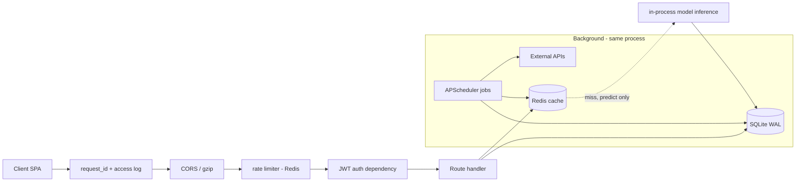
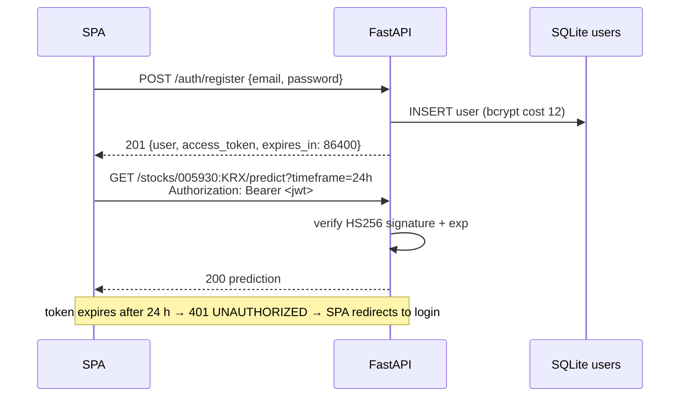

# DC Intel — Backend Design & API Specification (v1)

**Status:** v1 spec, implementation-ready · **Last updated:** 2026-06-12
**Audience:** backend engineers; frontend engineers consume Section 6 as the API contract.
**Related docs:** `schema.md` (authoritative DDL), `data-sources.md` (external APIs, circuit breaker, request budgets), `prediction-model.md` (model, `reasoning_json`, evidence algorithm), `sentiment-pipeline.md` (sentiment aggregation), `market-intel-pipeline.md` (intel clustering, `/dashboard/market-intel` payload), `economic-calendar.md` (`/dashboard/economic-calendar` payload), `deployment-architecture.md` (hosting, Redis/SQLite placement).

> **Naming note:** older docs reference an `api.md` (endpoint catalog) and a `jobs.md` (scheduler registry). Both live in this single file. This document is the **backend source of truth** — `ui-ux.md` and `architecture.html` must match it, not the other way around.

---

## 1. Scope and design principles

This document specifies:

1. The complete v1 HTTP API: 12 endpoints, auth, validation, caching, rate limits, error shapes.
2. The background-job registry (APScheduler, in-process).
3. Error handling and reliability: retries, degradation matrix, logging, audit.

Design principles (binding):

- **No synchronous external API calls on the request path. Ever.** Every endpoint reads Redis and/or SQLite only. External data is fetched exclusively by background jobs. A slow third-party API can therefore never slow down a user request.
- **Degrade in richness, never in availability** — except the explicit price-staleness guard on `/predict` (Section 9.4), because predicting on >30-minute-old prices during market hours would be dishonest, and honesty is the product.
- **Every prediction served is logged** (audit requirement) with `model_version` and the full `reasoning_json` snapshot.
- **Single process in v1.** APScheduler runs inside the FastAPI process, and SQLite is the store, so production runs **exactly one** uvicorn worker (`uvicorn app.main:app --workers 1`). Concurrency comes from asyncio. The scale-up path (Celery workers + PostgreSQL + multiple uvicorn workers) is documented in `deployment-architecture.md`.

### 1.1 Stack

| Layer | Choice |
|---|---|
| Language / framework | Python 3.11+, FastAPI (async), uvicorn |
| Validation | pydantic v2 (`pydantic-settings` for config) |
| Jobs | APScheduler (`AsyncIOScheduler`) in-process; Celery is the documented scale-up path |
| DB | SQLite (WAL mode, `busy_timeout=5000`); upgrade path PostgreSQL per `schema.md` |
| Cache | Redis (also: rate-limit counters, circuit-breaker state) |
| Auth | email/password, bcrypt (cost 12), JWT bearer (HS256) |
| HTTP client (jobs only) | `httpx` async + `tenacity` retries |
| Logging | `structlog`, JSON lines to stdout |

### 1.2 Application layout

```
app/
  main.py              # FastAPI app, lifespan (starts scheduler), middleware stack
  config.py            # pydantic-settings; env vars (Section 11)
  api/
    deps.py            # get_current_user, get_optional_user, parse_instrument
    routers/
      auth.py          # POST /auth/register, /auth/login
      stocks.py        # search, price, predict, prices-across-markets, history, accuracy
      dashboard.py     # trending, indexes, economic-calendar, market-intel
    errors.py          # error envelope, exception handlers
    ratelimit.py       # Redis fixed-window limiter middleware
  core/
    security.py        # bcrypt, JWT encode/decode
    cache.py           # Redis helpers, key builders (Section 7)
    logging.py         # structlog setup, request_id middleware
  jobs/
    registry.py        # APScheduler job table (Section 8)
    price_poller.py    # ... one module per job
  ml/                  # model loading, feature assembly, inference (prediction-model.md)
  sentiment/           # sentiment-pipeline.md modules
  intel/               # market-intel-pipeline.md modules
```

### 1.3 Request lifecycle



---

## 2. Global API conventions

### 2.1 Paths and versioning

Paths are exactly as listed in Section 6 — no `/api/v1` prefix in v1 (the canonical paths are the contract). A future breaking change introduces a `/v2/...` prefix; v1 paths are then frozen, not mutated.

### 2.2 The `{symbol}:{exchange}` path convention

Every stock-scoped endpoint addresses an **instrument** as `{symbol}:{exchange}` in a single path segment:

```
GET /stocks/005930:KRX/price
GET /stocks/AAPL:NASDAQ/predict?timeframe=24h
GET /stocks/TSM:NYSE/prices-across-markets
```

| Rule | Detail |
|---|---|
| Grammar | `symbol`: 1–12 chars of `A–Z 0–9 . -` (e.g. `005930`, `AAPL`, `BRK.B`). `exchange` ∈ `{KRX, NASDAQ, NYSE, AMEX, OTC}` — must stay in sync with `stocks.exchange` (`schema.md` §1.5); `OTC` is needed for ADR listings such as `HXSCL:OTC`. The `INDEX` pseudo-exchange is intentionally **not** addressable here (index rows are not stock endpoints). KOSDAQ-listed stocks use exchange `KRX`; the board (`KOSPI`/`KOSDAQ`) is metadata on the `stocks` row. |
| Normalization | Input is uppercased before lookup; `aapl:nasdaq` ≡ `AAPL:NASDAQ`. |
| URL encoding | `:` is a legal `pchar` inside a path segment per RFC 3986, so `/stocks/AAPL:NASDAQ/price` is valid **unencoded**. Clients that percent-encode it (`/stocks/AAPL%3ANASDAQ/price`) are accepted identically — Starlette URL-decodes the path parameter before our parser runs. Frontend rule: just call `encodeURIComponent("005930:KRX")` and don't think about it; both forms work. |
| Implementation | Routes are declared as `/stocks/{instrument}/...`; the `parse_instrument` dependency splits on the **first** `:`, validates against the grammar, then resolves against the `stocks` table. |
| Errors | Malformed segment (no colon, bad exchange code) → `400 INVALID_PARAM`. Well-formed but unknown instrument → `404 SYMBOL_NOT_FOUND`. |

The `stocks` table stores our instrument key plus provider tickers (`yfinance_ticker`, `finnhub_ticker`) per `data-sources.md` §1, so provider fallback never re-maps symbols at request time.

### 2.3 Response envelope (success)

Every `2xx` data response is wrapped (contract with `data-sources.md` §9.2):

```json
{
  "data": { "...": "endpoint-specific payload" },
  "meta": {
    "source": "yfinance",
    "data_as_of": "2026-06-12T05:31:00Z",
    "is_stale": false,
    "cache": "hit",
    "request_id": "req_8c1f3a2b"
  }
}
```

- `meta.source` — dominant upstream source of the payload (`"yfinance"`, `"finnhub"`, `"model"`, `"internal"`, `"composite"`).
- `meta.data_as_of` — timestamp of the underlying data (not of the HTTP response). UTC ISO-8601 `Z`, like **every** timestamp in this API (contract with `economic-calendar.md` §"Store UTC, only UTC").
- `meta.is_stale` — true when `data_as_of` is older than the per-data-type freshness threshold (`data-sources.md` §9.2 table). UI renders a **gray** "데이터 지연 / Data delayed" badge (gray = neutral, per canonical color semantics).
- `meta.cache` — `"hit"` | `"miss"` | `"none"` (uncached endpoint). Diagnostic only; clients must not branch on it.
- Owner-doc payloads (`/dashboard/market-intel` per `market-intel-pipeline.md` §12, `/dashboard/economic-calendar` per `economic-calendar.md` §12) are wrapped **unchanged** inside `data`.

### 2.4 Error envelope

Every non-`2xx` response:

```json
{
  "error": {
    "code": "SOURCE_DEGRADED",
    "message_en": "Price data is delayed right now. Please try again shortly.",
    "message_ko": "시세 데이터가 지연되고 있어요. 잠시 후 다시 시도해 주세요.",
    "details": null,
    "request_id": "req_8c1f3a2b"
  }
}
```

Messages are beginner plain language, always in both languages; the client picks by its UI locale. `details` is `null` or a machine-readable object (e.g. pydantic field errors). Error catalog:

| HTTP | `code` | When |
|---|---|---|
| 400 | `INVALID_PARAM` | Malformed query/path value (bad timeframe, bad instrument grammar, `days` out of range) |
| 401 | `UNAUTHORIZED` | Missing/expired/invalid bearer token on an auth-required endpoint, or invalid token on an optional-auth endpoint |
| 401 | `INVALID_CREDENTIALS` | `/auth/login` only — wrong email **or** password (deliberately indistinguishable) |
| 404 | `SYMBOL_NOT_FOUND` | Well-formed instrument not in `stocks` |
| 404 | `NOT_FOUND` | Anything else missing |
| 409 | `EMAIL_TAKEN` | `/auth/register` duplicate email |
| 422 | `VALIDATION_ERROR` | pydantic body validation failed; `details.fields[]` lists `{field, problem}` |
| 429 | `RATE_LIMITED` | Rate limit exceeded; `Retry-After` header set (seconds) |
| 500 | `INTERNAL` | Unhandled exception. Body carries `request_id` only — never a stack trace |
| 503 | `SOURCE_DEGRADED` | Data too stale to serve honestly (Section 9.4) |
| 503 | `MODEL_UNAVAILABLE` | No promoted model artifact for the requested timeframe (failed ship gate or rollout gap); `details.available_timeframes` lists what works |

### 2.5 Auth tiers

| Tier | Meaning | Endpoints |
|---|---|---|
| **None** | No token read at all | `/auth/*`, `/stocks/search`, `/stocks/{i}/price`, `/stocks/{i}/prices-across-markets`, `/stocks/{i}/accuracy` |
| **Optional** | Anonymous OK; a valid token adds personalization; a *present but invalid* token → `401 UNAUTHORIZED` (contract with `economic-calendar.md` §12) | all `/dashboard/*` |
| **Required** | `401 UNAUTHORIZED` without a valid token | `/stocks/{i}/predict`, `/stocks/{i}/history` |

`/predict` requires auth because every prediction is logged against the requesting user — that log powers `/history` and the "user holdings" approximation (no watchlist table in v1; the user's recent prediction requests in `predictions` stand in for holdings).

### 2.6 Language

Structured text that the backend *generates* is returned in **both** languages (`text_en` + `text_ko`, `message_en` + `message_ko`) so historical records render correctly forever. Endpoints whose owner docs define a `lang` query param (`/dashboard/market-intel`, `/dashboard/economic-calendar`) keep that behavior unchanged.

### 2.7 Pagination

Only `/stocks/{i}/history` paginates in v1: `limit` (1–100, default 20) + `offset` (default 0), response carries `total`. Cursor pagination is a documented v1.1 upgrade if histories grow long.

---

## 3. Authentication design

### 3.1 Flow



### 3.2 Decisions

| Item | Decision | Rationale |
|---|---|---|
| Password hashing | **bcrypt, cost 12** (`bcrypt` library). Target < 300 ms verify on the production VM; lower to 11 only if measured above that. | Canonical decision; cost 12 ≈ 250 ms on an e2-small-class core. |
| Password rules | 8–72 **bytes** (bcrypt's hard input limit), must contain ≥1 letter and ≥1 digit. Reject if found in the bundled top-10k common-password list. No forced symbols/rotation (NIST-aligned, beginner-friendly). | Validated in `RegisterRequest` (Section 3.4). |
| Email | pydantic `EmailStr`, lowercased before storage/lookup, max 254 chars. Unique index on `users.email`. No email verification in v1 (documented v1.1: verification + password reset, which requires outbound email). |
| JWT algorithm | HS256, single secret `JWT_SECRET` (≥ 32 random bytes, env var, rotated manually). | One service, one signer — asymmetric keys add nothing in v1. |
| JWT claims | `{ "sub": "<user_id as string>", "iat": <epoch>, "exp": <epoch> }`. Email deliberately excluded (avoids stale-claim bugs); handlers load the user by `sub`. |
| **Token expiry** | **Access token: 24 hours** (`expires_in: 86400`). **No refresh token in v1** — the SPA re-prompts login on 401. Refresh tokens + server-side revocation (`jti` denylist in Redis) are the documented v1.1 path. | A market-hours product is naturally used in daily sessions; 24 h keeps UX painless without long-lived bearer risk. |
| Logout | Client discards the token. No server-side revocation in v1 (accepted risk at 24 h expiry; documented above). |
| Transport | HTTPS only (terminated by the platform per `deployment-architecture.md`). Token sent as `Authorization: Bearer <jwt>`; never in query strings, never logged. |

### 3.3 Login throttling

- Per-IP: 10 failed attempts / 15 min → `429` for that IP on `/auth/login`.
- Per-email: 10 failed attempts / 15 min across all IPs → `429` for that email (counter `rl:login_email:{sha1(email)}`; protects a targeted account from distributed guessing).
- Successful login resets neither counter early (fixed windows, simple).
- bcrypt verify runs even for unknown emails (against a static dummy hash) so response timing doesn't leak account existence.

### 3.4 Validation models (excerpt)

```python
class RegisterRequest(BaseModel):
    email: EmailStr = Field(max_length=254)
    password: str = Field(min_length=8)
    language: Literal["ko", "en"] = "en"

    @field_validator("password")
    @classmethod
    def password_policy(cls, v: str) -> str:
        if len(v.encode("utf-8")) > 72:
            raise ValueError("password longer than 72 bytes")
        if not (re.search(r"[A-Za-z]", v) and re.search(r"\d", v)):
            raise ValueError("password needs at least one letter and one digit")
        if v.lower() in COMMON_PASSWORDS_10K:
            raise ValueError("password is too common")
        return v
```

All request bodies and query params go through pydantic models like this; FastAPI's default 422 is re-shaped into the Section 2.4 envelope by a global exception handler.

---

## 4. Rate limiting

Two layers, both enforced by a Redis fixed-window middleware (key `rl:{scope}:{id}:{epoch_window}`, `INCR` + `EXPIRE` — deliberately simple; sliding windows are a v1.1 nicety).

### 4.1 Global limits

| Scope | Limit | Notes |
|---|---|---|
| Per-IP (always) | **100 req/min** | IP from the platform's `X-Forwarded-For` first untrusted hop — trust the header **only** behind the known Railway/GCP proxy (config flag `TRUST_PROXY`). |
| Per-user (when authenticated) | **120 req/min** | Keyed on JWT `sub`. Both limits apply; either can trip. |

### 4.2 Per-endpoint overrides (stricter wins)

| Endpoint | Limit | Why |
|---|---|---|
| `POST /auth/register` | **5 / hour / IP** | Abuse control |
| `POST /auth/login` | **10 failed / 15 min / IP** and **10 failed / 15 min / email** (Section 3.3) | Credential stuffing |
| `GET /stocks/search` | **60 / min / IP** | Autocomplete; frontend must debounce ≥ 250 ms |
| `GET /stocks/{i}/predict` | **30 / min / user** | Each miss runs inference + writes audit rows |

### 4.3 Behavior on limit

`429 RATE_LIMITED` with `Retry-After: <seconds>` and headers `X-RateLimit-Limit` / `X-RateLimit-Remaining` on every response of limited scopes. **If Redis is down, the limiter fails OPEN** (requests pass, `WARNING` logged once per minute) — availability beats throttling for a small v1.

---

## 5. Caching architecture

Two cache populations:

1. **Job write-through** — background jobs write quotes, indexes, trending, calendar, sentiment, and intel into Redis on their cadence. Request handlers only read. These keys have no meaningful TTL race: they're overwritten each cycle and served with computed `is_stale`.
2. **Request-populated (cache-aside)** — `/predict`, `/accuracy`, `/search`, `/prices-across-markets` compute on miss and `SETEX`.

### 5.1 Redis key namespace (cross-doc contract)

| Prefix | Keys (examples) | Writer | TTL |
|---|---|---|---|
| `px:` | `px:quote:{symbol}:{exchange}`, `px:fx:{pair}`, `px:xmkt:{symbol}:{exchange}` | `price_poller` (quotes, fx); request path (`xmkt` response) | quotes: overwrite each cycle (no expiry); fx: 5 min; xmkt response: 60 s |
| `dash:` | `dash:indexes`, `dash:trending:{region}` | `price_poller` | 60 s |
| `pred:` | `pred:{symbol}:{exchange}:{timeframe}` | `/predict` handler | per-timeframe (Section 6.5) |
| `acc:` | `acc:{symbol}:{exchange}:{timeframe}:{window}` | `/accuracy` handler | 300 s |
| `stocks:` | `stocks:search:{norm_q}:{limit}` | `/search` handler | 6 h (bust on `stocks` table change) |
| `cal:` | `cal:list:*`, `cal:user_affects:{user_id}` | `calendar_sync` / calendar API | 600 s (owner: `economic-calendar.md`) |
| `sentiment:` | `sentiment:clf:*`, `sentiment:source_health:{source}`, ... | sentiment pipeline | owner: `sentiment-pipeline.md` |
| `intel:` | `intel:cluster:*`, `intel:emb:*`, ... | intel pipeline | owner: `market-intel-pipeline.md` |
| `rl:` | `rl:ip:*`, `rl:user:*`, `rl:login_email:*` | rate limiter | window length |
| `cb:` | `cb:{source}` (circuit-breaker state) | retry/breaker layer | persistent (survives restarts, per `data-sources.md` §9.1) |

### 5.2 Frontend polling guidance (v1 — polling, WebSocket is v2)

Poll intervals are tuned so polls mostly hit cache; `ui-ux.md` must match this table.

| View | Endpoint(s) | Poll every |
|---|---|---|
| Stock page price | `/stocks/{i}/price` | 30 s (market open), 5 min (closed) |
| Dashboard tickers/indexes/trending | `/dashboard/indexes`, `/dashboard/trending` | 60 s |
| Market intel feed | `/dashboard/market-intel` | 60 s |
| Economic calendar | `/dashboard/economic-calendar` | 10 min |
| Prediction card | `/stocks/{i}/predict` | do **not** poll — re-fetch on user action or when `window_closes_at` passes |
| History / accuracy | `/stocks/{i}/history`, `/accuracy` | on navigation only |

---

## 6. Endpoint reference

Summary (details per endpoint below):

| # | Endpoint | Auth | Cache source → TTL | Rate limit |
|---|---|---|---|---|
| 1 | `POST /auth/register` | none | — | 5/h/IP |
| 2 | `POST /auth/login` | none | — | 10 failed/15min/IP + per-email |
| 3 | `GET /stocks/search?q=` | none | `stocks:search:*` → 6 h | 60/min/IP |
| 4 | `GET /stocks/{i}/price` | none | `px:quote:*` (job write-through) | global |
| 5 | `GET /stocks/{i}/predict?timeframe=` | **required** | `pred:*` → per-timeframe (6.5) | 30/min/user |
| 6 | `GET /stocks/{i}/prices-across-markets` | none | `px:xmkt:*` → 60 s | global |
| 7 | `GET /dashboard/trending` | optional | `dash:trending:*` → 60 s | global |
| 8 | `GET /dashboard/indexes` | optional | `dash:indexes` → 60 s | global |
| 9 | `GET /dashboard/economic-calendar` | optional | `cal:list:*` → 600 s | global |
| 10 | `GET /dashboard/market-intel` | optional | intel response cache → 60 s | global |
| 11 | `GET /stocks/{i}/history` | **required** | none (direct SQLite) | global |
| 12 | `GET /stocks/{i}/accuracy` | none | `acc:*` → 300 s | global |

“global” = the Section 4.1 limits only. `{i}` = `{symbol}:{exchange}` per Section 2.2.

---

### 6.1 POST /auth/register

| | |
|---|---|
| Auth | none |
| Body | `email` (EmailStr, ≤254), `password` (Section 3.2 rules), `language` (`"ko"`\|`"en"`, default `"en"`) |
| Cache | none |
| Rate limit | 5/hour/IP |

Registers the user (bcrypt cost 12) and **auto-logs-in** (returns a token — no second round trip).

**`201` example:**

```json
{
  "data": {
    "user": { "id": 42, "email": "kom2k@daum.net", "language": "ko",
              "created_at": "2026-06-12T05:30:00Z" },
    "access_token": "eyJhbGciOiJIUzI1NiIs...",
    "token_type": "bearer",
    "expires_in": 86400
  },
  "meta": { "source": "internal", "data_as_of": "2026-06-12T05:30:00Z",
            "is_stale": false, "cache": "none", "request_id": "req_01ab23cd" }
}
```

**Errors:** `409 EMAIL_TAKEN` ("이미 가입된 이메일이에요" / "This email is already registered"), `422 VALIDATION_ERROR` (field details), `429 RATE_LIMITED`.

---

### 6.2 POST /auth/login

| | |
|---|---|
| Auth | none |
| Body | `email` (EmailStr), `password` (string, 1–256 — policy NOT re-validated here; legacy passwords must keep working) |
| Cache | none |
| Rate limit | Section 3.3 |

**`200` example:** identical shape to register's `data` (user + `access_token` + `expires_in: 86400`).

**Errors:** `401 INVALID_CREDENTIALS` ("이메일 또는 비밀번호가 맞지 않아요" / "Email or password doesn't match" — same message for unknown email and wrong password), `422`, `429`.

---

### 6.3 GET /stocks/search?q=

| | |
|---|---|
| Auth | none |
| Query | `q` required, 1–50 chars after trim; `limit` 1–20, default 10 |
| Cache | Two layers: the **company/listing metadata** blob is cached `stocks:search:{norm_q}:{limit}` → **6 h** (the `stocks` table changes rarely; busted on change). The **live price overlay** (`last_price`, `price_as_of`, `fx_rate`, `diff_vs_primary_pct`) is **not** in that blob — it is merged per request from the price cache (`px:quote:*`, `px:fx:*`), so prices stay ≤ 30 s fresh even on a metadata cache hit. |
| Rate limit | 60/min/IP (frontend debounces ≥ 250 ms) |

Autocomplete over the `stocks` table: case-insensitive prefix match on `symbol`, substring match on `name_en` and `name_ko`. Results are **grouped by company** so one company shows **all of its exchange listings** (KRX listing + US ADR etc.) in a single result row. Each listing carries a live price overlay so the UI can render the inline cross-market price diff in the dropdown (`ui-ux.md` §6.2) without a second round-trip.

**`200` example — `GET /stocks/search?q=SK`:**

```json
{
  "data": {
    "query": "SK",
    "results": [
      {
        "company_name_en": "SK hynix", "company_name_ko": "SK하이닉스",
        "listings": [
          { "instrument": "000660:KRX", "symbol": "000660", "exchange": "KRX",
            "board": "KOSPI", "currency": "KRW", "is_primary": true, "kind": "common",
            "last_price": 198500, "price_as_of": "2026-06-12T06:30:11Z",
            "fx_rate": 0.000731, "diff_vs_primary_pct": null }
        ]
      },
      {
        "company_name_en": "SK Telecom", "company_name_ko": "SK텔레콤",
        "listings": [
          { "instrument": "017670:KRX", "symbol": "017670", "exchange": "KRX",
            "board": "KOSPI", "currency": "KRW", "is_primary": true, "kind": "common",
            "last_price": 51800, "price_as_of": "2026-06-12T06:30:11Z",
            "fx_rate": 0.000731, "diff_vs_primary_pct": null },
          { "instrument": "SKM:NYSE", "symbol": "SKM", "exchange": "NYSE",
            "board": null, "currency": "USD", "is_primary": false, "kind": "adr",
            "last_price": 22.34, "price_as_of": "2026-06-12T06:30:09Z",
            "fx_rate": 1.0, "diff_vs_primary_pct": 2.1 }
        ]
      }
    ]
  },
  "meta": { "source": "internal", "data_as_of": "2026-06-12T05:31:02Z",
            "is_stale": false, "cache": "metadata-hit", "request_id": "req_77e1f0aa" }
}
```

`kind ∈ {"common", "adr"}`. Price-overlay fields:
- `last_price` — latest cached quote in the listing's own `currency` (`null` if no quote cached yet; UI shows "—").
- `price_as_of` — timestamp of that quote (drives the per-listing `is_stale` badge the same way as `/price`).
- `fx_rate` — multiplier to USD for FX-normalized comparison (`1.0` for USD listings).
- `diff_vs_primary_pct` — this listing's FX-normalized price vs the company's **primary** listing, in %. `null` on the primary listing itself and whenever either side has no fresh quote.

**Errors:** `400 INVALID_PARAM` (empty/overlong `q`), `429`.

---

### 6.4 GET /stocks/{symbol}:{exchange}/price

| | |
|---|---|
| Auth | none |
| Query | none |
| Cache | reads `px:quote:{symbol}:{exchange}` written by `price_poller` (1-min cadence in market hours). The handler **never** fetches externally; a missing key falls back to the latest stored bar in SQLite. |
| Rate limit | global |

**`200` example — `GET /stocks/005930:KRX/price`:**

```json
{
  "data": {
    "instrument": "005930:KRX",
    "name_en": "Samsung Electronics", "name_ko": "삼성전자",
    "price": 84300, "currency": "KRW",
    "change": 700, "change_pct": 0.84,
    "previous_close": 83600,
    "volume": 11250300,
    "day_high": 84600, "day_low": 83400,
    "market_state": "open",
    "session": { "exchange": "KRX", "open_kst": "09:00", "close_kst": "15:30" }
  },
  "meta": { "source": "yfinance", "data_as_of": "2026-06-12T05:30:45Z",
            "is_stale": false, "cache": "hit", "request_id": "req_3b9d11ce" }
}
```

`market_state ∈ {"open", "closed", "pre", "post"}` (pre/post US only). Staleness rule: `is_stale = age > 5 min` while the exchange is open; **never stale when closed** (last close is correct by definition — `data-sources.md` §9.2).

**Errors:** `400 INVALID_PARAM`, `404 SYMBOL_NOT_FOUND`, `429`. This endpoint never returns `503` — there is always a last-known price once a symbol has been tracked; brand-new symbols with no data yet return `404 NOT_FOUND` with message "이 종목의 데이터가 아직 준비 중이에요" / "We're still preparing data for this stock".

---

### 6.5 GET /stocks/{symbol}:{exchange}/predict?timeframe=

| | |
|---|---|
| Auth | **required** (predictions are logged per user) |
| Query | `timeframe` **required**, enum `1h\|5h\|24h\|2d\|3d\|5d` |
| Cache | `pred:{symbol}:{exchange}:{timeframe}` — TTL per timeframe below |
| Rate limit | 30/min/user |

Per-timeframe cache TTLs (this is the table `prediction-model.md` §9 defers to — chosen ≥ the slowest input cadence so a cached prediction is never staler than its inputs):

| Timeframe | `1h` | `5h` | `24h` | `2d` | `3d` | `5d` |
|---|---|---|---|---|---|---|
| Cache TTL | 5 min | 10 min | 15 min | 30 min | 45 min | 60 min |

**Flow (cache miss):** assemble features from `technical_snapshots` + latest `sentiment_logs` + `economic_events` + cross-market cache → staleness/missing flags → load model artifact → predict → calibrate → neutral rule → confidence cap → evidence bullets → `INSERT predictions` row (with `user_id`, `model_version`, full `reasoning_json`) → cache → respond. Budget < 150 ms (`prediction-model.md` §9). Stale sentiment (> 30 min) is treated as a **missing feature**, never as fresh data (`sentiment-pipeline.md` §8.2).

**Flow (cache hit):** return the cached payload. If the requesting user has no `predictions` row for this `(stock, timeframe, window_closes_at)`, insert one duplicating the cached model output — so *every user's served prediction is audited* and `/history` is complete per user. Accuracy stats de-duplicate these (Section 6.12).

**`200` example — `GET /stocks/005930:KRX/predict?timeframe=24h`** (same worked scenario as `prediction-model.md` §8.2):

```json
{
  "data": {
    "prediction_id": 91842,
    "instrument": "005930:KRX",
    "name_en": "Samsung Electronics", "name_ko": "삼성전자",
    "timeframe": "24h",
    "direction": "up",
    "confidence": 66,
    "evidence": [
      { "rank": 1, "group": "sentiment", "contribution_pct": 43,
        "text_en": "Positive sentiment surge (43%)", "text_ko": "긍정적 여론 급증 (43%)" },
      { "rank": 2, "group": "rsi", "contribution_pct": 38,
        "text_en": "RSI bullish signal (38%)", "text_ko": "RSI 상승 신호 (38%)" },
      { "rank": 3, "group": "ema", "contribution_pct": 19,
        "text_en": "Bullish EMA crossover (19%)", "text_ko": "EMA 상승 교차 신호 (19%)" }
    ],
    "evidence_summary_en": "Positive sentiment surge (43%) + RSI bullish signal (38%) + Bullish EMA crossover (19%)",
    "evidence_summary_ko": "긍정적 여론 급증 (43%) + RSI 상승 신호 (38%) + EMA 상승 교차 신호 (19%)",
    "predicted_at": "2026-06-12T01:30:00Z",
    "window_closes_at": "2026-06-15T01:30:00Z",
    "entry_price": 84300, "currency": "KRW",
    "model_version": "24h-xgb-20260608.1",
    "neutral_rule_applied": false,
    "confidence_capped": false,
    "coverage": { "reduced_coverage": false, "sources_down": [], "low_confidence": false },
    "data_staleness": { "any_stale": false },
    "high_impact_events": [
      { "event_id": 1234, "title_en": "US CPI (May)", "title_ko": "미국 소비자물가지수 (5월)",
        "impact": "high", "scheduled_at": "2026-06-12T12:30:00Z", "relation": "inside_window" }
    ]
  },
  "meta": { "source": "model", "data_as_of": "2026-06-12T01:30:00Z",
            "is_stale": false, "cache": "miss", "request_id": "req_8c1f3a2b" }
}
```

Field semantics (direction, confidence, evidence algorithm, neutral rule, staleness cap at 65) are owned by `prediction-model.md`; this endpoint exposes them verbatim. Evidence bullets follow the canonical explainability format: up to 3 bullets, `<plain-language signal phrase> (<contribution>%)`, contributions summing to 100. `coverage` mirrors `sentiment-pipeline.md` §9.2 (`reduced_coverage`, `sources_down`, `low_confidence`) — **this is the reduced-coverage flag**: when the sentiment pipeline is down, the prediction is still served from technical indicators with `coverage.reduced_coverage: true` and sentiment simply absent from the evidence bullets.

**Errors:**

| HTTP / code | When |
|---|---|
| `400 INVALID_PARAM` | missing/unknown `timeframe` |
| `401 UNAUTHORIZED` | no/expired token |
| `404 SYMBOL_NOT_FOUND` | unknown instrument |
| `429 RATE_LIMITED` | > 30/min/user |
| `503 SOURCE_DEGRADED` | price data > 30 min old during market hours **and** no cached prediction exists (Section 9.4): "시세 데이터가 지연되고 있어요. 잠시 후 다시 시도해 주세요." / "Price data is delayed right now. Please try again shortly." |
| `503 MODEL_UNAVAILABLE` | timeframe has no promoted artifact (e.g. failed the ≥ 52% ship gate); `details.available_timeframes` lists working ones |

---

### 6.6 GET /stocks/{symbol}:{exchange}/prices-across-markets

| | |
|---|---|
| Auth | none |
| Query | none |
| Cache | `px:xmkt:{symbol}:{exchange}` → 60 s (composed from `px:quote:*` + `px:fx:*`) |
| Rate limit | global |

All listings of the same company with prices normalized to a **per-underlying-share USD basis** (ADR ratio from `stocks` metadata × FX from `px:fx:USDKRW`, 5-min TTL) and the % difference vs the requested listing. This surfaces ADR premium/discount in beginner terms.

**`200` example — `GET /stocks/017670:KRX/prices-across-markets`** (numbers illustrative, including the ADR ratio — real ratios come from `stocks.adr_ratio`):

```json
{
  "data": {
    "company_name_en": "SK Telecom", "company_name_ko": "SK텔레콤",
    "base_instrument": "017670:KRX",
    "fx_rates": { "USDKRW": 1378.20, "as_of": "2026-06-12T05:28:00Z" },
    "listings": [
      { "instrument": "017670:KRX", "exchange": "KRX", "currency": "KRW",
        "price": 56200, "change_pct": 1.08,
        "adr_ratio": null, "normalized_usd": 40.78,
        "diff_pct_vs_base": 0.0,
        "market_state": "open", "data_as_of": "2026-06-12T05:30:45Z", "is_stale": false },
      { "instrument": "SKM:NYSE", "exchange": "NYSE", "currency": "USD",
        "price": 20.91, "change_pct": 0.43,
        "adr_ratio": "1 ADR = 0.5 share", "normalized_usd": 41.82,
        "diff_pct_vs_base": 2.55,
        "market_state": "closed", "data_as_of": "2026-06-11T20:00:00Z", "is_stale": false }
    ],
    "note_en": "Prices come from different market sessions; the difference partly reflects time-zone gaps, not only a premium.",
    "note_ko": "거래소마다 장 시간이 달라서, 가격 차이에는 프리미엄뿐 아니라 시차 영향도 섞여 있어요."
  },
  "meta": { "source": "composite", "data_as_of": "2026-06-12T05:30:45Z",
            "is_stale": false, "cache": "miss", "request_id": "req_aa0192fe" }
}
```

Single-listing companies return one listing and `diff_pct_vs_base: 0.0` — not an error. **Errors:** `400`, `404 SYMBOL_NOT_FOUND`, `429`.

---

### 6.7 GET /dashboard/trending

| | |
|---|---|
| Auth | optional (no personalization in v1) |
| Query | `region` enum `kr\|us\|all`, default `all`; `limit` 1–20 per list, **default 10** (the dashboard carousel shows a top-10 — `ui-ux.md` §7.2.1) |
| Cache | `dash:trending:{region}` → 60 s, rebuilt by `price_poller` each cycle from the ~50-stock tracked universe. Each card's `sparkline` and `win_rate_pct`/`n_closed` are assembled into the same cached blob (sparkline from the intraday bar store; win-rate from the same aggregate `/accuracy` computes, `acc:*`). |
| Rate limit | global |

Top movers (gainers and losers by `change_pct` over the current/most-recent session) per region. Each card carries everything the carousel renders — a `sparkline` and a win-rate badge — so the widget needs no per-card follow-up calls.

**`200` example — `GET /dashboard/trending?region=all&limit=2`:**

```json
{
  "data": {
    "regions": [
      { "region": "kr", "market_state": "open",
        "gainers": [
          { "instrument": "000660:KRX", "name_en": "SK hynix", "name_ko": "SK하이닉스",
            "price": 248500, "currency": "KRW", "change_pct": 4.12, "volume": 4810022,
            "sparkline": [241000, 243200, 244100, 246800, 247500, 248500],
            "win_rate_pct": 63.0, "n_closed": 84 },
          { "instrument": "005380:KRX", "name_en": "Hyundai Motor", "name_ko": "현대차",
            "price": 291000, "currency": "KRW", "change_pct": 2.75, "volume": 1203311,
            "sparkline": [283000, 285500, 288000, 287200, 290100, 291000],
            "win_rate_pct": null, "n_closed": 12 }
        ],
        "losers": [
          { "instrument": "035420:KRX", "name_en": "NAVER", "name_ko": "네이버",
            "price": 187300, "currency": "KRW", "change_pct": -3.21, "volume": 990118,
            "sparkline": [193500, 192100, 190800, 189400, 188000, 187300],
            "win_rate_pct": 57.0, "n_closed": 41 }
        ] },
      { "region": "us", "market_state": "closed",
        "gainers": [
          { "instrument": "NVDA:NASDAQ", "name_en": "NVIDIA", "name_ko": "엔비디아",
            "price": 148.22, "currency": "USD", "change_pct": 3.66, "volume": 301220110,
            "sparkline": [143.10, 144.80, 145.50, 146.90, 147.60, 148.22],
            "win_rate_pct": 66.0, "n_closed": 120 }
        ],
        "losers": [
          { "instrument": "TSLA:NASDAQ", "name_en": "Tesla", "name_ko": "테슬라",
            "price": 301.55, "currency": "USD", "change_pct": -2.10, "volume": 88012034,
            "sparkline": [308.00, 306.20, 304.80, 303.10, 302.40, 301.55],
            "win_rate_pct": 52.0, "n_closed": 73 }
        ] }
    ]
  },
  "meta": { "source": "yfinance", "data_as_of": "2026-06-12T05:30:45Z",
            "is_stale": false, "cache": "hit", "request_id": "req_5f02c8d1" }
}
```

Per-card fields beyond price/volume:
- `sparkline` — array of recent prices (most-recent last) for the mini chart; intraday closes when the market is open, else the last session's bars. Length is a fixed window (~24 points); UI scales it, never reads absolute values.
- `win_rate_pct` / `n_closed` — the stock's overall directional win rate and graded-prediction count, same numbers as `/accuracy` (all timeframes). `win_rate_pct` is `null` when `n_closed < 20` (the `low_sample` rule, §6.12); the UI then shows a "collecting data" badge instead of a percentage.

When a region's market is closed, movers reflect that market's **last completed session** and `market_state: "closed"`. **Errors:** `400 INVALID_PARAM`, `429`.

---

### 6.8 GET /dashboard/indexes

| | |
|---|---|
| Auth | optional (no personalization in v1) |
| Query | none |
| Cache | `dash:indexes` → 60 s, written by `price_poller` |
| Rate limit | global |

The five canonical indexes; codes shared with `economic-calendar.md`: `KOSPI`, `NASDAQ_COMPOSITE`, `SP500`, `NIKKEI225`, `DAX`.

**`200` example:**

```json
{
  "data": {
    "indexes": [
      { "code": "KOSPI", "name_en": "KOSPI", "name_ko": "코스피",
        "level": 3142.55, "change": 18.20, "change_pct": 0.58,
        "market_state": "open",  "data_as_of": "2026-06-12T05:30:00Z" },
      { "code": "NASDAQ_COMPOSITE", "name_en": "NASDAQ Composite", "name_ko": "나스닥 종합",
        "level": 21540.10, "change": -85.33, "change_pct": -0.39,
        "market_state": "closed", "data_as_of": "2026-06-11T20:00:00Z" },
      { "code": "SP500", "name_en": "S&P 500", "name_ko": "S&P 500",
        "level": 6321.40, "change": -12.05, "change_pct": -0.19,
        "market_state": "closed", "data_as_of": "2026-06-11T20:00:00Z" },
      { "code": "NIKKEI225", "name_en": "Nikkei 225", "name_ko": "닛케이 225",
        "level": 43012.77, "change": 230.11, "change_pct": 0.54,
        "market_state": "open",  "data_as_of": "2026-06-12T05:30:00Z" },
      { "code": "DAX", "name_en": "DAX", "name_ko": "닥스",
        "level": 24388.92, "change": 40.87, "change_pct": 0.17,
        "market_state": "pre",   "data_as_of": "2026-06-11T15:35:00Z" }
    ]
  },
  "meta": { "source": "yfinance", "data_as_of": "2026-06-12T05:30:45Z",
            "is_stale": false, "cache": "hit", "request_id": "req_b8d0341a" }
}
```

**Errors:** `429` only.

---

### 6.9 GET /dashboard/economic-calendar

| | |
|---|---|
| Auth | **optional** — anonymous gets the calendar with `affects_your_stocks: null`; a valid token adds the per-user affects overlay; a present-but-invalid token → `401` (owner: `economic-calendar.md` §12) |
| Query | `days` 1–14 default **7**; `impact` CSV of `high,medium,low`; `country` CSV ISO codes (`US,KR,...`); `include_past_hours` 0–48 default 24 |
| Cache | `cal:list:{days}:{impact}:{country}:{include_past_hours}` → 600 s; user overlay `cal:user_affects:{user_id}` → 600 s |
| Rate limit | global |

Payload shape is **owned by `economic-calendar.md` §12** — full field semantics there. Wrapped in the standard envelope. Condensed example (authenticated request):

```json
{
  "data": {
    "events": [
      { "id": 1234, "event_type": "us_cpi",
        "title_en": "US CPI (May)", "title_ko": "미국 소비자물가지수 (5월)",
        "country": "US", "impact_level": "high", "impact_source": "override",
        "scheduled_at_utc": "2026-06-12T12:30:00Z", "status": "scheduled",
        "actual_vs_forecast": null,
        "affects_your_stocks": true, "match_level": "market",
        "matched_symbols": ["005930:KRX", "NVDA:NASDAQ"] },
      { "id": 1290, "event_type": "kr_bok_rate_decision",
        "title_en": "Bank of Korea rate decision", "title_ko": "한국은행 기준금리 결정",
        "country": "KR", "impact_level": "high", "impact_source": "override",
        "scheduled_at_utc": "2026-06-16T01:00:00Z", "status": "scheduled",
        "actual_vs_forecast": null,
        "affects_your_stocks": true, "match_level": "stock",
        "matched_symbols": ["105560:KRX"] }
    ],
    "horizon_days": 7
  },
  "meta": { "source": "composite", "data_as_of": "2026-06-11T21:30:00Z",
            "is_stale": false, "cache": "hit", "request_id": "req_209cc417" }
}
```

**Errors:** `400 INVALID_PARAM` (bad `days`/`impact`/`country`), `401 UNAUTHORIZED` (invalid token present), `429`.

---

### 6.10 GET /dashboard/market-intel

| | |
|---|---|
| Auth | optional (the `/dashboard/*` policy — Section 2.5) |
| Query | `stock` (`{symbol}:{exchange}`), `lang` `ko\|en` default `en`, `limit` 1–50 default 20, `min_credibility` 0–100 default 25, `only_anomalies` bool default false |
| Cache | server-side ranked-retrieval response cache → 60 s |
| Rate limit | global |

Real-time **unconfirmed** intel with credibility scores (0–100), clusters, anomaly pins, and the CONFIRMED/UNCONFIRMED badge contract. Payload shape is **owned by `market-intel-pipeline.md` §12** and is wrapped unchanged in the standard envelope. Condensed example:

```json
{
  "data": {
    "as_of": "2026-06-12T05:40:00Z", "lang": "en",
    "anomalies": [],
    "clusters": [
      { "cluster_id": "cl_9f2c41ab77d1",
        "stock": { "symbol": "005930", "exchange": "KRX",
                   "name_en": "Samsung Electronics", "name_ko": "삼성전자" },
        "status": "UNCONFIRMED",
        "badge": { "label": "Unconfirmed — rumor", "style": "speculation",
                   "disclaimer": "No official news source has confirmed this yet. Treat it as speculation, not fact." },
        "sentiment": "bearish", "sentiment_confidence": 0.78,
        "item_count": 5, "distinct_authors": 4,
        "max_credibility": 65, "credibility_band": "Moderately credible",
        "coordinated_warning": false, "lead_time_minutes": null,
        "timeline": [ { "event": "first_posted", "at": "2026-06-12T04:53:00Z",
                        "label": "First posted on Reddit" } ],
        "items": [
          { "id": 18234, "source": "reddit", "author_handle": "u/krflowwatch",
            "url": "https://reddit.com/r/stocks/comments/abc123",
            "content_snippet": "Hearing a foreign fund is force-liquidating its 005930 position...",
            "lang": "en", "posted_at": "2026-06-12T04:53:00Z",
            "credibility_score": 65, "sentiment": "bearish",
            "sentiment_confidence": 0.81, "confirmed": false }
        ],
        "confirm_url": null }
    ]
  },
  "meta": { "source": "composite", "data_as_of": "2026-06-12T05:40:00Z",
            "is_stale": false, "cache": "hit", "request_id": "req_e3309a1c" }
}
```

**Errors:** `400 INVALID_PARAM`, `401` (invalid token present), `429`.

---

### 6.11 GET /stocks/{symbol}:{exchange}/history

| | |
|---|---|
| Auth | **required** — returns only the **requesting user's** predictions on this stock |
| Query | `timeframe` optional filter; `status` optional `pending\|correct\|incorrect`; `limit` 1–100 default 20; `offset` ≥ 0 default 0 |
| Cache | none — direct SQLite (per-user, low volume, must be instantly consistent after a new prediction) |
| Rate limit | global per-user |

Joins `predictions` (rows where `user_id = current_user`) with `prediction_outcomes`. `status` is derived: `pending` until the outcome checker grades the row; then `correct` iff the realized 3-class label equals the displayed direction (a realized `neutral` against a directional call is `incorrect` — same honesty rule as the ship gate).

**`200` example — `GET /stocks/005930:KRX/history?limit=2`:**

```json
{
  "data": {
    "instrument": "005930:KRX",
    "total": 14,
    "items": [
      { "prediction_id": 91842, "timeframe": "24h",
        "direction": "up", "confidence": 66,
        "evidence_summary_en": "Positive sentiment surge (43%) + RSI bullish signal (38%) + Bullish EMA crossover (19%)",
        "evidence_summary_ko": "긍정적 여론 급증 (43%) + RSI 상승 신호 (38%) + EMA 상승 교차 신호 (19%)",
        "predicted_at": "2026-06-12T01:30:00Z",
        "window_closes_at": "2026-06-15T01:30:00Z",
        "entry_price": 84300, "currency": "KRW",
        "model_version": "24h-xgb-20260608.1",
        "status": "pending", "outcome": null },
      { "prediction_id": 90211, "timeframe": "5h",
        "direction": "down", "confidence": 58,
        "evidence_summary_en": "MACD momentum falling (52%) + Negative sentiment surge (48%)",
        "evidence_summary_ko": "MACD 모멘텀 하락 (52%) + 부정적 여론 급증 (48%)",
        "predicted_at": "2026-06-10T01:00:00Z",
        "window_closes_at": "2026-06-10T06:00:00Z",
        "entry_price": 85100, "currency": "KRW",
        "model_version": "5h-lr-20260601.1",
        "status": "correct",
        "outcome": { "realized_direction": "down", "exit_price": 84480,
                     "move_pct": -0.73, "graded_at": "2026-06-10T06:01:12Z" } }
    ]
  },
  "meta": { "source": "internal", "data_as_of": "2026-06-12T05:41:00Z",
            "is_stale": false, "cache": "none", "request_id": "req_44c0de77" }
}
```

**Errors:** `400`, `401 UNAUTHORIZED`, `404 SYMBOL_NOT_FOUND`, `429`. A user with no predictions on the stock gets `total: 0, items: []` — not a 404.

---

### 6.12 GET /stocks/{symbol}:{exchange}/accuracy

| | |
|---|---|
| Auth | none — accuracy is public; honest win/loss numbers are the product's trust anchor |
| Query | `timeframe` optional filter; `window` enum `30d\|90d\|all` default `all`; `include_model_versions` bool default false |
| Cache | `acc:{symbol}:{exchange}:{timeframe}:{window}` → 300 s |
| Rate limit | global |

Platform-wide stats for this stock (all users' graded predictions), **de-duplicated**: cache-hit duplicates (Section 6.5) are collapsed with `GROUP BY (timeframe, direction, window_closes_at)` before counting, so popular stocks aren't double-counted. Two statistics, both shown (this is the user-facing metric, distinct from the ship gate — `prediction-model.md` §7.6):

- `exact_accuracy_pct` — 3-class exact match over all graded predictions.
- `directional.win_rate_pct` — among `up`/`down` calls only; realized `neutral` counts as a loss.

**`200` example — `GET /stocks/005930:KRX/accuracy`:**

```json
{
  "data": {
    "instrument": "005930:KRX",
    "window": "all",
    "graded_total": 412, "pending": 9,
    "exact_accuracy_pct": 47.6,
    "directional": { "predictions": 268, "wins": 147, "losses": 121, "win_rate_pct": 54.9 },
    "neutral_predictions": 144,
    "low_sample": false,
    "by_timeframe": [
      { "timeframe": "1h",  "graded": 64, "exact_accuracy_pct": 43.8,
        "directional": { "predictions": 41, "wins": 22, "win_rate_pct": 53.7 } },
      { "timeframe": "24h", "graded": 118, "exact_accuracy_pct": 49.2,
        "directional": { "predictions": 80, "wins": 45, "win_rate_pct": 56.3 } }
    ]
  },
  "meta": { "source": "internal", "data_as_of": "2026-06-12T05:41:30Z",
            "is_stale": false, "cache": "miss", "request_id": "req_91fe20bb" }
}
```

`low_sample: true` when `graded_total < 20`; UI then shows "아직 데이터가 부족해요 / Not enough data yet" instead of headline percentages. With `include_model_versions=true`, a `by_model_version[]` array is appended (joins `predictions.model_version` × `prediction_outcomes` — the reason the `model_version` column exists).

**Errors:** `400`, `404 SYMBOL_NOT_FOUND`, `429`.

---

## 7. Background jobs (APScheduler registry)

All jobs run in-process (`AsyncIOScheduler`, started in the FastAPI lifespan). Job defaults: `max_instances=1` (a slow cycle never stacks), `coalesce=True` (missed runs collapse to one), `misfire_grace_time = cadence / 2`. Celery is the documented scale-up path when job CPU time starts crowding the event loop.

Job names are the canonical ones from `data-sources.md` §0 — other docs must use these exact names.

| Job | Schedule | Reads from | Writes to | Failure behavior |
|---|---|---|---|---|
| `price_poller` | every **1 min** while an exchange is open (KRX 09:00–15:30 KST; NYSE/NASDAQ 09:30–16:00 ET); every **5 min** US extended hours; paused per-exchange when closed. Daily OHLCV backfill after each close. | yfinance (batched, one call per exchange); fallback Finnhub `/quote` (US/ADR), pykrx/KIS (KRX) | Redis `px:quote:*`, `px:fx:*`, `dash:indexes`, `dash:trending:*`; daily bars → SQLite bar store | Retry per §9.1; exhausted retries count as breaker failures (§9.2); breaker OPEN → switch to fallback source; both down → serve stale with `is_stale: true`; > 30 min stale in market hours triggers the §9.4 predict guard. Never partial-writes a quote batch — validate then swap. |
| `indicator_calculator` | every **5 min**, offset +30 s after the price tick | Redis quote cache + SQLite bar store | `technical_snapshots` (SQLite) | If fresh bars are missing for a symbol, **skip that symbol this cycle** (`WARNING`); downstream staleness flags handle the gap. Never writes a row computed from stale bars. No external calls → no breaker. |
| `sentiment_refresher` | master cycle every **10 min** (per-source fetch cadences inside `sentiment-pipeline.md` §6; canonical window 10–15 min) | Finnhub news, NewsAPI, Reddit, StockTwits, confirmed `market_intel` | `sentiment_logs` (SQLite), Redis `sentiment:*` | Per-source health state (3 consecutive failures = down); weighted-mean aggregation renormalizes automatically; sets `coverage.reduced_coverage` / `sources_down`; all-social or all-news down forces `low_confidence` on 1h/5h; **all** sources down → no row written, `ERROR` + alert, read-time 30-min staleness rule takes over. |
| `intel_scraper` | every **5 min** (Reddit, StockTwits); every **10 min** (DC Inside, Naver) — canonical window 5–10 min | source APIs / HTML scrapes | `market_intel` (SQLite), Redis `intel:*` | Per-source breaker; dashboard serves cached clusters with `is_stale` after 30 min; Korean scrapers are explicitly allowed to stay down for days (alert, don't block); dedupe/cluster steps are idempotent so re-runs are safe. |
| `calendar_sync` | daily **06:30 KST** (Investing.com scrape, next 14 days) + **07:00 KST** (FRED macro series + release dates) | Investing.com scrape; FRED; Finnhub earnings/IPO calendars; static FOMC/BOK/BOJ seed files | `economic_events` (SQLite, upsert — never deletes; cancelled events get `status='cancelled'`), Redis `cal:*` | Existing events keep serving for 14 days; scraper broken > 3 consecutive days → breaker promotes the composite fallback (FRED dates + Finnhub calendars + seeds) and fires an ops alert; UI shows "calendar last updated" after 48 h staleness. |
| `outcome_checker` | every **1 min**: grade all `predictions` with `window_closes_at <= now` and no `prediction_outcomes` row | due `predictions` rows (incl. `reasoning_json.neutral_band_pct`), Redis `px:quote:*` / bar store for the exit price | `prediction_outcomes` (SQLite) | **Never grades against a stale price**: if the exit price is older than 10 min relative to `window_closes_at` coverage, defer that row to the next cycle (`INFO`); grading uses the snapshotted `neutral_band_pct`, so band re-tunes never corrupt old grades; idempotent (unique index on `prediction_id`). |
| `model_retrain` | weekly **Sun 03:00 KST** (both markets closed) | SQLite bar store, `sentiment_logs`, `economic_events` | model artifacts on disk, `feature_importance_logs` (SQLite) | Promotion guard (`prediction-model.md` §7.7): a candidate that doesn't beat max(52%, prod − 0.5 pp) is **not** promoted; production keeps serving the old artifact; failure → `ERROR` + alert, nothing user-visible. |

Auxiliary housekeeping jobs (owners: pipeline docs): `intel_author_stats` (daily 03:00 KST), `refresh_eng_p95` (daily 03:00 UTC), `db_backup` (daily 04:00 KST — mechanism in `deployment-architecture.md`).

**Job logging contract:** every run emits `job.start` / `job.done` (INFO, with `duration_ms`, counts) or `job.fail` (ERROR, with exception class + message). Breaker transitions emit `breaker.open` / `breaker.half_open` / `breaker.closed` (WARNING/INFO).

---

## 8. Outcome checker — grading rules (summary)

The full clock rules live in `prediction-model.md` §2; the checker must implement them exactly:

1. Select due rows: `window_closes_at <= now`, no outcome row.
2. Resolve `exit_price` = last trade price at `window_closes_at` (from the bar store; falls back to the freshest quote at/after close).
3. `move_pct = (exit − entry) / entry × 100`; realized label from the **snapshotted** `reasoning_json.neutral_band_pct`.
4. `correct = (realized label == displayed direction)`.
5. Insert `prediction_outcomes`; emit `outcome.graded` (INFO).
6. If price data for the symbol is stale (source outage), **defer** — never grade on stale prices (`data-sources.md` §1 "When down").

---

## 9. Error handling & reliability

### 9.1 Retry policy for ALL external API calls (concrete, binding)

Implemented once in the shared HTTP client wrapper (`tenacity`); used by every job. The request path makes no external calls, so users never wait on a retry.

| Parameter | Value |
|---|---|
| Attempts | **4 total** (1 initial + 3 retries) |
| Backoff | exponential, **base 0.5 s, factor 2, cap 8 s** → nominal delays 0.5 / 1 / 2 s (capped at 8) |
| Jitter | **full jitter**: actual sleep = `uniform(0, nominal_delay)` — prevents thundering-herd re-polls |
| Timeouts | 10 s connect / 10 s read per attempt |
| Retry on | connect/read timeout, HTTP 5xx, HTTP 429 (sleep = `max(backoff, Retry-After)` when the header is present) |
| Never retry on | other 4xx (a 401/403 means auth is broken — retrying burns quota), payload validation failure |
| Total budget | ≤ ~15 s per logical call; then the call is a **failure** and feeds the circuit breaker |

```python
@retry(stop=stop_after_attempt(4),
       wait=wait_random(0, 1) * wait_exponential(multiplier=0.5, max=8),
       retry=retry_if_exception(is_retryable),  # timeout | 5xx | 429
       reraise=True)
async def fetch(...): ...
```

### 9.2 Circuit breaker

Owned by `data-sources.md` §9.1; the backend implements it in the same HTTP wrapper. State per source in Redis `cb:{source}` (survives restarts). CLOSED → OPEN on 5 consecutive failures or >50% errors in 2 min; OPEN cooldown 60 s doubling to 30 min; HALF_OPEN probes. While OPEN, jobs skip the source and use its designated fallback. A 429-triggered OPEN also logs a **budget alert** — at our cadences a 429 means the request-budget math broke or the provider changed limits.

### 9.3 Degradation matrix (API view)

Consistent with `data-sources.md` §9.3 and `deployment-architecture.md`; this table adds the endpoint-level behavior. **Design rule: no single external source can take down the API.** Predictions degrade in evidence richness (fewer of the up-to-3 bullets, contributions still summing to 100 across the remaining signals), never in availability — except the price-staleness guard (9.4).

| Failure | `/predict` | `/price`, `/dashboard/*` | Flags the client sees |
|---|---|---|---|
| Yahoo Finance down | Served on fallback quotes (Finnhub US / pykrx-KIS KRX, 5-min cadence). Fallback also down > 30 min in market hours → cached prediction, else `503 SOURCE_DEGRADED` | Last cached quote, `is_stale: true` | gray "Data delayed" badge; `meta.source` shows the fallback |
| **Sentiment pipeline down** (the canonical worked case) | **Still served**, from technical indicators: stale sentiment treated as missing feature, sentiment absent from evidence, `coverage.reduced_coverage: true`, `low_confidence: true` on 1h/5h, confidence cap 65 if staleness trips | unaffected | `coverage` object in 6.5 |
| Finnhub down | Rapid news signal lost; sentiment rides NewsAPI (≥ 24 h delayed) → marked stale after 30 min (canonical sentiment staleness, `sentiment-pipeline.md` §8.2) | news-derived fields stale | intel items stay `UNCONFIRMED` (confirmation oracle paused — honest default) |
| NewsAPI down | invisible for hours (its data is ≥ 24 h old anyway) | unaffected | none |
| Reddit **and** StockTwits down | technicals + news evidence only (documented reduced-evidence mode) | `/dashboard/market-intel` serves stale + Korean-community items | `coverage.sources_down: ["reddit","stocktwits"]` |
| Calendar scrape down | `econ_event` features ride existing 14-day rows | calendar keeps serving; "last updated" notice after 48 h | `meta.is_stale` on calendar after 48 h |
| FRED down | invisible (7-day macro cache) | unaffected | none |
| Model artifact missing for a timeframe | `503 MODEL_UNAVAILABLE` with `details.available_timeframes` | unaffected | UI hides/disables that timeframe chip |
| **Redis down** | prediction cache disabled → every request runs inference (still < 150 ms) and is logged; rate limiter **fails open** (WARN); breaker state lost → resets CLOSED | reads fall back to SQLite (latest `technical_snapshots` / bar store) — slower, correct | none (slower responses) |
| SQLite write contention | WAL mode + `busy_timeout=5000`; writes are short transactions; jobs batch inserts | reads unaffected (WAL readers don't block) | none |

### 9.4 The one deliberate hard failure: price-staleness guard

If, **during the stock's market hours**, the freshest available price (primary + fallback) is older than **30 minutes**: new `/predict` requests for that symbol return the cached prediction if one exists, else `503 SOURCE_DEGRADED`. Rationale: serving a "fresh" prediction computed on half-hour-old prices would be lying about what the model saw. Outside market hours the last close is valid by definition and predictions proceed normally (clock rules in `prediction-model.md` §2).

### 9.5 Input validation summary

- All bodies/queries through pydantic v2 models; unknown body fields rejected (`model_config = ConfigDict(extra="forbid")`).
- Path instruments through `parse_instrument` (Section 2.2).
- Enum params (`timeframe`, `region`, `window`, `lang`) are `Literal` types → automatic `400/422` with field details.
- All SQL through parameterized queries (no string interpolation, ever).
- Response models are also pydantic — accidental field leakage (e.g. `users.password_hash`) is structurally impossible.

---

## 10. Logging & audit

### 10.1 Structured logging

`structlog`, JSON lines on stdout (the platform collects them — `deployment-architecture.md`). Every request gets a `request_id` (`req_` + 8 hex; honors inbound `X-Request-ID`, echoes it in the response header and in every error envelope).

**Structured log-line example** (the `prediction.created` audit event):

```json
{"ts": "2026-06-12T01:30:02.412Z", "level": "info", "event": "prediction.created",
 "request_id": "req_8c1f3a2b", "user_id": 42, "instrument": "005930:KRX",
 "timeframe": "24h", "direction": "up", "confidence": 66,
 "model_version": "24h-xgb-20260608.1", "prediction_id": 91842,
 "cache": "miss", "reduced_coverage": false, "latency_ms": 87}
```

### 10.2 Level policy

| Level | What goes there |
|---|---|
| **INFO** (major events) | `app.start`/`app.stop`, `job.start`/`job.done`, `prediction.created` (every served prediction — cache hit or miss), `outcome.graded`, `auth.register`, `auth.login.success`, `breaker.closed`, model promotion |
| **WARNING** | retries exhausted for one cycle, `breaker.open`/`half_open`, serving stale past threshold, rate-limit trips (sampled 1/min per scope), Redis-down fail-open |
| **ERROR** | job failure, all-sources-down for a pipeline, unhandled exception (→ 500), model retrain failure |
| **DEBUG** (troubleshooting only, off in prod by default) | per-feature vectors, external request/response summaries (status + ms, bodies truncated), cache key hits/misses, SQL timings |

### 10.3 Redaction rules (binding)

Never logged: passwords (any field named like `password`), full `Authorization` headers/JWTs, API keys (the HTTP wrapper strips `token=`, `apiKey=`, `api_key=`, `Authorization` per `data-sources.md` §7). Emails appear only in `auth.register`/`auth.login` events at INFO; everywhere else use `user_id`. Failed logins log `auth.login.failed` with IP + sha1(email) prefix — never the raw email + guess.

### 10.4 Audit trail for predictions

The durable audit record is the `predictions` **row itself**: `user_id`, `model_version`, full `reasoning_json` (features, probabilities, staleness, evidence — `prediction-model.md` §8), `predicted_at`, `window_closes_at`, plus the `prediction_outcomes` row once graded. The INFO log line is the operational echo; the database is the source of truth. Nothing about a served prediction is reconstructable-only-from-logs.

---

## 11. Configuration (env vars)

**The single env-var registry / `.env.example` is owned by `deployment-architecture.md` §7.2** — to avoid two `.env.example` files drifting, this doc does **not** redefine names; it just lists the variables the backend reads, using the canonical names from that doc. API keys are owned by `data-sources.md` §7.

Backend-read variables (canonical names per `deployment-architecture.md` §7.2):

```bash
JWT_SECRET=                 # >= 32 random bytes; openssl rand -hex 32
JWT_EXPIRY_MIN=1440         # 24 h access token, no refresh in v1 (Section 3.2)
BCRYPT_ROUNDS=12
DATABASE_URL=sqlite+aiosqlite:////data/dcintel.db   # SQLAlchemy async URL (canonical value in deployment-architecture.md §7.2); the PostgreSQL upgrade path swaps this
REDIS_URL=redis://localhost:6379/0
CORS_ORIGINS=http://localhost:5173         # comma-separated allowlist
TRUST_PROXY=false           # true only behind Railway/GCP LB (Section 4.1)
LOG_LEVEL=INFO
RATE_LIMIT_ENABLED=true
```

`TRUST_PROXY` and `RATE_LIMIT_ENABLED` are backend-specific — they are registered in `deployment-architecture.md` §7.2 alongside the deployment-only variables (`DOMAIN`, `BACKUP_BUCKET`, `ALERT_WEBHOOK_URL`, thresholds). Startup fails fast if `JWT_SECRET` is missing or shorter than 32 bytes. SQLite pragmas applied on every connection: `journal_mode=WAL`, `busy_timeout=5000`, `foreign_keys=ON`, `synchronous=NORMAL`.

---

## 12. Cross-document contracts defined in this file

1. **Response envelope** `{data, meta}` with `meta = {source, data_as_of, is_stale, cache, request_id}`; error envelope `{error: {code, message_en, message_ko, details, request_id}}` and the Section 2.4 error-code catalog (including `400 INVALID_PARAM` and `503 SOURCE_DEGRADED` referenced by other docs).
2. **Instrument convention**: `{symbol}:{exchange}` grammar, exchange enum `{KRX, NASDAQ, NYSE, AMEX, OTC}` (in sync with `schema.md` §1.5; `INDEX` not addressable), encoding rules, `400` vs `404` split (Section 2.2).
3. **Auth tiers** (Section 2.5): `/dashboard/*` = optional auth; `/predict` + `/history` = required; the rest public. JWT HS256, claims `{sub, iat, exp}`, **24 h expiry, no refresh token in v1**; bcrypt cost 12; password rules (8–72 bytes, letter + digit, common-password rejection).
4. **Rate limits** (Section 4): 100/min/IP, 120/min/user, register 5/h/IP, login 10-failed/15 min, search 60/min/IP, predict 30/min/user; `429` + `Retry-After`; limiter fails open on Redis loss.
5. **Prediction cache TTLs per timeframe**: 5/10/15/30/45/60 min for 1h/5h/24h/2d/3d/5d (the table `prediction-model.md` §9 defers to), key `pred:{symbol}:{exchange}:{timeframe}`.
6. **Cache-hit audit rule**: a cache-hit `/predict` for a user without a row for that `(stock, timeframe, window_closes_at)` inserts a duplicate `predictions` row for that user; `/accuracy` de-duplicates via `GROUP BY (timeframe, direction, window_closes_at)`.
7. **Redis key namespaces** `px:*`, `dash:*`, `pred:*`, `acc:*`, `stocks:search:*`, `rl:*`, `cb:*` (joining the existing `cal:*`, `sentiment:*`, `intel:*`).
8. **Job registry names and schedules** (Section 7) — `price_poller`, `indicator_calculator`, `sentiment_refresher`, `intel_scraper`, `calendar_sync`, `outcome_checker`, `model_retrain` — matching `data-sources.md` §0 cadences.
9. **Retry policy**: 4 attempts, base 0.5 s × 2 exponential, 8 s cap, full jitter, 10 s timeouts, retry only on timeout/5xx/429, honor `Retry-After`.
10. **Price-staleness guard**: > 30 min stale during market hours → cached prediction or `503 SOURCE_DEGRADED`; `/price` itself never 503s.
11. **Single-process rule**: one uvicorn worker in v1 because APScheduler is in-process and SQLite is the store; scaling out requires the Celery + PostgreSQL path first.
12. **Frontend polling table** (Section 5.2) — `ui-ux.md` must match.
13. **`/predict` response shape** (Section 6.5) including the `coverage` object (`reduced_coverage`, `sources_down`, `low_confidence`) bridged from `sentiment-pipeline.md`, and `evidence[]`/`evidence_summary_*` in the canonical explainability format.
14. **`/accuracy` public statistics**: `exact_accuracy_pct` + `directional.win_rate_pct` (realized neutral = loss for directional calls), `low_sample` below 20 graded — distinct from the ML ship gate.

## 13. Documented v1.1 extensions (not built in v1)

- Refresh tokens + server-side revocation (`jti` denylist), email verification, password reset.
- Watchlist table (replaces the predictions-based "user holdings" approximation).
- Cursor pagination on `/history`; WebSocket push replacing polling.
- Sliding-window rate limiter; per-plan quotas.
- Celery + PostgreSQL + multi-worker uvicorn (scale-out path).
