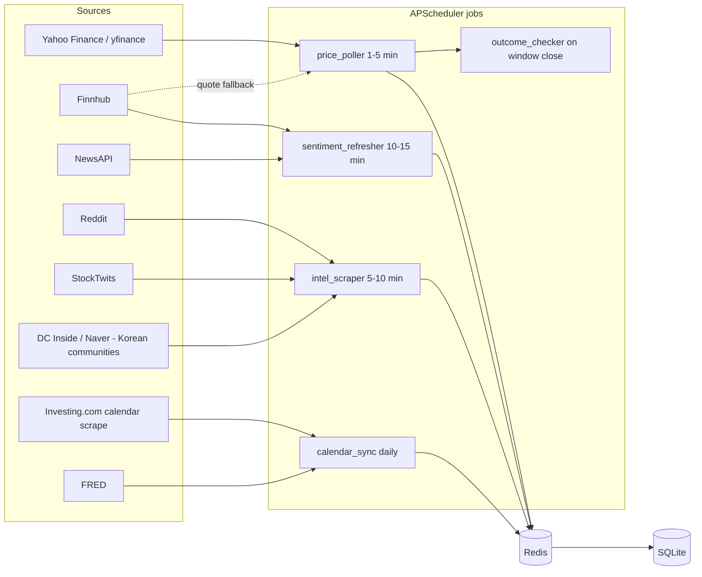
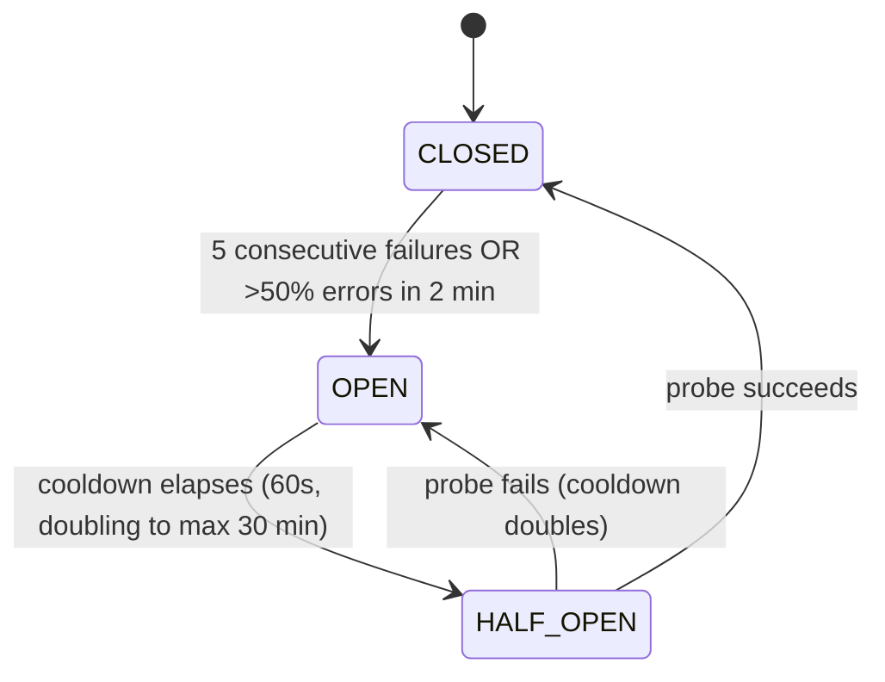

# DC Intel — External Data Sources Specification

**Status:** v1 spec · **Last updated:** 2026-06-12
**Related docs:** `deployment-architecture.md` (job scheduler, circuit breaker placement), `schema.md` (tables that store this data), `backend-design.md` (endpoints that serve it), `prediction-model.md` (feature consumers).

This document specifies every external API and data stream DC Intel consumes: what we pull, how we authenticate, the free-tier limits we operate inside, the exact polling cadence we run, what happens when a source degrades or dies, and the request-budget math proving our cadences fit free tiers for **~50 tracked stocks** (the v1 capacity assumption).

> **Rate-limit disclaimer (applies to every figure in this doc):** all third-party rate limits, quotas, and prices below are commonly published figures as of writing. Providers change them without notice. **Verify current limits at signup** before relying on any number here, and re-verify before each capacity increase.

---

## 0. Canonical cadences (must match everywhere)

These are the platform-wide update cadences. Every per-source cadence in this document is an instantiation of one of these rows.

| Data class | Canonical cadence | Consuming jobs |
|---|---|---|
| Stock prices | every 1–5 min | `price_poller` |
| Technical indicators | every 5 min (computed internally from cached prices — no extra API calls) | `indicator_calculator` |
| Sentiment refresh (news + social sentiment scoring) | every 10–15 min | `sentiment_refresher` |
| Social-media market intel scrape | every 5–10 min | `intel_scraper` |
| Economic calendar | checked daily | `calendar_sync` |
| Prediction outcomes | when each prediction window closes (1h/5h/24h/2d/3d/5d) | `outcome_checker` |

All jobs run in-process via **APScheduler** (v1). All fetched data lands in **Redis** (hot cache) and is persisted to **SQLite** tables (`technical_snapshots`, `sentiment_logs`, `economic_events`, `market_intel`) per `schema.md`.

### Source → feature flow



---

## 1. Yahoo Finance (via `yfinance`) — prices, volume, fundamentals

| Field | Value |
|---|---|
| **What we pull** | Real-time-ish quotes (last price, change, volume), OHLCV history (1m/5m/1h/1d bars) for indicator computation, basic fundamentals (market cap, P/E, 52-week range), index levels (KOSPI, NASDAQ Composite, S&P 500, Nikkei 225, DAX) |
| **Access method** | `yfinance` Python library (>= latest release; pin in `requirements.txt` and watch its issue tracker) |
| **Auth** | None — no API key exists |
| **Free-tier limits** | **None published — this is the problem, not a perk.** `yfinance` scrapes Yahoo's unofficial endpoints. Yahoo has historically added crumb/cookie auth and aggressive IP rate limiting with zero notice. Community guidance: stay under ~1–2 requests/sec sustained and batch tickers. *Verify current behavior at integration time — there is nothing to "sign up" for.* |
| **Our cadence** | Batched quote download every **1 min during market hours** per exchange, every **5 min during US extended hours**, paused while an exchange is closed (serve last close). Matches canonical "prices every 1–5 min". Daily OHLCV history backfill once per day after each market close. |
| **Freshness/delay** | US quotes are near-real-time (Nasdaq Last Sale–derived). Non-US exchanges (including KRX) may be delayed up to ~15–20 min depending on Yahoo's exchange agreements. **Action item:** during integration, compare a Yahoo KRX quote against a live broker quote and record the measured delay in this doc. UI must show the `data_as_of` timestamp, never imply tick-level real-time. |
| **First paid tier** | N/A — Yahoo sells no API. The "paid upgrade" is switching providers (Polygon.io Stocks Starter ~US$29/mo, or Finnhub paid — see below). |
| **Fallback** | **Finnhub `/quote`** for US/ADR symbols (free tier, real-time US). For **KRX symbols** Finnhub free tier does not cover Korean market data — KRX fallback is **`pykrx`** (also unofficial, scrapes KRX/Naver) or the **Korea Investment & Securities (KIS) open API** (official, free, requires a Korean brokerage account — see open question Q2). |
| **When down** | Circuit breaker opens (§9). Serve last cached quote from Redis with `is_stale: true`. Predictions **continue** using the most recent `technical_snapshots` row but the confidence display gets a "data delayed" gray badge; if price data is older than **30 min during market hours**, new prediction requests for affected symbols return the cached prediction (if any) or a `503 SOURCE_DEGRADED` with a plain-language message ("시세 데이터가 지연되고 있어요" / "Price data is delayed right now"). The `outcome_checker` defers outcome grading until a fresh price is available (it never grades against stale prices). |

### Stability risk — read this before building on yfinance

`yfinance` is **unofficial**. Known historical failure modes, all of which have actually happened:

1. Yahoo adds cookie/"crumb" authentication → all requests 401 until the library patches (days).
2. Yahoo rate-limits the host IP → intermittent 429s, often triggered by per-ticker loops.
3. Yahoo silently changes a JSON field → wrong/missing data without an error.

**Mitigations we implement (mandatory):**

- **Batch, never loop.** One `yf.download("005930.KS 035420.KS ... AAPL NVDA", period=..., interval=...)` call per cycle, not 50 single-ticker calls. One batched call per exchange per minute ≈ **2 requests/min total** — polite and cheap.
- **Validate every payload** (non-null price, price within ±30% of previous tick, volume ≥ 0) before caching; a failed validation counts as a source failure for the circuit breaker.
- **Pin the library version**; upgrade deliberately, not automatically.
- **Fallback wired from day one** (Finnhub for US, pykrx/KIS for KRX) — not a "later" item, because yfinance outages are a *when*, not an *if*.

### Symbol conventions (worked example)

| DC Intel symbol | yfinance ticker | Notes |
|---|---|---|
| `005930:KRX` (Samsung Electronics) | `005930.KS` | `.KS` = KOSPI, `.KQ` = KOSDAQ |
| `AAPL:NASDAQ` | `AAPL` | bare ticker for US |
| `TSM:NYSE` (ADR) | `TSM` | ADRs are plain US tickers |
| KOSPI index | `^KS11` | dashboard `/dashboard/indexes` |
| NASDAQ Composite / S&P 500 / Nikkei 225 / DAX | `^IXIC` / `^GSPC` / `^N225` / `^GDAXI` | same |

The `stocks` table stores both our `{symbol}:{exchange}` key and the provider-specific ticker (`yfinance_ticker`, `finnhub_ticker` columns per `schema.md`) so fallback switching never requires symbol re-mapping at request time.

---

## 2. FRED — macroeconomic data

| Field | Value |
|---|---|
| **What we pull** | US unemployment rate, CPI (inflation), GDP, Fed funds rate, 10Y Treasury yield; selected Korea series mirrored on FRED; **scheduled release dates** via the `releases/dates` endpoint (feeds the economic calendar — see §3) |
| **Access method** | Official REST API (`https://api.stlouisfed.org/fred/...`) via the `fredapi` Python library or plain `httpx` |
| **Auth** | Free API key — register at https://fred.stlouisfed.org/docs/api/api_key.html (instant, email + account). Env var: `FRED_API_KEY` |
| **Free-tier limits** | Commonly cited **~120 requests/min**; the entire API is free, no payment tier exists. *Verify current limits at signup.* |
| **Our cadence** | **Once daily** at 07:00 KST (canonical "economic calendar checked daily" — macro series move monthly/quarterly, daily polling is already generous). ~10 series + 1 release-dates call ≈ **11 requests/day**. |
| **Freshness/delay** | FRED publishes within minutes-to-hours of official agency releases. Series are **revised** retroactively (GDP especially) — store `realtime_start` with each observation and never treat past values as immutable. Data granularity is monthly/quarterly; this is regime context for the models, not a fast signal. |
| **First paid tier** | None exists — FRED is free, full stop. |
| **Fallback** | None needed for v1 (official, US-government-backed, historically very stable). If unreachable, yesterday's cached values are fine for days. Optional Korea supplement: **Bank of Korea ECOS API** (free key at https://ecos.bok.or.kr) for BOK base rate and Korean CPI if FRED's Korea mirrors prove too laggy — noted, not built, in v1. |
| **When down** | Serve cached values with `is_stale` after **7 days** (macro staleness threshold). No user-facing feature visibly degrades for short outages; the economic-calendar US-macro rows simply stop refreshing. |

### Series IDs we pull (worked list)

| Series ID | What | Frequency |
|---|---|---|
| `UNRATE` | US unemployment rate | monthly |
| `CPIAUCSL` | US CPI (all urban) | monthly |
| `GDP` | US GDP | quarterly |
| `FEDFUNDS` | Effective Fed funds rate | monthly |
| `DGS10` | 10Y Treasury yield | daily |
| `KORCPIALLMINMEI` | Korea CPI (OECD mirror) | monthly |
| `LRUNTTTTKRM156S` | Korea unemployment (OECD mirror) | monthly |

Stored as features in `technical_snapshots`-adjacent macro context (see `prediction-model.md`); release *dates* land in `economic_events`.

---

## 3. Economic Calendar — evaluation and recommendation

**Requirement:** scheduled events — CPI releases, earnings reports, central-bank meetings (Fed/FOMC **and** Bank of Korea), IPOs, major company announcements — for `GET /dashboard/economic-calendar` and as model features ("event in next 24h" flags).

### Candidate evaluation

| Criterion | Trading Economics | Investing.com (unofficial) | Polygon.io |
|---|---|---|---|
| Official API | ✅ Yes | ❌ No — scraping only | ✅ Yes |
| US macro calendar (CPI, FOMC) | ✅ | ✅ | ⚠️ Partial — economy endpoints (treasury yields, inflation) but **no forward-looking macro event calendar** |
| Korea coverage (BOK, Korean CPI) | ✅ (paid tiers) | ✅ | ❌ |
| Earnings calendar | ✅ | ✅ | ⚠️ via partner data on paid plans |
| IPO calendar | ⚠️ limited | ✅ | ✅ (`/vX/reference/ipos`) |
| Free tier | ⚠️ `guest:guest` dev access covers only ~4 minor markets (Sweden, Mexico, NZ, Thailand) — **no US, no Korea**; *verify at signup* | Free (it's scraping) | 5 calls/min, end-of-day focus; *verify at signup* |
| First paid tier | Pricing not publicly fixed; commonly reported from **~US$100–300/mo** — *verify with sales* | N/A | Stocks Starter **~US$29/mo** — *verify at signup* |
| Stability/ToS risk | Low | **High** — Cloudflare has broken scrapers before (`investpy` died in 2022); ToS-gray | Low |

### Recommendation

- **Primary: Investing.com economic + earnings + IPO calendar via our own scraper.** It is the only zero-cost option covering *every* required event type for *both* US and Korea. The risk profile is acceptable **specifically because the cadence is daily and the data is forward-looking**: a broken scraper costs us calendar freshness measured in days, not minutes, and the fallback (below) covers the must-have events. Build defensively: own parser (no dead third-party wrapper like `investpy`), realistic browser headers, 1 request per calendar page with 5–10 s spacing, **3–5 requests/day total**, alert on parse-shape change.
- **Fallback: official-free composite** (zero new vendors — every piece is already integrated or static):
  1. **FRED `releases/dates`** → US CPI / GDP / employment release schedule (official, free).
  2. **Finnhub earnings + IPO calendars** (`/calendar/earnings`, `/calendar/ipo`) on the free tier we already use for news — *verify these endpoints remain free-tier at signup*.
  3. **Static seed files** for FOMC and Bank of Korea Monetary Policy Committee meeting dates — both central banks publish full-year schedules in advance; we commit `data/fomc_2026.json` and `data/bok_mpc_2026.json` and refresh them once a year (calendar reminder in the team runbook).
- **Paid upgrade path:** Trading Economics replaces the scraper when revenue justifies ~US$100+/mo. Polygon.io is **rejected for this role** (no macro calendar) but remains a candidate for the *quote* fallback chain (§1).

| Field | Value (primary = Investing.com scrape) |
|---|---|
| **Auth** | None (scrape). Fallback pieces use existing `FRED_API_KEY` / `FINNHUB_API_KEY`. |
| **Our cadence** | **Once daily** at 06:30 KST, pulling the next 14 days of events; upsert into `economic_events` keyed on `(source_event_id, event_date)`. Matches canonical "economic calendar checked daily". |
| **Freshness/delay** | Event *times* occasionally shift (earnings dates especially) — the daily re-pull picks changes up within 24 h, which is acceptable for a calendar view. Event *results* (actual vs. forecast values) appear minutes after release; v1 backfills actuals on the next daily run — we do **not** poll for intraday actuals. |
| **When down** | Calendar data degrades gracefully: events already in `economic_events` keep serving for 14 days. UI shows "calendar last updated <date>" once data is >48 h old (`is_stale`). If the scraper breaks for >3 consecutive days, the composite fallback is promoted automatically by the circuit breaker and an ops alert fires to fix the parser. |

---

## 4. Social media — unconfirmed market intel

Feeds the `intel_scraper` job (canonical: every 5–10 min) and the `GET /dashboard/market-intel` endpoint. Everything here lands in the `market_intel` table with `confirmed = false` and a `credibility_score`; items are only flipped to `confirmed = true` when corroborated by a news source (§5). UI labels this section honestly: "미확인 정보" / "Unconfirmed intel".

`market_intel.source` enum values: `reddit`, `stocktwits`, `dcinside`, `naver`, `twitter` (all v1 sources; `twitter` via logged-in session scraping, §4.1).

### 4.1 Twitter/X — **v1 via logged-in session scraping (personal-use)**

> **Scope & honesty note (owner decision).** DC Intel is a **personal-use** tool, so X is collected for free by **reusing a logged-in account's web session** rather than paying for the API. This is a deliberate, informed trade with real downsides — read the risk row. The pipeline must treat X as a **best-effort, may-disappear source**: it runs fully without X (graceful degradation, §9), and X carries the **lowest weight of trust** until corroborated, same as any social source.

| Field | Value |
|---|---|
| **What we pull** | Cashtag search (`$AAPL`, `$삼성전자`) and a small watched-account list, for the ~50 tracked tickers |
| **Access method** | **Logged-in session scraping** of x.com's internal GraphQL endpoints — the same calls the website makes — via a maintained client library (e.g. `twikit`) or a thin `httpx` wrapper. **No paid API, $0.** |
| **Auth** | A real account's **session credentials**, not an API key: the `auth_token` cookie + the `ct0` (CSRF) cookie + the public web bearer the client supplies. Env: `TWITTER_ENABLED` (default `true`) + `TWITTER_AUTH_TOKEN` + `TWITTER_CT0` (or `TWITTER_COOKIES_FILE` for a persisted cookie jar that `twikit` writes after a one-time login). **Do not store the account password** in env or the repo — extract the two cookies once from a logged-in browser, or do a single interactive login that persists the cookie file. If the cookies are absent, the job logs a warning and **self-disables** (the pipeline keeps running without X). |
| **Account guidance** | Use a **dedicated account you don't mind losing** — never your primary/personal account. Scraping accounts can be rate-limited, challenged, or suspended; isolating that risk to a throwaway account protects your real identity. **One** account only. |
| **Cadence & politeness** | The canonical intel cadence (every 5–10 min, `intel_scrape_twitter` every 10 min); low, human-plausible request volume for ~50 cashtags. Aggressive exponential backoff on `429`/auth-challenge; on a lock/challenge the circuit breaker opens and X is dropped for a cool-down. **Do not escalate** into proxy rotation, browser-fingerprint spoofing, or multiple rotating accounts — at personal volume it is unnecessary, and needing it is the signal you're pushing harder than a personal tool should. If you get blocked, **back off or accept the gap**, don't build an evasion arms race. |
| **Risk (read before enabling)** | (1) **ToS:** logging in means you accepted X's terms, which prohibit automated access/scraping — this breaches them. (2) **Account:** the scraping account may be rate-limited or **suspended** at any time. (3) **Brittleness:** the internal GraphQL API + query IDs change without notice, so the scraper **will break periodically** and needs maintenance. These are acceptable *only* under the personal-use, single-user, low-volume scope; **revisit entirely if DC Intel is ever distributed or commercialized** (then the clean path is the paid Basic API). |
| **Fallback / when down** | Drop X and reweight the remaining social sources (Reddit + StockTwits + Korean communities) — no hard dependency. Cooldown via the per-source circuit breaker (§9); the feed simply shows fewer X-sourced items, flagged like any reduced-coverage state. |

### 4.2 Reddit

| Field | Value |
|---|---|
| **What we pull** | New + hot posts and top comments from finance subreddits: `r/stocks`, `r/wallstreetbets`, `r/investing`, `r/StockMarket`, `r/options`, `r/pennystocks`, plus ticker-mention search across them. (Korean-language stock discussion barely exists on Reddit — Korean coverage comes from §4.4.) |
| **Access method** | Official Reddit Data API via **PRAW** (`praw` Python library), OAuth script-type app |
| **Auth** | Create a "script" app at https://www.reddit.com/prefs/apps → get client ID + secret. Env vars: `REDDIT_CLIENT_ID`, `REDDIT_CLIENT_SECRET`, `REDDIT_USER_AGENT` (Reddit requires a descriptive UA, e.g. `web:dc-intel:v1.0 (by /u/<account>)`). |
| **Free-tier limits** | Commonly published since the 2023 API changes: **100 queries/min per OAuth client** (10 QPM unauthenticated — always authenticate). *Verify current limits at signup.* |
| **Our cadence** | Subreddit `new` + `hot` listings every **5 min** (6 subs × 2 listings = 12 calls); tracked-ticker search sweep every **10 min** (50 searches). Matches canonical "social intel scrape every 5–10 min". |
| **Freshness/delay** | Listings are real-time. Reddit search indexing can lag minutes. Scores/upvotes churn for hours — we snapshot score at scrape time and re-rank on later sightings rather than treating the first score as final. |
| **First paid tier** | Published commercial rate (2023): **~US$0.24 per 1,000 API calls** above free thresholds — *verify; our usage stays inside the free tier (§8)*. |
| **Fallback** | StockTwits (different community, same feature slot). No Reddit-mirror scraping — not worth the ToS risk for a redundant source. |
| **When down** | `dashboard/market-intel` keeps serving cached items with `is_stale` after 30 min; sentiment features fall back to news-only sentiment (Finnhub/NewsAPI) with the social-sentiment feature weight zeroed and the prediction evidence bullets simply not citing social signals. No hard failure anywhere. |

### 4.3 StockTwits

| Field | Value |
|---|---|
| **What we pull** | Per-symbol message streams (`/streams/symbol/{ticker}.json`) including user-self-labeled bullish/bearish tags (a free pre-labeled sentiment signal), plus trending symbols (`/trending/symbols.json`) |
| **Access method** | Public REST API (`api.stocktwits.com/api/2/`), plain `httpx` — no maintained official Python SDK |
| **Auth** | Register an app at the StockTwits developer portal for an access token — env var `STOCKTWITS_ACCESS_TOKEN`. **Note:** API access policy has tightened over the years; app approval may require a short form. *Verify access process and limits at signup.* |
| **Free-tier limits** | Commonly reported: **200 requests/hr unauthenticated (per IP), 400 requests/hr authenticated**. *Verify current limits at signup.* |
| **Our cadence** | Trending symbols + top-20 hottest tracked tickers every **10 min** (21 calls/cycle); remaining 30 tracked tickers every **30 min**. Matches canonical 5–10 min for the hot path. Total ≈ 186 calls/hr — fits even the *unauthenticated* limit (§8). |
| **Freshness/delay** | Real-time firehose-of-opinion; KRX tickers are essentially absent (US/ADR coverage only). The bullish/bearish self-labels are noisy and skew bullish — calibrate, don't trust raw ratios (see `prediction-model.md`). |
| **First paid tier** | Partner/commercial API — pricing on request, not publicly listed. *Verify if ever needed.* |
| **Fallback** | Reddit (same feature slot). |
| **When down** | Identical degradation to Reddit (§4.2). If **both** Reddit and StockTwits are down, the market-intel dashboard panel shows the stale-cache state and predictions run technicals + news sentiment only — this is a documented reduced-evidence mode, and evidence bullets will show only technical/news signals. |

### 4.4 Korean communities — DC Inside & Naver (unofficial)

Korean retail sentiment lives on **DC Inside stock galleries** (국내주식갤러리, 해외주식갤러리) and **Naver 종목토론실** (per-stock discussion boards) — neither has an official API.

| Field | Value |
|---|---|
| **What we pull** | New post titles + bodies from 2 DC Inside galleries; new posts from Naver discussion boards of tracked KRX stocks |
| **Access method** | Our own HTML scraper (`httpx` + `selectolax`/`BeautifulSoup`), respectful: identifyable UA, honor robots.txt, 2–5 s spacing per page |
| **Auth** | None |
| **Free-tier limits** | N/A (scraping) — self-imposed budget: ≤ 30 page fetches per 10-min cycle |
| **Our cadence** | Every **10 min** (canonical 5–10 min window) |
| **Freshness/delay** | Real-time posts; extremely high noise/troll ratio — `credibility_score` starts low for these sources and items never reach `confirmed = true` without news corroboration |
| **First paid tier** | N/A |
| **Fallback** | None (unique data). When down, Korean-community intel simply pauses; KRX sentiment falls back to news sources. |
| **When down** | Same stale-cache pattern as §4.2. Scraper breakage alerts ops; this source is explicitly allowed to be down for days without blocking releases. |

> ⚠️ **ToS/legal note:** scraping DC Inside and Naver is ToS-gray, like all unofficial scraping in this doc. Volume is kept trivially low and content stored as short snippets + links (`content_snippet`, `url` columns), not full mirrored posts. Needs product-owner sign-off — see open question Q3.

---

## 5. News aggregators — rapid sentiment shifts & confirmed-news detection

Two roles: (a) fast inputs to `sentiment_refresher` (canonical 10–15 min), (b) the **confirmation oracle** for market intel — when a news article corroborates an unconfirmed `market_intel` item (same ticker + matching event keywords within a time window), the item flips to `confirmed = true`.

### 5.1 Finnhub — **primary news source + designated quote fallback**

| Field | Value |
|---|---|
| **What we pull** | Company news per symbol (`/company-news`), general market news (`/news`), earnings calendar + IPO calendar (calendar fallback, §3), and `/quote` (price fallback for US/ADR, §1) |
| **Access method** | Official REST API; `finnhub-python` official SDK or `httpx` |
| **Auth** | Free API key, instant signup at https://finnhub.io/register. Env var: `FINNHUB_API_KEY` |
| **Free-tier limits** | Commonly published: **60 API calls/min** (with a short-burst ceiling around 30/s). Free tier covers US market data + company news; many premium endpoints (e.g., pre-computed news *sentiment*) are paid. *Verify current limits and endpoint tiering at signup.* |
| **Our cadence** | Company news for all 50 tracked symbols every **10 min** (50 calls/cycle = 5/min avg); general news 1 call/10 min. In **quote-fallback mode** add a 50-symbol `/quote` sweep every 5 min (10/min avg). Matches canonical "sentiment refresh 10–15 min". |
| **Freshness/delay** | News appears within minutes of publication — this is our rapid-shift detector. Coverage of Korean-language domestic news is thin; KRX-listed large caps get English coverage, small caps don't (accepted v1 gap). |
| **First paid tier** | Paid plans commonly reported from **~US$50–60+/month** depending on bundle — *verify at finnhub.io/pricing*. |
| **Fallback** | NewsAPI (breadth, below) for news; for the *quote-fallback* role Finnhub itself is the fallback, with Polygon.io free (5 calls/min) as a last-resort third layer for spot checks only. |
| **When down** | Sentiment refresh continues on NewsAPI alone (slower, see 5.2); intel confirmation pauses (items stay `confirmed = false` — honest default); if simultaneously in yfinance-fallback mode, US quotes go stale per §1 rules. |

### 5.2 NewsAPI — breadth + backfill

| Field | Value |
|---|---|
| **What we pull** | Keyword/ticker-name search across ~80k outlets (`/v2/everything`), business top headlines (`/v2/top-headlines`) |
| **Access method** | Official REST API; `newsapi-python` or `httpx` |
| **Auth** | Free Developer key at https://newsapi.org/register. Env var: `NEWSAPI_API_KEY` |
| **Free-tier limits** | Commonly published Developer tier: **100 requests/day**, articles **delayed 24 hours**, non-commercial/development use only. *Verify current limits at signup.* |
| **Our cadence** | **Hourly** (24 calls/day): one `everything` query OR-ing tracked company names (batched, `pageSize=100`), rotating through the ticker list across hours. |
| **Freshness/delay** | **The 24-hour article delay on the free tier makes NewsAPI structurally unable to detect rapid sentiment shifts.** Honest role assignment: Finnhub is the *only* rapid-news source in v1; NewsAPI provides breadth, next-day corroboration for intel confirmation, and training-data backfill. The license also restricts commercial use — see open question Q4 before public launch. |
| **First paid tier** | **Business, ~US$449/month** (real-time articles, commercial license, 250k req/mo) — *verify at newsapi.org/pricing*. |
| **Fallback** | None needed (it *is* the breadth fallback). If both news sources are down, sentiment serves stale and predictions degrade to technicals-only evidence. |
| **When down** | No visible feature loss for hours (its data is ≥24 h old anyway); `sentiment_logs` rows just stop citing `newsapi` as source. |

---

## 6. Summary matrix

| Source | Data type | Our cadence | Free-tier limit (verify at signup) | Auth | Fallback |
|---|---|---|---|---|---|
| Yahoo Finance (`yfinance`) | Prices, volume, OHLCV, fundamentals, indexes | 1 min (market hours), 5 min (US extended), batched | None published — unofficial; stay <2 req/min batched | None | Finnhub (US/ADR); pykrx or KIS API (KRX) |
| FRED | US/KR macro: unemployment, CPI, GDP, rates; release dates | Daily (~11 calls/day) | ~120 req/min, fully free | Free API key | None needed (cache OK for days) |
| Investing.com (scrape) | Economic calendar: CPI, FOMC, BOK, earnings, IPOs | Daily (3–5 req/day) | N/A (scrape, self-limited) | None | FRED release-dates + Finnhub calendars + static FOMC/BOK files |
| Reddit (PRAW) | Social intel + sentiment (US) | Listings 5 min; ticker search 10 min | 100 queries/min OAuth | OAuth script app | StockTwits |
| StockTwits | Social intel + labeled bull/bear sentiment (US) | Hot 10 min; full sweep 30 min | 200/hr unauth, 400/hr auth | App token | Reddit |
| DC Inside / Naver (scrape) | Korean retail intel | 10 min (≤30 pages/cycle) | N/A (scrape, self-limited) | None | None (unique data; degrades to news) |
| Twitter/X | Cashtag intel (v1, **logged-in session scraping**, personal-use) | 10 min | $0 (no API); self-imposed low volume, breaker cooldown on lock | Session cookies (`TWITTER_AUTH_TOKEN`+`TWITTER_CT0`); `TWITTER_ENABLED=true` | Reweight remaining social sources |
| Finnhub | Company/market news; earnings+IPO calendar; quote fallback | News 10 min; quotes 5 min (fallback mode only) | 60 calls/min | Free API key | NewsAPI (news role) |
| NewsAPI | News breadth, backfill, next-day corroboration | Hourly (24 calls/day) | 100 req/day, 24 h article delay, non-commercial | Free API key | None (is the fallback) |

---

## 7. API-key management

**Rules (non-negotiable):**

1. **Keys live in environment variables only.** Local dev: a `.env` file loaded by `pydantic-settings` (`Settings(BaseSettings)` in `app/config.py`). Production: Railway environment variables, or GCP Secret Manager exposed as env vars.
2. **`.env` is in `.gitignore` from the first commit.** A committed **`.env.example`** lists every variable name with placeholder values and a one-line comment on where to obtain each key.
3. **Never log keys.** The HTTP client wrapper redacts known key query-params/headers (`token=`, `apiKey=`, `api_key=`, `Authorization`) before any log line is emitted.
4. **One key per environment** (dev / prod) where the provider allows multiple keys, so a leaked dev key never burns prod quota.
5. **Rotation:** if a key appears in any log, paste, or commit — rotate immediately at the provider, update the env var, restart. All keys here are free to regenerate.

**Canonical environment variable names** (other docs and code must use these exact names):

```bash
# .env.example
FRED_API_KEY=            # https://fred.stlouisfed.org/docs/api/api_key.html
FINNHUB_API_KEY=         # https://finnhub.io/register
NEWSAPI_API_KEY=         # https://newsapi.org/register
REDDIT_CLIENT_ID=        # https://www.reddit.com/prefs/apps (script app)
REDDIT_CLIENT_SECRET=
REDDIT_USER_AGENT=web:dc-intel:v1.0 (by /u/your_account)
STOCKTWITS_ACCESS_TOKEN= # StockTwits developer portal
# --- Twitter/X: v1 via logged-in session scraping (personal-use, §4.1) ---
TWITTER_ENABLED=true     # on in v1; job self-disables if the cookies below are unset
TWITTER_AUTH_TOKEN=      # `auth_token` cookie from a logged-in (dedicated/throwaway) account — NOT a password
TWITTER_CT0=             # `ct0` (CSRF) cookie from the same session
# TWITTER_COOKIES_FILE=  # alt: path to a persisted cookie jar (e.g. twikit) instead of the two cookies above
# --- optional / reserved ---
POLYGON_API_KEY=         # last-resort quote spot-checks
TRADINGECONOMICS_API_KEY=# paid calendar upgrade path
KIS_APP_KEY=             # KRX quote fallback, pending Q2
KIS_APP_SECRET=
```

Startup behavior: the app **fails fast** with a clear message if a *required* key (`FRED_API_KEY`, `FINNHUB_API_KEY`, `NEWSAPI_API_KEY`, Reddit trio) is missing; *optional* keys missing just disable their integration with a startup log line.

---

## 8. Request-budget math — 50 tracked stocks vs. free tiers

Assumptions: **50 tracked stocks** (≈25 KRX + 25 US/ADR), 5 indexes. KRX session 09:00–15:30 KST = 390 min/day; US session 09:30–16:00 ET = 390 min/day; US extended hours ≈ 6.5 h.

| Source | Worst-case usage at our cadence | Free limit (verify at signup) | Headroom |
|---|---|---|---|
| yfinance | 1 batched call/min/exchange while open + 1/5 min extended + indexes batch: ≈ **(390 + 390 + 78 + 800) ≈ 1,660 calls/day ≈ ~1.2/min average, ≤2/min peak** | No published limit; community-safe zone ~1–2 req/min | Within polite zone; batching is what makes this work — *never* per-ticker loops |
| Finnhub (normal mode) | News: 50 calls/10 min + 1 general = **5.1/min**; daily calendars +2/day | 60/min | **~91% free** |
| Finnhub (quote-fallback mode) | Above + 50 quotes/5 min (**10/min**) = **15.1/min** | 60/min | **~75% free** even in failure mode |
| FRED | 10 series + 1 release-dates = **11 calls/day** | ~120/min | Effectively unlimited |
| NewsAPI | 1 batched query/hour = **24/day** | 100/day | **76% free** — room for 3 extra ad-hoc queries/hour during news spikes |
| Reddit | 12 listing calls/5 min + 50 searches/10 min = **2.4 + 5.0 = 7.4/min** | 100/min OAuth | **~93% free** |
| StockTwits | (1 trending + 20 hot)/10 min + 30 cold/30 min = 126 + 60 = **186/hr** | 200/hr unauth, 400/hr auth | Fits unauthenticated; **>50% free** authenticated |
| Investing.com scrape | **3–5 page fetches/day** | self-imposed | Trivial |
| DC Inside / Naver scrape | ≤30 pages/10 min = **≤3/min** | self-imposed | Deliberately tiny |

**Conclusion:** every cadence fits its free tier with ≥50% headroom, *including* the Finnhub quote-fallback failure mode. **Scaling note:** the per-symbol sources (Finnhub news, Reddit search, StockTwits) scale linearly with tracked-stock count — at ~150 stocks Finnhub news polling alone hits 15/min and StockTwits breaks its hourly cap; revisit this table before raising the 50-stock cap. yfinance batching scales to hundreds of tickers per call, so prices are not the bottleneck.

---

## 9. Global fallback strategy

### 9.1 Per-source circuit breaker

Every external source gets an independent circuit breaker (simple in-process implementation, state in Redis so it survives restarts; see `deployment-architecture.md` for placement).



- **Failure** = timeout (10 s connect/read), HTTP 5xx, 401/403 (auth broken), 429 (rate-limited), or payload validation failure (§1).
- While **OPEN**: the job skips the source, immediately uses its designated fallback (if one exists), and serves cache otherwise. **429 special case:** opens the breaker for the provider's `Retry-After` (or 5 min default) *and* logs a budget alert — a 429 at our cadences means the math in §8 broke or the provider changed limits.
- Breaker state changes emit a structured log + ops alert (v1: log-based; no paging infra).

### 9.2 Stale cache with staleness flag

Last-known-good data is **never deleted** on source failure — it is served with honest metadata. Every data-bearing API response carries a `meta` object (contract with `backend-design.md`):

```json
{
  "data": { "...": "..." },
  "meta": {
    "source": "yfinance",
    "data_as_of": "2026-06-12T14:32:00+09:00",
    "is_stale": true
  }
}
```

`is_stale` thresholds (≈2× the polling cadence, except slow-moving data):

| Data type | Fresh if younger than |
|---|---|
| Price (market hours) | 5 min |
| Price (market closed) | never stale — last close is correct by definition |
| Technical indicators | 15 min |
| Sentiment | 30 min (read-time staleness rule per `sentiment-pipeline.md` §8.2) |
| Market intel | 30 min |
| Economic calendar | 48 h |
| Macro (FRED) | 7 days |

UI renders `is_stale: true` as a **gray** "데이터 지연 / Data delayed" badge with the `data_as_of` time — gray because staleness is neutral information, per the canonical color semantics (green=bullish, red=bearish, gray=neutral).

### 9.3 Feature degradation map — what breaks when each source is down

| Source down | Degraded features | Hard-failed features | User-visible behavior |
|---|---|---|---|
| Yahoo Finance | Quotes via Finnhub (US) / pykrx-KIS (KRX) at 5-min cadence; indicators recompute on fallback prices | If fallback also down >30 min in market hours: new predictions for affected symbols return cached or `503 SOURCE_DEGRADED`; outcome grading defers | Stale badge on prices; "try again shortly" message on new predictions |
| Finnhub | Rapid news detection lost → sentiment rides NewsAPI (≥24 h delayed); intel confirmation pauses; calendar fallback piece offline | None | Sentiment marked stale after 30 min; intel items stay "unconfirmed" |
| NewsAPI | News breadth/backfill lost; next-day intel corroboration pauses | None | Effectively invisible for hours |
| FRED | Macro features and US-macro calendar rows frozen at cache | None (cache valid ~7 days) | Invisible for short outages |
| Investing.com scrape | Calendar stops refreshing; auto-promotes composite fallback (FRED dates + Finnhub calendars + static FOMC/BOK) | None within 14-day event horizon | "Calendar last updated" notice after 48 h |
| Reddit | Social sentiment from StockTwits only; US intel volume drops | None | Fewer intel cards; evidence bullets cite social signals less often |
| StockTwits | Social sentiment from Reddit only; bull/bear self-label feature zeroed | None | Same as above |
| Reddit **and** StockTwits | Predictions run on technicals + news only (documented reduced-evidence mode); `/dashboard/market-intel` serves stale + Korean-community items only | None | Intel panel mostly stale; evidence bullets show technical/news signals only |
| DC Inside / Naver | Korean retail intel pauses; KRX sentiment = news only | None | Fewer Korean intel cards |
| **Redis itself** | Not an external source, but: jobs write through to SQLite, reads fall back to SQLite (slower); see `deployment-architecture.md` | None | Slower responses |

**Design principle:** no single external source can take down the API. Predictions degrade in evidence richness (fewer of the up-to-3 evidence bullets, with contributions still summing to 100% across whichever signals remain), never in availability — except the explicit price-staleness guard, because predicting on >30-min-old prices during market hours would be dishonest, and honesty is the product.
