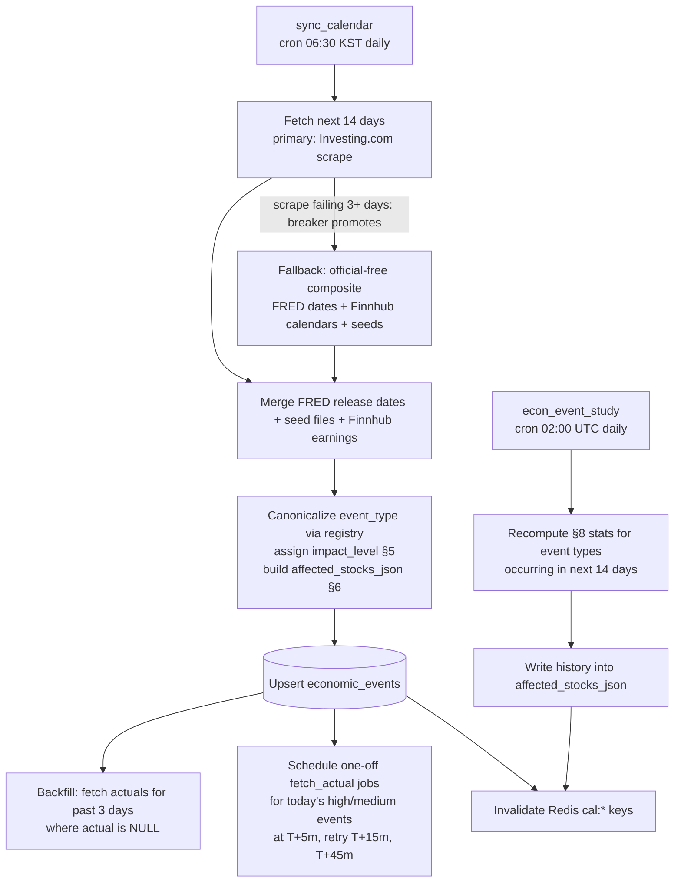
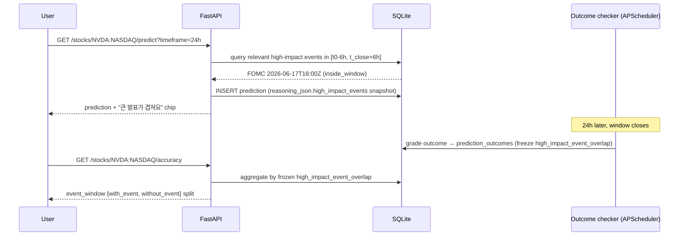

# Economic Calendar — Feature Specification (v1)

Status: v1 spec, implementation-ready
Owner: DC Intel core team
Related docs: `schema.md` (authoritative DDL), `backend-design.md` (endpoint catalog + scheduler registry), `prediction-model.md` (prediction pipeline), `win-loss-tracking.md` (win/loss tracking)

---

## 1. Purpose and scope

The economic calendar answers four beginner questions:

1. **"What is coming up that could move my stocks?"** — upcoming events for the next 7 days with a plain-language impact level (high / medium / low).
2. **"What usually happens when this event hits?"** — historical event-study stats: average price-move size and direction-consistency for affected stocks/indexes in the 1h and 24h after past releases.
3. **"Did the number come in better or worse than expected?"** — realized vs. expected values (e.g., CPI actual vs. forecast), stored in `economic_events.actual_vs_forecast_json`.
4. **"Did events mess with my predictions?"** — every prediction snapshots overlapping high-impact events into `predictions.reasoning_json.high_impact_events[]` (shape owned by `prediction-model.md` §8), and the outcome checker freezes `prediction_outcomes.high_impact_event_overlap` at resolve time so win/loss accuracy can be split into *around-major-news* vs. *quiet-period* predictions (`win-loss-tracking.md` §7; details in §13).

Out of scope for v1: push notifications, user-configurable alert rules, a real watchlist (v1.1, see §9), intraday calendar re-sync beyond the targeted actual-value fetchers (§11).

---

## 2. Data sources

Source selection is **owned by `data-sources.md` §3** (candidate evaluation: Trading Economics vs. Investing.com vs. Polygon.io). Its decision, restated: **primary = Investing.com scrape; fallback = official-free composite; Trading Economics = paid upgrade path only.** This section adds the calendar-feature view of each source.

| Role | Source | What we pull | Cost / limits (verify current limits at signup) | Risk notes |
|---|---|---|---|---|
| **Primary (macro + earnings + IPO calendar)** | Investing.com economic calendar — our **own scraper** of the public calendar endpoint (no third-party wrapper) | Scheduled events, importance (1–3 bulls), forecast / previous / actual values | Free; no official API. Self-imposed budget: realistic browser headers, 1 request per calendar page with 5–10 s spacing, **3–5 requests/day total**. | Brittle (HTML/endpoint changes break it — `investpy` died this way in 2022), ToS-gray. Acceptable **specifically because the cadence is daily and the data is forward-looking**: a broken scraper costs calendar freshness measured in days, not minutes. Isolate behind a provider adapter; alert on parse-shape changes (§11.5). Same risk class as our yfinance dependency, documented identically. It is the only zero-cost option covering every required event type for both US and KR (`data-sources.md` §3). |
| **Fallback piece 1 (US macro release dates)** | FRED `releases/dates` endpoint | Official release schedule for US macro series (CPI, GDP, unemployment) — dates only, no forecasts | Free API key; commonly published limit ~120 req/min — verify current limits at signup. | Stable and official. Also merged on every sync to cross-check the scrape's US dates; FRED is already a canonical DC Intel data source. |
| **Fallback piece 2 (earnings + IPO)** | Finnhub calendars (`/calendar/earnings`, `/calendar/ipo`) | Earnings dates + EPS/revenue estimate and actual for covered tickers; IPO dates | Free tier commonly published at ~60 calls/min — verify these endpoints remain free-tier at signup. | Finnhub is already a canonical news source; reuse the same API key. Cross-checks the scrape's earnings dates on every sync. Last-resort earnings fallback: yfinance earnings dates (unofficial, same stability caveat as prices). |
| **Fallback piece 3 (central-bank meetings)** | Static seed files in repo (`data/fomc_2026.json`, `data/bok_mpc_2026.json`, `data/boj_2026.json`) | FOMC, Bank of Korea MPC, Bank of Japan meeting dates — published a year ahead by each central bank | Free (manual yearly update; ~8 meetings each; calendar reminder in the team runbook) | Near-zero risk; guarantees the highest-impact events exist even if the scraper and all API pieces are down. The FOMC + BOK files and the `data/*.json` format are fixed by `data-sources.md` §3; the BOJ file is this doc's addition (Nikkei 225 is a canonical dashboard index), same format and refresh runbook. |
| **Paid upgrade path (NOT v1)** | Trading Economics API | Same fields as primary, via an official API | Free dev tier covers only ~4 minor markets — **no US, no Korea**; first paid tier commonly reported ~US$100–300/mo — verify with sales. | Rejected as v1 primary by `data-sources.md` §3 on cost. Replaces the scraper when revenue justifies it — budget decision flagged in §16. The provider adapter below makes the swap a config change. |

Pieces 1–3 together form the **official-free composite fallback** (zero new vendors — every piece is already integrated or static). It is promoted to primary automatically by the circuit breaker when the scrape fails for >3 consecutive days, with an ops alert to fix the parser (`data-sources.md` §3).

All providers sit behind a common adapter interface (`app/calendar/providers/base.py`):

```python
class CalendarProvider(Protocol):
    name: str
    def fetch_scheduled(self, start_utc: datetime, end_utc: datetime) -> list[RawEvent]: ...
    def fetch_actual(self, raw_ref: str) -> RawActual | None: ...
```

The sync job (§11) runs the primary scrape daily, merges FRED release dates + Finnhub calendars as cross-checks and seed-file events regardless, and the circuit breaker promotes the full composite to primary when the scrape fails for >3 consecutive days (`data-sources.md` §3).

---

## 3. Data model: `economic_events`

**`schema.md` owns the authoritative DDL** (its §4.6); this section mirrors it and explains the calendar-feature semantics. Two column names from early drafts of this doc were renamed by schema.md and are canonical there: **`event_name`** (drafted `title_en`) and **`event_time`** (drafted `scheduled_at_utc`). The API response keeps `title_en` / `scheduled_at_utc` as **field names** (§12, matching `backend-design.md` §6.9) — they are serializations of the `event_name` / `event_time` columns.

```sql
CREATE TABLE economic_events (
    id                      INTEGER PRIMARY KEY AUTOINCREMENT,
    event_name              TEXT    NOT NULL,             -- English display title (API field: title_en)
    event_time              TEXT    NOT NULL,             -- ISO 8601 UTC, e.g. '2026-06-17T18:00:00Z' (API field: scheduled_at_utc)
    impact_level            TEXT    NOT NULL DEFAULT 'low'
                            CHECK (impact_level IN ('high','medium','low')),
    affected_stocks_json    TEXT    CHECK (affected_stocks_json IS NULL
                                           OR json_valid(affected_stocks_json)),
                            -- JSON, shape in §6
    actual_vs_forecast_json TEXT    CHECK (actual_vs_forecast_json IS NULL
                                           OR json_valid(actual_vs_forecast_json)),
                            -- JSON, shape in §7; NULL until released
    provider                TEXT    NOT NULL,             -- 'trading_economics' | 'investing_com' | 'fred' | 'finnhub' | 'seed'
                                                          -- (schema.md §1.5; trading_economics = paid upgrade path, unused in v1)
    provider_event_id       TEXT,                         -- provider's stable id, NULL for seeds
    event_type              TEXT    NOT NULL,             -- canonical slug from the registry (§4), e.g. 'us_cpi', 'us_fomc_rate_decision', 'earnings:NVDA:NASDAQ'
    title_ko                TEXT,                         -- NULL falls back to event_name in the UI
    country                 TEXT    NOT NULL,             -- ISO 3166-1 alpha-2 ('US','KR','JP','DE') or 'GLOBAL'
    impact_source           TEXT    NOT NULL DEFAULT 'default'
                            CHECK (impact_source IN ('override','provider','default')),
    status                  TEXT    NOT NULL DEFAULT 'scheduled'
                            CHECK (status IN ('scheduled','released','revised','cancelled')),
    created_at              TEXT    NOT NULL DEFAULT (strftime('%Y-%m-%dT%H:%M:%fZ','now')),
    updated_at              TEXT    NOT NULL DEFAULT (strftime('%Y-%m-%dT%H:%M:%fZ','now')),
    UNIQUE (provider, provider_event_id),
    UNIQUE (event_type, event_time)
);
CREATE INDEX idx_econ_events_sched  ON economic_events (event_time);
CREATE INDEX idx_econ_events_type   ON economic_events (event_type, event_time);
CREATE INDEX idx_econ_events_impact ON economic_events (impact_level, event_time);
```

Notes:

- **Upsert key**: `(provider, provider_event_id)` when the provider gives a stable id; otherwise `(event_type, event_time)`. The sync job never deletes rows; provider-removed events are set `status='cancelled'`.
- Timestamps are TEXT ISO-8601 with a trailing `Z`, always UTC. No local times in the database, ever (§10).
- One row per *occurrence* (e.g., each monthly CPI release is its own row). Event-study lookups group rows by `event_type`.
- Earnings events use the composite slug `earnings:{symbol}:{exchange}` so each company's earnings is its own event type for grouping (same `{symbol}:{exchange}` convention as the API paths).

---

## 4. Canonical event-type registry

Providers name the same event differently ("Consumer Price Index YoY" vs. "CPI (YoY)"). A single in-repo registry, `config/economic_events.yaml`, canonicalizes names and carries per-event metadata used by impact assignment (§5), stock mapping (§6), and surprise interpretation (§7).

```yaml
us_cpi:
  titles:
    en: "US Consumer Prices (CPI), {period}"
    ko: "미국 소비자물가지수(CPI), {period}"
  plain_summary:
    en: "Shows whether everyday prices in the US rose faster or slower than experts expected. Faster-than-expected is usually bad news for stocks."
    ko: "미국의 물가가 전문가 예상보다 빨리 올랐는지 보여줘요. 예상보다 빠르면 보통 주식에 안 좋은 소식이에요."
  country: US
  provider_match:                       # used by the sync job to canonicalize
    investing_com: ["CPI (YoY)", "CPI (MoM)", "Core CPI (YoY)"]
    trading_economics: ["Inflation Rate YoY", "Consumer Price Index"]   # paid upgrade path
  impact_override: high                 # §5
  surprise_polarity: -1                 # §7: actual ABOVE forecast = bearish for stocks
  neutral_band_abs: 0.05                # surprise within ±0.05pp counts as 'in line'
  affected:                             # §6
    indexes: [SP500, NASDAQ_COMPOSITE, KOSPI]
    sectors: []
    stocks: []
```

Unmatched provider events still get a row (slug auto-generated as `{country}_{snake_cased_provider_name}`, `impact_source='provider'` or `'default'`); they just won't have curated metadata. The sync job logs unmatched names weekly so the registry can grow.

Canonical index codes (shared with `GET /dashboard/indexes`): `KOSPI`, `NASDAQ_COMPOSITE`, `SP500`, `NIKKEI225`, `DAX`.

---

## 5. Impact level assignment (high / medium / low)

Assignment runs in the sync job, in strict precedence order. The winner is recorded in `impact_source` so the UI and debugging can tell why an event is rated as it is.

| Precedence | Rule | `impact_source` |
|---|---|---|
| 1 | **Override table** — registry entry has `impact_override` | `override` |
| 2 | **Provider-supplied** — map the provider scale to ours (Investing.com 3 bulls→high, 2→medium, 1→low; Trading Economics — paid upgrade path — importance 3→high, 2→medium, 1→low) | `provider` |
| 3 | **Default** — anything else | `default` (= `low`) |

### 5.1 The override table (v1 contents)

| `event_type` | Override | Rationale |
|---|---|---|
| `us_cpi` | high | Single biggest recurring macro mover for both US and KR sessions |
| `us_fomc_rate_decision` (incl. press conference) | high | Moves everything, including KOSPI at next open |
| `kr_bok_rate_decision` | high | Direct KRX driver |
| `jp_boj_rate_decision` | high | Moves Nikkei 225 and spills into KOSPI |
| `us_nonfarm_payrolls` | high | Classic volatility event |
| `us_gdp_advance` | high | First GDP print only; second/third estimates stay at provider rating |
| `earnings:{T}:{X}` for mega-caps: AAPL, MSFT, NVDA, GOOGL, AMZN, META, TSLA, AVGO (US) and 005930 (Samsung Electronics), 000660 (SK hynix) on KRX | high | Index-moving single names; the two KR names dominate KOSPI weighting |
| `us_retail_sales`, `us_ppi`, `kr_cpi`, `kr_unemployment`, `ecb_rate_decision`, `us_michigan_sentiment` | medium | Reliable but smaller movers |
| `earnings:{T}:{X}` for any other stock in our `stocks` table | medium | Matters to holders of that stock, not the market |

The mega-cap ticker list lives in `config/economic_events.yaml` under a shared anchor so it is edited in one place. Proposed list above needs product-owner sign-off (§16).

---

## 6. Mapping events to affected stocks/sectors — `affected_stocks_json`

Built by the sync job from the registry's `affected:` block, then enriched nightly with event-study history (§8). Stored as JSON text in `economic_events.affected_stocks_json`.

### 6.1 Shape

```jsonc
{
  "scope": "macro",                  // 'macro' | 'sector' | 'stock'
  "indexes": ["SP500", "NASDAQ_COMPOSITE", "KOSPI"],   // canonical index codes
  "sectors": [                       // sector codes from config/sectors.yaml
    { "code": "semiconductors" }
  ],
  "stocks": [                        // explicit tickers
    { "symbol": "NVDA", "exchange": "NASDAQ", "relation": "direct" }
    // relation: 'direct' | 'peer' | 'supply_chain'
  ],
  "history": {                       // §8 — written by the nightly event-study job; null until computed
    "lookback_months": 24,
    "sample_size": 23,
    "computed_at_utc": "2026-06-12T02:05:11Z",
    "per_target": [
      {
        "target": "index:SP500",     // 'index:{CODE}' | 'sector:{code}' | 'stock:{SYMBOL}:{EXCHANGE}'
        "windows": {
          "1h":  { "n": 23, "avg_abs_move_pct": 0.58, "avg_signed_move_pct": 0.07,
                   "direction_consistency": 0.61, "modal_direction": "up",
                   "surprise_aligned_consistency": 0.78 },
          "24h": { "n": 23, "avg_abs_move_pct": 0.94, "avg_signed_move_pct": 0.11,
                   "direction_consistency": 0.57, "modal_direction": "up",
                   "surprise_aligned_consistency": 0.74 }
        }
      }
    ]
  }
}
```

### 6.2 Worked example — NVDA earnings event

```json
{
  "scope": "stock",
  "indexes": [],
  "sectors": [{ "code": "semiconductors" }],
  "stocks": [
    { "symbol": "NVDA",   "exchange": "NASDAQ", "relation": "direct" },
    { "symbol": "AMD",    "exchange": "NASDAQ", "relation": "peer" },
    { "symbol": "000660", "exchange": "KRX",    "relation": "supply_chain" }
  ],
  "history": {
    "lookback_months": 24,
    "sample_size": 8,
    "computed_at_utc": "2026-06-12T02:05:11Z",
    "per_target": [
      {
        "target": "stock:NVDA:NASDAQ",
        "windows": {
          "1h":  { "n": 8, "avg_abs_move_pct": 4.9, "avg_signed_move_pct": 1.2,
                   "direction_consistency": 0.63, "modal_direction": "up",
                   "surprise_aligned_consistency": 0.88 },
          "24h": { "n": 8, "avg_abs_move_pct": 7.1, "avg_signed_move_pct": 2.0,
                   "direction_consistency": 0.63, "modal_direction": "up",
                   "surprise_aligned_consistency": 0.88 }
        }
      },
      {
        "target": "stock:000660:KRX",
        "windows": {
          "1h":  { "n": 8, "avg_abs_move_pct": 2.1, "avg_signed_move_pct": 0.9,
                   "direction_consistency": 0.75, "modal_direction": "up",
                   "surprise_aligned_consistency": 0.75 },
          "24h": { "n": 8, "avg_abs_move_pct": 2.8, "avg_signed_move_pct": 1.1,
                   "direction_consistency": 0.75, "modal_direction": "up",
                   "surprise_aligned_consistency": 0.75 }
        }
      }
    ]
  }
}
```

### 6.3 Sector map

`config/sectors.yaml` — small static map, v1 has ~10 sectors. Each sector has a tradable proxy used for event studies plus member tickers used for alert matching (§9).

| `code` | name_en / name_ko | proxy (for event-study prices) | example members |
|---|---|---|---|
| `semiconductors` | Semiconductors / 반도체 | SOXX:NASDAQ | NVDA, AMD, AVGO, MU, 005930:KRX, 000660:KRX |
| `banks_us` | US Banks / 미국 은행 | KBE:NYSE | JPM, BAC, WFC |
| `autos` | Autos / 자동차 | CARZ:NASDAQ | TSLA, 005380:KRX (Hyundai) |
| … | … | … | … |

---

## 7. Realized vs. expected — `actual_vs_forecast_json`

### 7.1 Shape

One event can carry several metrics (CPI YoY + MoM + Core). Exactly one metric is `primary: true`; the UI headline and the surprise computation use the primary metric.

```jsonc
{
  "metrics": [
    {
      "key": "cpi_yoy",                 // stable snake_case key
      "label_en": "CPI YoY", "label_ko": "소비자물가 전년 대비",
      "unit": "%",                      // '%' | 'K' | 'B USD' | 'KRW' | 'USD' (per-share) ...
      "primary": true,
      "forecast": 2.6,                  // consensus before release; null if provider gave none
      "previous": 2.7,                  // prior occurrence's actual
      "revised_previous": null,         // non-null when the prior value was revised at this release
      "actual": 2.4,                    // null until released
      "surprise_abs": -0.2,             // actual - forecast, same unit
      "surprise_direction": "below_forecast"  // 'above_forecast' | 'below_forecast' | 'in_line'
    },
    {
      "key": "core_cpi_yoy",
      "label_en": "Core CPI YoY", "label_ko": "근원 소비자물가 전년 대비",
      "unit": "%", "primary": false,
      "forecast": 2.9, "previous": 3.0, "revised_previous": null,
      "actual": 2.8, "surprise_abs": -0.1, "surprise_direction": "below_forecast"
    }
  ],
  "released_at_utc": "2026-06-10T12:30:00Z",
  "source": "investing_com",
  "surprise_polarity": -1,              // copied from registry at release time (frozen)
  "market_read": "bullish"              // 'bullish' | 'bearish' | 'neutral' — derived, see below
}
```

Derivation rules (run in the actual-fetch job, §11.3):

- `surprise_abs = actual − forecast` (null if either side is null).
- `surprise_direction`: `in_line` when `|surprise_abs| ≤ neutral_band_abs` (registry, default 0), otherwise above/below.
- `market_read = sign(surprise_abs) × surprise_polarity` mapped to bullish (+), bearish (−), neutral (0 or `in_line` or unknown polarity). For CPI (`surprise_polarity: -1`), actual *below* forecast ⇒ `bullish` — exactly the worked example above. For earnings EPS (`surprise_polarity: +1`), a beat ⇒ `bullish`.
- `market_read` colors in the UI follow the global semantics: green = bullish, red = bearish, gray = neutral.

### 7.2 Earnings variant

```json
{
  "metrics": [
    { "key": "eps", "label_en": "Earnings per share", "label_ko": "주당순이익",
      "unit": "USD", "primary": true,
      "forecast": 4.12, "previous": 3.71, "revised_previous": null,
      "actual": 4.40, "surprise_abs": 0.28, "surprise_direction": "above_forecast" },
    { "key": "revenue", "label_en": "Revenue", "label_ko": "매출",
      "unit": "B USD", "primary": false,
      "forecast": 5.79, "previous": 5.31, "revised_previous": null,
      "actual": 5.87, "surprise_abs": 0.08, "surprise_direction": "above_forecast" }
  ],
  "released_at_utc": "2026-06-12T20:05:00Z",
  "source": "finnhub",
  "surprise_polarity": 1,
  "market_read": "bullish"
}
```

---

## 8. Event-study: historical accuracy of event impact

Answers "what usually happens to X when this event releases" using past occurrences of the same `event_type`.

### 8.1 Method

For each `event_type` with an upcoming occurrence in the next 14 days, and each target in its `affected_stocks_json` (every index — via its tradable proxy or the index ticker itself, every sector proxy, every listed stock):

1. **Collect occurrences**: rows of the same `event_type` with `status='released'` and a known `released_at_utc`, within the last `lookback_months = 24`. Require **n ≥ 4** to publish stats; otherwise `history` stays per-target-absent and the UI shows "아직 충분한 과거 데이터가 없어요 / Not enough history yet".
2. **Price series**: yfinance 60-minute bars (interval `60m` supports ~730 days back — matches the 24-month lookback). The 1h window is therefore bar-resolution, which is acceptable for v1.
3. **Anchor and window prices** per occurrence, with release time `t0 = released_at_utc` (fallback: the `event_time` column):
   - `p0` (anchor): last regular-session trade at or before `t0`. If `t0` falls outside the target's regular session (e.g., US CPI at 08:30 ET pre-market, or any US event relative to KRX), `p0` = previous regular-session close.
   - `p1h`: price 60 minutes after `t0` if the session is open at `t0`; otherwise 60 minutes after the **next session open** (so pre-market CPI is measured over the first trading hour, 09:30→10:30 ET).
   - `p24h`: last regular-session trade at or before `t0 + 24h` (wall clock). If no trading occurred between `p0` and `t0 + 24h` (weekend/holiday), the 24h window for that occurrence is marked not-measurable and excluded.
4. **Returns**: `r_w = (p_w − p0) / p0 × 100` for `w ∈ {1h, 24h}`.
5. **Aggregates** per target per window:
   - `avg_abs_move_pct = mean(|r_w|)` — "how big the move usually is".
   - `avg_signed_move_pct = mean(r_w)` — drift.
   - Direction counting: `up` if `r_w > +0.05`, `down` if `r_w < −0.05`, else flat (excluded from consistency). `direction_consistency = max(n_up, n_down) / (n_up + n_down)`; `modal_direction = 'up' | 'down'` (the larger side; `'mixed'` if tied).
   - `surprise_aligned_consistency` (only when the occurrence has a non-null primary `surprise_abs` and the registry has nonzero `surprise_polarity`): share of occurrences where `sign(r_w) == sign(surprise_abs × surprise_polarity)`. This is the more meaningful number for two-sided events like CPI; the UI prefers it when present.
6. **Persist**: write the aggregates into the upcoming occurrence's `affected_stocks_json.history` (shape in §6.1). No new table in v1 — the stats ride along with the event row they describe. If event-study queries grow beyond this, a derived `event_impact_stats` table is the documented upgrade path.

### 8.2 Where it runs

Nightly APScheduler job `econ_event_study` at 02:00 UTC (§11.4), after the daily sync. Worst case ~40 event types × ~4 targets × 2 windows over cached hourly bars; minutes, not hours.

### 8.3 UI rendering (beginner language)

> **과거 8번의 NVDA 실적 발표에서** 발표 후 24시간 동안 평균 **7.1%** 움직였어요. 실적이 예상보다 좋았을 때는 8번 중 7번 주가가 올랐어요.
> *(Across the last 8 NVDA earnings reports, the stock moved 7.1% on average in the 24 hours after. When results beat expectations, the price rose 7 times out of 8.)*

Numbers shown: `avg_abs_move_pct` (headline), `surprise_aligned_consistency` as "X번 중 Y번" (Y of X times) when available, else `direction_consistency` + `modal_direction`. Never show raw decimals like `0.88` to users.

---

## 9. Alerts: events that may affect stocks the user follows

**v1 approximation of "holdings"** (canonical): the stocks a user recently requested predictions for.

```sql
-- "stocks you follow" for user :uid
SELECT DISTINCT p.stock_id
FROM predictions p
WHERE p.user_id = :uid
  AND p.created_at >= datetime('now', '-14 days');
```

A real watchlist table is a documented **v1.1 extension**; when it ships, this query becomes `followed = watchlist ∪ recent-prediction stocks` with no API shape change.

### 9.1 Matching rule

An event *affects* a followed stock when (checked in this order, strongest wins):

| `match_level` | Condition | UI badge copy (ko / en) |
|---|---|---|
| `stock` | The stock appears in `affected_stocks_json.stocks` (any relation) | "내 종목 직접 영향 / Directly affects your stock" |
| `sector` | The stock is a member of a sector in `affected_stocks_json.sectors` (via `config/sectors.yaml`) | "내 종목 업종 영향 / Affects your stock's sector" |
| `market` | `affected_stocks_json.indexes` contains the index of the stock's market (KRX→KOSPI; NASDAQ→NASDAQ_COMPOSITE, SP500; NYSE→SP500) | "시장 전체 영향 / Market-wide event" |

### 9.2 Delivery (v1 = in-app only, polling SPA)

- `GET /dashboard/economic-calendar` (with a Bearer token) returns `affects_your_stocks`, `match_level`, and `matched_symbols` per event (§12). Anonymous requests get `affects_your_stocks: null`.
- The dashboard renders a banner for the **next high-impact event within 48h that matches the user at `stock` or `sector` level** (market-level matches don't trigger the banner — too noisy — they only get the inline badge):
  > ⚠️ 토요일 새벽 5시 어도비 실적 발표 — 회원님이 보는 ADBE에 직접 영향이 있을 수 있어요.
- The stock detail page shows the same upcoming-event chip above the prediction card when a match exists for that stock.
- Per-user match results are cached in Redis `cal:user_affects:{user_id}` (TTL 600 s) because the followed-stocks query + JSON matching runs on every dashboard poll.
- Push/email notifications: explicitly **not** v1 (no WebSocket, no mailer); listed in §15.

---

## 10. Time zones

Hard rules:

1. **Store UTC, only UTC.** Every timestamp column and every JSON timestamp is ISO-8601 with `Z`. Provider local times (ET, KST, JST) are converted to UTC at ingest using the IANA tz database (`zoneinfo`), never fixed offsets — this makes US DST shifts automatic (08:30 ET CPI = 12:30 UTC in summer, 13:30 UTC in winter; KST never shifts).
2. **API returns UTC.** No `_kst` fields. The server additionally returns `server_time_utc` so clients can correct local clock skew for countdowns.
3. **Display is the frontend's job.** The SPA converts with `Intl.DateTimeFormat` (or dayjs + timezone plugin): Korean UI defaults to `Asia/Seoul`, English UI defaults to the browser zone with a KST toggle. Day-grouping headers are computed in the *display* zone — e.g., the FOMC decision at `2026-06-17T18:00:00Z` renders under **6월 18일 (목) 03:00** in KST even though it is June 17 in the US. Tests must cover this date-shift case.
4. Never persist recurring rules like "every CPI at 08:30 ET" — each occurrence's UTC instant comes from the provider/seed at sync time.

---

## 11. Background jobs (APScheduler, in-process)



### 11.1 `sync_calendar` — daily at 06:30 KST (21:30 UTC the previous day)

Canonical job naming and time, per `data-sources.md` §3 and `deployment-architecture.md`: APScheduler job id **`sync_calendar`**, registered in the **`calendar_sync`** job group (alongside `sync_fred` at 07:00 KST). Matches the canonical "economic calendar checked daily" cadence. Steps as diagrammed; fully idempotent via the upsert keys in §3. Horizon fetched: 14 days (API serves 7 by default, headroom avoids weekend gaps).

### 11.2 Disagreement handling

If primary and fallback disagree on a time for the same canonical event by >15 minutes, keep the primary's time, log a warning. Seed-file central-bank times always win over providers (they come from the central banks themselves).

### 11.3 `fetch_actual` one-off jobs

The daily sync registers APScheduler **date jobs** (not cron) for each of today's high/medium events at `event_time + 5min`, with retries at +15 min and +45 min if the provider hasn't published the actual yet. On success: fill `actual_vs_forecast_json` (derivations in §7), set `status='released'`, store `released_at_utc`, invalidate cache. This keeps calendar *discovery* daily while making actual values visible within minutes of release — the distinction the cadence rule intends. Low-impact actuals are simply backfilled by the next daily sync.

### 11.4 `econ_event_study` — daily at 02:00 UTC

Implements §8. Runs after the sync so newly discovered occurrences are included.

### 11.5 Failure behavior

- Scraper down or parse-shape failure: keep serving existing rows (events already synced cover the 14-day horizon); the API adds `"data_stale": true` once `last_synced_at_utc` is >48h old (the calendar staleness threshold in `data-sources.md` §9); log at ERROR (surfaces in ops alerting). After >3 consecutive failed days, the circuit breaker promotes the official-free composite (§2) to primary and an ops alert fires to fix the parser.
- Composite pieces also down (FRED/Finnhub outage): seed-file events still merge — the highest-impact events (FOMC, BOK, BOJ) can never disappear.
- yfinance gaps in event-study pricing: skip the occurrence (it lowers `n`), never interpolate.

---

## 12. API — `GET /dashboard/economic-calendar`

| Aspect | Spec |
|---|---|
| Auth | Optional Bearer JWT. Authenticated ⇒ per-event `affects_your_stocks` populated; anonymous ⇒ `null`. |
| Query params | `days` int 1–14, default **7** (forward horizon). `impact` CSV filter, e.g. `high,medium`. `country` CSV ISO codes, e.g. `US,KR`. `include_past_hours` int 0–48, default **24** (so this morning's released numbers stay visible). |
| Range | `[now − include_past_hours, now + days×24h]`, computed in UTC. |
| Sort | `scheduled_at_utc` ascending. |
| Caching | Redis `cal:list:{days}:{impact}:{country}:{include_past_hours}` TTL 600 s for the event list; per-user affects overlay from `cal:user_affects:{user_id}` (§9.2). |
| Errors | `400 INVALID_PARAM` (bad days/impact/country), `401` only if a token is present but invalid. Standard error envelope from `backend-design.md`. |

### 12.1 Per-event response fields

`id`, `event_type`, `title_en`, `title_ko`, `plain_summary_en`, `plain_summary_ko`, `country`, `impact_level`, `impact_source`, `scheduled_at_utc`, `status`, `countdown_seconds` (server-computed `scheduled_at_utc − server_time_utc`, **null once released/cancelled**), `actual_vs_forecast` (parsed §7 JSON or null), `affected` (parsed §6 JSON; `history.per_target` included as-is), `affects_your_stocks` (bool|null), `match_level` (`'stock'|'sector'|'market'|null`), `matched_symbols` (array of `"{symbol}:{exchange}"`).

Field-name note: `title_en` and `scheduled_at_utc` are the API **serializations** of the DB columns `event_name` and `event_time` (§3). `backend-design.md` §6.9 uses the same response field names; only the database follows schema.md's column names.

### 12.2 Worked example — next 7 days, authenticated user following NVDA and ADBE

Request (sent 2026-06-12 05:30 UTC = 14:30 KST):

```
GET /dashboard/economic-calendar?days=7
Authorization: Bearer eyJ...
```

Response `200` (some `history.per_target` entries trimmed with `…` for brevity — real responses are complete):

```jsonc
{
  "server_time_utc": "2026-06-12T05:30:00Z",
  "range": { "from_utc": "2026-06-11T05:30:00Z", "to_utc": "2026-06-19T05:30:00Z" },
  "last_synced_at_utc": "2026-06-11T21:30:42Z",
  "data_stale": false,
  "events": [
    {
      "id": 1192,
      "event_type": "kr_unemployment",
      "title_en": "South Korea Unemployment Rate (May)",
      "title_ko": "한국 실업률 (5월)",
      "plain_summary_en": "How many Koreans looking for work couldn't find a job. Lower than expected is usually good news for Korean stocks.",
      "plain_summary_ko": "일자리를 찾는 사람 중 구하지 못한 비율이에요. 예상보다 낮으면 보통 한국 주식에 좋은 소식이에요.",
      "country": "KR",
      "impact_level": "medium",
      "impact_source": "override",
      "scheduled_at_utc": "2026-06-11T23:00:00Z",          // = 2026-06-12 08:00 KST
      "status": "released",
      "countdown_seconds": null,
      "actual_vs_forecast": {
        "metrics": [
          { "key": "unemployment_rate", "label_en": "Unemployment Rate", "label_ko": "실업률",
            "unit": "%", "primary": true,
            "forecast": 2.8, "previous": 2.9, "revised_previous": null,
            "actual": 2.7, "surprise_abs": -0.1, "surprise_direction": "below_forecast" }
        ],
        "released_at_utc": "2026-06-11T23:00:00Z",
        "source": "investing_com",
        "surprise_polarity": -1,
        "market_read": "bullish"
      },
      "affected": {
        "scope": "macro", "indexes": ["KOSPI"], "sectors": [], "stocks": [],
        "history": {
          "lookback_months": 24, "sample_size": 23, "computed_at_utc": "2026-06-12T02:05:11Z",
          "per_target": [
            { "target": "index:KOSPI",
              "windows": {
                "1h":  { "n": 23, "avg_abs_move_pct": 0.31, "avg_signed_move_pct": 0.02,
                         "direction_consistency": 0.55, "modal_direction": "up",
                         "surprise_aligned_consistency": 0.65 },
                "24h": { "n": 23, "avg_abs_move_pct": 0.62, "avg_signed_move_pct": 0.05,
                         "direction_consistency": 0.52, "modal_direction": "up",
                         "surprise_aligned_consistency": 0.61 } } }
          ]
        }
      },
      "affects_your_stocks": false,
      "match_level": null,
      "matched_symbols": []
    },
    {
      "id": 1201,
      "event_type": "earnings:ADBE:NASDAQ",
      "title_en": "Adobe (ADBE) Q2 Earnings",
      "title_ko": "어도비(ADBE) 2분기 실적 발표",
      "plain_summary_en": "Adobe reports how much money it made last quarter. Better than expected usually lifts the stock.",
      "plain_summary_ko": "어도비가 지난 분기에 얼마나 벌었는지 발표해요. 예상보다 좋으면 보통 주가가 올라요.",
      "country": "US",
      "impact_level": "medium",
      "impact_source": "override",
      "scheduled_at_utc": "2026-06-12T20:05:00Z",          // = 2026-06-13 05:05 KST (토)
      "status": "scheduled",
      "countdown_seconds": 52500,
      "actual_vs_forecast": {
        "metrics": [
          { "key": "eps", "label_en": "Earnings per share", "label_ko": "주당순이익",
            "unit": "USD", "primary": true,
            "forecast": 4.12, "previous": 3.71, "revised_previous": null,
            "actual": null, "surprise_abs": null, "surprise_direction": null }
        ],
        "released_at_utc": null, "source": "finnhub",
        "surprise_polarity": 1, "market_read": null
      },
      "affected": {
        "scope": "stock", "indexes": [],
        "sectors": [{ "code": "software" }],
        "stocks": [{ "symbol": "ADBE", "exchange": "NASDAQ", "relation": "direct" }],
        "history": {
          "lookback_months": 24, "sample_size": 8, "computed_at_utc": "2026-06-12T02:05:11Z",
          "per_target": [
            { "target": "stock:ADBE:NASDAQ",
              "windows": {
                "1h":  { "n": 8, "avg_abs_move_pct": 5.4, "avg_signed_move_pct": -1.1,
                         "direction_consistency": 0.63, "modal_direction": "down",
                         "surprise_aligned_consistency": 0.75 },
                "24h": { "n": 8, "avg_abs_move_pct": 6.8, "avg_signed_move_pct": -1.4,
                         "direction_consistency": 0.63, "modal_direction": "down",
                         "surprise_aligned_consistency": 0.75 } } }
          ]
        }
      },
      "affects_your_stocks": true,
      "match_level": "stock",
      "matched_symbols": ["ADBE:NASDAQ"]
    },
    {
      "id": 1204,
      "event_type": "jp_boj_rate_decision",
      "title_en": "Bank of Japan Interest Rate Decision",
      "title_ko": "일본은행 기준금리 결정",
      "plain_summary_en": "Japan's central bank sets its interest rate. It moves Japanese stocks and often spills over to Korea.",
      "plain_summary_ko": "일본 중앙은행이 기준금리를 정해요. 일본 주식이 움직이고 한국 시장에도 영향을 줄 때가 많아요.",
      "country": "JP",
      "impact_level": "high",
      "impact_source": "override",
      "scheduled_at_utc": "2026-06-16T03:30:00Z",          // = 2026-06-16 12:30 KST (화)
      "status": "scheduled",
      "countdown_seconds": 338400,
      "actual_vs_forecast": {
        "metrics": [
          { "key": "policy_rate", "label_en": "Policy Rate", "label_ko": "기준금리",
            "unit": "%", "primary": true,
            "forecast": 0.75, "previous": 0.75, "revised_previous": null,
            "actual": null, "surprise_abs": null, "surprise_direction": null }
        ],
        "released_at_utc": null, "source": "seed",
        "surprise_polarity": -1, "market_read": null
      },
      "affected": {
        "scope": "macro", "indexes": ["NIKKEI225", "KOSPI"], "sectors": [], "stocks": [],
        "history": { "lookback_months": 24, "sample_size": 16,
                     "computed_at_utc": "2026-06-12T02:05:11Z",
                     "per_target": [ "…" ] }
      },
      "affects_your_stocks": false,
      "match_level": null,
      "matched_symbols": []
    },
    {
      "id": 1206,
      "event_type": "us_retail_sales",
      "title_en": "US Retail Sales (May)",
      "title_ko": "미국 소매판매 (5월)",
      "plain_summary_en": "How much Americans spent in shops last month. Stronger than expected usually helps stocks.",
      "plain_summary_ko": "미국 사람들이 지난달 얼마나 소비했는지 보여줘요. 예상보다 많으면 보통 주식에 도움이 돼요.",
      "country": "US",
      "impact_level": "medium",
      "impact_source": "override",
      "scheduled_at_utc": "2026-06-16T12:30:00Z",          // = 2026-06-16 21:30 KST (화)
      "status": "scheduled",
      "countdown_seconds": 370800,
      "actual_vs_forecast": {
        "metrics": [
          { "key": "retail_sales_mom", "label_en": "Retail Sales MoM", "label_ko": "소매판매 전월 대비",
            "unit": "%", "primary": true,
            "forecast": 0.3, "previous": 0.1, "revised_previous": null,
            "actual": null, "surprise_abs": null, "surprise_direction": null }
        ],
        "released_at_utc": null, "source": "investing_com",
        "surprise_polarity": 1, "market_read": null
      },
      "affected": {
        "scope": "macro", "indexes": ["SP500", "NASDAQ_COMPOSITE"], "sectors": [], "stocks": [],
        "history": { "lookback_months": 24, "sample_size": 22,
                     "computed_at_utc": "2026-06-12T02:05:11Z",
                     "per_target": [ "…" ] }
      },
      "affects_your_stocks": true,
      "match_level": "market",
      "matched_symbols": ["NVDA:NASDAQ", "ADBE:NASDAQ"]
    },
    {
      "id": 1207,
      "event_type": "us_fomc_rate_decision",
      "title_en": "US Fed Interest Rate Decision (FOMC)",
      "title_ko": "미국 연준 기준금리 결정 (FOMC)",
      "plain_summary_en": "The US central bank decides interest rates. This is one of the biggest market-moving events anywhere.",
      "plain_summary_ko": "미국 중앙은행이 금리를 결정해요. 전 세계 주식시장을 가장 크게 움직이는 이벤트 중 하나예요.",
      "country": "US",
      "impact_level": "high",
      "impact_source": "override",
      "scheduled_at_utc": "2026-06-17T18:00:00Z",          // = 2026-06-18 03:00 KST (목) — note the date shift
      "status": "scheduled",
      "countdown_seconds": 477000,
      "actual_vs_forecast": {
        "metrics": [
          { "key": "fed_funds_upper", "label_en": "Fed Funds Rate (upper bound)", "label_ko": "기준금리 상단",
            "unit": "%", "primary": true,
            "forecast": 3.50, "previous": 3.50, "revised_previous": null,
            "actual": null, "surprise_abs": null, "surprise_direction": null }
        ],
        "released_at_utc": null, "source": "seed",
        "surprise_polarity": -1, "market_read": null
      },
      "affected": {
        "scope": "macro",
        "indexes": ["SP500", "NASDAQ_COMPOSITE", "KOSPI", "NIKKEI225", "DAX"],
        "sectors": [{ "code": "banks_us" }], "stocks": [],
        "history": {
          "lookback_months": 24, "sample_size": 16, "computed_at_utc": "2026-06-12T02:05:11Z",
          "per_target": [
            { "target": "index:SP500",
              "windows": {
                "1h":  { "n": 16, "avg_abs_move_pct": 0.71, "avg_signed_move_pct": 0.04,
                         "direction_consistency": 0.56, "modal_direction": "up",
                         "surprise_aligned_consistency": 0.81 },
                "24h": { "n": 16, "avg_abs_move_pct": 1.12, "avg_signed_move_pct": 0.09,
                         "direction_consistency": 0.56, "modal_direction": "up",
                         "surprise_aligned_consistency": 0.79 } } },
            { "target": "index:KOSPI",
              "windows": {
                "1h":  { "n": 16, "avg_abs_move_pct": 0.48, "avg_signed_move_pct": 0.06,
                         "direction_consistency": 0.60, "modal_direction": "up",
                         "surprise_aligned_consistency": 0.73 },
                "24h": { "n": 16, "avg_abs_move_pct": 0.83, "avg_signed_move_pct": 0.10,
                         "direction_consistency": 0.60, "modal_direction": "up",
                         "surprise_aligned_consistency": 0.73 } } }
          ]
        }
      },
      "affects_your_stocks": true,
      "match_level": "market",
      "matched_symbols": ["NVDA:NASDAQ", "ADBE:NASDAQ"]
    }
  ]
}
```

---

## 13. Linking events to win/loss tracking — `reasoning_json.high_impact_events[]` + the frozen outcome flag

Two mechanisms, two owning docs — this section only describes how calendar rows feed them:

1. **At prediction time**, overlapping high-impact events are snapshotted into `predictions.reasoning_json.high_impact_events[]`. The shape is owned by `prediction-model.md` §8 (marked **CONTRACT**); this doc does not redefine it.
2. **At resolve time**, the outcome checker freezes a boolean into `prediction_outcomes.high_impact_event_overlap`; the user-facing accuracy split is computed from that frozen flag, owned by `win-loss-tracking.md` §7.

### 13.1 Snapshot at prediction time — `high_impact_events[]`

When `GET /stocks/{symbol}:{exchange}/predict?timeframe=` creates a prediction, the pipeline queries `economic_events` for **relevant high-impact events** overlapping `[t0 − 6h, t_close + 6h]` — the same window and relevance rule as the `econ_high_impact_6h` / `econ_impact_score` model features (relevant = event `country` ∈ {stock's listing country, US}) — and writes them into `reasoning_json.high_impact_events[]` exactly per `prediction-model.md` §8.1:

| Entry field | Source |
|---|---|
| `event_id` | `economic_events.id` |
| `title_en` / `title_ko` | `event_name` / `title_ko` columns |
| `country` | `country` |
| `impact` | `impact_level` (always `'high'` here — only high-impact events are snapshotted) |
| `scheduled_at` | `event_time` |
| `relation` | `'inside_window'` if `t0 ≤ event_time ≤ t_close`; `'within_6h_before'` if `t0 − 6h ≤ event_time < t0`; `'within_6h_after'` if `t_close < event_time ≤ t_close + 6h` |

```sql
-- candidate events for one prediction (t0 = predicted_at, t_close = window_closes_at)
SELECT id, event_name, title_ko, country, impact_level, event_time
FROM economic_events
WHERE impact_level = 'high'
  AND status IN ('scheduled', 'released')
  AND event_time >= :t0_minus_6h AND event_time <= :t_close_plus_6h
  AND country IN (:listing_country, 'US')
ORDER BY event_time;   -- served by idx_econ_events_impact (impact_level, event_time)
```

The snapshot is **immutable** — taken once at creation, never retro-edited — so later calendar revisions can't quietly rewrite a prediction's stored reasoning.

Example stored `reasoning_json`, abridged to the two arrays this feature touches (full canonical example: `prediction-model.md` §8.2; evidence objects are `{rank, group, contribution_pct, template_key, text_en, text_ko}` with `contribution_pct` summing to 100 across ≤ 3 bullets):

```json
{
  "evidence": [
    { "rank": 1, "group": "sentiment", "contribution_pct": 43, "template_key": "sentiment.up",
      "text_en": "Positive sentiment surge (43%)", "text_ko": "긍정적 여론 급증 (43%)" },
    { "rank": 2, "group": "rsi",       "contribution_pct": 38, "template_key": "rsi.up",
      "text_en": "RSI bullish signal (38%)",       "text_ko": "RSI 상승 신호 (38%)" },
    { "rank": 3, "group": "ema",       "contribution_pct": 19, "template_key": "ema.up",
      "text_en": "Bullish EMA crossover (19%)",    "text_ko": "EMA 상승 교차 신호 (19%)" }
  ],
  "high_impact_events": [
    { "event_id": 1207, "title_en": "US Fed Interest Rate Decision (FOMC)",
      "title_ko": "미국 연준 기준금리 결정 (FOMC)", "country": "US", "impact": "high",
      "scheduled_at": "2026-06-17T18:00:00Z", "relation": "inside_window" }
  ]
}
```

### 13.2 Accuracy segmentation — owned by `win-loss-tracking.md` §7

The split mechanics live in `win-loss-tracking.md` §§7–8; the calendar-side contract is only this:

- The outcome checker computes the overlap **once at resolve time** and freezes it into `prediction_outcomes.high_impact_event_overlap` (1/0): true iff a high-impact event has `event_time` inside `[predictions.created_at, prediction_outcomes.created_at]` (the grading timestamp; inclusive — the *real* window, including any next-close stretch) with `country ∈ relevant_countries(stock.exchange)` (`KRX → {KR, US}`; `NYSE/NASDAQ → {US}`).
- Frozen on purpose: calendar rows get revised after the fact, and accuracy history must not silently shift. Segmentation is **not** a query-time filter on `reasoning_json` — the display snapshot (§13.1) and the grading flag are deliberately separate mechanisms.
- `GET /stocks/{symbol}:{exchange}/accuracy` exposes the split per timeframe as `event_window.with_event` / `event_window.without_event` blocks (each subject to the ≥ 20-resolved-per-segment rule; `event_window: null` otherwise). Exact response shape, thresholds, and SQL in `win-loss-tracking.md` §§6–8.

UI copy (beginner, honest — fixed by `win-loss-tracking.md` §7): "주요 경제 발표 전후: {x}% · 평상시: {y}%" / "Around major economic news: {x}% · Quiet periods: {y}%".



---

## 14. UI behavior

### 14.1 Layout (dashboard "경제 캘린더" panel + full page)

- List grouped by day **in the display time zone** (§10); sticky day headers like "6월 16일 (화)".
- Each row: impact indicator · time (display zone) · localized title · countdown or result badge · affects-badge (§9.1) when matched.
- Released rows show the primary metric as "실제 2.7% · 예상 2.8%" with a `market_read` pill — green/red/gray per global color semantics (green = bullish, red = bearish, gray = neutral).
- **Impact indicator must NOT reuse green/red** (those mean direction). Use a neutral intensity scale: filled-bar triplet in amber — `▮▮▮` high ("주의"), `▮▮▯` medium, `▮▯▯` low — with text labels for accessibility.
- Tapping a row expands the event-study summary (§8.3) and the affected stocks/sectors as chips that link to each stock page.
- Filters: impact level, country (KR/US/JP/EU), "내 종목만" (only events affecting my stocks — auth required).

### 14.2 Countdown display logic

Client computes from `scheduled_at_utc` against a skew-corrected clock: `skew = server_time_utc − client_now` captured at each poll; `remaining = scheduled_at_utc − (client_now + skew)`. The server's `countdown_seconds` is the initial value; the client ticks it locally between polls.

| Condition | Display (ko / en) | Re-render tick |
|---|---|---|
| `status == released` | result badge (actual vs forecast + `market_read` pill) | none |
| `remaining < 0` and still `scheduled` | "결과 대기 중 / Awaiting result" | poll-driven (dashboard polls every 60 s) |
| `0 ≤ remaining < 5 min` | "곧 발표 / Any minute now" highlighted | 10 s |
| `5 min ≤ remaining < 60 min` | "42분 후 / in 42m" | 30 s |
| `1 h ≤ remaining < 48 h` | "5시간 12분 후 / in 5h 12m" | 60 s |
| `≥ 48 h` | absolute local datetime: "6월 18일 (목) 03:00" | none |

Rationale for the 48 h cutoff: relative times beyond two days read worse than a concrete date, and dates avoid the "in 6 days" ambiguity around midnight.

### 14.3 Language

All user-facing copy comes from `title_ko`/`title_en` + `plain_summary_*` in the registry — no provider jargon leaks ("Nonfarm Payrolls" renders as "미국 고용 보고서 / US jobs report" with the formal name in the detail view). Numbers are formatted per locale (`2.7%`, `52,500원` style separators).

---

## 15. Edge cases and v1.1 extensions

Edge cases an implementer must handle:

| Case | Behavior |
|---|---|
| Provider publishes "tentative" times (some earnings) | Store the provider's time as given; at sync, suffix `event_name` / `title_ko` with "(시간 미정 / time TBD)" and the UI suppresses the countdown for those rows (shows date only). Do not invent a 00:00 UTC placeholder. |
| Event time changes after sync | Upsert updates `event_time`; the old `(event_type, event_time)` unique key is handled by matching on `provider_event_id` first. Already-snapshotted `reasoning_json.high_impact_events` entries and frozen `high_impact_event_overlap` flags are NOT retro-edited (§13). |
| Actual published with a revision later | New fetch overwrites `actual_vs_forecast_json`, sets `status='revised'`; `revised_previous` carries the prior-period revision. |
| Two providers, same event, both stored | Prevented by canonicalization: both map to the same `event_type` + UTC instant ⇒ same upsert target. |
| Event at exact prediction-window boundary | Inclusive on both ends in both mechanisms: the §13.1 reasoning snapshot uses `[t0 − 6h, t_close + 6h]` inclusive (`prediction-model.md` §8); the frozen outcome flag uses `predictions.created_at ≤ event_time ≤ prediction_outcomes.created_at` inclusive (`win-loss-tracking.md` §7). |
| Anonymous user | `affects_your_stocks: null`, no banner, calendar otherwise identical. |

v1.1 documented extensions (not built now): watchlist table feeding §9; push/email alerts (needs WebSocket/mailer); surprise-conditioned event studies as a model feature (`hours_to_next_high_impact_event` is a candidate engineered feature for the per-timeframe models); derived `event_impact_stats` table if JSON-embedded history becomes a query bottleneck; PostgreSQL `JSONB` + GIN indexes on the two JSON columns after the documented SQLite→PostgreSQL migration.

---

## 16. Decisions needing product-owner input

1. **Trading Economics upgrade budget**: v1 ships on the Investing.com scrape as primary (`data-sources.md` §3 — the free Trading Economics tier excludes US/KR). Decide when/whether to approve the paid Trading Economics plan (commonly ~US$100+/mo, verify with sales) that would replace the scraper; until then the official-free composite is the only backstop.
2. **Mega-cap 'high' earnings list** (§5.1): confirm the proposed 8 US + 2 KR tickers.
3. **"Stocks you follow" lookback**: 14 days proposed; confirm or adjust (7/30 days are the obvious alternatives).
