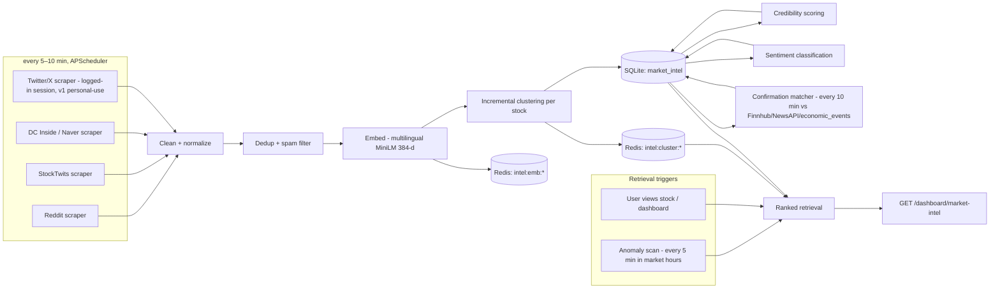

# Market Intel Pipeline — Real-Time Unconfirmed Intel from Social Media

**Status:** v1 spec — implementation-ready
**Owner doc for:** the `market_intel` supplementary table, the `GET /dashboard/market-intel` endpoint, the anomaly flag feature, credibility scoring, and the CONFIRMED/UNCONFIRMED badge contract.
**Related docs:** `schema.md` (table DDL), `backend-design.md` (endpoint catalog + APScheduler registry), `sentiment-pipeline.md` (news/sentiment refresh), `deployment-architecture.md` (Redis/SQLite layout).

---

## 1. Purpose

Traders on Reddit, StockTwits, and Korea's retail boards (DC Inside stock galleries, Naver 종목토론실) often discuss market-moving events **before** any official news article exists: sudden liquidations, exchange leverage restrictions, whale trades, regulatory rumors. DC Intel captures this chatter every 5–10 minutes, scores how believable each claim is (0–100 credibility), clusters duplicate claims together, labels every item **CONFIRMED** or **UNCONFIRMED**, and surfaces it in two situations:

1. **Price anomaly** — a stock moves ≥ 3% in 30 minutes with no official explanation. We show: *"Samsung Electronics moved −3.4% in 30 minutes with no official news — here's what traders are saying happened."*
2. **User view** — a user opens a stock page or requests a prediction; the freshest, most credible intel for that stock is retrieved and shown.

This is intentionally a **RAG-style pipeline**: scrape → clean → embed → cluster → store → retrieve-on-trigger. v1 is small-team simple: one embedding model on CPU, SQLite for durable rows, Redis for embeddings and cluster/anomaly metadata.

> **Honesty rule (applies to all UI built on this pipeline):** unconfirmed intel is *rumor*. It must always carry the speculation badge and disclaimer text (§8). Never present an unconfirmed claim as fact, in either language.

---

## 2. Pipeline Overview



Stage-by-stage detail follows. All thresholds referenced below are collected in the config table in §13 — code must read them from config, not hard-code.

---

## 3. Ingestion

### 3.1 Sources and cadence

| Source | Method | Cadence (APScheduler job) | What we pull | Free-tier rate limit (verify current limits at signup) |
|---|---|---|---|---|
| Reddit | PRAW (OAuth script app) | `intel_scrape_reddit` every 5 min | New posts + top-level comments from configured subreddits | ~100 queries/min per OAuth client |
| StockTwits | Public REST API | `intel_scrape_stocktwits` every 5 min, offset 2 min from Reddit | Symbol streams for tracked tickers + trending stream | ~200 req/hr unauth, ~400 req/hr authed (figures historically published; verify) |
| DC Inside / Naver | Own HTML scraper (`httpx` + `selectolax`/BeautifulSoup; identifiable UA, robots.txt honored, 2–5 s page spacing) | `scrape_kr_communities` every 10 min | New post titles + bodies from 2 DC Inside stock galleries (국내주식갤러리, 해외주식갤러리); new posts from Naver 종목토론실 boards of tracked KRX stocks | N/A (scraping) — self-imposed budget ≤ 30 page fetches per 10-min cycle (`data-sources.md` §4.4) |
| Twitter/X | **Logged-in session scraping** of the internal GraphQL API (`twikit`/`httpx`) | `intel_scrape_twitter` every 10 min — **v1, on by default (personal-use)** | Cashtag searches for tracked tickers | $0 (no paid API). Uses a dedicated account's session cookies (`data-sources.md` §4.1). Best-effort: the account may be rate-limited/suspended and the internal API breaks periodically — treat X as a may-disappear source; the pipeline degrades gracefully without it (§15). |

Default subreddit list (config `INTEL_SUBREDDITS`): `r/stocks`, `r/investing`, `r/wallstreetbets`, `r/StockMarket`, `r/options`, `r/Daytrading`, plus Korean-language finance subreddits where active (e.g., `r/hanguktrading` — maintainers keep the list in config). Korean domestic communities (DC Inside stock galleries, Naver 종목토론실) are **v1 sources**: the scraper spec, the ≤ 30-pages-per-cycle budget, and the ToS-gray note awaiting product-owner sign-off (open question Q3) are owned by `data-sources.md` §4.4. The pipeline below is language-agnostic, so their items flow through cleaning, clustering, and credibility scoring unchanged.

News articles fetched by the sentiment pipeline (Finnhub / NewsAPI) are **also** persisted as `market_intel` rows with `source = 'finnhub' | 'newsapi'` (see `sentiment-pipeline.md` and `schema.md` §1.5) — those fetch jobs belong to the sentiment pipeline's job slice, not this scraper slice, but the rows share this table, the clustering stages, and the retrieval ranking.

"Tracked tickers" = all rows in `stocks` that (a) appear in any prediction requested in the last 7 days, or (b) are constituents of the dashboard trending list. This bounds API usage. (Recall v1 has no watchlist table; recent `predictions` rows are the canonical proxy for user interest.)

### 3.2 Scrape window and idempotency

Each job fetches items newer than its last high-water mark (per source, stored in Redis `intel:hwm:{source}`), minus a 10-minute overlap to tolerate clock skew. Re-fetched items are dropped by the dedup stage, so jobs are idempotent and safe to retry.

### 3.3 Per-item raw payload

Each scraped item is normalized to:

```python
RawIntel = {
  "source": "reddit" | "stocktwits" | "dcinside" | "naver" | "twitter",
  "author_handle": str,           # e.g. "u/deepfvalue", "@kr_whalewatch", a DC Inside nickname
  "url": str,                     # permalink to the post itself
  "text": str,                    # full body, pre-cleaning
  "posted_at": datetime,          # platform timestamp, stored as UTC
  "account_age_days": int | None, # from author profile, if the platform exposes it (None for DC Inside/Naver)
  "engagement": int | None,       # reddit karma / stocktwits followers / twitter followers; None for DC Inside/Naver
}
```

(`'twitter'` is a v1 source via logged-in session scraping, §3.1 / `data-sources.md` §4.1. The full open enum for `market_intel.source`, including the news-derived `'finnhub'`/`'newsapi'` values written by the sentiment pipeline, is owned by `schema.md` §1.5.)

`account_age_days` and `engagement` feed credibility subscore E (§6) and are cached in Redis `intel:author:{source}:{handle}` (TTL 7 days) so we don't re-fetch author profiles on every item. When a platform exposes no profile data (DC Inside, Naver), E falls back to its default (§6.2).

---

## 4. Cleaning, Dedup, and Noise Filtering

### 4.1 Cleaning (deterministic, in order)

1. Strip HTML/markdown to plain text.
2. Unicode-normalize NFKC; collapse whitespace.
3. Remove bot signatures and quoted-reply blocks (`>` lines on Reddit).
4. Strip embedded URLs from the text body (the permalink is kept in `url`).
5. Clamp to 500 chars → this becomes `content_snippet` (store original casing/script; never auto-translate at storage time).
6. Detect tickers/entities (§4.2). Items mentioning > 5 distinct tickers are treated as spam-like blasts and hard-dropped.

### 4.2 Ticker / entity extraction (Korean + English)

Resolution order, first match wins; result sets `market_intel.stock_id`:

1. **Cashtag** — `$TSLA`, `$AAPL` → lookup in `stocks` by symbol.
2. **Exact ticker token** — uppercase token 1–6 chars matching a `stocks` symbol, with a stop-list (`A`, `IT`, `ALL`, `CEO`, …).
3. **Company-name alias dictionary** — a maintained JSON config mapping aliases (both languages) to `symbol:exchange`. Example entries:

```json
{
  "삼성전자":   "005930:KRX",
  "삼전":       "005930:KRX",
  "samsung electronics": "005930:KRX",
  "에코프로":   "086520:KRX",
  "tesla":      "TSLA:NASDAQ",
  "테슬라":     "TSLA:NASDAQ"
}
```

If no entity resolves, `stock_id` is **NULL** — this is valid and important: market-wide intel ("KRX restricting leverage on theme stocks", "major broker halting margin loans") has no single ticker. NULL-stock items cluster in a per-exchange "market-wide" bucket and appear on the dashboard feed but never on a single stock's page.

**Language detection** is *not* stored (the canonical `market_intel` schema has no `lang` column). It is recomputed cheaply at render/API time: `lang = "ko"` if ≥ 30% of alphabetic chars are Hangul, else `"en"`. Deterministic, zero-dependency, good enough for badge/label selection.

### 4.3 Dedup

| Check | Mechanism | Action |
|---|---|---|
| Exact duplicate | SHA-256 of lowercased, punctuation-stripped text → Redis set `intel:hash:{sha}` (TTL 48 h) | Drop silently (re-scrape overlap, bot reposts) |
| Same-author near-duplicate | Cosine ≥ 0.97 vs that author's items in last 48 h | Drop (author spamming same claim) |
| Cross-author copypasta | Same exact hash from ≥ 3 distinct authors within 30 min | **Keep one item**, mark its cluster `coordinated=true` (§4.4) |

### 4.4 Spam and coordinated pump-and-dump filtering

**Hard drops (never stored):**

- Text < 10 chars after cleaning, or > 3 embedded URLs pre-strip.
- Blacklisted phrases/domains (crypto giveaways, "join my Telegram/Discord signal group", referral links) — maintained list in config.
- Author scraped > 10 items in the past hour (per-author Redis counter `intel:rate:{source}:{handle}`, TTL 1 h).
- Mentions > 5 distinct tickers (§4.1).

**Soft flags (stored, but penalized):** a cluster is marked `coordinated=true` in its Redis metadata when any of:

- Copypasta rule from §4.3 fires.
- **Burst rule:** cluster gains ≥ 10 distinct authors within 15 minutes AND ≥ 70% of those accounts are < 30 days old.
- **Pump pattern:** stock market cap < $300M (or ₩400B), cluster sentiment bullish, ≥ 5 authors within 30 min, and price already up ≥ 5% today.

Effect of `coordinated=true`: every item's credibility is **capped at 20** (§6.4), the cluster is **excluded from anomaly explanations**, and if shown in the feed it carries an extra warning label — EN: *"Possible coordinated promotion"*, KO: *"조직적 띄우기 의심"*. With the dashboard's default `min_credibility=25` filter these clusters are hidden unless the user explicitly lowers the filter.

---

## 5. Embedding and Clustering

### 5.1 Embedding

- **Model:** `sentence-transformers/paraphrase-multilingual-MiniLM-L12-v2` — 384-dim, multilingual (Korean + English in the same vector space, so a Korean rumor and its English retelling land in the same cluster). Runs on CPU; batch of 32 embeds in well under a second on a small VM.
- **RAM note (owner decision: free + local-first):** the embedding model + runtime needs roughly 0.7–1 GB resident, which is trivially available on the local machine that runs v1 (`deployment-architecture.md` §5.1). It does **not** fit comfortably on a 1 GB GCP e2-micro, so the optional free-cloud demo (`deployment-architecture.md` §5.3) is the only place RAM is tight; no paid instance is adopted.
- **Storage:** embeddings are *not* stored in SQLite (the canonical `market_intel` schema has no vector column, and v1 needs no ANN index at this scale). Each vector is stored as 1,536 raw bytes (384 × float32) in Redis `intel:emb:{intel_id}`, TTL 48 h. If Redis is flushed, vectors are lazily re-computed from `content_snippet` on demand — `content_snippet` is the durable source of truth.

### 5.2 Incremental clustering

Goal: group restatements of the *same claim* ("whale dumped 2M shares of 005930") so the UI shows one card with a corroboration count, not 12 near-identical cards. Full-blown HDBSCAN is overkill at v1 volume (expect < 5k items/day); we use greedy centroid clustering:

```python
SIM_JOIN = 0.80          # cosine threshold to join a cluster
CLUSTER_TTL_H = 48       # cluster expires 48h after its last item

def assign_cluster(item, emb):
    # candidate clusters: same stock_id (or same exchange bucket when stock_id is NULL),
    # active = last_item_at within 48h. Centroids live in Redis intel:cluster:{cid}.
    best_cid, best_sim = None, 0.0
    for cid, meta in active_clusters(item.stock_id):
        sim = cosine(emb, meta["centroid"])
        if sim > best_sim:
            best_cid, best_sim = cid, sim
    if best_sim >= SIM_JOIN:
        update_centroid(best_cid, emb)            # running mean, renormalized
        return best_cid
    return create_cluster(item, emb)              # new cluster_id
```

- **`cluster_id` format (cross-doc contract):** `"cl_" + uuid4().hex[:12]`, e.g. `cl_9f2c41ab77d1`. Stored on every `market_intel` row.
- **Cluster metadata** lives in Redis hash `intel:cluster:{cluster_id}` (TTL refreshed to 48 h on each new item; key retained 7 days after last activity for timeline rendering):

| field | meaning |
|---|---|
| `centroid` | 1,536-byte float32 vector, running mean |
| `stock_id` | int or empty (market-wide) |
| `first_posted_at` | MIN(posted_at) over members — **timeline anchor** |
| `item_count`, `distinct_authors` | counters |
| `coordinated` | "0"/"1" (§4.4) |
| `confirmed_at`, `confirm_url`, `confirm_source` | set by confirmation matcher (§8) |
| `anomaly_id` | set when an anomaly retrieval pins this cluster (§9) |

**Durability trade-off (deliberate v1 simplification):** cluster metadata and anomaly events live only in Redis. If Redis is lost, durable facts (`confirmed` flag, `cluster_id` grouping, all item rows) survive in SQLite; only `confirmed_at` timestamps and anomaly history older than the Redis restore point are lost, degrading the timeline view until new data accrues. A persistent `intel_anomalies` table is the documented v1.1 fix. (Rationale: keeps the canonical 7+2 table set intact for v1.)

---

## 6. Credibility Scoring (0–100)

Every item gets a credibility score at insert time, recomputed when its cluster gains corroboration. The score answers one beginner-friendly question: *"how seriously should I take this post?"*

### 6.1 Formula (cross-doc contract)

```
credibility = round( 0.30·S + 0.30·A + 0.25·C + 0.15·E )
if cluster.coordinated: credibility = min(credibility, 20)
clamp to [0, 100]
```

| Subscore | Weight | Meaning |
|---|---|---|
| **S** — source reputation tier | 0.30 | How trustworthy is the venue/account type |
| **A** — author historical claim accuracy | 0.30 | Has this account been right before |
| **C** — corroboration | 0.25 | Independent voices making the same claim |
| **E** — account age + engagement | 0.15 | Bot/throwaway resistance |

### 6.2 Subscore definitions

**S — source reputation tier (0–100):**

| Tier | S | Examples |
|---|---|---|
| T1 | 90 | Platform-verified accounts of news orgs, exchanges, regulators (rare in scraped social, but they do post) |
| T2 | 70 | Strictly moderated finance communities: r/stocks, r/investing; StockTwits accounts with "official" designation |
| T3 | 50 | General finance communities: r/wallstreetbets, r/Daytrading, regular StockTwits/Twitter users |
| T4 | 30 | New, unmoderated, or meme-heavy venues; anonymous boards (DC Inside galleries, Naver 종목토론실) default here |

The subreddit→tier and account-type→tier mapping is a config table, not code.

**A — author historical claim accuracy (0–100), Laplace-smoothed:**

```
resolved  = author's market_intel items posted > 48h ago (confirmation window closed)
confirmed = those items with confirmed = true
A = 100 · (confirmed + 1) / (resolved + 2)
```

- New/unknown author → A = 50 (neutral prior). Author with 0/5 confirmed → A = 14. Author with 8/10 → A = 75.
- **No new table needed:** A is derived entirely from existing `market_intel` rows (`author_handle`, `source`, `confirmed`, `posted_at`). The daily job `intel_author_stats` (03:00 KST) recomputes per-author stats over the 90-day retention window and caches them in Redis `intel:authorstats:{source}:{handle}` (TTL 26 h).

**C — corroboration (0–100):** `n` = distinct `(source, author_handle)` pairs in the item's cluster.

```
C = min(100, 25 · (n − 1))      # 1 author→0, 2→25, 3→50, 5+→100
```

Cross-*platform* corroboration is naturally rewarded because clusters are cross-source. Items recompute C (and thus credibility) whenever their cluster's `distinct_authors` changes — done in the clustering step, an `UPDATE market_intel SET credibility_score=... WHERE cluster_id=?` batch.

**E — account age + engagement (0–100):**

```
age_part        = min(1, account_age_days / 365)
engagement_part = min(1, log10(1 + engagement) / 5)   # karma or followers; 100k+ → 1.0
E = round(50·age_part + 50·engagement_part)
E = 25 if profile data unavailable
```

### 6.3 Worked example

A post in **r/stocks** (T2 → S = 70): *"Hearing a foreign fund is force-liquidating its 005930 position, big sell blocks hitting the tape"*.
Author `u/krflowwatch`: 8 resolved past claims, 3 confirmed → A = 100·(3+1)/(8+2) = **40**. Account is 2 years old (age_part = 1.0), 12,400 karma (log10(12401)/5 ≈ 0.82) → E = 50 + 41 = **91**. Cluster currently has 4 distinct authors across Reddit + StockTwits → C = 25·3 = **75**.

```
credibility = 0.30·70 + 0.30·40 + 0.25·75 + 0.15·91
            = 21.0 + 12.0 + 18.75 + 13.65 = 65.4 → 65
```

UI copy at this score (§11): EN "Moderately credible (65/100)", KO "보통 신뢰도 (65/100)".

### 6.4 Score bands (UI contract)

| Band | EN label | KO label |
|---|---|---|
| 75–100 | High credibility | 높은 신뢰도 |
| 50–74 | Moderately credible | 보통 신뢰도 |
| 25–49 | Low credibility | 낮은 신뢰도 |
| 0–24 | Very low — likely noise | 매우 낮음 — 잡음 가능성 |

---

## 7. Sentiment Classification per Item

Each item is classified **bullish / bearish / neutral** with a confidence in [0, 1], stored in `market_intel.sentiment` (TEXT enum) and `market_intel.sentiment_confidence` (REAL, 2 decimals). These are the same enum values and color semantics used platform-wide (green = bullish, red = bearish, gray = neutral).

**v1 classifier — one shared implementation, owned by `sentiment-pipeline.md` §5.** Market-intel items run through exactly the same classifier as every other sentiment-scored text on the platform; this doc adds **no second model, no alternate thresholds, and no separate confidence formula**. Contract summary (the normative spec lives in `sentiment-pipeline.md` §5):

- **Model:** multilingual zero-shot NLI — `MoritzLaurer/mDeBERTa-v3-base-xnli-multilingual-nli-2mil7` — on CPU; one model covers Korean and English, no translation step (config `SENTIMENT_CLF_MODEL`).
- **Labels:** `bullish` / `bearish` / `neutral`. The top label is stored in `market_intel.sentiment`, its softmaxed confidence in `market_intel.sentiment_confidence`.
- **Low-confidence floor:** if the top-label confidence is < **0.45** (barely above the 1/3 prior), the item is stored as `neutral` with that confidence (`sentiment-pipeline.md` §5.1; config `SENTIMENT_CLF_MIN_CONF`).
- **StockTwits weak labels:** author-declared Bullish/Bearish tags combine with the model output per `sentiment-pipeline.md` §5.4.
- **Caching:** classification results are cached in Redis `sentiment:clf:{sha1(normalized_text)}` (that doc's key namespace), so reposts and cross-posted items never hit the model twice.
- **Failure mode:** if the classifier crashes or cannot load, items persist with `sentiment = NULL` per `sentiment-pipeline.md` §9.4 — there is **no lexicon fallback in v1** (see §15).

What *is* this doc's concern is cluster-level aggregation: a cluster's displayed sentiment = item-count-weighted majority label over its items; cluster confidence = mean confidence of the items carrying that label (NULL-sentiment items are excluded from both).

---

## 8. CONFIRMED vs UNCONFIRMED — Matching Logic and Badge Contract

Every item is exactly one of two states, driven by the boolean `market_intel.confirmed`. Default at insert: `false` (UNCONFIRMED).

### 8.1 Confirmation matcher (`intel_confirmation_match`, every 10 min)

For each **active unconfirmed cluster** (last item within 48 h):

1. **Candidate official sources:**
   - Finnhub company news for the cluster's ticker (or Finnhub general market news when `stock_id` is NULL), `published_at` in `[first_posted_at − 30 min, now]`. The −30 min tolerance covers near-simultaneous posting.
   - NewsAPI headlines for the company name / KO alias, same window. (NewsAPI free Developer tier has ~100 req/day and delayed articles — verify current limits at signup — so Finnhub is primary, NewsAPI fallback per the platform's data-source policy.)
   - `economic_events` rows: if the cluster text semantically matches a high-impact calendar event on the same day (e.g., a "rate decision leak" rumor vs an actual rate decision), that event can confirm it.
2. **Match test (both must pass):**
   - **Semantic:** embed `headline + summary` with the same MiniLM model; `cosine(cluster_centroid, news_emb) ≥ 0.70`.
   - **Entity guard:** the news item references the same ticker, or shares ≥ 1 extracted entity token with the cluster — prevents "some bearish Samsung article" confirming an unrelated Samsung rumor.
3. **On match:** `UPDATE market_intel SET confirmed = 1 WHERE cluster_id = ?` (the whole cluster flips, including future joiners — checked at join time); write `confirmed_at`, `confirm_url`, `confirm_source` into the cluster's Redis hash. The confirming article link is surfaced in the UI.
4. Items whose cluster reaches 48 h without a match stay UNCONFIRMED permanently and become "resolved-unconfirmed" for author-accuracy purposes (§6.2 A).

### 8.2 Badge UI contract (identical everywhere intel is rendered)

| State | EN label | KO label | Icon | Color | Tooltip |
|---|---|---|---|---|---|
| `confirmed = true` | **Confirmed** | **확인됨** | check | **Blue `#2563EB`** | EN: "Matched to a published news report." KO: "보도된 뉴스 기사와 일치해요." + link to `confirm_url` |
| `confirmed = false` | **Unconfirmed — rumor** | **미확인 — 소문** | warning triangle | **Amber `#D97706`** | EN: "No official news source has confirmed this yet. Treat it as speculation, not fact." KO: "아직 어떤 공식 뉴스도 이 내용을 확인하지 않았어요. 사실이 아닌 소문으로 봐주세요." |

Hard rules:

- The badge is **mandatory** on every rendering of an intel item or cluster: dashboard feed card, stock-page intel section, anomaly banner. No badge → do not render the item.
- Badge colors are deliberately **blue/amber, never green/red** — green and red are reserved platform-wide for bullish/bearish sentiment, and a green "confirmed" badge on a bearish rumor would be misread by beginners.
- Plain language only; "rumor"/"소문", never "alpha", "DD", or other jargon in user-facing copy.

---

## 9. Anomaly Flag Feature

### 9.1 Trigger — precise definition (cross-doc contract)

Job `intel_anomaly_scan` runs **every 5 min during each exchange's market hours** (KRX 09:00–15:30 KST continuous session; NYSE/NASDAQ 09:30–16:00 ET). For every tracked stock:

```
TRIGGER when ALL of:
  1. |pct_change(last_price, price_30_min_ago)| ≥ 3.0%
     (prices from the Redis price cache fed by the 1–5 min price job; fallback: yfinance intraday)
  2. NO high-impact calendar event: no economic_events row with importance = 'high'
     for the stock's country within ±60 min of now
  3. NO confirmed news: no Finnhub company-news item for the ticker published
     in the last 60 min
  4. NOT an earnings day for the ticker (earnings date from the calendar source)
  5. Cooldown: no anomaly already fired for this symbol in the last 120 min,
     UNLESS the new move is ≥ 2× the previous anomaly's magnitude
```

### 9.2 On trigger

1. Write the anomaly event to Redis `intel:anomaly:{symbol}:{exchange}:{epoch}` (TTL 7 days): `{direction, change_pct, window_minutes: 30, detected_at}`.
2. **Retrieve explanation candidates:** all clusters for that `stock_id` (plus the exchange's market-wide NULL-stock clusters) with activity in the last 24 h, ranked by

   ```
   rank = max_credibility_in_cluster
        × exp(−hours_since_first_posted / 24)        # recency decay
        × (1.25 if cluster_sentiment matches move direction else 0.80)
   ```

   (bearish matches a down move, bullish an up move; neutral gets neither boost nor penalty). Coordinated-flagged clusters are excluded outright.
3. Pin the top 3 clusters to the anomaly (`anomaly_id` in each cluster's Redis hash) and bust the dashboard cache.
4. Surface in `GET /dashboard/market-intel` (and as a banner on the stock page) with the canonical headline:
   - EN: `"{name} moved {signed_pct}% in 30 minutes with no official news — here's what traders are saying happened"`
   - KO: `"{name}이(가) 공식 뉴스 없이 30분 만에 {signed_pct}% 움직였어요 — 트레이더들의 이야기를 모아봤어요"`
5. If **zero** clusters exist, still surface the anomaly with the honest empty-state: EN *"No social-media explanation found yet — we're watching."* / KO *"아직 소셜미디어에서 설명을 찾지 못했어요 — 계속 지켜보고 있어요."*

### 9.3 Retrieval on user view (the second RAG trigger)

When a user opens a stock page or requests a prediction, the frontend calls `GET /dashboard/market-intel?stock={symbol}:{exchange}`. Server-side this runs the same ranked retrieval as §9.2 step 2 (without the direction multiplier, since there's no move to align with), over the last 48 h, default top 10 clusters, response cached in Redis for 60 s.

---

## 10. Timeline Tracking

For each cluster we can reconstruct *who said it first and how long before the market moved* — the feature beginners find most convincing.

**Recorded timestamps and where they live:**

| Event | Timestamp source |
|---|---|
| `first_posted` | `MIN(posted_at)` over cluster rows (durable, SQLite) |
| `first_seen` | `MIN(created_at)` over cluster rows — when *we* scraped it (durable) |
| `corroborated` | `posted_at` of the 2nd … nth distinct author (durable) |
| `market_moved` | anomaly `detected_at` minus 30 min window start (Redis, 7-day TTL) |
| `news_confirmed` | `confirmed_at` from cluster Redis hash (Redis, 7-day TTL) |

**Lead time** = `market_moved − first_posted`, shown as a plain-language stat: EN *"Posted 42 min before the move"* / KO *"주가가 움직이기 42분 전에 게시됨"*. If intel appeared *after* the move, say so honestly: EN *"Posted after the move — reaction, not prediction"* / KO *"주가가 움직인 뒤에 게시됨 — 예측이 아닌 반응이에요"*.

The API returns the timeline as an ordered event array (see §11 example); the frontend renders it as a horizontal timeline with dots (mobile-first: it scrolls horizontally). Timestamps are ISO-8601 UTC; the frontend localizes to the user's timezone.

---

## 11. Storage: the `market_intel` Table

Canonical supplementary table (full DDL owned by `schema.md`, marked there as an addition with rationale). Columns and how this pipeline uses them:

| Column | Type | Written by | Notes |
|---|---|---|---|
| `id` | INTEGER PK | insert | |
| `stock_id` | INTEGER NULL → `stocks.id` | entity extraction (§4.2) | NULL = market-wide intel |
| `source` | TEXT | ingestion (§3) or the sentiment pipeline's news fetchers | Open enum owned by `schema.md` §1.5: `'reddit' \| 'stocktwits' \| 'dcinside' \| 'naver' \| 'twitter' \| 'finnhub' \| 'newsapi'` (`'twitter'` via session scraping, §3.1) |
| `author_handle` | TEXT | ingestion | platform-native handle |
| `url` | TEXT | ingestion | permalink to the post |
| `content_snippet` | TEXT | cleaning (§4.1) | ≤ 500 chars, original language |
| `posted_at` | TEXT (ISO UTC) | ingestion | platform timestamp |
| `credibility_score` | INTEGER 0–100 | §6, updated on corroboration | |
| `sentiment` | TEXT | §7 | `'bullish' \| 'bearish' \| 'neutral'` |
| `sentiment_confidence` | REAL 0–1 | §7 | 2 decimals |
| `confirmed` | INTEGER (bool) | §8 matcher | default 0 |
| `cluster_id` | TEXT | §5.2 | `cl_` + 12 hex |
| `created_at` | TEXT (ISO UTC) | insert | scrape time |

**Indexes** (in `schema.md`): `(stock_id, created_at)`, `(cluster_id)`, `(source, author_handle, posted_at)` — the third one makes the author-accuracy aggregation cheap.

**Retention:** daily job `intel_retention` deletes rows older than 90 days (SQLite + WAL handles this fine at v1 volume). Author-accuracy stats are therefore a 90-day rolling window — documented behavior, acceptable for v1.

**Redis key namespace (contract):** everything this pipeline writes to Redis is under `intel:*` — `intel:emb:{id}`, `intel:cluster:{cid}`, `intel:anomaly:{sym}:{exch}:{epoch}`, `intel:hash:{sha}`, `intel:hwm:{source}`, `intel:rate:{source}:{handle}`, `intel:author:{source}:{handle}`, `intel:authorstats:{source}:{handle}`.

---

## 12. API: `GET /dashboard/market-intel`

Auth: same JWT bearer policy as the other `/dashboard/*` endpoints (see `backend-design.md`).

**Query parameters:**

| Param | Type | Default | Meaning |
|---|---|---|---|
| `stock` | string `{symbol}:{exchange}` | — | Filter to one stock (its clusters + relevant market-wide clusters). Omit for the global feed. |
| `lang` | `ko` \| `en` | `en` | Language of generated labels/headlines. `content_snippet` is always original language. |
| `limit` | int 1–50 | 20 | Max clusters returned |
| `min_credibility` | int 0–100 | 25 | Clusters whose `max_credibility` is below this are filtered out |
| `only_anomalies` | bool | false | Return only anomaly-pinned content |

**Sort order:** anomaly-pinned clusters first (newest anomaly first), then remaining clusters by the §9.2 rank score. Response cached 60 s in Redis.

**Example** — `GET /dashboard/market-intel?stock=005930:KRX&lang=en&limit=2`:

```json
{
  "as_of": "2026-06-12T05:40:00Z",
  "lang": "en",
  "anomalies": [
    {
      "stock": { "symbol": "005930", "exchange": "KRX",
                 "name_en": "Samsung Electronics", "name_ko": "삼성전자" },
      "detected_at": "2026-06-12T05:35:00Z",
      "direction": "down",
      "change_pct": -3.4,
      "window_minutes": 30,
      "headline": "Samsung Electronics moved -3.4% in 30 minutes with no official news — here's what traders are saying happened",
      "top_cluster_ids": ["cl_9f2c41ab77d1"]
    }
  ],
  "clusters": [
    {
      "cluster_id": "cl_9f2c41ab77d1",
      "stock": { "symbol": "005930", "exchange": "KRX",
                 "name_en": "Samsung Electronics", "name_ko": "삼성전자" },
      "status": "UNCONFIRMED",
      "badge": {
        "label": "Unconfirmed — rumor",
        "style": "speculation",
        "disclaimer": "No official news source has confirmed this yet. Treat it as speculation, not fact."
      },
      "sentiment": "bearish",
      "sentiment_confidence": 0.78,
      "item_count": 5,
      "distinct_authors": 4,
      "max_credibility": 65,
      "credibility_band": "Moderately credible",
      "coordinated_warning": false,
      "lead_time_minutes": 42,
      "timeline": [
        { "event": "first_posted",  "at": "2026-06-12T04:53:00Z",
          "label": "First posted on Reddit" },
        { "event": "corroborated",  "at": "2026-06-12T05:11:00Z",
          "label": "3 more accounts reported the same thing", "count": 3 },
        { "event": "market_moved",  "at": "2026-06-12T05:35:00Z",
          "label": "Price fell 3.4% in 30 minutes", "change_pct": -3.4 }
      ],
      "items": [
        {
          "id": 18234,
          "source": "reddit",
          "author_handle": "u/krflowwatch",
          "url": "https://reddit.com/r/stocks/comments/abc123",
          "content_snippet": "Hearing a foreign fund is force-liquidating its 005930 position, big sell blocks hitting the tape...",
          "lang": "en",
          "posted_at": "2026-06-12T04:53:00Z",
          "credibility_score": 65,
          "sentiment": "bearish",
          "sentiment_confidence": 0.81,
          "confirmed": false
        }
      ],
      "confirm_url": null
    },
    {
      "cluster_id": "cl_77ab03de1c20",
      "stock": null,
      "status": "CONFIRMED",
      "badge": {
        "label": "Confirmed",
        "style": "confirmed",
        "disclaimer": null
      },
      "sentiment": "bearish",
      "sentiment_confidence": 0.71,
      "item_count": 9,
      "distinct_authors": 7,
      "max_credibility": 82,
      "credibility_band": "High credibility",
      "coordinated_warning": false,
      "lead_time_minutes": null,
      "timeline": [
        { "event": "first_posted",   "at": "2026-06-12T02:10:00Z",
          "label": "First posted on StockTwits" },
        { "event": "news_confirmed", "at": "2026-06-12T03:05:00Z",
          "label": "Confirmed by a news report" }
      ],
      "items": [
        {
          "id": 18102,
          "source": "stocktwits",
          "author_handle": "@kr_margin_desk",
          "url": "https://stocktwits.com/kr_margin_desk/message/555111",
          "content_snippet": "브로커들이 테마주 신용융자 한도 줄인다는 얘기 돌고 있음. 레버리지 규제 임박한 듯",
          "lang": "ko",
          "posted_at": "2026-06-12T02:10:00Z",
          "credibility_score": 82,
          "sentiment": "bearish",
          "sentiment_confidence": 0.69,
          "confirmed": true
        }
      ],
      "confirm_url": "https://finnhub.io/api/news/redirect/xyz"
    }
  ]
}
```

Notes for frontend:

- `status` is derived: `CONFIRMED` iff any item in the cluster has `confirmed = true`.
- `badge.style ∈ {"confirmed", "speculation"}` maps to the §8.2 colors. `lang=ko` swaps `headline`, `badge.label`, `disclaimer`, `credibility_band`, and timeline `label`s to the Korean strings defined in §§8–10; data fields are unchanged.
- `items` is capped at 3 per cluster (highest credibility first); `item_count` carries the true total.
- `lead_time_minutes` is `null` when no anomaly is associated.

---

## 13. Configuration Defaults

All tunables in one place (`config/intel.py`, env-overridable):

| Key | Default | Used in |
|---|---|---|
| `INTEL_SCRAPE_INTERVAL_MIN` | 5 (Reddit/StockTwits), 10 (DC Inside/Naver), 10 (Twitter/X) | §3 |
| `INTEL_SNIPPET_MAX_CHARS` | 500 | §4.1 |
| `INTEL_MAX_TICKERS_PER_ITEM` | 5 | §4.1 |
| `INTEL_SIM_JOIN` | 0.80 | §5.2 |
| `INTEL_SIM_NEARDUP` | 0.97 | §4.3 |
| `INTEL_CLUSTER_TTL_H` | 48 | §5.2 |
| `INTEL_CONFIRM_SIM` | 0.70 | §8.1 |
| `INTEL_CONFIRM_WINDOW_H` | 48 | §8.1 |
| `INTEL_WEIGHTS (S,A,C,E)` | 0.30 / 0.30 / 0.25 / 0.15 | §6.1 |
| `INTEL_COORDINATED_CAP` | 20 | §6.4 |
| `INTEL_ANOMALY_PCT` | 3.0 | §9.1 |
| `INTEL_ANOMALY_WINDOW_MIN` | 30 | §9.1 |
| `INTEL_ANOMALY_NEWS_QUIET_MIN` | 60 | §9.1 |
| `INTEL_ANOMALY_COOLDOWN_MIN` | 120 | §9.1 |
| `INTEL_RECENCY_HALFLIFE_H` | 24 | §9.2 |
| `INTEL_MIN_CREDIBILITY_DEFAULT` | 25 | §12 |
| `INTEL_RETENTION_DAYS` | 90 | §11 |
| `INTEL_SMALLCAP_USD` / `_KRW` | 300M / 400B | §4.4 |

## 14. APScheduler Job Registry (this pipeline's slice)

| Job id | Cadence | Notes |
|---|---|---|
| `intel_scrape_reddit` | */5 min | offsets staggered to spread API load |
| `intel_scrape_stocktwits` | */5 min, +2 min offset | |
| `scrape_kr_communities` | */10 min | DC Inside + Naver 종목토론실, ≤ 30 page fetches/cycle; spec in `data-sources.md` §4.4 (job id matches `deployment-architecture.md`) |
| `intel_scrape_twitter` | */10 min | v1, on by default; registered when `TWITTER_ENABLED=true` (default) and session cookies (`TWITTER_AUTH_TOKEN`+`TWITTER_CT0`, or `TWITTER_COOKIES_FILE`) are present — logged-in session scraping per `data-sources.md` §4.1. Self-disables (warns) if cookies are missing |
| `intel_confirmation_match` | */10 min | runs after the news refresh job |
| `intel_anomaly_scan` | */5 min | gated to per-exchange market hours |
| `intel_author_stats` | daily 03:00 KST | recomputes A subscore cache |
| `intel_retention` | daily 03:30 KST | 90-day delete |

All jobs are `max_instances=1`, `coalesce=True`, with jittered retry (3 attempts, 30 s backoff) and failures logged + counted in a Redis health key so the dashboard ops page can show scraper staleness ("intel last updated N min ago").

## 15. Failure Modes

| Failure | Behavior |
|---|---|
| Reddit/StockTwits API down or rate-limited | Skip cycle, keep high-water mark, alert after 3 consecutive failures. Feed shows honest staleness timestamp (`as_of`). |
| DC Inside/Naver scraper breaks (HTML change) | Korean-community intel pauses — no fallback, unique data; alert ops; explicitly allowed to stay down without blocking releases (`data-sources.md` §4.4). |
| Sentiment classifier OOM / fails to load | Items still persist with `sentiment = NULL` (skipped by cluster sentiment aggregation, §7) per `sentiment-pipeline.md` §9.4; no lexicon fallback in v1. |
| Redis flush/restart | Embeddings lazily rebuilt from `content_snippet`; clusters re-form going forward; `confirmed` flags survive in SQLite; timeline `confirmed_at`/anomaly history older than restart is lost (documented v1 trade-off, §5.2). |
| Finnhub down | Confirmation matching pauses (items stay UNCONFIRMED — fail *safe*: we never over-claim confirmation). NewsAPI fallback used within its small free quota. |
| Embedding model fails to load | Ingestion degrades to store-without-cluster (each item its own cluster, C = 0); flag raised. |
| yfinance price gap during anomaly scan | Skip that symbol this cycle (no false anomalies from stale prices). |

## 16. v1.1 Extensions (documented, not built)

- `intel_anomalies` persistent table (durable timeline + anomaly history beyond 7 days).
- Sentiment classifier upgrade (fine-tuned FinBERT-class models or a fine-tuned mDeBERTa) — upgrade path owned by `sentiment-pipeline.md` §5.5; v1 already ships the shared zero-shot transformer (§7).
- Migrate Twitter/X off logged-in session scraping onto the paid Basic API **if DC Intel is ever distributed/commercialized** (the personal-use scraping path in §3.1 / `data-sources.md` §4.1 is not appropriate at that point).
- WebSocket push of new anomalies (aligns with platform v2 real-time plan; v1 is polling).
- Watchlist-driven tracked-ticker set once the v1.1 watchlist table ships.
- Aggregated intel sentiment as an input feature to the prediction models (decision belongs to the ML doc; the per-stock aggregate is already computable from `market_intel`).
