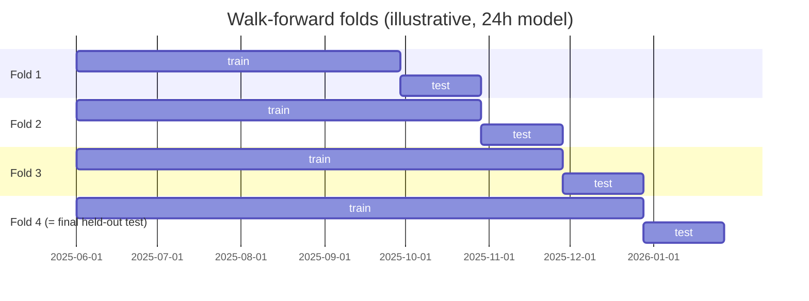
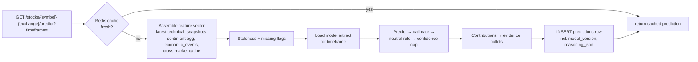

# DC Intel — Prediction Model Specification (v1)

Status: v1 spec, implementation-ready
Audience: backend/ML engineers
Related docs: `schema.md` (table definitions), the sentiment pipeline doc (sentiment aggregation internals), the API doc (`/predict` endpoint shape), the jobs/scheduler doc (APScheduler job wiring)

This document specifies the core ML prediction system: model choice, labels, features, output and confidence calibration, explainability, training/retraining, and the canonical `reasoning_json` snapshot stored with every prediction. Where this doc defines a cross-document contract (marked **CONTRACT**), other docs must match it exactly.

---

## 1. Overview

DC Intel predicts short-term stock direction — **up / down / neutral** — with a calibrated **confidence score (0–100%)** and up to **3 plain-language evidence bullets** whose percentage contributions sum to 100.

| Decision | Value |
|---|---|
| Algorithms (v1) | Logistic regression (multinomial, L2) **and** XGBoost (`multi:softprob`). Both are trained; the one with the higher held-out test win rate ships, **per timeframe**. |
| Number of models | **6** — one per timeframe: `1h`, `5h`, `24h`, `2d`, `3d`, `5d` |
| Model scope | One **global pooled** model per timeframe (all stocks share a model). Per-stock models are a v2 idea. |
| Classes | 3: `up`, `down`, `neutral` (multinomial classification) |
| Confidence | Calibrated probability of the displayed class × 100 (Section 5) |
| Explainability | Logistic: signed coefficient × standardized value; XGBoost: SHAP (TreeExplainer) (Section 6) |
| Ship gate | Held-out test **directional win rate ≥ 52%** AND **directional coverage ≥ 30%**, per timeframe (Section 7.6) |
| Retraining | Weekly (Sunday 03:00 KST), walk-forward, with promotion guard (Section 7.7) |
| Versioning | `model_version` string recorded with every prediction (Section 7.8) |

### 1.1 Why one model per timeframe (not one shared model)

1. **Feature horizons differ.** Indicators for the `1h` model are computed on 5-minute bars; the `5d` model uses daily bars. The same feature name (`rsi_14`) means a physically different signal at each horizon, so coefficients/splits cannot be shared.
2. **Label thresholds differ.** The neutral dead-band scales from ±0.15% (`1h`) to ±0.75% (`5d`) (Section 3). A shared model would mix incompatible label definitions.
3. **Signal/target relationships differ.** Sentiment deltas and volume spikes dominate intraday horizons; economic-calendar and cross-market features matter more at 2–5 days. Separate models let each horizon learn its own weights, and feature-importance logs stay interpretable per horizon.
4. **Operational independence.** Each timeframe is gated, calibrated, retrained, and rolled back independently. A regression in the `1h` model never blocks shipping the `24h` model.

### 1.2 Why logistic regression + XGBoost (and nothing fancier)

- Both train in seconds–minutes on v1 data volumes (≤ ~250k rows, 15 features), infer in < 5 ms, and run fine on a small VM next to FastAPI — no GPU, no model server.
- Both are honestly explainable: exact coefficient contributions (logistic) or exact SHAP attributions (XGBoost), which feed the canonical 3-bullet evidence format directly.
- Logistic regression is the sanity baseline: if XGBoost cannot beat it on the held-out test, ship logistic (simpler ops, perfectly linear explanations).
- Selection rule per timeframe: pick the algorithm with the higher test directional win rate; if within 0.5 percentage points, pick logistic. Different timeframes may ship different algorithms (e.g., `1h` logistic, `24h` xgboost) — this is expected and fine.

---

## 2. Prediction window mechanics

A prediction made at time `t0` covers the window `[t0, t_close]`. **CONTRACT** — the outcome checker must use exactly these clock rules:

| Timeframe | Window clock rule |
|---|---|
| `1h`, `5h` | Counts **regular-session trading hours only**. The clock pauses at session close and resumes at the next session open of the stock's exchange. |
| `24h` | Closes at the **same time of day on the next trading day** of the stock's exchange. |
| `2d`, `3d`, `5d` | Closes at the same time of day **N trading days** later. |

- Exchange sessions: KRX 09:00–15:30 KST (continuous session); NYSE/NASDAQ 09:30–16:00 ET. Use an exchange-calendar library (`exchange_calendars` or `pandas_market_calendars`) for holidays/half-days.
- **Off-hours predictions** are allowed: `entry_price` = last regular-session trade price; the window clock starts at the next session open.
- Worked example (`1h`, KRX): prediction at Friday 15:00 KST → 30 session-minutes remain → window closes Monday 09:30 KST.
- Worked example (`24h`, KRX): prediction Friday 2026-06-12 10:30 KST → closes Monday 2026-06-15 10:30 KST.

`entry_price` = last trade price at `t0`. `exit_price` = last trade price at `t_close`. `move_pct = (exit_price − entry_price) / entry_price × 100`.

---

## 3. Label definition (up / down / neutral)

The realized label uses a per-timeframe **neutral dead-band** so that tiny, untradeable wiggles do not count as direction. All values are **tunable** (Section 10) — they were sized so `neutral` covers roughly 25–40% of historical samples on KOSPI 200 + S&P 500 constituents; re-tune after the first backfill if the class balance falls outside that range.

| Timeframe | Neutral dead-band (tunable) | Label rule |
|---|---|---|
| `1h` | \|move_pct\| < **0.15%** | `up` if move_pct > band; `down` if move_pct < −band; else `neutral` |
| `5h` | \|move_pct\| < **0.30%** | same |
| `24h` | \|move_pct\| < **0.40%** | same |
| `2d` | \|move_pct\| < **0.50%** | same |
| `3d` | \|move_pct\| < **0.60%** | same |
| `5d` | \|move_pct\| < **0.75%** | same |

**CONTRACT** — the outcome checker computes the realized label with the *same band* that the model was trained with; the band used is snapshotted in `reasoning_json.neutral_band_pct` so a later band re-tune never corrupts old outcome grading.

Worked example (`24h`, Samsung Electronics `005930:KRX`): entry 84,300 KRW (Fri 10:30 KST), exit 85,100 KRW (Mon 10:30 KST) → move_pct = +0.949% > 0.40% → realized label `up`.

---

## 4. Features

### 4.1 Indicator bar intervals per timeframe

Indicators are computed on bars whose interval suits the horizon. yfinance backfill limits constrain how much history exists at launch (figures are commonly published yfinance/Yahoo limits — **verify current limits at implementation time**):

| Timeframe | Bar interval | yfinance backfill available | Launch note |
|---|---|---|---|
| `1h` | 5m | ~60 days | **Cannot reach 6 months of history at launch.** Persist every fetched bar into our own store from day one; the `1h` model trains on ~60 days initially and grows weekly. |
| `5h` | 15m | ~60 days | **Cannot reach 6 months of history at launch** — `15m` has the same ~60-day yfinance limit as `5m` (technical-indicators.md §3.1). Persist every fetched bar from day one; the `5h` model trains on ~60 days initially and grows weekly. |
| `24h` | 60m | ~730 days | OK |
| `2d` | 1d | years | OK |
| `3d` | 1d | years | OK |
| `5d` | 1d | years | OK |

### 4.2 Feature table

15 features (14 required + 1 auxiliary), grouped into 8 evidence groups (group names are **CONTRACT** — they appear in `reasoning_json` and `feature_importance_logs`).

| # | Feature name | Group | Source | Computation | Update cadence |
|---|---|---|---|---|---|
| 1 | `rsi_14` | `rsi` | `technical_snapshots` (bars via yfinance) | RSI, 14 bars at the timeframe's bar interval (Wilder smoothing) | every 5 min |
| 2 | `rsi_slope_3` | `rsi` | `technical_snapshots` | `rsi_14[t] − rsi_14[t−3 bars]` | every 5 min |
| 3 | `ema_cross_state` | `ema` | `technical_snapshots` | `ema_5_20_cross_dir` from the §10.1 indicator payload (technical-indicators.md §5.3): +1 = EMA5 crossed above EMA20, −1 = crossed below, 0 = no cross in window | every 5 min |
| 4 | `ema_bars_since_cross` | `ema` | `technical_snapshots` | `bars_since_ema_5_20_cross` from the same payload (capped at 20 upstream), signed by `ema_cross_state` → range ±20 | every 5 min |
| 5 | `macd_hist_norm` | `macd` | `technical_snapshots` | MACD(12,26,9) histogram ÷ close (price-scale-free) | every 5 min |
| 6 | `macd_hist_delta` | `macd` | `technical_snapshots` | `macd_hist_norm[t] − macd_hist_norm[t−1 bar]` | every 5 min |
| 7 | `bb_position` | `bollinger` | `technical_snapshots` | %B = (close − lowerBB) / (upperBB − lowerBB), 20-bar, 2σ; clipped to [−0.5, 1.5] | every 5 min |
| 8 | `vol_z20` | `volume` | `technical_snapshots` | (current bar volume − 20-bar mean volume) / 20-bar std volume; clipped to [−3, +6] | every 5 min |
| 9 | `sent_agg` | `sentiment` | `sentiment_logs` | `source_breakdown_json.timeframe_scores[tf].score ÷ 100` from the **latest** `sentiment_logs` row → [−1, +1]. The aggregation itself (credibility × exponential-decay weights `w_i = cred_i × 0.5^(age/half_life)`, half-lives 30m/2h/6h/12h/18h/24h, lookbacks 2h/8h/24h/48h/72h/120h per timeframe) is owned by sentiment-pipeline.md §7.2 — never recomputed here. A null `score` or a `low_confidence: true` timeframe is treated as missing (Section 4.4). | every 10–15 min |
| 10 | `sent_delta_2h` | `sentiment` | `sentiment_logs` | `sent_agg(now) − sent_agg(now − 2h)`, the 2h-ago value read from the latest `sentiment_logs` row at or before `now − 2h` (same per-timeframe score) | every 10–15 min |
| 11 | `econ_high_impact_6h` | `econ_event` | `economic_events` | 1 if any **high-impact** relevant event is scheduled in `[t0 − 6h, t_close + 6h]`, else 0. Relevant = event country ∈ {stock's listing country, US}. | daily fetch; evaluated at prediction time |
| 12 | `econ_impact_score` | `econ_event` | `economic_events` | Σ over relevant events of `w_impact × proximity`; `w_impact`: high=3, medium=1, low=0.25; `proximity` = 1 if inside `[t0, t_close]`, else `max(0, 1 − gap_hours/6)` for events within 6h outside the window | daily fetch; evaluated at prediction time |
| 13 | `xmkt_ref_return` | `cross_market` | yfinance (cached in Redis) | Return (%) of the stock's cross-market reference instrument over its latest **completed** session (resolution order in 4.3) | refreshed with price job (1–5 min); reference session updates once/day |
| 14 | `xmkt_corr_60d` | `cross_market` | computed daily from stored daily bars | Pearson correlation of daily returns, stock vs reference instrument, trailing 60 trading days | daily |
| 15 | `market_is_krx` (auxiliary) | — (never shown in evidence) | `stocks` | 1 if listing exchange is KRX, else 0. Lets one pooled model learn market-level offsets. | static |

### 4.3 Cross-market reference resolution order

**CONTRACT** — the reference instrument is resolved per stock (stored as metadata on `stocks`, refreshed when mappings are edited):

| Stock type | Reference instrument | Example |
|---|---|---|
| KRX stock with a US-listed ADR | the ADR | POSCO Holdings `005490:KRX` → `PKX:NYSE` |
| KRX stock without a US ADR | mapped US sector ETF (manual mapping table); fallback `SPY` | Samsung Electronics `005930:KRX` → `SOXX` (semis); London GDRs are out of scope in v1 |
| US-listed ADR of a Korean company | the underlying KRX listing | `KB:NYSE` → `105560:KRX` |
| Other US stock | Nikkei 225 (latest completed Asian session) as the global overnight risk proxy | `AAPL:NASDAQ` → `^N225` |

"Latest completed session" means: for a KRX stock predicted during KRX hours, the reference is the US session that closed the prior (US) day. If reference data is unavailable, `xmkt_ref_return = 0` and the feature is flagged `missing` (4.4).

### 4.4 Missing data and imputation

- **XGBoost**: missing values passed as `NaN` (native handling).
- **Logistic regression**: impute with the training-set mean (stored in the model artifact), after which the standard scaler applies.
- Every imputed/absent value sets `missing: true` on that feature in `reasoning_json`. Common case: small-cap stocks with zero sentiment items in the lookback → the per-timeframe `score` is null → `sent_agg` is `missing: true`.
- A feature flagged `missing` is **excluded from evidence bullets** (it cannot honestly "drive" a decision).

### 4.5 Data staleness flags

Evaluated at prediction time, recorded in `reasoning_json.data_staleness` (**CONTRACT**). "Stale" thresholds apply only while the stock's market is open; when closed, last-session data counts as fresh:

| Data group | Stale if older than (market open) |
|---|---|
| prices | 10 min |
| technical snapshot | 15 min |
| sentiment aggregate | 30 min (matches sentiment-pipeline.md §8.2) |
| market intel | 30 min |
| economic calendar fetch | 48 h (always, open or closed) |
| cross-market reference | 36 h (always) |

If `any_stale = true`, the displayed confidence is **capped at 65** and `confidence_capped: true` is recorded; the UI shows a "data may be delayed" badge. (Cap value tunable, Section 10.)

---

## 5. Output: direction + confidence

### 5.1 Pipeline from raw probabilities to displayed output

```
raw model probs (up/down/neutral, sum=1)
   → per-class calibration (fit on validation set)   → renormalize to sum=1
   → neutral rule                                     → displayed direction
   → confidence = round(100 × calibrated P(displayed class))
   → staleness cap (≤65 if any_stale)
```

### 5.2 Calibration

- Fit on the **validation split only** (never train, never test).
- Method: per-class one-vs-rest **isotonic regression** if the validation split has ≥ 5,000 samples for that timeframe, otherwise **Platt scaling** (sigmoid) — isotonic overfits on small samples. After per-class calibration, renormalize the three probabilities to sum to 1.
- Calibrators are stored in the model artifact and applied at inference.
- Quality check recorded in the manifest: Expected Calibration Error (10 equal-width bins) on the test split; warn (do not block) if ECE > 0.07.

### 5.3 Neutral-prediction rule (**CONTRACT**)

Let `p_up, p_down, p_neutral` be calibrated probabilities.

1. `displayed = argmax(p_up, p_down, p_neutral)`.
2. **Downgrade rule:** if `displayed` is `up` or `down` but `max(p_up, p_down) < τ_dir` (default **0.45**, tuned per timeframe on validation), set `displayed = neutral` and `neutral_rule_applied = true`.

Rationale: a 41/38/21 split is not a tradeable call; beginners must not see "UP 41%". τ_dir is chosen on the validation set to satisfy the coverage/accuracy targets in Section 7.6.

### 5.4 Displayed confidence (**CONTRACT**)

`confidence = round(100 × calibrated P(displayed class))`, then apply the staleness cap.

- Practical range for argmax up/down/neutral calls: ~34–99 (a 3-class argmax cannot fall below ~1/3).
- For **rule-downgraded neutral** calls, confidence = `round(100 × p_neutral)` and may be low (e.g., 21). That is intentional and honest: "neutral, 21%" reads as *no clear signal*, and the evidence bullets use neutral-flavored templates ("Mixed sentiment…"). UI copy explains low-confidence-neutral as "no clear direction right now".
- Color semantics downstream: green = up, red = down, gray = neutral.

---

## 6. Explainability

### 6.1 Per-feature contribution math

Contributions are computed **toward the displayed class**:

- **Logistic regression** (multinomial, standardized inputs): for displayed class `k`, the signed contribution of feature `i` is
  `c_i = coef[k][i] × x_std_i` where `x_std_i = (x_i − μ_i) / σ_i` with `μ, σ` from the training scaler.
- **XGBoost**: `c_i = SHAP_i` for class `k`, from `shap.TreeExplainer` on the single prediction row (multi-class SHAP, class-`k` output). TreeExplainer runs in ~1 ms for v1-sized trees.

A positive `c_i` pushes toward the displayed class; a negative `c_i` pushes against it.

### 6.2 Group → bullet algorithm (**CONTRACT**)

```python
def build_evidence(contribs: dict[str, float], group_of: dict[str, str],
                   missing: set[str], direction: str) -> list[Evidence]:
    # 1. Sum signed contributions per group, excluding missing features.
    g = defaultdict(float)
    for feat, c in contribs.items():
        if feat in missing or group_of.get(feat) is None:  # aux features have no group
            continue
        g[group_of[feat]] += c
    # 2. Keep only groups that PUSH TOWARD the displayed direction (positive sum).
    pos = {grp: v for grp, v in g.items() if v > 0}
    # 3. Top 3 by magnitude.
    top = sorted(pos.items(), key=lambda kv: -kv[1])[:3]
    # 4. Normalize to percentages summing to 100 (largest-remainder rounding).
    pcts = largest_remainder_round([v for _, v in top], total=100)
    # 5. Drop any bullet < 5% and renormalize the rest to 100 ("up to 3 bullets").
    keep = [(grp, p) for (grp, _), p in zip(top, pcts) if p >= 5]
    if len(keep) < len(top):
        pcts = largest_remainder_round([g[grp] for grp, _ in keep], total=100)
        keep = [(grp, p) for (grp, _), p in zip(keep, pcts)]
    # 6. Render template strings (Section 6.3) for `direction`.
    return [render(grp, direction, pct) for grp, pct in keep]
```

Rules worth restating in prose:

- Only groups pushing **toward** the displayed direction appear — an "up" prediction never shows "RSI bearish signal". If fewer than 3 groups push toward the direction, show fewer bullets ("up to 3").
- Percentages always sum to exactly 100 via largest-remainder rounding.
- For neutral predictions (argmax-neutral or rule-downgraded), contributions toward the `neutral` class are used with neutral-flavored templates.
- The joined one-line form concatenates bullets with `" + "`, exactly matching the canonical example: `RSI bullish signal (40%) + Positive sentiment surge (35%) + EMA crossover (25%)`.

### 6.3 Plain-language template strings (**CONTRACT**)

Final bullet string = template + `" (" + pct + "%)"`. Keys are `{group}.{direction}`. No financial jargon beyond indicator names beginners see in the app's glossary.

| Group | Direction | English template | Korean template |
|---|---|---|---|
| `rsi` | up | RSI bullish signal | RSI 상승 신호 |
| `rsi` | down | RSI bearish signal | RSI 하락 신호 |
| `rsi` | neutral | RSI in neutral zone | RSI 중립 구간 |
| `ema` | up | Bullish EMA crossover | EMA 상승 교차 신호 |
| `ema` | down | Bearish EMA crossover | EMA 하락 교차 신호 |
| `ema` | neutral | No clear EMA trend | EMA 추세 뚜렷하지 않음 |
| `macd` | up | MACD momentum rising | MACD 모멘텀 상승 |
| `macd` | down | MACD momentum falling | MACD 모멘텀 하락 |
| `macd` | neutral | MACD momentum fading | MACD 모멘텀 약화 |
| `bollinger` | up | Price in Bollinger buy zone | 볼린저 밴드 매수 구간 |
| `bollinger` | down | Price in Bollinger sell zone | 볼린저 밴드 매도 구간 |
| `bollinger` | neutral | Price mid-range of Bollinger bands | 볼린저 밴드 중앙 구간 |
| `volume` | up | Unusual volume surge with buyers | 거래량 급증 (매수 우위) |
| `volume` | down | Unusual volume surge with sellers | 거래량 급증 (매도 우위) |
| `volume` | neutral | Volume back to normal | 거래량 평소 수준 |
| `sentiment` | up | Positive sentiment surge | 긍정적 여론 급증 |
| `sentiment` | down | Negative sentiment surge | 부정적 여론 급증 |
| `sentiment` | neutral | Mixed sentiment | 여론 혼조 |
| `econ_event` | up | Economic event tailwind | 경제 일정 호재 영향 |
| `econ_event` | down | Economic event risk ahead | 경제 일정 리스크 임박 |
| `econ_event` | neutral | Waiting on major economic event | 주요 경제 일정 대기 |
| `cross_market` | up | Overseas market moved up overnight | 해외 시장 야간 상승 |
| `cross_market` | down | Overseas market moved down overnight | 해외 시장 야간 하락 |
| `cross_market` | neutral | Overseas markets flat | 해외 시장 보합 |

Both languages are rendered at prediction time and stored in `reasoning_json` (so historical predictions display correctly even if templates change later).

---

## 7. Training plan

### 7.1 Data window and universe

- **History**: 6–12 months per timeframe, except `1h` and `5h`, which start at ~60 days (yfinance 5m/15m limits, Section 4.1) and grow from our own bar store.
- **Training universe**: KOSPI 200 constituents + S&P 500 constituents + the top ~50 US-listed ADRs/popular tickers ≈ **750 symbols**. The serving universe (any searchable stock) is wider than the training universe; the pooled model generalizes because every feature is scale-free (returns, z-scores, bounded oscillators).
- **Sentiment history caveat**: `sentiment_logs` accumulate from launch; partial backfill via Finnhub historical news where available. Older samples will have `sent_agg`/`sent_delta_2h` missing — handled per Section 4.4. Expect sentiment importance to rise across the first weekly retrains; that is normal and visible in `feature_importance_logs`.

### 7.2 Sampling (no overlapping labels)

One training sample = (stock, timestamp) with features as of that timestamp and the realized label from Section 3. Per stock, samples are taken at a **stride equal to the horizon**, so label windows never overlap — overlapping windows autocorrelate labels and inflate metrics.

Approximate v1 sample counts (750 symbols, 12 months unless noted):

| Timeframe | Stride | ~Samples |
|---|---|---|
| `1h` | 1 session hour | ~250k (60 days only) |
| `5h` | 5 session hours | ~55k (60 days only) |
| `24h` | 1 trading day | ~180k |
| `2d` | 2 trading days | ~90k |
| `3d` | 3 trading days | ~60k |
| `5d` | 5 trading days | ~36k |

### 7.3 Time-based split (no shuffling — lookahead leakage is the #1 risk)

Strictly chronological, identical boundary dates for every stock:

```
|------------- train 70% -------------|-- validation 15% --|--- test 15% ---|
oldest                                                                newest
```

- Train: model fitting.
- Validation: hyperparameter selection, calibration fitting, τ_dir tuning.
- Test: touched **once** per candidate, for the ship gate and algorithm selection. Never used for any fitting.
- No shuffling anywhere. No feature may use data after its sample timestamp (enforce in the feature builder: every feature query is bounded by `as_of`).
- v1 ships **exactly the artifact that was evaluated** (trained on train, calibrated on validation). Refitting on train+validation after gating is a documented v1.1 consideration, not done in v1 — it would ship an untested artifact.

### 7.4 Hyperparameters (small grids, validation-selected)

| Algorithm | Grid |
|---|---|
| Logistic (multinomial, L2, `class_weight="balanced"`, StandardScaler) | `C ∈ {0.01, 0.1, 1, 10}` |
| XGBoost (`multi:softprob`, early stopping on validation mlogloss, rounds ≤ 600) | `max_depth ∈ {3, 4, 5}`, `learning_rate = 0.05`, `subsample = 0.8`, `colsample_bytree = 0.8`, `min_child_weight ∈ {5, 20}`, `reg_lambda ∈ {1, 5}` |

Selection metric on validation: directional win rate (Section 7.6 definition, evaluated on validation); mlogloss as tiebreak.

Stack: Python 3.11+, `scikit-learn ≥ 1.4`, `xgboost ≥ 2.0`, `shap ≥ 0.45`, `pandas ≥ 2.2`, `joblib` for artifacts.

### 7.5 Walk-forward evaluation

Beyond the single final split, run **4 expanding-window folds** per timeframe for robustness reporting:



- **Hard gate** is decided on the final fold (the most recent held-out test slice — Section 7.6).
- **Soft check**: if any fold's directional win rate < 48%, investigate before shipping even if the final fold passes (likely regime luck).
- All fold metrics go into the model manifest.

### 7.6 Ship gate (**CONTRACT** — the precise win-rate definition)

Evaluated per timeframe on the final held-out test slice, **after** calibration and the neutral rule are applied (i.e., on displayed outputs, exactly as users would see them):

- **Directional prediction**: displayed direction is `up` or `down`.
- **Win**: realized label (Section 3) equals the displayed direction. A realized `neutral` counts as a **loss** for a directional prediction.
- **Directional win rate** = wins / directional predictions.
- **Directional coverage** = directional predictions / all test samples.

**Gate: directional win rate ≥ 52% AND directional coverage ≥ 30%.**

The coverage floor prevents gaming the gate by predicting neutral almost always. A timeframe that fails the gate does **not** ship: investigate feature engineering (first suspects: sentiment lookback windows, dead-band sizing, τ_dir) before retrying. Timeframes pass or fail independently; shipping a subset of the six timeframes at launch is acceptable (UI treatment of a missing timeframe is an open product question).

User-facing accuracy (the `/accuracy` endpoint and history pages) is a different, broader statistic (all predictions, exact 3-class match plus directional win rate) computed from `prediction_outcomes`; it is defined in the metrics/outcome doc and must not be conflated with this gate.

### 7.7 Retraining cadence and promotion guard

- **Weekly**, Sunday 03:00 KST (both KRX and US markets closed), via an APScheduler job that shells out to the training CLI:
  `python -m app.ml.train --timeframe 24h --as-of 2026-06-07`
- Each retrain re-runs the full pipeline (resample → split → both algorithms → calibrate → evaluate) on the data window ending the previous Friday.
- **Promotion guard**: the new version is promoted only if its final-fold directional win rate ≥ max(52%, current production version − 0.5 pp). No silent regressions; failed candidates are kept on disk with their manifests for inspection.
- Keep the last 4 promoted artifacts per timeframe; manual rollback = flip a symlink/config pointer and restart workers.
- After every retrain (promoted or not), write per-feature importances to **`feature_importance_logs`** — one row per (model_version, timeframe, feature): `importance_score` = |standardized coefficient| (logistic) or mean |SHAP| on validation (XGBoost); `window_start`/`window_end` = the training data window.

### 7.8 Model versioning (**CONTRACT**)

```
model_version = "{timeframe}-{algo}-{YYYYMMDD}.{seq}"
  algo ∈ {"lr", "xgb"}            e.g.  "24h-xgb-20260608.1"
```

- Recorded in `predictions.model_version` for **every** prediction, in `feature_importance_logs.model_version`, and inside `reasoning_json`.
- Artifact layout on disk:

```
models/{timeframe}/{model_version}/
  model.pkl          # fitted estimator
  scaler.pkl         # logistic only
  calibrators.pkl    # per-class calibrators
  manifest.json      # metrics (all folds, ECE, gate result), train window,
                     # feature list + train means/stds, neutral_band_pct,
                     # tau_dir, git commit, library versions, created_at
```

Accuracy-by-model-version reporting joins `predictions.model_version` × `prediction_outcomes` — this is why the column exists.

---

## 8. `reasoning_json` contract

**CONTRACT** — this is the canonical JSON snapshot stored in `predictions.reasoning_json` (TEXT column, SQLite JSON1-queryable; typical size 2–4 KB). Other docs (schema, API, UI) reference this shape; do not redefine it elsewhere.

### 8.1 Schema

| Field | Type | Meaning |
|---|---|---|
| `schema_version` | int | `1` for this spec. Bump on breaking change; readers must check it. |
| `model_version` | string | Section 7.8 format |
| `algorithm` | `"logistic"` \| `"xgboost"` | shipped algorithm for this timeframe |
| `timeframe` | `"1h"\|"5h"\|"24h"\|"2d"\|"3d"\|"5d"` | |
| `symbol` | string | `{symbol}:{exchange}`, e.g. `"005930:KRX"` |
| `predicted_at` | ISO 8601 UTC | `t0` |
| `window_closes_at` | ISO 8601 UTC | per Section 2 clock rules |
| `entry_price` | number | last trade price at `t0` (listing currency) |
| `neutral_band_pct` | number | dead-band used (Section 3) — snapshotted for outcome grading |
| `direction` | `"up"\|"down"\|"neutral"` | displayed direction (post neutral rule) |
| `confidence` | int 0–100 | displayed confidence (post calibration, post cap) |
| `probabilities.raw` | object | raw model probs `{up, down, neutral}` |
| `probabilities.calibrated` | object | calibrated, renormalized probs |
| `neutral_rule_applied` | bool | true if downgraded per Section 5.3 |
| `confidence_capped` | bool | true if staleness cap applied |
| `features[]` | array | one entry per model feature: `{name, group, value, baseline, contribution_signed, missing, stale}` — `baseline` = training mean; `contribution_signed` = toward displayed class (Section 6.1); `group` is null for auxiliary features |
| `evidence[]` | array | the rendered bullets, ≤ 3: `{rank, group, contribution_pct, template_key, text_en, text_ko}`; `contribution_pct` values sum to 100 |
| `data_staleness` | object | `{prices_age_sec, technicals_age_sec, sentiment_age_sec, intel_age_sec, econ_age_sec, xmkt_age_sec, any_stale}` |
| `high_impact_events[]` | array | relevant high-impact events overlapping `[t0 − 6h, t_close + 6h]`: `{event_id, title_en, title_ko, country, impact, scheduled_at, relation}` with `relation ∈ {"inside_window", "within_6h_before", "within_6h_after"}` |

### 8.2 Worked example

Samsung Electronics `005930:KRX`, `24h` model, predicted Friday 2026-06-12 10:30 KST (01:30 UTC). XGBoost raw probs 0.64/0.17/0.19 → calibrated 0.66/0.16/0.18 → `up`, confidence 66. Top SHAP groups toward `up`: sentiment 0.31, rsi 0.27, ema 0.14 (sum 0.72 → 43/38/19 after largest-remainder rounding). US CPI falls inside the window. Samsung has no US ADR, so the cross-market reference resolved to the sector ETF `SOXX` (Section 4.3).

```json
{
  "schema_version": 1,
  "model_version": "24h-xgb-20260608.1",
  "algorithm": "xgboost",
  "timeframe": "24h",
  "symbol": "005930:KRX",
  "predicted_at": "2026-06-12T01:30:00Z",
  "window_closes_at": "2026-06-15T01:30:00Z",
  "entry_price": 84300,
  "neutral_band_pct": 0.40,
  "direction": "up",
  "confidence": 66,
  "probabilities": {
    "raw":        { "up": 0.640, "down": 0.170, "neutral": 0.190 },
    "calibrated": { "up": 0.660, "down": 0.160, "neutral": 0.180 }
  },
  "neutral_rule_applied": false,
  "confidence_capped": false,
  "features": [
    { "name": "rsi_14",               "group": "rsi",          "value": 63.2,    "baseline": 51.8,   "contribution_signed":  0.21, "missing": false, "stale": false },
    { "name": "rsi_slope_3",          "group": "rsi",          "value": 4.1,     "baseline": 0.1,    "contribution_signed":  0.06, "missing": false, "stale": false },
    { "name": "ema_cross_state",      "group": "ema",          "value": 1,       "baseline": 0.04,   "contribution_signed":  0.10, "missing": false, "stale": false },
    { "name": "ema_bars_since_cross", "group": "ema",          "value": 3,       "baseline": 0.2,    "contribution_signed":  0.04, "missing": false, "stale": false },
    { "name": "macd_hist_norm",       "group": "macd",         "value": 0.0012,  "baseline": 0.0001, "contribution_signed":  0.05, "missing": false, "stale": false },
    { "name": "macd_hist_delta",      "group": "macd",         "value": 0.0003,  "baseline": 0.0,    "contribution_signed":  0.00, "missing": false, "stale": false },
    { "name": "bb_position",          "group": "bollinger",    "value": 0.78,    "baseline": 0.52,   "contribution_signed": -0.03, "missing": false, "stale": false },
    { "name": "vol_z20",              "group": "volume",       "value": 1.9,     "baseline": 0.0,    "contribution_signed":  0.08, "missing": false, "stale": false },
    { "name": "sent_agg",             "group": "sentiment",    "value": 0.42,    "baseline": 0.03,   "contribution_signed":  0.19, "missing": false, "stale": false },
    { "name": "sent_delta_2h",        "group": "sentiment",    "value": 0.18,    "baseline": 0.0,    "contribution_signed":  0.12, "missing": false, "stale": false },
    { "name": "econ_high_impact_6h",  "group": "econ_event",   "value": 1,       "baseline": 0.21,   "contribution_signed": -0.04, "missing": false, "stale": false },
    { "name": "econ_impact_score",    "group": "econ_event",   "value": 3.0,     "baseline": 0.6,    "contribution_signed": -0.02, "missing": false, "stale": false },
    { "name": "xmkt_ref_return",      "group": "cross_market", "value": 1.4,     "baseline": 0.05,   "contribution_signed":  0.09, "missing": false, "stale": false },
    { "name": "xmkt_corr_60d",        "group": "cross_market", "value": 0.61,    "baseline": 0.38,   "contribution_signed":  0.02, "missing": false, "stale": false },
    { "name": "market_is_krx",        "group": null,           "value": 1,       "baseline": 0.46,   "contribution_signed":  0.01, "missing": false, "stale": false }
  ],
  "evidence": [
    { "rank": 1, "group": "sentiment", "contribution_pct": 43, "template_key": "sentiment.up", "text_en": "Positive sentiment surge (43%)", "text_ko": "긍정적 여론 급증 (43%)" },
    { "rank": 2, "group": "rsi",       "contribution_pct": 38, "template_key": "rsi.up",       "text_en": "RSI bullish signal (38%)",      "text_ko": "RSI 상승 신호 (38%)" },
    { "rank": 3, "group": "ema",       "contribution_pct": 19, "template_key": "ema.up",       "text_en": "Bullish EMA crossover (19%)",   "text_ko": "EMA 상승 교차 신호 (19%)" }
  ],
  "data_staleness": {
    "prices_age_sec": 45, "technicals_age_sec": 180, "sentiment_age_sec": 540,
    "intel_age_sec": 300, "econ_age_sec": 14400, "xmkt_age_sec": 21600,
    "any_stale": false
  },
  "high_impact_events": [
    { "event_id": 1234, "title_en": "US CPI (May)", "title_ko": "미국 소비자물가지수 (5월)",
      "country": "US", "impact": "high",
      "scheduled_at": "2026-06-12T12:30:00Z", "relation": "inside_window" }
  ]
}
```

Notes on the example: the `econ_event` and `bollinger` groups have **negative** signed contributions (they pushed against `up`), so they are correctly absent from the evidence bullets; the three bullets render to the canonical one-liner `Positive sentiment surge (43%) + RSI bullish signal (38%) + Bullish EMA crossover (19%)`.

---

## 9. Serving pipeline (summary)

Full request flow lives in the API/architecture docs; the model-relevant slice:



- Server-side budget: feature assembly + inference + SHAP + JSON build **< 150 ms** (all inputs come from SQLite/Redis caches; no synchronous external API calls on the request path).
- Cache TTL per timeframe so repeated requests within the data cadence return the same logged prediction (exact TTLs in the API doc).
- The outcome checker job evaluates each prediction at `window_closes_at` using `neutral_band_pct` from `reasoning_json` and writes `prediction_outcomes`.

---

## 10. Tunable parameters (single source of defaults)

All live in `config/ml.yaml`; changing any of them requires retraining (bands, lookbacks) or revalidation (τ_dir, cap) before deploy.

| Parameter | Default | Notes |
|---|---|---|
| `neutral_band_pct` per timeframe | 0.15 / 0.30 / 0.40 / 0.50 / 0.60 / 0.75 | Section 3; retune to keep neutral at 25–40% of samples |
| `tau_dir` per timeframe | 0.45 | neutral downgrade threshold; tuned on validation |
| `staleness_confidence_cap` | 65 | Section 4.5 |
| `evidence_min_pct` | 5 | bullets below this are dropped and the rest renormalized |
| `sentiment_lookback` per timeframe | 2h / 8h / 24h / 48h / 72h / 120h | **Owned by sentiment-pipeline.md §7.2** (paired half-lives 30m / 2h / 6h / 12h / 18h / 24h); listed here for reference only — tune it there, not in `ml.yaml` |
| `econ_proximity_hours` | 6 | event relevance window padding |
| `econ_impact_weights` | high=3, medium=1, low=0.25 | |
| `xmkt_corr_window_days` | 60 | trailing trading days |
| `ship_gate` | win ≥ 52%, coverage ≥ 30% | Section 7.6 |
| `promotion_margin_pp` | 0.5 | Section 7.7 |
| `retrain_cron` | Sun 03:00 KST | APScheduler |

---

## 11. Cross-document contracts defined here

1. Window clock rules per timeframe (Section 2) — outcome checker must match.
2. Neutral dead-band defaults and the snapshot rule via `reasoning_json.neutral_band_pct` (Section 3).
3. Feature group names (`rsi`, `ema`, `macd`, `bollinger`, `volume`, `sentiment`, `econ_event`, `cross_market`) used in `reasoning_json`, evidence templates, and `feature_importance_logs` (Section 4.2).
4. Cross-market reference resolution order (Section 4.3).
5. Staleness thresholds and the confidence cap of 65 (Section 4.5).
6. Calibration method selection and the neutral rule with `tau_dir = 0.45` (Sections 5.2–5.3).
7. Displayed confidence = round(100 × calibrated P(displayed class)) (Section 5.4).
8. Evidence algorithm (toward-direction groups only, top 3, largest-remainder rounding to 100, ≥5% floor) and the bilingual template-string table (Sections 6.2–6.3).
9. Ship gate: directional win rate ≥ 52% AND directional coverage ≥ 30% on the final held-out test, post-calibration/post-neutral-rule (Section 7.6).
10. `model_version` format `{timeframe}-{algo}-{YYYYMMDD}.{seq}`, recorded in `predictions` and `feature_importance_logs` (Section 7.8).
11. `reasoning_json` schema v1 (Section 8) — the canonical shape; other docs reference, never redefine.

## 12. Out of scope for v1 (documented extensions)

- Per-stock models; deep/sequence models (LSTM/transformers) — revisit only after the simple models plateau.
- Refit-on-all-data after gating (v1 ships the evaluated artifact as-is).
- London GDRs as cross-market references.
- Watchlist-aware personalization (no watchlist table in v1; "user holdings" are approximated from the user's recent predictions).

(Twitter/X sentiment **is** in v1 — collected free via logged-in session scraping, `data-sources.md` §4.1 — so it is not listed here. Its items flow through `market_intel` → `sentiment_logs` → `sent_agg` with no model change.)
