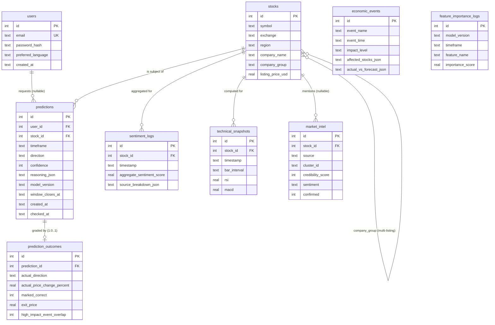

# DC Intel — Database Schema

**Status:** v1 specification — implementation-ready
**Owner doc for:** all SQLite DDL, the data dictionary, JSON column shapes (by reference where another doc is authoritative), indexes, migrations, and the SQLite → PostgreSQL upgrade path.
**Related docs:** `prediction-model.md` (owns the `reasoning_json` shape, §8 there), `sentiment-pipeline.md` (owns the `source_breakdown_json` shape, §8.1 there), `economic-calendar.md` (owns `affected_stocks_json` / `actual_vs_forecast_json` shapes, §6–7 there), `market-intel-pipeline.md` (owns credibility/cluster/confirmation semantics), `technical-indicators.md` (owns the indicator payload, §10.1 there), `data-sources.md` (fetch jobs that write these tables).

> **Single source of truth rule:** this document owns the authoritative `CREATE TABLE` statements. Where a pipeline doc sketches DDL or column lists, the version here wins; reconciliation notes below each table call out any naming differences the sibling docs must patch.

---

## 1. Engine, conventions, and global decisions

### 1.1 Engine

- **SQLite** for v1, single file `data/dcintel.db`, **WAL mode**. Documented upgrade path to PostgreSQL in §11.
- Requires SQLite **≥ 3.38** (JSON functions and `->`/`->>` operators compiled in by default). Python 3.11+ official builds bundle ≥ 3.39 — verify at startup with `sqlite3.sqlite_version_info >= (3, 38, 0)` and refuse to boot otherwise.
- Redis is the hot cache (live quotes, cluster metadata, embeddings, source health). **Nothing in Redis is durable truth**; everything the product must not lose lives in these SQLite tables.

### 1.2 Connection pragmas

```sql
-- Once, at database creation (WAL is persistent across connections):
PRAGMA journal_mode = WAL;

-- On EVERY connection (set in the FastAPI connection factory and in every
-- APScheduler job's connection setup — foreign_keys is per-connection in SQLite):
PRAGMA foreign_keys = ON;
PRAGMA busy_timeout = 5000;      -- ms; jobs and API share one writer
PRAGMA synchronous = NORMAL;     -- safe with WAL, much faster than FULL
```

### 1.3 Type and naming conventions

| Concern | Convention |
|---|---|
| Primary keys | `id INTEGER PRIMARY KEY AUTOINCREMENT`. `AUTOINCREMENT` is deliberate: several tables are pruned by retention jobs (§9) and their ids are referenced from JSON blobs in other rows (`market_intel_id` inside `source_breakdown_json`, `event_id` inside `reasoning_json`). `AUTOINCREMENT` guarantees ids are never reused, so a stale JSON reference can dangle but never silently point at the wrong row. |
| Timestamps | `TEXT`, ISO-8601 **UTC** with trailing `Z`, e.g. `2026-06-12T05:40:00Z`. Column defaults use `strftime('%Y-%m-%dT%H:%M:%fZ','now')` (millisecond precision). App writes may use second precision; readers must accept both. **No local times in the database, ever** (KST/ET conversion is a presentation concern). |
| Booleans | `INTEGER` with `CHECK (x IN (0,1))`. Maps to `BOOLEAN` in PostgreSQL. |
| JSON | `TEXT` with `CHECK (json_valid(col))`. Queryable with SQLite JSON1 (`->>`). Maps to `JSONB` in PostgreSQL. Every JSON shape carries `schema_version` where its owner doc defines one; consumers must tolerate unknown extra keys. |
| Money / prices | `REAL` in v1 (display-grade precision is sufficient for a prediction product that never executes trades). PostgreSQL port uses `NUMERIC(18,6)` for price columns (§11). |
| Enums | **Closed** enums (timeframe, direction, impact level, sentiment label, bar interval) are enforced with `CHECK (... IN (...))`. **Open** enums (exchange, region, source, security_type) are app-validated against config — changing a `CHECK` in SQLite requires a full table rebuild, so we don't put growing lists in `CHECK`s. |
| Index names | `idx_{table}_{purpose}`. |

### 1.4 Canonical closed enums

| Enum | Values | Used by |
|---|---|---|
| `timeframe` | `'1h','5h','24h','2d','3d','5d'` | `predictions.timeframe`, `feature_importance_logs.timeframe` |
| `direction` | `'up','down','neutral'` | `predictions.direction`, `prediction_outcomes.actual_direction` |
| `impact_level` | `'high','medium','low'` | `economic_events.impact_level` |
| `intel sentiment` | `'bullish','bearish','neutral'` | `market_intel.sentiment` (green/red/gray platform-wide) |
| `bar_interval` | `'5m','15m','1h','1d'` | `technical_snapshots.bar_interval` |
| `event status` | `'scheduled','released','revised','cancelled'` | `economic_events.status` |

### 1.5 Open (app-validated) enums — documented current values

| Column | Current values | Notes |
|---|---|---|
| `stocks.exchange` | `KRX`, `NASDAQ`, `NYSE`, `AMEX`, `OTC`, `INDEX` | `INDEX` is the pseudo-exchange for dashboard index rows (§8.3). Extensible (e.g. `TSE`, `XETRA`) without migration. |
| `stocks.region` | `KR`, `US`, `JP`, `DE` | Region of the **listing venue** (drives market-hours logic: KRX 09:00–15:30 KST; NYSE/NASDAQ 09:30–16:00 ET). Same ISO-3166 alpha-2 convention as `economic_events.country`. |
| `stocks.security_type` | `common`, `adr`, `etf`, `index` | `future` reserved for the futures roadmap item. |
| `stocks.board` | `KOSPI`, `KOSDAQ` | KRX board of the listing; **NULL for every non-KRX row**. Metadata only — KOSDAQ stocks still address as `{symbol}:KRX` (backend-design.md §2.2); surfaced as `board` in `/stocks/search` listings (backend-design.md §6.3). |
| `stocks.currency` | `KRW`, `USD`, `JPY`, `EUR` | Listing currency; `reasoning_json.entry_price` and `prediction_outcomes.exit_price` are in this currency. |
| `market_intel.source` | `reddit`, `stocktwits`, `dcinside`, `naver`, `finnhub`, `newsapi`, `twitter` (all v1; `twitter` via logged-in session scraping, `data-sources.md` §4.1) | Union of `data-sources.md` §social (community sources incl. Korean boards) and `sentiment-pipeline.md` (news items from Finnhub/NewsAPI are also scored and stored as `market_intel` rows). |
| `economic_events.provider` | `trading_economics`, `investing_com`, `fred`, `finnhub`, `seed` | Per `economic-calendar.md` §3. |

---

## 2. Entity-relationship overview

Nine tables: the canonical seven (`users`, `stocks`, `predictions`, `prediction_outcomes`, `sentiment_logs`, `economic_events`, `technical_snapshots`) plus two canonical supplementary tables (`feature_importance_logs`, `market_intel`) — see §4.8–4.9 for the addition rationale. There is **no portfolio/watchlist table in v1**: "stocks the user cares about" is approximated by the user's recent rows in `predictions` (§7.6); a `watchlists` table is a documented v1.1 extension.



`feature_importance_logs` has no FK edges by design — it references model artifacts (`model_version` strings), not rows.

---

## 3. Full DDL — `migrations/001_initial_schema.sql`

The complete initial migration. Conventions from §1 apply. `-- ADDITION` marks columns beyond the original 7-table spec (each justified in §4).

```sql
-- migrations/001_initial_schema.sql
-- DC Intel v1 initial schema. SQLite >= 3.38 (JSON1).
-- Applied by the migration runner (schema.md §10) inside one transaction.

------------------------------------------------------------------------------
-- users
------------------------------------------------------------------------------
CREATE TABLE users (
    id                 INTEGER PRIMARY KEY AUTOINCREMENT,
    email              TEXT    NOT NULL COLLATE NOCASE,
    password_hash      TEXT    NOT NULL,                  -- bcrypt "$2b$12$..." (60 chars)
    preferred_language TEXT    NOT NULL DEFAULT 'ko'      -- ADDITION: bilingual UI (ko/en)
                       CHECK (preferred_language IN ('ko','en')),
    created_at         TEXT    NOT NULL DEFAULT (strftime('%Y-%m-%dT%H:%M:%fZ','now')),
    updated_at         TEXT    NOT NULL DEFAULT (strftime('%Y-%m-%dT%H:%M:%fZ','now'))  -- ADDITION
);

CREATE UNIQUE INDEX idx_users_email ON users (email);

------------------------------------------------------------------------------
-- stocks  (one row PER LISTING; multi-listing handling in schema.md §8)
------------------------------------------------------------------------------
CREATE TABLE stocks (
    id                INTEGER PRIMARY KEY AUTOINCREMENT,
    symbol            TEXT    NOT NULL,        -- '005930', 'AAPL', 'PKX', 'KOSPI'
    exchange          TEXT    NOT NULL,        -- open enum §1.5: KRX|NASDAQ|NYSE|AMEX|OTC|INDEX
    region            TEXT    NOT NULL,        -- listing-venue region: KR|US|JP|DE (§1.5)
    company_name      TEXT    NOT NULL,        -- English display name
    company_name_ko   TEXT,                    -- ADDITION: Korean display name (NULL -> fall back to company_name)
    company_group     TEXT,                    -- multi-listing slug, e.g. 'posco-holdings'; NULL = single listing
    security_type     TEXT    NOT NULL DEFAULT 'common',  -- ADDITION: common|adr|etf|index (§1.5)
    currency          TEXT    NOT NULL DEFAULT 'USD',     -- ADDITION: listing currency (§1.5)
    board             TEXT,                    -- ADDITION: KRX board 'KOSPI'|'KOSDAQ' (open enum §1.5);
                                               -- NULL for all non-KRX rows (backend-design.md §2.2)
    yfinance_ticker   TEXT    NOT NULL,        -- ADDITION: provider ticker '005930.KS'|'AAPL'|'^KS11'
                                               -- (mapping rules: data-sources.md §1)
    finnhub_ticker    TEXT,                    -- ADDITION: US fallback-provider ticker; NULL for KRX and
                                               -- index rows (KRX fallback is pykrx/KIS, data-sources.md §1)
    adr_ratio         REAL,                    -- ADDITION: underlying shares per 1 ADR (SKM: 0.5);
                                               -- NULL unless security_type='adr' (backend-design.md §6.6)
    xmkt_reference    TEXT,                    -- ADDITION: resolved cross-market reference instrument
                                               -- (prediction-model.md §4.3): '{symbol}:{exchange}' when
                                               -- tracked, else raw yfinance ticker ('SOXX', '^N225')
    listing_price_usd REAL,                    -- IPO/first-listing reference price converted to USD; NULL if unknown
    is_active         INTEGER NOT NULL DEFAULT 1 CHECK (is_active IN (0,1)),  -- ADDITION: delistings
    created_at        TEXT    NOT NULL DEFAULT (strftime('%Y-%m-%dT%H:%M:%fZ','now')),
    updated_at        TEXT    NOT NULL DEFAULT (strftime('%Y-%m-%dT%H:%M:%fZ','now')),  -- ADDITION
    UNIQUE (symbol, exchange)                  -- the {symbol}:{exchange} API convention resolves here
);

CREATE INDEX idx_stocks_company_group ON stocks (company_group) WHERE company_group IS NOT NULL;
CREATE INDEX idx_stocks_symbol        ON stocks (symbol);   -- exact-prefix search; name search scans (§7.7)

------------------------------------------------------------------------------
-- predictions  (one row per generated prediction; the product's honesty log)
------------------------------------------------------------------------------
CREATE TABLE predictions (
    id               INTEGER PRIMARY KEY AUTOINCREMENT,
    user_id          INTEGER REFERENCES users(id) ON DELETE SET NULL,
                     -- NULL = system-generated (dashboard/trending precompute) or deleted account
    stock_id         INTEGER NOT NULL REFERENCES stocks(id) ON DELETE RESTRICT,
    timeframe        TEXT    NOT NULL CHECK (timeframe IN ('1h','5h','24h','2d','3d','5d')),
    direction        TEXT    NOT NULL CHECK (direction IN ('up','down','neutral')),
    confidence       INTEGER NOT NULL CHECK (confidence BETWEEN 0 AND 100),
                     -- displayed value: post-calibration, post-cap (prediction-model.md §4.5)
    reasoning_json   TEXT    NOT NULL CHECK (json_valid(reasoning_json)),
                     -- canonical shape owned by prediction-model.md §8 (schema_version 1); §6.1 below
    model_version    TEXT    NOT NULL,
                     -- ADDITION: '{timeframe}-{algo}-{YYYYMMDD}.{seq}', e.g. '24h-xgb-20260608.1'.
                     -- Required for accuracy-by-model-version tracking (prediction-model.md §7.8).
    window_closes_at TEXT    NOT NULL,
                     -- ADDITION: denormalized copy of reasoning_json.window_closes_at so the
                     -- outcome checker's due-scan is a plain indexed range query (§7.2).
    created_at       TEXT    NOT NULL DEFAULT (strftime('%Y-%m-%dT%H:%M:%fZ','now')),
    checked_at       TEXT                              -- NULL until the outcome checker grades it
);

CREATE INDEX idx_predictions_due           ON predictions (window_closes_at) WHERE checked_at IS NULL;
CREATE INDEX idx_predictions_accuracy      ON predictions (stock_id, timeframe) WHERE checked_at IS NOT NULL;
CREATE INDEX idx_predictions_model_version ON predictions (model_version) WHERE checked_at IS NOT NULL;
CREATE INDEX idx_predictions_user_recent   ON predictions (user_id, created_at);
CREATE INDEX idx_predictions_stock_latest  ON predictions (stock_id, timeframe, created_at);

------------------------------------------------------------------------------
-- prediction_outcomes  (exactly 0 or 1 per prediction; written by the outcome checker)
------------------------------------------------------------------------------
CREATE TABLE prediction_outcomes (
    id                          INTEGER PRIMARY KEY AUTOINCREMENT,
    prediction_id               INTEGER NOT NULL UNIQUE REFERENCES predictions(id) ON DELETE CASCADE,
    actual_direction            TEXT    NOT NULL CHECK (actual_direction IN ('up','down','neutral')),
    actual_price_change_percent REAL    NOT NULL,   -- 100 * (exit - entry) / entry
    marked_correct              INTEGER NOT NULL CHECK (marked_correct IN (0,1)),
    exit_price                  REAL,               -- ADDITION: last trade at window close, listing currency
    high_impact_event_overlap   INTEGER CHECK (high_impact_event_overlap IN (0,1)),
                                                    -- ADDITION: frozen at resolve time. 1 iff a high-impact
                                                    -- economic_events row has event_time inside
                                                    -- [prediction.created_at, prediction_outcomes.created_at]
                                                    -- with country in relevant_countries(stock.exchange)
                                                    -- (KRX -> {KR,US}; NYSE/NASDAQ -> {US}). Powers the
                                                    -- event-window accuracy split (win-loss-tracking.md §7,
                                                    -- economic-calendar.md §13). NULL only on legacy rows
                                                    -- graded before this column existed.
    created_at                  TEXT    NOT NULL DEFAULT (strftime('%Y-%m-%dT%H:%M:%fZ','now'))
                                                    -- ADDITION: when the checker actually graded it
);

------------------------------------------------------------------------------
-- sentiment_logs  (one row per active stock per 10-minute aggregation cycle)
------------------------------------------------------------------------------
CREATE TABLE sentiment_logs (
    id                        INTEGER PRIMARY KEY AUTOINCREMENT,
    stock_id                  INTEGER NOT NULL REFERENCES stocks(id) ON DELETE RESTRICT,
    timestamp                 TEXT    NOT NULL,
                              -- aggregation cycle time; sentiment-pipeline.md §8 calls this
                              -- "created_at" — SAME FIELD, canonical column name is `timestamp`.
    aggregate_sentiment_score REAL
                              CHECK (aggregate_sentiment_score IS NULL
                                     OR aggregate_sentiment_score BETWEEN -100 AND 100),
                              -- -100..+100, 24h-timeframe headline score; NULL when zero items
                              -- in the 24h window (sentiment-pipeline.md §8)
    source_breakdown_json     TEXT    NOT NULL CHECK (json_valid(source_breakdown_json)),
                              -- shape owned by sentiment-pipeline.md §8.1 (schema_version 1); §6.2 below
    UNIQUE (stock_id, timestamp)       -- also serves "latest sentiment per stock"
);

------------------------------------------------------------------------------
-- economic_events  (one row per occurrence; sync job upserts, never deletes)
------------------------------------------------------------------------------
CREATE TABLE economic_events (
    id                      INTEGER PRIMARY KEY AUTOINCREMENT,
    event_name              TEXT    NOT NULL,
                            -- English display title. economic-calendar.md §3 drafted this as
                            -- "title_en" — canonical column name is `event_name` (see note §4.6).
    event_time              TEXT    NOT NULL,
                            -- ISO-8601 UTC scheduled time. Drafted as "scheduled_at_utc" in
                            -- economic-calendar.md §3 — canonical column name is `event_time`.
    impact_level            TEXT    NOT NULL DEFAULT 'low'
                            CHECK (impact_level IN ('high','medium','low')),
    affected_stocks_json    TEXT    CHECK (affected_stocks_json IS NULL
                                           OR json_valid(affected_stocks_json)),
                            -- shape owned by economic-calendar.md §6; §6.3 below
    actual_vs_forecast_json TEXT    CHECK (actual_vs_forecast_json IS NULL
                                           OR json_valid(actual_vs_forecast_json)),
                            -- NULL until released; shape owned by economic-calendar.md §7; §6.4 below
    provider                TEXT    NOT NULL,            -- ADDITION (§1.5): upstream feed
    provider_event_id       TEXT,                        -- ADDITION: provider's stable id, NULL for seeds
    event_type              TEXT    NOT NULL,            -- ADDITION: canonical registry slug, e.g. 'us_cpi',
                                                         -- 'earnings:NVDA:NASDAQ' (economic-calendar.md §4)
    title_ko                TEXT,                        -- ADDITION: Korean title; NULL -> event_name
    country                 TEXT    NOT NULL,            -- ADDITION: ISO alpha-2 or 'GLOBAL'
    impact_source           TEXT    NOT NULL DEFAULT 'default'
                            CHECK (impact_source IN ('override','provider','default')),  -- ADDITION
    status                  TEXT    NOT NULL DEFAULT 'scheduled'
                            CHECK (status IN ('scheduled','released','revised','cancelled')),  -- ADDITION
    created_at              TEXT    NOT NULL DEFAULT (strftime('%Y-%m-%dT%H:%M:%fZ','now')),  -- ADDITION
    updated_at              TEXT    NOT NULL DEFAULT (strftime('%Y-%m-%dT%H:%M:%fZ','now')),  -- ADDITION
    UNIQUE (provider, provider_event_id),
    UNIQUE (event_type, event_time)
);

CREATE INDEX idx_econ_events_sched  ON economic_events (event_time);
CREATE INDEX idx_econ_events_type   ON economic_events (event_type, event_time);
CREATE INDEX idx_econ_events_impact ON economic_events (impact_level, event_time);

------------------------------------------------------------------------------
-- technical_snapshots  (one row per (stock, bar_interval, computation time))
------------------------------------------------------------------------------
CREATE TABLE technical_snapshots (
    id              INTEGER PRIMARY KEY AUTOINCREMENT,
    stock_id        INTEGER NOT NULL REFERENCES stocks(id) ON DELETE RESTRICT,
    timestamp       TEXT    NOT NULL,
                    -- computation time; technical-indicators.md §10.1 calls this "computed_at" —
                    -- SAME FIELD, canonical column name is `timestamp`.
    bar_interval    TEXT    NOT NULL CHECK (bar_interval IN ('5m','15m','1h','1d')),
                    -- ADDITION: required by technical-indicators.md §3 — one indicator codebase,
                    -- four bar intervals; the 2d/3d/5d models share the '1d' snapshot.
    rsi             REAL    CHECK (rsi IS NULL OR (rsi >= 0 AND rsi <= 100)),
                    -- rsi_14; NULL while warming up (< 15 bars)
    ema_5           REAL,
    ema_20          REAL,
    ema_50          REAL,
    ema_200         REAL,                    -- NULL when < 200 bars (recent IPOs)
    macd            REAL,                    -- the MACD line (12/26); doc name "macd_line"
    macd_signal     REAL,                    -- ADDITION: 9-EMA signal line (evidence bullets need crosses)
    macd_histogram  REAL,                    -- ADDITION: macd - macd_signal
    bollinger_upper REAL,                    -- SMA20 + 2 sigma
    bollinger_lower REAL,                    -- SMA20 - 2 sigma
    bollinger_middle REAL,                   -- ADDITION: SMA20 (doc name "bb_middle")
    indicators_json TEXT    NOT NULL CHECK (json_valid(indicators_json)),
                    -- ADDITION: the FULL indicator payload owned by technical-indicators.md §10.1
                    -- (states, cross directions, %B, squeeze, flags). Hot scalars are promoted
                    -- to the real columns above; everything else lives here so the payload is
                    -- durable without a 30-column table.
    UNIQUE (stock_id, bar_interval, timestamp)   -- also serves "latest snapshot per stock+interval"
);

------------------------------------------------------------------------------
-- feature_importance_logs
-- ADDITION BEYOND THE ORIGINAL 7-TABLE SPEC. Rationale: required by win-loss
-- tracking — accuracy-by-model-version reporting and the "what is the model
-- looking at" view need per-retrain feature importances (prediction-model.md §7.7).
------------------------------------------------------------------------------
CREATE TABLE feature_importance_logs (
    id               INTEGER PRIMARY KEY AUTOINCREMENT,
    model_version    TEXT    NOT NULL,     -- '{timeframe}-{algo}-{YYYYMMDD}.{seq}'
    timeframe        TEXT    NOT NULL CHECK (timeframe IN ('1h','5h','24h','2d','3d','5d')),
    feature_name     TEXT    NOT NULL,     -- e.g. 'rsi_14', 'sent_agg' (names owned by prediction-model.md §4)
    importance_score REAL    NOT NULL,     -- |standardized coefficient| (logistic) or mean |SHAP| (xgboost)
    window_start     TEXT    NOT NULL,     -- training data window (ISO-8601 UTC)
    window_end       TEXT    NOT NULL,
    created_at       TEXT    NOT NULL DEFAULT (strftime('%Y-%m-%dT%H:%M:%fZ','now')),
    UNIQUE (model_version, feature_name)   -- one row per (model_version, feature); model_version embeds timeframe
);

CREATE INDEX idx_fil_version ON feature_importance_logs (model_version, timeframe);

------------------------------------------------------------------------------
-- market_intel
-- ADDITION BEYOND THE ORIGINAL 7-TABLE SPEC. Rationale: required by the
-- market-intel pipeline — durable store for every scraped/ingested intel item,
-- credibility scoring, clustering, and the CONFIRMED/UNCONFIRMED badge
-- (market-intel-pipeline.md, owner doc).
------------------------------------------------------------------------------
CREATE TABLE market_intel (
    id                   INTEGER PRIMARY KEY AUTOINCREMENT,
    stock_id             INTEGER REFERENCES stocks(id) ON DELETE SET NULL,
                         -- NULL = market-wide chatter or unresolved ticker
    source               TEXT    NOT NULL,    -- open enum §1.5
    author_handle        TEXT    NOT NULL,    -- platform-native: 'u/deepfvalue', '@kr_whalewatch', 'reuters.com'
    url                  TEXT,                -- permalink; durable evidence pointer
    content_snippet      TEXT    NOT NULL,    -- truncated text; the durable source for lazy embedding rebuilds
    posted_at            TEXT    NOT NULL,    -- when it appeared on the platform (UTC)
    credibility_score    INTEGER NOT NULL DEFAULT 50
                         CHECK (credibility_score BETWEEN 0 AND 100),
                         -- 0-100; formula owned by market-intel-pipeline.md §6; batch-updated on corroboration
    sentiment            TEXT    NOT NULL DEFAULT 'neutral'
                         CHECK (sentiment IN ('bullish','bearish','neutral')),
    sentiment_confidence REAL    NOT NULL DEFAULT 0
                         CHECK (sentiment_confidence BETWEEN 0 AND 1),   -- 2 decimals
    confirmed            INTEGER NOT NULL DEFAULT 0 CHECK (confirmed IN (0,1)),
                         -- flipped to 1 for the whole cluster on news corroboration
    cluster_id           TEXT,                -- 'cl_' + 12 hex (cross-doc contract, market-intel-pipeline.md §5.2)
    created_at           TEXT    NOT NULL DEFAULT (strftime('%Y-%m-%dT%H:%M:%fZ','now'))
                         -- when WE ingested it (feed recency sort key)
);

CREATE INDEX idx_intel_recency        ON market_intel (created_at);             -- global feed by recency
CREATE INDEX idx_intel_stock_recency  ON market_intel (stock_id, created_at);   -- per-stock feed
CREATE INDEX idx_intel_cluster        ON market_intel (cluster_id);             -- confirmation flips, corroboration
CREATE INDEX idx_intel_author         ON market_intel (source, author_handle, posted_at);
                                      -- author-accuracy aggregation (market-intel-pipeline.md §6.2)
```

---

## 4. Data dictionary and example rows

Conventions: PK = primary key, FK = foreign key, **bold** = beyond the original column list (marked `ADDITION` in DDL).

### 4.1 `users`

| Column | Type | Null | Default | Description |
|---|---|---|---|---|
| `id` | INTEGER PK | no | auto | |
| `email` | TEXT, unique, `COLLATE NOCASE` | no | — | Login identifier; case-insensitive uniqueness (`A@x.com` == `a@x.com`). Normalize to lowercase at the app layer anyway. |
| `password_hash` | TEXT | no | — | bcrypt (`$2b$`, cost 12), 60 chars. Never log it. |
| **`preferred_language`** | TEXT | no | `'ko'` | `'ko'` or `'en'`; default UI language. |
| `created_at` | TEXT | no | now | |
| **`updated_at`** | TEXT | no | now | App updates on any profile change. |

```sql
INSERT INTO users (email, password_hash) VALUES
  ('kom2k@daum.net', '$2b$12$LJ3m9yPq0eFhT0eVnXkLXuC1dW3qZ8rT5vNb2sYwq1mAoPzKfGh1e');
```

### 4.2 `stocks`

One row **per listing**, not per company (§8).

| Column | Type | Null | Default | Description |
|---|---|---|---|---|
| `id` | INTEGER PK | no | auto | |
| `symbol` | TEXT | no | — | Exchange-native ticker: `005930` (KRX numeric), `AAPL`, `PKX`. Index rows use the canonical index code (§8.3). |
| `exchange` | TEXT | no | — | Open enum §1.5. `UNIQUE(symbol, exchange)` is how every `{symbol}:{exchange}` API path resolves. |
| `region` | TEXT | no | — | Listing-venue region (`KR`,`US`,`JP`,`DE`); drives market-hours/session logic only. A Korean company listed on NYSE (Coupang) has `region='US'`. |
| `company_name` | TEXT | no | — | English display name. |
| **`company_name_ko`** | TEXT | yes | NULL | Korean display name; UI falls back to `company_name`. |
| `company_group` | TEXT | yes | NULL | Multi-listing slug (lowercase-hyphen, stable), e.g. `posco-holdings`. NULL when only one listing is tracked. See §8. |
| **`security_type`** | TEXT | no | `'common'` | `common` / `adr` / `etf` / `index`. Distinguishes ADR rows and index pseudo-rows. |
| **`currency`** | TEXT | no | `'USD'` | Listing currency. All stored prices for this listing (`entry_price` in `reasoning_json`, `exit_price`) are in this currency. |
| **`board`** | TEXT | yes | NULL | KRX board, `KOSPI` / `KOSDAQ` (open enum §1.5); **NULL for every non-KRX row**. Metadata only — KOSDAQ stocks still use `exchange='KRX'` in the `{symbol}:{exchange}` key (backend-design.md §2.2); rendered as `board` in `/stocks/search` listings (backend-design.md §6.3). |
| **`yfinance_ticker`** | TEXT | no | — | Provider-native yfinance ticker (`005930.KS`, `AAPL`, `^KS11`); mapping rules owned by data-sources.md §1. Stored as a column so provider fallback never re-maps symbols at request time (backend-design.md §2.2); populated by the seed step from `data/seed_stocks.csv` (deployment-architecture.md). |
| **`finnhub_ticker`** | TEXT | yes | NULL | Fallback-provider ticker for US listings (`AAPL`, `PKX`). NULL for KRX rows and index pseudo-rows — the KRX fallback is pykrx/KIS, not Finnhub (data-sources.md §1). |
| **`adr_ratio`** | REAL | yes | NULL | Underlying shares represented by **one ADR** (SKM: `0.5`, rendered by the API as `"1 ADR = 0.5 share"`). NULL unless `security_type='adr'`. Feeds the per-underlying-share USD normalization in `/prices-across-markets` — "real ratios come from `stocks.adr_ratio`" (backend-design.md §6.6). |
| **`xmkt_reference`** | TEXT | yes | NULL | Resolved cross-market reference instrument — the prediction-model.md §4.3 CONTRACT ("stored as metadata on `stocks`, refreshed when mappings are edited"). A `{symbol}:{exchange}` key when the reference is a tracked listing (`PKX:NYSE`, `105560:KRX`), otherwise a raw yfinance ticker (`SOXX`, `^N225`). NULL → the resolver applies the §4.3 resolution order at the next mapping refresh. |
| `listing_price_usd` | REAL | yes | NULL | The security's **IPO / first-listing reference price converted to USD at listing date**. Display-only context ("since listing"). NULL when unknown. *Not* a live price — live quotes live in Redis only, never in this table. |
| **`is_active`** | INTEGER bool | no | 1 | 0 = delisted/suspended; excluded from search and new predictions, kept for history. |
| `created_at` / **`updated_at`** | TEXT | no | now | |

```sql
INSERT INTO stocks (symbol, exchange, region, company_name, company_name_ko,
                    company_group, security_type, currency, listing_price_usd) VALUES
  ('005930', 'KRX',    'KR', 'Samsung Electronics', '삼성전자',     NULL,             'common', 'KRW', 0.045),
  ('005490', 'KRX',    'KR', 'POSCO Holdings',      '포스코홀딩스', 'posco-holdings', 'common', 'KRW', NULL),
  ('PKX',    'NYSE',   'US', 'POSCO Holdings ADR',  '포스코홀딩스 ADR', 'posco-holdings', 'adr', 'USD', 23.00),
  ('CPNG',   'NYSE',   'US', 'Coupang',             '쿠팡',         NULL,             'common', 'USD', 35.00),
  ('NVDA',   'NASDAQ', 'US', 'NVIDIA',              '엔비디아',     NULL,             'common', 'USD', 12.00),
  ('KOSPI',  'INDEX',  'KR', 'KOSPI',               '코스피',       NULL,             'index',  'KRW', NULL);
```

### 4.3 `predictions`

One row per **generated** prediction. The API's per-timeframe cache TTL guarantees repeated requests inside the data cadence return the *same* logged row, so there is no uniqueness constraint on `(stock_id, timeframe, …)` — concurrent rows are legitimate when data refreshes.

| Column | Type | Null | Default | Description |
|---|---|---|---|---|
| `id` | INTEGER PK | no | auto | |
| `user_id` | INTEGER FK → users, `ON DELETE SET NULL` | yes | — | The user whose request triggered generation. **NULL = system-generated** (e.g. trending-dashboard precompute) or a deleted account. Predictions are never deleted with the user — they are the platform's public accuracy record. |
| `stock_id` | INTEGER FK → stocks, RESTRICT | no | — | |
| `timeframe` | TEXT, CHECK | no | — | `1h/5h/24h/2d/3d/5d` — one model per timeframe. |
| `direction` | TEXT, CHECK | no | — | `up/down/neutral` (green/red/gray). Post-neutral-rule displayed direction. |
| `confidence` | INTEGER, CHECK 0–100 | no | — | Displayed value: calibrated, capped (prediction-model.md §4.5). |
| `reasoning_json` | TEXT JSON | no | — | Canonical explanation snapshot, `schema_version` 1 — shape owned by `prediction-model.md` §8 (summary in §6.1). Carries `entry_price` and `neutral_band_pct`, which the outcome checker reads at grading time. |
| **`model_version`** | TEXT | no | — | ADDITION — required for accuracy-by-model-version tracking. Format `{timeframe}-{algo}-{YYYYMMDD}.{seq}` (cross-doc contract). |
| **`window_closes_at`** | TEXT | no | — | ADDITION — denormalized from `reasoning_json.window_closes_at` so the outcome checker's due-scan is one indexed range query (§7.2). Always equal to the JSON value. |
| `created_at` | TEXT | no | now | = `reasoning_json.predicted_at` (t0). |
| `checked_at` | TEXT | yes | NULL | Set when the outcome checker writes the `prediction_outcomes` row. NULL = window still open or grading pending. |

```sql
INSERT INTO predictions (user_id, stock_id, timeframe, direction, confidence,
                         reasoning_json, model_version, window_closes_at, created_at)
VALUES (1, 1, '24h', 'up', 66,
        '<full reasoning_json from §6.1>',
        '24h-xgb-20260608.1', '2026-06-15T01:30:00Z', '2026-06-12T01:30:00Z');
```

### 4.4 `prediction_outcomes`

Written exactly once per prediction by the outcome-checker job (runs when each prediction window closes). `UNIQUE(prediction_id)` makes the job idempotent under retries.

| Column | Type | Null | Default | Description |
|---|---|---|---|---|
| `id` | INTEGER PK | no | auto | |
| `prediction_id` | INTEGER FK → predictions, UNIQUE, CASCADE | no | — | 1:0..1 with `predictions`. |
| `actual_direction` | TEXT, CHECK | no | — | Realized label, computed with the **same `neutral_band_pct` snapshotted in `reasoning_json`** (cross-doc contract, prediction-model.md §3): `|change| ≤ band` → `neutral`, else sign. |
| `actual_price_change_percent` | REAL | no | — | `100 × (exit_price − entry_price) / entry_price`, entry from `reasoning_json.entry_price`, both in listing currency (FX never enters grading). |
| `marked_correct` | INTEGER bool, CHECK | no | — | `1` iff `predictions.direction == actual_direction`. Win rate = `AVG(marked_correct)` over graded rows — the honest number shown to users. |
| **`exit_price`** | REAL | yes | NULL | ADDITION — last trade price at/most recent before `window_closes_at` (listing currency); kept for audit/debug of grading. |
| **`high_impact_event_overlap`** | INTEGER bool, CHECK | yes | NULL | ADDITION — frozen by the checker at grading time. `1` iff a high-impact `economic_events` row has `event_time` inside `[prediction.created_at, prediction_outcomes.created_at]` with `country ∈ relevant_countries(stock.exchange)` (`KRX → {KR,US}`, `NYSE/NASDAQ → {US}`). This is the **single source** for the event-window accuracy split (win-loss-tracking.md §7, economic-calendar.md §13) — computed once at resolve time over the *real* window (incl. any next-close stretch), never recomputed. NULL only on rows graded before this column existed. |
| **`created_at`** | TEXT | no | now | ADDITION — when grading actually ran (may trail `window_closes_at` if the job was down; the *prices used* are still as-of window close). |

```sql
-- Samsung 24h prediction graded: +0.92% with band ±0.40% -> 'up', prediction said 'up' -> correct.
-- US CPI fell inside the window and KRX -> {KR,US} -> high_impact_event_overlap = 1.
INSERT INTO prediction_outcomes (prediction_id, actual_direction,
                                 actual_price_change_percent, marked_correct, exit_price,
                                 high_impact_event_overlap)
VALUES (1, 'up', 0.92, 1, 85075.0, 1);
-- and the checker sets: UPDATE predictions SET checked_at = '2026-06-15T01:31:12Z' WHERE id = 1;
```

### 4.5 `sentiment_logs`

One row per active stock per 10-minute aggregation cycle (`sentiment-pipeline.md` §8 is the writer contract).

| Column | Type | Null | Default | Description |
|---|---|---|---|---|
| `id` | INTEGER PK | no | auto | |
| `stock_id` | INTEGER FK → stocks, RESTRICT | no | — | |
| `timestamp` | TEXT | no | — | Aggregation cycle time (UTC). **Reconciliation:** sentiment-pipeline.md §8 lists this field as `created_at`; canonical column name here is `timestamp` — same field, one column. |
| `aggregate_sentiment_score` | REAL, CHECK −100..+100 | yes | — | Headline score = the **24h-timeframe** score. NULL when zero items in the 24h window (never fake a 0). |
| `source_breakdown_json` | TEXT JSON | no | — | Full per-timeframe / per-source breakdown, `schema_version` 1 — shape owned by sentiment-pipeline.md §8.1 (summary + example in §6.2). |

Read-time staleness rule (API layer, not the schema): a row older than 30 minutes is *stale* — gray gauge, never silently presented as current.

### 4.6 `economic_events`

One row per **occurrence** (each monthly CPI release is its own row). The daily sync job upserts; rows are never deleted — provider-removed events become `status='cancelled'`.

| Column | Type | Null | Default | Description |
|---|---|---|---|---|
| `id` | INTEGER PK | no | auto | |
| `event_name` | TEXT | no | — | English display title, e.g. `US Consumer Prices (CPI), May`. |
| `event_time` | TEXT | no | — | Scheduled release time, ISO-8601 UTC. |
| `impact_level` | TEXT, CHECK | no | `'low'` | `high/medium/low`. |
| `affected_stocks_json` | TEXT JSON | yes | NULL | Shape owned by economic-calendar.md §6 (§6.3 below). Carries indexes/sectors/stocks + nightly event-study `history`. |
| `actual_vs_forecast_json` | TEXT JSON | yes | NULL | NULL until released. Shape owned by economic-calendar.md §7 (§6.4 below). |
| **`provider`** | TEXT | no | — | ADDITION — upstream feed (§1.5). |
| **`provider_event_id`** | TEXT | yes | NULL | ADDITION — provider's stable id; `UNIQUE(provider, provider_event_id)` is the primary upsert key. |
| **`event_type`** | TEXT | no | — | ADDITION — canonical registry slug (`us_cpi`, `earnings:NVDA:NASDAQ`); `UNIQUE(event_type, event_time)` is the fallback upsert key and the event-study group key. |
| **`title_ko`** | TEXT | yes | NULL | ADDITION — Korean title; falls back to `event_name`. |
| **`country`** | TEXT | no | — | ADDITION — ISO alpha-2 or `GLOBAL`. |
| **`impact_source`** | TEXT, CHECK | no | `'default'` | ADDITION — where `impact_level` came from: `override/provider/default`. |
| **`status`** | TEXT, CHECK | no | `'scheduled'` | ADDITION — `scheduled/released/revised/cancelled`. |
| **`created_at` / `updated_at`** | TEXT | no | now | ADDITION. |

> **Reconciliation note (action for `economic-calendar.md`):** the draft DDL in economic-calendar.md §3 used `title_en` and `scheduled_at_utc`. The canonical 7-table spec fixes these names as **`event_name`** and **`event_time`**; this document is the DDL authority, so the calendar doc's §3 needs a two-name patch (`title_en` → `event_name`, `scheduled_at_utc` → `event_time`). Everything else in its §3 — uniques, indexes, statuses, upsert keys — is adopted verbatim here. (data-sources.md's "(source_event_id, event_date)" upsert key phrasing also maps to `(provider, provider_event_id)`.)

```sql
INSERT INTO economic_events (event_name, event_time, impact_level,
                             affected_stocks_json, actual_vs_forecast_json,
                             provider, provider_event_id, event_type, title_ko,
                             country, impact_source, status) VALUES
  ('US Consumer Prices (CPI), May', '2026-06-10T12:30:00Z', 'high',
   '<§6.3 macro example>', '<§6.4 CPI example>',
   'investing_com', 'ic:usa:cpi:2026-05', 'us_cpi',
   '미국 소비자물가지수(CPI), 5월', 'US', 'override', 'released'),
  ('NVIDIA Q1 FY27 Earnings', '2026-06-24T20:05:00Z', 'high',
   '<§6.3 NVDA example>', NULL,
   'finnhub', 'fh:earn:NVDA:2026Q1', 'earnings:NVDA:NASDAQ',
   '엔비디아 실적 발표', 'US', 'override', 'scheduled');
```

### 4.7 `technical_snapshots`

One row per `(stock_id, bar_interval, timestamp)`; writer contract is technical-indicators.md §10.1. The 1h prediction model reads `5m` rows, 5h reads `15m`, 24h reads `1h`, and 2d/3d/5d share `1d`. Raw OHLCV bars are **not** stored in SQLite (Redis/yfinance refetch per data-sources.md); snapshots are the durable indicator record.

| Column | Type | Null | Default | Description |
|---|---|---|---|---|
| `id` | INTEGER PK | no | auto | |
| `stock_id` | INTEGER FK → stocks, RESTRICT | no | — | Index rows (KOSPI etc.) get snapshots too. |
| `timestamp` | TEXT | no | — | Computation time. **Reconciliation:** technical-indicators.md §10.1 calls this `computed_at` — same field, canonical name `timestamp`. |
| **`bar_interval`** | TEXT, CHECK | no | — | ADDITION — `5m/15m/1h/1d` (required by the four-interval design). |
| `rsi` | REAL, CHECK 0–100 or NULL | yes | — | `rsi_14`. NULL while warming up. |
| `ema_5` / `ema_20` / `ema_50` / `ema_200` | REAL | yes | — | `ema_200` NULL when < 200 bars (recent IPOs; flagged in `indicators_json`). |
| `macd` | REAL | yes | — | The MACD line (12/26). Doc name `macd_line`. |
| **`macd_signal`** | REAL | yes | — | ADDITION — 9-EMA of MACD; crosses power evidence bullets. |
| **`macd_histogram`** | REAL | yes | — | ADDITION — `macd − macd_signal`. |
| `bollinger_upper` / `bollinger_lower` | REAL | yes | — | SMA20 ± 2σ (population σ). |
| **`bollinger_middle`** | REAL | yes | — | ADDITION — SMA20 (`bb_middle`). |
| **`indicators_json`** | TEXT JSON | no | — | ADDITION — the full §10.1 payload (states, cross directions, `bb_percent_b`, squeeze, `flags: [warming_up|stale_price|limit_lock|insufficient_history]`). Scalars above are *promoted copies* of payload fields; the payload is authoritative for derived/state fields. |

```sql
INSERT INTO technical_snapshots (stock_id, timestamp, bar_interval, rsi,
    ema_5, ema_20, ema_50, ema_200, macd, macd_signal, macd_histogram,
    bollinger_upper, bollinger_lower, bollinger_middle, indicators_json)
VALUES (1, '2026-06-12T01:25:00Z', '1h', 63.2,
    84510, 84120, 83310, 81250, 1.40, 1.16, 0.24,
    85200, 82900, 84050,
    '{"rsi_14":63.2,"rsi_state":"neutral_strong", ... ,"flags":[]}');  -- full §10.1 payload
```

### 4.8 `feature_importance_logs` — *addition beyond the original spec*

**Rationale (one line):** required by win-loss tracking — explaining *why* a model version wins or loses needs the per-retrain feature importances next to `predictions.model_version`.

| Column | Type | Null | Description |
|---|---|---|---|
| `id` | INTEGER PK | no | |
| `model_version` | TEXT | no | Same format/value space as `predictions.model_version`. Written after **every** retrain, promoted or not. |
| `timeframe` | TEXT, CHECK (six values) | no | Redundant with the version string's prefix but kept as a typed, indexable column. |
| `feature_name` | TEXT | no | From the feature registry in prediction-model.md §4 (`rsi_14`, `sent_agg`, …). |
| `importance_score` | REAL | no | \|standardized coefficient\| (logistic) or mean \|SHAP\| on validation (XGBoost). Comparable within one model_version only. |
| `window_start` / `window_end` | TEXT | no | Training data window. |
| `created_at` | TEXT | no | |

```sql
INSERT INTO feature_importance_logs
  (model_version, timeframe, feature_name, importance_score, window_start, window_end) VALUES
  ('24h-xgb-20260608.1', '24h', 'sent_agg',   0.31, '2024-06-01T00:00:00Z', '2026-05-31T00:00:00Z'),
  ('24h-xgb-20260608.1', '24h', 'rsi_14',     0.27, '2024-06-01T00:00:00Z', '2026-05-31T00:00:00Z'),
  ('24h-xgb-20260608.1', '24h', 'ema_cross_state', 0.14, '2024-06-01T00:00:00Z', '2026-05-31T00:00:00Z');
```

### 4.9 `market_intel` — *addition beyond the original spec*

**Rationale (one line):** required by the market-intel pipeline — the durable per-item store behind `GET /dashboard/market-intel`, credibility scoring, clustering, and the CONFIRMED/UNCONFIRMED honesty badge.

| Column | Type | Null | Default | Description |
|---|---|---|---|---|
| `id` | INTEGER PK | no | auto | Referenced as `market_intel_id` from `source_breakdown_json.top_contributors` — ids are never reused (`AUTOINCREMENT`, §1.3). |
| `stock_id` | INTEGER FK → stocks, SET NULL | yes | — | NULL = market-wide chatter / unresolved ticker (resolution order in market-intel-pipeline.md §4). |
| `source` | TEXT | no | — | Open enum §1.5 (`reddit`, `stocktwits`, `dcinside`, `naver`, `finnhub`, `newsapi`, `twitter`; `twitter` via session scraping, §4.1 of `data-sources.md`). |
| `author_handle` | TEXT | no | — | Platform-native handle; news items use the publisher domain (`reuters.com`). |
| `url` | TEXT | yes | NULL | Permalink. Not unique — the same article can legitimately yield rows for multiple resolved tickers; ingest dedupe is app-level per `(source, url, stock_id)` via a Redis seen-set. |
| `content_snippet` | TEXT | no | — | Truncated text; the **durable source of truth** for lazy embedding rebuilds (embeddings live only in Redis). |
| `posted_at` | TEXT | no | — | Platform publish time (UTC). |
| `credibility_score` | INTEGER, CHECK 0–100 | no | 50 | Formula owned by market-intel-pipeline.md §6; batch-`UPDATE`d when cluster corroboration changes. |
| `sentiment` | TEXT, CHECK | no | `'neutral'` | `bullish/bearish/neutral` — platform-wide green/red/gray semantics. |
| `sentiment_confidence` | REAL, CHECK 0–1 | no | 0 | 2 decimals. |
| `confirmed` | INTEGER bool | no | 0 | Default UNCONFIRMED (amber "rumor" badge). News-corroboration matcher flips the **whole cluster** to 1 (blue "confirmed" badge). |
| `cluster_id` | TEXT | yes | NULL | `'cl_' + uuid4().hex[:12]` (cross-doc contract). Cluster *metadata* lives in Redis only — documented v1 trade-off. |
| `created_at` | TEXT | no | now | Ingestion time; the feed's recency sort key (a 3-day-old tweet scraped now should surface now). |

```sql
INSERT INTO market_intel (stock_id, source, author_handle, url, content_snippet,
                          posted_at, credibility_score, sentiment, sentiment_confidence,
                          confirmed, cluster_id) VALUES
  (1, 'reddit', 'u/value_hunter88', 'https://reddit.com/r/stocks/comments/abc123',
   'Heard from a supplier that Samsung''s HBM4 yields are worse than reported...',
   '2026-06-12T02:41:00Z', 55, 'bearish', 0.74, 0, 'cl_9f2c41ab77d1'),
  (1, 'finnhub', 'reuters.com', 'https://www.reuters.com/technology/samsung-hbm4',
   'Samsung says HBM4 qualification with major GPU customer is on track...',
   '2026-06-12T04:38:00Z', 70, 'bullish', 0.91, 1, 'cl_77ab03de1c20');
```

> **Cross-field note:** `source_breakdown_json.top_contributors[].credibility` is the **normalized** value `credibility_score / 100` (0–1); the column itself is the 0–100 integer. Same number, two scales — documented here so neither doc "fixes" the other.

---

## 5. Referential-integrity policy summary

| FK | On delete | Why |
|---|---|---|
| `predictions.user_id → users` | `SET NULL` | Account deletion must not erase the public accuracy record. |
| `predictions.stock_id → stocks` | `RESTRICT` | Stocks are never hard-deleted; use `is_active = 0`. |
| `prediction_outcomes.prediction_id → predictions` | `CASCADE` | An outcome without its prediction is meaningless. |
| `sentiment_logs.stock_id`, `technical_snapshots.stock_id → stocks` | `RESTRICT` | Same as predictions. |
| `market_intel.stock_id → stocks` | `SET NULL` | Intel degrades to market-wide chatter rather than vanishing. |

---

## 6. JSON column shapes

Four JSON columns have cross-document shapes. For each: who owns the shape, the contract summary, and a worked example. All shapes carry `schema_version` and consumers must (a) check it, (b) tolerate unknown extra keys.

### 6.1 `predictions.reasoning_json` — owned by `prediction-model.md` §8 (schema_version 1)

Typical size 2–4 KB. Key fields (full field table in the owner doc — do not redefine):

| Field | Type | Notes |
|---|---|---|
| `schema_version` | int | `1` |
| `model_version`, `algorithm`, `timeframe`, `symbol` | strings | `symbol` is `{symbol}:{exchange}` |
| `predicted_at`, `window_closes_at` | ISO UTC | `window_closes_at` is duplicated into the typed column (§4.3) |
| `entry_price` | number | last trade at t0, **listing currency** — the outcome checker's entry price |
| `neutral_band_pct` | number | dead-band snapshotted at prediction time; grading always uses this value |
| `direction`, `confidence` | enum, int 0–100 | duplicated into typed columns |
| `probabilities.raw` / `.calibrated` | objects | `{up, down, neutral}` |
| `features[]` | array | per-feature `{name, group, value, baseline, contribution_signed, missing, stale}` |
| `evidence[]` | array, ≤ 3 | `{rank, group, contribution_pct, template_key, text_en, text_ko}`; `contribution_pct` **sums to 100** — renders as the canonical one-liner `Positive sentiment surge (43%) + RSI bullish signal (38%) + Bullish EMA crossover (19%)` |
| `data_staleness` | object | ages in seconds + `any_stale` |
| `high_impact_events[]` | array | events overlapping `[t0 − 6h, t_close + 6h]` with `event_id` → `economic_events.id` |

Worked example (abridged — `features[]` truncated to 4 of 15 entries; the authoritative full example is prediction-model.md §8.2):

```json
{
  "schema_version": 1,
  "model_version": "24h-xgb-20260608.1",
  "algorithm": "xgboost",
  "timeframe": "24h",
  "symbol": "005930:KRX",
  "predicted_at": "2026-06-12T01:30:00Z",
  "window_closes_at": "2026-06-15T01:30:00Z",
  "entry_price": 84300,
  "neutral_band_pct": 0.40,
  "direction": "up",
  "confidence": 66,
  "probabilities": {
    "raw":        { "up": 0.640, "down": 0.170, "neutral": 0.190 },
    "calibrated": { "up": 0.660, "down": 0.160, "neutral": 0.180 }
  },
  "neutral_rule_applied": false,
  "confidence_capped": false,
  "features": [
    { "name": "rsi_14",          "group": "rsi",       "value": 63.2,  "baseline": 51.8, "contribution_signed": 0.21, "missing": false, "stale": false },
    { "name": "ema_cross_state", "group": "ema",       "value": 1,     "baseline": 0.04, "contribution_signed": 0.10, "missing": false, "stale": false },
    { "name": "sent_agg",        "group": "sentiment", "value": 0.42,  "baseline": 0.03, "contribution_signed": 0.19, "missing": false, "stale": false },
    { "name": "sent_delta_2h",   "group": "sentiment", "value": 0.18,  "baseline": 0.0,  "contribution_signed": 0.12, "missing": false, "stale": false }
  ],
  "evidence": [
    { "rank": 1, "group": "sentiment", "contribution_pct": 43, "template_key": "sentiment.up", "text_en": "Positive sentiment surge (43%)", "text_ko": "긍정적 여론 급증 (43%)" },
    { "rank": 2, "group": "rsi",       "contribution_pct": 38, "template_key": "rsi.up",       "text_en": "RSI bullish signal (38%)",      "text_ko": "RSI 상승 신호 (38%)" },
    { "rank": 3, "group": "ema",       "contribution_pct": 19, "template_key": "ema.up",       "text_en": "Bullish EMA crossover (19%)",   "text_ko": "EMA 상승 교차 신호 (19%)" }
  ],
  "data_staleness": {
    "prices_age_sec": 45, "technicals_age_sec": 180, "sentiment_age_sec": 540,
    "intel_age_sec": 300, "econ_age_sec": 14400, "xmkt_age_sec": 21600, "any_stale": false
  },
  "high_impact_events": [
    { "event_id": 1, "title_en": "US CPI (May)", "title_ko": "미국 소비자물가지수 (5월)",
      "country": "US", "impact": "high",
      "scheduled_at": "2026-06-12T12:30:00Z", "relation": "inside_window" }
  ]
}
```

Useful JSON1 queries against this column:

```sql
-- band actually used for a graded prediction (audit)
SELECT reasoning_json ->> '$.neutral_band_pct' FROM predictions WHERE id = ?;
-- entry price for the outcome checker
SELECT CAST(reasoning_json ->> '$.entry_price' AS REAL) FROM predictions WHERE id = ?;
```

### 6.2 `sentiment_logs.source_breakdown_json` — owned by `sentiment-pipeline.md` §8.1 (schema_version 1)

Contract summary: per-timeframe scores (−100..+100, `null` when `item_count` = 0), per-source item counts, source-coverage health, and up to 5 `top_contributors` ranked by weight over the 24h window (these power the "why is sentiment bullish?" drill-down; `content_snippet` is deliberately *not* duplicated here — fetch from `market_intel` by `market_intel_id`).

Worked example (condensed to 2 `top_contributors`; full example in the owner doc):

```json
{
  "schema_version": 1,
  "computed_at": "2026-06-12T05:40:00Z",
  "classifier": "mdeberta-v3-xnli@zero-shot-v1",
  "timeframe_scores": {
    "1h":  { "score": 38.2, "item_count": 3,  "low_confidence": true  },
    "5h":  { "score": 33.5, "item_count": 5,  "low_confidence": true  },
    "24h": { "score": 31.0, "item_count": 6,  "low_confidence": true  },
    "2d":  { "score": 18.4, "item_count": 14, "low_confidence": false },
    "3d":  { "score": 12.1, "item_count": 19, "low_confidence": false },
    "5d":  { "score": 9.7,  "item_count": 27, "low_confidence": false }
  },
  "item_counts_by_source": { "reddit": 9, "stocktwits": 11, "twitter": 6, "finnhub": 5, "newsapi": 2 },
  "coverage": {
    "twitter_enabled": true,
    "sources_ok": ["reddit", "stocktwits", "twitter", "finnhub", "newsapi"],
    "sources_down": [],
    "reduced_coverage": false
  },
  "top_contributors": [
    { "market_intel_id": 48211, "source": "finnhub", "author_handle": "reuters.com",
      "url": "https://www.reuters.com/technology/samsung-...", "sentiment": "bullish",
      "sentiment_confidence": 0.91, "item_score": 91, "credibility": 0.70,
      "weight": 0.624, "posted_at": "2026-06-12T04:38:00Z" },
    { "market_intel_id": 48150, "source": "reddit", "author_handle": "u/value_hunter88",
      "url": "https://reddit.com/r/stocks/comments/...", "sentiment": "bearish",
      "sentiment_confidence": 0.74, "item_score": -74, "credibility": 0.55,
      "weight": 0.390, "posted_at": "2026-06-12T02:41:00Z" }
  ]
}
```

The row's `aggregate_sentiment_score` column equals `timeframe_scores."24h".score` (31.0 here) — duplicated as a typed column so trend queries don't parse JSON.

### 6.3 `economic_events.affected_stocks_json` — owned by `economic-calendar.md` §6

Contract summary: `scope` (`macro|sector|stock`), canonical `indexes` codes, `sectors` (codes from `config/sectors.yaml`), explicit `stocks` with `relation ∈ {direct, peer, supply_chain}`, and a nightly event-study `history` block (`null` until computed). Stock references use `{symbol, exchange}` pairs matching `stocks(symbol, exchange)`.

Worked example — NVDA earnings (`scope: stock`), abridged `history`:

```json
{
  "scope": "stock",
  "indexes": [],
  "sectors": [{ "code": "semiconductors" }],
  "stocks": [
    { "symbol": "NVDA",   "exchange": "NASDAQ", "relation": "direct" },
    { "symbol": "AMD",    "exchange": "NASDAQ", "relation": "peer" },
    { "symbol": "000660", "exchange": "KRX",    "relation": "supply_chain" }
  ],
  "history": {
    "lookback_months": 24, "sample_size": 8, "computed_at_utc": "2026-06-12T02:05:11Z",
    "per_target": [
      { "target": "stock:NVDA:NASDAQ",
        "windows": {
          "24h": { "n": 8, "avg_abs_move_pct": 7.1, "avg_signed_move_pct": 2.0,
                   "direction_consistency": 0.63, "modal_direction": "up",
                   "surprise_aligned_consistency": 0.88 } } }
    ]
  }
}
```

A macro event (US CPI) instead carries `"scope": "macro"`, `"indexes": ["SP500", "NASDAQ_COMPOSITE", "KOSPI"]`, empty `stocks`. Index codes are the same canonical codes used as `stocks.symbol` for index rows (§8.3), so they join.

### 6.4 `economic_events.actual_vs_forecast_json` — owned by `economic-calendar.md` §7

Contract summary: `metrics[]` with exactly one `primary: true` (UI headline + surprise computation); per metric `forecast/previous/revised_previous/actual/surprise_abs/surprise_direction` (`above_forecast|below_forecast|in_line`); top-level `released_at_utc`, `source`, frozen `surprise_polarity`, and derived `market_read ∈ {bullish, bearish, neutral}` (green/red/gray).

Worked example — May CPI released 2026-06-10, came in *below* forecast → bullish read:

```json
{
  "metrics": [
    { "key": "cpi_yoy", "label_en": "CPI YoY", "label_ko": "소비자물가 전년 대비",
      "unit": "%", "primary": true,
      "forecast": 2.6, "previous": 2.7, "revised_previous": null,
      "actual": 2.4, "surprise_abs": -0.2, "surprise_direction": "below_forecast" },
    { "key": "core_cpi_yoy", "label_en": "Core CPI YoY", "label_ko": "근원 소비자물가 전년 대비",
      "unit": "%", "primary": false,
      "forecast": 2.9, "previous": 3.0, "revised_previous": null,
      "actual": 2.8, "surprise_abs": -0.1, "surprise_direction": "below_forecast" }
  ],
  "released_at_utc": "2026-06-10T12:30:00Z",
  "source": "investing_com",
  "surprise_polarity": -1,
  "market_read": "bullish"
}
```

### 6.5 `technical_snapshots.indicators_json` — owned by `technical-indicators.md` §10.1

Not one of the four cross-cutting shapes, listed for completeness: the full indicator payload (states, cross directions, `bb_percent_b`, `bb_squeeze`, `flags`). Promoted scalar columns (§4.7) must equal the payload's corresponding fields; the writer produces both from the same dict in one statement, so divergence is a bug.

---

## 7. Hot queries and the indexes that serve them

### 7.1 Accuracy lookup — `GET /stocks/{symbol}:{exchange}/accuracy`

```sql
SELECT p.timeframe,
       COUNT(*)                            AS graded,
       AVG(o.marked_correct) * 100.0       AS win_rate_pct,
       AVG(o.actual_price_change_percent)  AS avg_realized_move_pct
FROM predictions p
JOIN prediction_outcomes o ON o.prediction_id = p.id
JOIN stocks s ON s.id = p.stock_id
WHERE s.symbol = ?1 AND s.exchange = ?2
  AND p.checked_at IS NOT NULL
GROUP BY p.timeframe;
```

Served by `idx_predictions_accuracy (stock_id, timeframe) WHERE checked_at IS NOT NULL` + the implicit unique index on `prediction_outcomes.prediction_id`. Same pattern with `GROUP BY p.model_version` over `idx_predictions_model_version` gives **accuracy by model version** — the reason `model_version` is a column.

### 7.2 Outcome-checker due scan (runs every minute via APScheduler)

```sql
SELECT id, stock_id, timeframe, reasoning_json
FROM predictions
WHERE checked_at IS NULL AND window_closes_at <= ?now
ORDER BY window_closes_at
LIMIT 200;
```

Served by the **partial index** `idx_predictions_due` — it only contains ungraded rows, so it stays tiny forever even as `predictions` grows.

### 7.3 Latest snapshot per stock + interval (feature assembly, < 150 ms budget)

```sql
SELECT * FROM technical_snapshots
WHERE stock_id = ?1 AND bar_interval = ?2
ORDER BY timestamp DESC LIMIT 1;
```

Served by the `UNIQUE (stock_id, bar_interval, timestamp)` index scanned backwards — no extra index needed. Same shape for latest sentiment via `UNIQUE (stock_id, timestamp)` on `sentiment_logs`.

### 7.4 Calendar range scan — `GET /dashboard/economic-calendar`

```sql
SELECT * FROM economic_events
WHERE event_time >= ?from AND event_time < ?to
  AND status != 'cancelled'
ORDER BY event_time;
-- high-impact-only variant uses (impact_level, event_time):
--   WHERE impact_level = 'high' AND event_time >= ?from AND event_time < ?to
```

ISO-8601 UTC strings compare lexicographically, so `BETWEEN`/range scans on TEXT timestamps are index-correct. Served by `idx_econ_events_sched` / `idx_econ_events_impact`.

### 7.5 Intel feed by recency — `GET /dashboard/market-intel`

```sql
SELECT * FROM market_intel
ORDER BY created_at DESC LIMIT 50;                          -- idx_intel_recency
-- per-stock drill-down:
SELECT * FROM market_intel WHERE stock_id = ?1
ORDER BY created_at DESC LIMIT 50;                          -- idx_intel_stock_recency
-- confirmation flip (whole cluster):
UPDATE market_intel SET confirmed = 1 WHERE cluster_id = ?; -- idx_intel_cluster
-- author-accuracy aggregation (daily 03:00 KST job):
SELECT author_handle,
       SUM(confirmed) AS confirmed_cnt, COUNT(*) AS resolved_cnt
FROM market_intel
WHERE source = ?1 AND posted_at < datetime('now', '-48 hours')
GROUP BY author_handle;                                     -- idx_intel_author
```

### 7.6 Pseudo-watchlist (canonical no-watchlist approximation)

"Stocks the user cares about" = stocks the user recently requested predictions for:

```sql
SELECT DISTINCT s.id, s.symbol, s.exchange, s.company_name, s.company_name_ko
FROM predictions p JOIN stocks s ON s.id = p.stock_id
WHERE p.user_id = ?1 AND p.created_at >= datetime('now', '-7 days')
ORDER BY MAX(p.created_at) OVER (PARTITION BY s.id) DESC
LIMIT 20;
```

Served by `idx_predictions_user_recent`. The v1.1 `watchlists(user_id, stock_id, created_at)` table replaces this query behind the same service function — no API change.

### 7.7 Stock search — `GET /stocks/search?q=`

Exact/prefix ticker matches use `idx_stocks_symbol`; name matches (`company_name LIKE '%q%' OR company_name_ko LIKE '%q%'`) deliberately full-scan — the table is a few thousand rows, and a leading-wildcard `LIKE` can't use a B-tree anyway. If the universe grows past ~50k rows, add an FTS5 virtual table (documented upgrade, not v1).

---

## 8. Multi-listing handling in `stocks`

### 8.1 The rule

**One row per listing, never per company.** The same company listed on KRX and as a US ADR is two `stocks` rows — different symbol, exchange, currency, market hours, price series, technical snapshots, and predictions. The rows are linked by the **`company_group`** column: a stable lowercase-hyphen slug, identical on every listing of that company, `NULL` when only one listing is tracked.

| id | symbol | exchange | region | security_type | currency | company_group |
|---|---|---|---|---|---|---|
| 2 | `005490` | KRX | KR | common | KRW | `posco-holdings` |
| 3 | `PKX` | NYSE | US | adr | USD | `posco-holdings` |

Rules:

- `company_group` values are assigned in the seed data / admin tooling, not derived from names. Renames of the display name never change the slug.
- Predictions, snapshots, sentiment, and accuracy are **always per-listing** (per row). There is no cross-listing aggregation of accuracy — `005490:KRX` and `PKX:NYSE` are honestly reported as separate prediction targets, because they are.
- The grouping powers exactly one v1 feature: `GET /stocks/{symbol}:{exchange}/prices-across-markets`.

### 8.2 The prices-across-markets query

```sql
-- sibling listings of whatever the user is looking at (includes itself)
SELECT s2.id, s2.symbol, s2.exchange, s2.region, s2.security_type, s2.currency
FROM stocks s1
JOIN stocks s2 ON s2.company_group = s1.company_group AND s2.is_active = 1
WHERE s1.symbol = ?1 AND s1.exchange = ?2
  AND s1.company_group IS NOT NULL;
```

Served by `idx_stocks_company_group` (partial: only grouped rows are in the index). Live quotes for each sibling come from Redis; the endpoint then renders both prices with an FX-normalized comparison ("the ADR trades ≈ 1.2% above the KRX close"). When `company_group IS NULL` the endpoint returns just the one listing.

### 8.3 Index pseudo-rows

The five dashboard indexes are `stocks` rows with `security_type='index'`, `exchange='INDEX'`, and **symbol = the canonical index code** used in `affected_stocks_json.indexes` — so calendar JSON joins to stock rows with no mapping table:

| symbol | region | currency | company_name | yfinance ticker (config, not DB) |
|---|---|---|---|---|
| `KOSPI` | KR | KRW | KOSPI | `^KS11` |
| `NASDAQ_COMPOSITE` | US | USD | NASDAQ Composite | `^IXIC` |
| `SP500` | US | USD | S&P 500 | `^GSPC` |
| `NIKKEI225` | JP | JPY | Nikkei 225 | `^N225` |
| `DAX` | DE | EUR | DAX | `^GDAXI` |

Index rows get `technical_snapshots` like any stock (technical-indicators.md §9 explicitly covers them); `listing_price_usd` is `NULL`; provider ticker mapping lives in `config/indexes.yaml` (data-sources.md), not the schema.

---

## 9. Data volume and retention

Predictions and outcomes are the product's honesty record — **never pruned**. Time-series tables are pruned by a daily 02:30 KST APScheduler job (`retention_pruner`), batched deletes of ≤ 10k rows per transaction to keep the WAL small.

Assumptions for sizing: ~100 "active" symbols at any time (open prediction window or requested in trailing 24h), KRX + US sessions ≈ 13 combined trading hours/day.

| Table | Growth (est.) | Retention (v1 default) | Rationale |
|---|---|---|---|
| `predictions` + `prediction_outcomes` | ~2–10k rows/day | **forever** | The accuracy history is the product. |
| `technical_snapshots` `5m`/`15m` rows | ~31k rows/day | 14 days | Only the *latest* intraday snapshot feeds predictions; history for debugging only. |
| `technical_snapshots` `1h` rows | ~16k rows/day | 90 days | Cheap medium-term debugging window. |
| `technical_snapshots` `1d` rows | ~100 rows/day | 2 years | Daily history is small and useful for event studies. |
| `sentiment_logs` | ~14k rows/day (~2 KB JSON each) | 90 days | Trend charts need ≤ 90 days; model training refetches raw text, not these aggregates. |
| `market_intel` | ~5–20k rows/day | 90 days | Matches the author-accuracy 90-day window (market-intel-pipeline.md §6.2). |
| `economic_events` | ~50–100 rows/day | forever | Tiny; event-study history needs it. |
| `feature_importance_logs` | ~100 rows/retrain | forever | Tiny. |

Back-of-envelope at these defaults: total DB size stabilizes around **3–6 GB**, comfortably inside SQLite's lane on a small VM. Run `PRAGMA incremental_vacuum`-friendly setup (`auto_vacuum = INCREMENTAL`, set in migration 001 **before** any tables are created if adopted) or periodic `VACUUM` during the weekly low-traffic window; pruning without vacuum only stops growth, it doesn't shrink the file.

---

## 10. Migrations and schema versioning (v1)

### 10.1 Approach: numbered SQL files, forward-only

```
migrations/
  001_initial_schema.sql      <- §3 of this document
  002_<short_description>.sql
  ...
```

- Version = zero-padded numeric filename prefix; strictly increasing; **never edit or renumber a migration that has been applied anywhere** — ship a new one.
- Forward-only: no down-migrations in v1. Recovery path is restore-from-backup (nightly `sqlite3 data/dcintel.db ".backup ..."` copy).
- Applied versions tracked in:

```sql
CREATE TABLE IF NOT EXISTS schema_migrations (
    version    TEXT PRIMARY KEY,    -- '001'
    filename   TEXT NOT NULL,
    applied_at TEXT NOT NULL DEFAULT (strftime('%Y-%m-%dT%H:%M:%fZ','now'))
);
```

### 10.2 Runner

Runs at FastAPI startup, **before** APScheduler starts any job. ~25 lines, no framework:

```python
# app/db/migrate.py
import re, sqlite3
from pathlib import Path

MIGRATIONS_DIR = Path(__file__).parent.parent.parent / "migrations"

def migrate(db_path: str) -> None:
    con = sqlite3.connect(db_path)
    con.execute("PRAGMA foreign_keys = ON")
    con.execute("PRAGMA busy_timeout = 5000")
    con.execute("""CREATE TABLE IF NOT EXISTS schema_migrations (
        version TEXT PRIMARY KEY, filename TEXT NOT NULL,
        applied_at TEXT NOT NULL DEFAULT (strftime('%Y-%m-%dT%H:%M:%fZ','now')))""")
    applied = {row[0] for row in con.execute("SELECT version FROM schema_migrations")}
    for path in sorted(MIGRATIONS_DIR.glob("*.sql")):
        version = re.match(r"(\d+)_", path.name).group(1)
        if version in applied:
            continue
        sql = path.read_text(encoding="utf-8")
        try:
            con.execute("BEGIN")
            for stmt in _split_statements(sql):   # naive ';' split is fine for our DDL style
                con.execute(stmt)
            con.execute("INSERT INTO schema_migrations (version, filename) VALUES (?, ?)",
                        (version, path.name))
            con.execute("COMMIT")
        except Exception:
            con.execute("ROLLBACK")
            raise SystemExit(f"Migration {path.name} failed; aborting startup.")
    con.close()
```

(Do **not** use `executescript` — it issues an implicit COMMIT, breaking the one-transaction-per-migration guarantee.)

### 10.3 SQLite ALTER limitations — the rules of the road

| Change | How |
|---|---|
| Add a nullable/defaulted column | `ALTER TABLE ... ADD COLUMN` — cheap, preferred. |
| Add an index | `CREATE INDEX` — cheap. |
| Drop a column | SQLite ≥ 3.35 `ALTER TABLE ... DROP COLUMN` (fails if indexed/referenced); otherwise rebuild. |
| Rename column/table | `ALTER TABLE ... RENAME` — fine. |
| Change a `CHECK`, FK, NOT NULL, or column type | **Table rebuild**: the documented 12-step recipe at sqlite.org/lang_altertable.html — create new table, `INSERT INTO new SELECT ... FROM old`, drop old, rename, recreate indexes — inside one migration file. This is exactly why open enums (§1.3) are app-validated, not `CHECK`ed. |

### 10.4 Versioning the JSON shapes

JSON columns version **independently** of SQL migrations via their embedded `schema_version` field (owned by the pipeline docs). Bumping a JSON `schema_version` does not require a SQL migration; readers must branch on it. Never retro-rewrite stored JSON to a new shape — old rows keep their version (the prediction log is an immutable audit trail).

---

## 11. PostgreSQL upgrade path

Trigger to migrate (any one): sustained write contention (`SQLITE_BUSY` despite WAL + 5s timeout), DB file > ~20 GB, multi-instance deployment (SQLite is single-writer, single-box), or need for online replication.

### 11.1 Type mapping

| SQLite (this schema) | PostgreSQL | Notes |
|---|---|---|
| `INTEGER PRIMARY KEY AUTOINCREMENT` | `BIGINT GENERATED ALWAYS AS IDENTITY PRIMARY KEY` | Ids carry over verbatim during copy (`OVERRIDING SYSTEM VALUE`), then `setval` the sequence. |
| `TEXT` ISO-8601 UTC timestamp | `TIMESTAMPTZ` | Parse on copy; all stored values are UTC with `Z`, so this is lossless. App keeps emitting/parsing ISO strings at the API boundary. |
| `REAL` (scores, percentages) | `DOUBLE PRECISION` | |
| `REAL` (prices: `listing_price_usd`, `exit_price`) | `NUMERIC(18,6)` | Exactness upgrade taken at port time. |
| `INTEGER` boolean + `CHECK (x IN (0,1))` | `BOOLEAN` | Drop the CHECK; `USING (x = 1)`. |
| `TEXT` + `CHECK (json_valid(...))` | `JSONB` | Drop the CHECK (JSONB validates on input). `col ->> '$.path'` (SQLite JSON path) becomes `col #>> '{path}'` / `col ->> 'key'` — the **one query-syntax difference to grep for**; keep JSON access behind small helper functions from day one. |
| `TEXT COLLATE NOCASE` (users.email) | `CITEXT` (extension) or `UNIQUE INDEX ON users (lower(email))` | |
| `CHECK (... IN (...))` enums | identical `CHECK`s (preferred over native `ENUM` types — same alterability reasoning) | |
| Partial indexes (`WHERE ...`) | identical syntax | Supported natively. |
| `strftime(...,'now')` defaults | `DEFAULT now()` | |

### 11.2 Porting checklist

1. All SQL lives in one module per table (repository pattern) — parameter style `?` → `%s`/named is then a mechanical change (or adopt SQLAlchemy Core now and the port is config).
2. Recreate schema from a translated `001` migration; copy data table-by-table in id order (FK-safe order: `users`, `stocks`, `predictions`, `prediction_outcomes`, `sentiment_logs`, `economic_events`, `technical_snapshots`, `feature_importance_logs`, `market_intel`).
3. Re-run the §7 hot queries under `EXPLAIN ANALYZE`; the same indexes apply, plus PG can additionally use covering indexes (`INCLUDE`) for §7.1 if needed.
4. Redis usage is unchanged; APScheduler jobs are unchanged except the connection factory.

---

## 12. Cross-document contract summary (what this doc fixes)

1. Canonical column names win over pipeline-doc drafts: `economic_events.event_name` (= calendar doc's `title_en`), `economic_events.event_time` (= `scheduled_at_utc`), `sentiment_logs.timestamp` (= sentiment doc's `created_at`), `technical_snapshots.timestamp` (= indicator doc's `computed_at`). Those three sibling docs need one-line terminology patches; semantics are unchanged.
2. `predictions.confidence` is an **INTEGER 0–100** (displayed value, post-calibration); `aggregate_sentiment_score` is REAL −100..+100 nullable; `market_intel.credibility_score` is INTEGER 0–100 (its normalized 0–1 twin appears only inside `source_breakdown_json.top_contributors[].credibility`).
3. `window_closes_at` and `model_version` are real columns on `predictions`, always equal to their `reasoning_json` copies.
4. Outcome grading uses `reasoning_json.entry_price` and `reasoning_json.neutral_band_pct` — never current config — and prices in listing currency only.
5. Index pseudo-rows: `stocks.symbol` for indexes equals the canonical index codes used in `affected_stocks_json.indexes` (`KOSPI`, `NASDAQ_COMPOSITE`, `SP500`, `NIKKEI225`, `DAX`), `exchange='INDEX'`.
6. Live prices are never stored in SQLite — Redis only; `listing_price_usd` is the static IPO-reference price in USD.
7. No watchlist table in v1; the §7.6 query is the canonical approximation.
