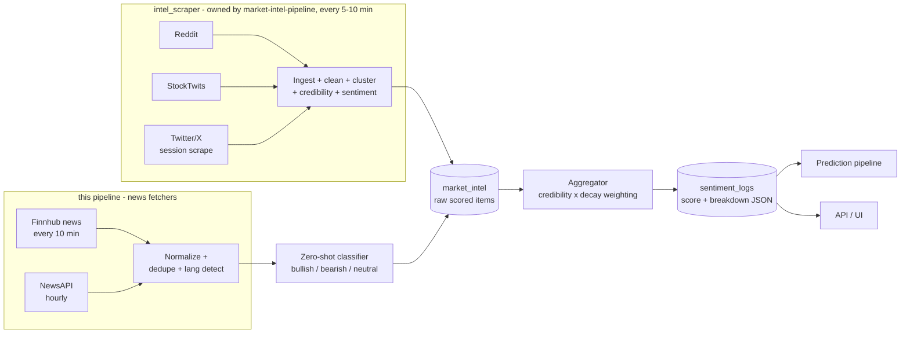

# DC Intel — Multi-Source Sentiment Pipeline (v1)

Status: v1 specification — implementation-ready
Owner: backend team
Related docs: `schema.md` (table definitions), `market-intel-pipeline.md` (raw item ingestion + credibility tracker), `prediction-model.md` (feature consumption), `backend-design.md` (response shapes)

---

## 1. Purpose and scope

This document specifies how DC Intel turns raw social posts and news articles into a single
per-stock sentiment score on a **-100 (max bearish) .. +100 (max bullish)** scale, refreshed
every 10 minutes, with per-source breakdown, credibility weighting, exponential time decay,
and explicit data-quality flags.

The pipeline output is written to the **`sentiment_logs`** table
(`aggregate_sentiment_score` + `source_breakdown_json`) and consumed by:

- the prediction pipeline (sentiment features per timeframe),
- the API/UI (sentiment gauge on the stock page, evidence bullets like
  "Positive sentiment surge (35%)"),
- the accuracy/history views (sentiment value that was live at prediction time).

Out of scope here: scraping the raw social posts — Reddit/StockTwits/X ingestion is owned
by `market-intel-pipeline.md` §3 (`intel_scraper` job group), and this pipeline registers
**no social fetchers** — and how individual market-intel posts are surfaced in the
`GET /dashboard/market-intel` feed (same doc). The two pipelines **share** the raw item
store (`market_intel` table); credibility scoring is owned by `market-intel-pipeline.md` §6
and consumed here as a per-item weight (Section 6).



---

## 2. Sources and fetch cadence

Canonical product cadence: **sentiment refresh every 10–15 minutes.** We implement that as
a 10-minute master aggregation cycle. This pipeline registers fetchers for the **news**
sources only (Finnhub, NewsAPI). The **social** sources (Reddit, StockTwits, optional
Twitter/X) are ingested by the market-intel pipeline's `intel_scrape_*` jobs (every
5–10 min — `market-intel-pipeline.md` §3, `data-sources.md` §4) into the shared
`market_intel` table; this pipeline's aggregator consumes those rows as-is. Registering a
second set of social fetchers here would double-spend the same free-tier quotas —
`data-sources.md` §8 budgets each source exactly once, and `deployment-architecture.md`
§3.1 assigns only the Finnhub/NewsAPI fetchers to the `sentiment_refresher` job group.

All limits below are commonly published free-tier figures — **verify current limits at
signup**, they change without notice.

| Source | Type | Fetched by | Cadence | Free-tier budget (verify at signup) | Notes |
|---|---|---|---|---|---|
| Reddit (official API, OAuth) | Social | `intel_scraper` (`market-intel-pipeline.md` §3) | every 5–10 min | ~100 queries/min with OAuth app | Rows arrive in `market_intel` already cleaned, ticker-mapped, clustered, sentiment-scored, and credibility-scored. Subreddit list and extraction rules are owned by the intel doc. |
| StockTwits | Social | `intel_scraper` (`market-intel-pipeline.md` §3) | every 5–10 min | ~200 req/hr unauthenticated, ~400 req/hr with token | Same as above. Posts are per-ticker and many carry user-declared Bullish/Bearish labels (used as weak labels, Section 5.4). US tickers only; no KRX coverage. |
| Twitter/X | Social | `intel_scraper` (on by default) | every 10 min | **$0 — logged-in session scraping** (no paid API), `data-sources.md` §4.1 | **v1 source (personal-use).** Best-effort: the account may be locked/suspended and the internal API breaks periodically, so this pipeline must still run correctly when X is unavailable. See Section 9.3 for graceful degradation. |
| Finnhub | News | **this pipeline** — `fetch_finnhub_news` | every 10 min | ~60 calls/min free | `company-news` endpoint per symbol. Good US coverage; KRX coverage is partial — treat as US-primary. |
| NewsAPI | News | **this pipeline** — `fetch_newsapi` | **hourly** | ~100 requests/day free; free-tier articles are delayed ~24 h | Hourly = **24 req/day** (one batched query OR-ing active company names, rotating through the list across hours) — ~76% headroom under the ~100/day cap, leaving room for the retry policy (`backend-design.md` §9.1) and ad-hoc queries. Request budget owned by `data-sources.md` §5.2/§8. Because of the 24 h delay, NewsAPI items only feed the **2d/3d/5d** timeframe windows in v1 (Section 7.2); paid tier removes the delay. |

Fetcher rules (for the news fetchers this pipeline registers):

- Each fetcher is an APScheduler job (in-process, per the canonical background-job decision).
  Jobs are independent: one source failing never blocks the others.
- Each fetcher targets the **active stock set** (Section 4.1), capped at 50 stocks/cycle to
  match the request budget in `data-sources.md` §8 (50 tracked symbols). Finnhub iterates
  the set per symbol; NewsAPI batches company names into its single hourly query.
- Every fetch records `last_success_at` and `consecutive_failures` in Redis
  (`sentiment:source_health:{source}`) — consumed by the failure-mode logic (Section 9).
  Social-source health is tracked by the intel scraper jobs (`market-intel-pipeline.md`
  §§14–15); the aggregator reads both when computing `coverage` (Section 8.1).

---

## 3. Pipeline stages overview

| Stage | Module | Cadence | Output |
|---|---|---|---|
| 0. Social ingestion (upstream) | market-intel pipeline (`market-intel-pipeline.md` §§3–7) | every 5–10 min | Cleaned, clustered, credibility- and sentiment-scored social rows in `market_intel` |
| 1. Fetch (news) | `app/sentiment/fetchers/*.py` | Finnhub 10 min; NewsAPI hourly | Raw articles in memory |
| 2. Normalize + dedupe | `app/sentiment/normalize.py` | with fetch | Clean text, language tag, cluster_id |
| 3. Classify | `app/sentiment/classify.py` | with fetch (batched) | bullish/bearish/neutral + confidence |
| 4. Persist raw items | — | with fetch | News rows in `market_intel` (credibility via the shared scorer, Section 6) |
| 5. Aggregate | `app/sentiment/aggregate.py` | every 10 min (master cycle) | One `sentiment_logs` row per active stock, over **all** eligible `market_intel` rows (news + social) |
| 6. Serve | API layer | on request | Score + flags, staleness checked at read time |

Suggested module layout:

```
app/sentiment/
    fetchers/
        base.py          # SourceFetcher protocol, health reporting
        finnhub_news.py
        newsapi.py
    normalize.py         # text cleaning, language detect, ticker extraction, dedupe
    classify.py          # zero-shot model wrapper + Redis cache
    aggregate.py         # per-stock, per-timeframe scoring; reads market_intel.credibility_score
    jobs.py              # APScheduler registration: news fetchers + aggregator only
```

There is deliberately **no** `credibility.py` and no social fetcher module here: credibility
scoring is implemented once in the market-intel pipeline (`market-intel-pipeline.md` §6) —
the news fetchers import that shared scorer when persisting rows (Section 6) — and the
Reddit/StockTwits/X fetchers live in the intel pipeline's job registry (its §14).

---

## 4. Fetch, normalization, and ticker mapping

The stages in this section apply to the items **this pipeline** ingests (news). Social
items arrive in `market_intel` already cleaned, ticker-mapped, deduped, and clustered by
the market-intel pipeline (its §§4–5); the aggregator consumes them without re-processing.

### 4.1 Active stock set

We do not scan the whole market. Each cycle the aggregator (and the symbol-targeted Finnhub
fetcher) operate on:

```
active_stocks = (stocks with >= 1 row in predictions where created_at >= now - 48h)
              UNION (current /dashboard/trending list)
LIMIT 50 (ordered by most recent prediction request first)
```

Rationale: v1 has no watchlist table (canonical decision); recently-requested predictions are
the proxy for "stocks users care about." The 50 cap matches the per-source request budget in
`data-sources.md` §8 (50 tracked symbols) and keeps Finnhub iteration well inside its free
tier.

### 4.2 Text normalization

Applied to every item before classification, in order:

1. Unicode **NFC** normalization (critical for Korean — composed jamo).
2. Convert full-width ASCII (ＡＢＣ１２３) to half-width.
3. Strip URLs from the classification text (original kept in `market_intel.url` /
   `content_snippet`); strip @-mentions; keep cashtags and hashtags (signal-bearing).
4. Collapse whitespace; truncate to 512 model tokens (classifier limit).
5. **Keep emoji** — 🚀🌕📉 carry direction signal and the multilingual transformer tokenizes
   them; do not demojize in v1.
6. Drop items whose cleaned text is < 10 characters (pure-emoji or empty posts) — too little
   evidence to classify; they are stored in `market_intel` but excluded from aggregation.

Language detection: run a lightweight detector (`pycld3` or `langdetect`) and store the tag
for analytics and template selection. Detection does **not** gate the classifier — the model
is multilingual and mixed-language posts ("삼성전자 buy the dip 가즈아") are classified
whole, untranslated (Section 5.3).

### 4.3 Ticker extraction and mapping

An item only enters a stock's aggregate if it maps to that stock:

| Pattern | Example | Mapping |
|---|---|---|
| Cashtag | `$TSLA`, `$AAPL` | symbol lookup in `stocks` (US exchanges first) |
| StockTwits symbol stream | endpoint is already per-ticker | direct |
| KRX 6-digit code | `005930` | `stocks.symbol` where exchange = KRX |
| Korean company name | `삼성전자`, `에코프로` | dictionary built nightly from `stocks` Korean names; longest-match against text |
| English company name (news) | "Samsung Electronics said…" | name dictionary, exact + common-alias match |
| Finnhub company-news | queried per symbol | direct |

One item may map to multiple stocks (an article comparing Samsung and SK Hynix) — it is
counted in each stock's aggregate independently. `market_intel.stock_id` stores the primary
match; multi-stock matches insert one row per stock (same `cluster_id`).

Items matching no known stock are stored with `stock_id = NULL` (still useful for the
market-intel feed) and skipped by the sentiment aggregator.

### 4.4 Deduplication and bot-cluster dampening

- **Exact dup:** same `url` already in `market_intel` within 7 days → skip insert.
- **Near-dup:** SHA-1 of the first 200 normalized characters; matching hash within the
  lookback window → new row gets the existing `cluster_id`. Only the **first** item of a
  cluster enters the aggregate; later copies are excluded (near-dup clusters also feed the
  coordinated-cluster detection that caps credibility at 20 — `market-intel-pipeline.md`
  §4.4/§6). This blunts copy-paste pump campaigns.

---

## 5. Classification: bullish / bearish / neutral

### 5.1 v1 model — multilingual zero-shot NLI

**Recommended model:** `MoritzLaurer/mDeBERTa-v3-base-xnli-multilingual-nli-2mil7`
(Hugging Face). mDeBERTa-v3-base (~280 M params) fine-tuned on XNLI + 2.7 M multilingual NLI
pairs; covers 100+ languages **including Korean**, and is one of the strongest open zero-shot
classifiers at its size. Used via the standard zero-shot-classification recipe (NLI
entailment scoring).

```python
from transformers import pipeline

clf = pipeline(
    "zero-shot-classification",
    model="MoritzLaurer/mDeBERTa-v3-base-xnli-multilingual-nli-2mil7",
    device=-1,  # CPU in v1
)

LABELS = ["bullish", "bearish", "neutral"]
HYPOTHESIS = "The author of this post is {} about this stock's price."

result = clf(text, LABELS, hypothesis_template=HYPOTHESIS, multi_label=False)
# result["labels"][0] = top label, result["scores"][0] = its softmaxed confidence (0..1)
```

Key implementation notes:

- **One English hypothesis template for all languages.** Cross-lingual NLI works: a Korean
  premise scored against an English hypothesis is exactly what XNLI trains for. This avoids
  maintaining per-language templates in v1. (A Korean template —
  `"이 글의 작성자는 이 주식의 주가에 대해 {}적인 입장이다."` with labels
  `["낙관(상승)", "비관(하락)", "중립"]` — is a documented A/B experiment, not required.)
- **Label semantics:** `bullish` → direction +1, `bearish` → -1, `neutral` → 0.
  Store the top label in `market_intel.sentiment` and its confidence in
  `market_intel.sentiment_confidence` (0..1).
- **Low-confidence floor:** if the top-label confidence < 0.45 (barely above the 1/3 prior),
  reclassify the item as `neutral` with that confidence. Don't let coin-flip outputs push the
  aggregate.
- **Batching:** classify in batches of 16; with int8 ONNX quantization
  (`optimum` export, ~180 MB on disk) expect roughly 5–15 items/sec on 2 vCPU — sufficient
  for a few hundred new items per 10-min cycle.
- **Cache:** Redis key `sentiment:clf:{sha1(normalized_text)}` → `{label, confidence}`,
  TTL 7 days. Reposts and cross-posted articles never hit the model twice.
- **Hosting decision (owner: free + local-first):** **v1 runs the full `mDeBERTa` model locally** — a developer machine has ample RAM, so we get the best quality at $0 (`deployment-architecture.md` §5.1). The model does NOT fit a 1 GB GCP e2-micro, so **only** the optional free-cloud demo (`deployment-architecture.md` §5.3) falls back to the smaller
  `MoritzLaurer/multilingual-MiniLMv2-L6-mnli-xnli` (~107 M params, noticeably weaker but
  runs in tight memory) via the `SENTIMENT_CLF_MODEL` env var (§11). No paid instance is adopted — local-first is the v1 target, MiniLM-on-free-cloud is the only hosted fallback.

### 5.2 Why zero-shot first

No labeled Korean+English finance dataset exists in-house at v1. Zero-shot ships day one,
handles both languages with one model, and — because every item and its label is persisted in
`market_intel` and every prediction outcome is persisted in `prediction_outcomes` — v1
operation automatically accumulates the training data the upgrade path needs.

### 5.3 Mixed-language and Korean-specific handling

- Mixed posts are classified **whole, untranslated** by the multilingual model. No sentence
  splitting, no machine translation in v1 (translation adds latency, cost, and a second
  failure mode).
- Known weakness to document and monitor: Korean retail-trading slang
  (떡상/떡락 = surge/crash, 가즈아 = let's go, 익절/손절 = take profit / cut loss,
  물렸다 = bagholding). Zero-shot NLI partially understands these from context but
  under-detects sarcasm and slang-only posts. v1 accepts this; the fine-tuned Korean model in
  the upgrade path is the fix. Keep a `docs/slang-glossary.md` watchlist so evaluation samples
  include these cases.

### 5.4 Weak labels from StockTwits

StockTwits posts often carry an author-declared **Bullish/Bearish** tag. v1 rule: if the tag
is present, use it as the label with confidence `max(0.75, model_confidence)` when model and
tag agree, and the **model's** output when they disagree (authors mislabel sarcasm). All
tag/model pairs are logged — they are free evaluation data for the classifier.

### 5.5 Upgrade path (v1.1+ — pick when zero-shot accuracy plateaus)

| Option | English | Korean | Trade-off |
|---|---|---|---|
| Fine-tuned finance models | FinBERT-style: `ProsusAI/finbert` or `yiyanghkust/finbert-tone` | `snunlp/KR-FinBert-SC` (Korean financial sentiment) | Two models to host + a router by language; best quality-per-dollar; needs label mapping positive→bullish, negative→bearish |
| Fine-tune the v1 model | One mDeBERTa fine-tune on accumulated `market_intel` labels + outcome-verified direction | same model | Single multilingual model preserved; needs ~10k+ curated labels |
| Small LLM API | Batched classification through an inexpensive hosted LLM | same call | Best slang/sarcasm handling; adds per-item cost, network latency, and an external dependency on the hot path — only with aggressive caching |

Switching models bumps the classifier version recorded in `source_breakdown_json.classifier`
so historical scores remain interpretable.

---

## 6. Credibility weighting (formula owned by `market-intel-pipeline.md` §6)

Every `market_intel` row carries **`credibility_score` — an INTEGER on 0–100**
(CHECK-constrained; `schema.md` §4.9). The formula is owned by `market-intel-pipeline.md`
§6 and implemented **once**, in the market-intel pipeline; this pipeline never
re-implements it. Social rows are scored at ingest by the intel scraper; the news fetchers
here call the same shared scorer when persisting Finnhub/NewsAPI rows. Restated for
convenience (the market-intel doc wins on any drift):

```
credibility = round( 0.30·S + 0.30·A + 0.25·C + 0.15·E )        # integer 0–100
if cluster.coordinated: credibility = min(credibility, 20)
clamp to [0, 100]
```

| Subscore | Weight | Meaning (authoritative definitions: `market-intel-pipeline.md` §6.2) |
|---|---|---|
| **S** — source reputation tier | 0.30 | Venue/account-type trust tier, T1 = 90 … T4 = 30 (config table, not code) |
| **A** — author historical claim accuracy | 0.30 | Laplace-smoothed **news-confirmation** rate: `A = 100·(confirmed + 1)/(resolved + 2)` over the author's resolved items (90-day window; new/unknown author → 50) |
| **C** — corroboration | 0.25 | Distinct `(source, author)` pairs in the item's cluster: `C = min(100, 25·(n − 1))` |
| **E** — account age + engagement | 0.15 | `50·age_part + 50·engagement_part`; `E = 25` when profile data is unavailable |

The coordinated cap (20) exists because brigaded bot clusters can farm huge engagement;
the detection rules live in `market-intel-pipeline.md` §4.4. Combined with the near-dup
clustering here (Section 4.4), this blunts copy-paste pump campaigns in the aggregate.

Notes specific to this pipeline:

- **`confirmed` means news corroboration only.** `market_intel.confirmed` is flipped by the
  confirmation matcher when a published news report corroborates the cluster
  (`market-intel-pipeline.md` §8). It does **not** track 24 h price moves, and the A
  subscore is a news-confirmation rate, not a price-direction hit rate. (An earlier draft
  of this section defined a separate 0.05–1.0 score with a price-move-based A; that
  definition is retired — this section defers to the owner doc.)
- **News items (Finnhub/NewsAPI) inserted by this pipeline** map into the same subscores:
  whitelisted major outlets (Reuters, Bloomberg, Yonhap/연합뉴스, Maeil Business/매일경제 —
  list in `config/outlets.yml`, fed into the market-intel tier config) score S as T1 (90);
  other publishers as T2 (70). Outlets expose no account profile → `E = 25`; v1 keeps no
  per-outlet track record → `A = 50` (neutral prior). C accrues normally through
  clustering. Example: a non-whitelisted publisher's article whose cluster has 3 distinct
  authors → `round(0.30·70 + 0.30·50 + 0.25·50 + 0.15·25) = 52`.
- **Two scales, one number** (`schema.md` §4.9 cross-field note): the column stores the
  0–100 integer; wherever this pipeline needs a 0–1 weight — the aggregation weight `w_i`
  (Section 7.2) and `source_breakdown_json.top_contributors[].credibility` (Section 8.1) —
  it uses the normalized twin **`credibility_score / 100`**. Same number, two scales;
  neither doc "fixes" the other.

### 6.1 Worked example (imported from `market-intel-pipeline.md` §6.3)

A post in r/stocks (T2 → S = 70). The author has 8 resolved past claims, 3 news-confirmed →
A = 100·(3+1)/(8+2) = 40. Account is 2 years old with 12,400 karma → E = 91. The cluster
has 4 distinct authors across Reddit + StockTwits → C = 25·3 = 75.

```
credibility = 0.30·70 + 0.30·40 + 0.25·75 + 0.15·91
            = 21.0 + 12.0 + 18.75 + 13.65 = 65.4 → 65
```

In this pipeline that row aggregates with weight base `65 / 100 = 0.65` (Section 7.2).

---

## 7. Aggregation: per-stock score on -100..+100

### 7.1 Item score

```
s_i = dir_i * conf_i * 100
   dir: bullish = +1, bearish = -1, neutral = 0
   conf: classifier confidence in [0, 1]
```

A confident bullish post is +91; a hesitant bearish one is -52; neutral items are 0 — but
neutral items **stay in the weighted denominator and the volume count**: a wall of credible
neutral chatter correctly drags the aggregate toward 0 rather than letting two stray bullish
posts read as a surge.

### 7.2 Weighted average with exponential time decay

For each stock and each of the six timeframes:

```
            Σ  w_i * s_i
S(tf)  =   ───────────────          w_i = (credibility_score_i / 100) * 0.5^(age_i_hours / half_life_tf)
            Σ  w_i

items: all aggregation-eligible market_intel rows for the stock with
       posted_at >= now - lookback_tf
```

(`credibility_score` is the stored 0–100 integer — Section 6; the `/100` normalization is
the `schema.md` §4.9 cross-field convention.)

| Timeframe | Decay half-life | Lookback window | Min items N (volume guard) |
|---|---|---|---|
| 1h | 30 min | 2 h | 5 |
| 5h | 2 h | 8 h | 8 |
| 24h | 6 h | 24 h | 10 |
| 2d | 12 h | 48 h | 12 |
| 3d | 18 h | 72 h | 12 |
| 5d | 24 h | 120 h | 15 |

Rationale: half-life ≈ half the prediction horizon (capped at 24 h — week-old chatter decays
fast regardless of horizon), lookback ≈ 4× half-life (beyond that, weight < 6% — not worth
querying). **The prediction pipeline must use these exact half-lives when reading sentiment
features; they are a cross-document contract.**

NewsAPI free-tier articles arrive ~24 h late (Section 2); they therefore only ever land
inside the 2d/3d/5d lookback windows — expected, not a bug.

- **Headline score:** `sentiment_logs.aggregate_sentiment_score` = the **24h** timeframe
  score, rounded to one decimal. This is what the UI gauge shows. All six per-timeframe
  scores are stored in `source_breakdown_json.timeframe_scores`.
- **Minimum-volume guard:** if a timeframe's eligible item count < N, its score is still
  computed and stored, but the timeframe is flagged `low_confidence: true`. UI renders the
  gauge in **gray** with copy like "데이터가 부족해요 / Not enough chatter to be confident",
  and the prediction pipeline down-weights or drops the sentiment feature for that timeframe
  (its call — but it MUST read the flag).
- If item count = 0 for a timeframe, store `score: null` for it.

### 7.3 Worked example — 005930:KRX (Samsung Electronics), 24h timeframe

Half-life 6 h, lookback 24 h. Six eligible items. The `score` column is the stored
`market_intel.credibility_score` (0–100 integer, computed per Section 6); `cred` is its
normalized twin `score / 100` (`schema.md` §4.9):

| # | Item | score | cred = score/100 | Label (conf) | s_i | Age | decay = 0.5^(age/6h) | w_i = cred·decay | w_i · s_i |
|---|---|---|---|---|---|---|---|---|---|
| 1 | Reuters article (Finnhub) | 70 | 0.70 | bullish (0.91) | +91 | 1 h | 0.891 | 0.624 | +56.8 |
| 2 | Reddit established user | 55 | 0.55 | bearish (0.74) | -74 | 3 h | 0.707 | 0.390 | -28.8 |
| 3 | StockTwits known trader | 66 | 0.66 | bullish (0.66) | +66 | 0.5 h | 0.944 | 0.619 | +40.9 |
| 4 | StockTwits new account | 29 | 0.29 | bullish (0.88) | +88 | 5 h | 0.561 | 0.165 | +14.5 |
| 5 | NewsAPI article | 70 | 0.70 | neutral (0.80) | 0 | 6 h | 0.500 | 0.350 | 0.0 |
| 6 | Reddit copy-paste cluster (coordinated → capped at 20) | 15 | 0.15 | bearish (0.95) | -95 | 1 h | 0.891 | 0.134 | -12.7 |

```
S(24h) = (56.8 - 28.8 + 40.9 + 14.5 + 0 - 12.7) / (0.624 + 0.390 + 0.619 + 0.165 + 0.350 + 0.134)
       = 70.6 / 2.281
       = +31.0     → mildly bullish
```

Item count = 6 < N(24h) = 10 → `low_confidence: true` for the 24h timeframe. The UI shows a
gray "not enough data" gauge even though the number leans bullish, and the worked JSON below
reflects exactly this state. Note what the weighting did: the coordinated cluster's
near-certain bearish scream moved the score by barely 5 points, while the Reuters article
and the known trader carried it.

---

## 8. Output contract — `sentiment_logs`

One row per active stock per 10-minute aggregation cycle.

| Column | Value written by this pipeline |
|---|---|
| `stock_id` | FK to `stocks` |
| `aggregate_sentiment_score` | REAL, -100..+100 — the 24h-timeframe headline score (null if zero items in 24 h window) |
| `source_breakdown_json` | TEXT (JSON) — full shape below, `schema_version: 1` |
| `created_at` | aggregation timestamp (UTC ISO-8601) |

(Exact DDL lives in `schema.md`; raw per-item rows live in `market_intel`, never in
`sentiment_logs` — the log row is a pure aggregate plus the breakdown JSON.)

### 8.1 `source_breakdown_json` shape (schema_version 1)

```json
{
  "schema_version": 1,
  "computed_at": "2026-06-12T05:40:00Z",
  "classifier": "mdeberta-v3-xnli@zero-shot-v1",
  "timeframe_scores": {
    "1h":  { "score": 38.2,  "item_count": 3,  "low_confidence": true  },
    "5h":  { "score": 33.5,  "item_count": 5,  "low_confidence": true  },
    "24h": { "score": 31.0,  "item_count": 6,  "low_confidence": true  },
    "2d":  { "score": 18.4,  "item_count": 14, "low_confidence": false },
    "3d":  { "score": 12.1,  "item_count": 19, "low_confidence": false },
    "5d":  { "score": 9.7,   "item_count": 27, "low_confidence": false }
  },
  "item_counts_by_source": {
    "reddit": 9, "stocktwits": 11, "twitter": 6, "finnhub": 5, "newsapi": 2
  },
  "coverage": {
    "twitter_enabled": true,
    "sources_ok": ["reddit", "stocktwits", "twitter", "finnhub", "newsapi"],
    "sources_down": [],
    "reduced_coverage": false
  },
  "top_contributors": [
    {
      "market_intel_id": 48211,
      "source": "finnhub",
      "author_handle": "reuters.com",
      "url": "https://www.reuters.com/technology/samsung-...",
      "sentiment": "bullish",
      "sentiment_confidence": 0.91,
      "item_score": 91,
      "credibility": 0.70,
      "weight": 0.624,
      "posted_at": "2026-06-12T04:38:00Z"
    },
    {
      "market_intel_id": 48196,
      "source": "stocktwits",
      "author_handle": "KimTrader_kr",
      "url": "https://stocktwits.com/KimTrader_kr/message/...",
      "sentiment": "bullish",
      "sentiment_confidence": 0.66,
      "item_score": 66,
      "credibility": 0.66,
      "weight": 0.619,
      "posted_at": "2026-06-12T05:10:00Z"
    },
    {
      "market_intel_id": 48150,
      "source": "reddit",
      "author_handle": "u/value_hunter88",
      "url": "https://reddit.com/r/stocks/comments/...",
      "sentiment": "bearish",
      "sentiment_confidence": 0.74,
      "item_score": -74,
      "credibility": 0.55,
      "weight": 0.390,
      "posted_at": "2026-06-12T02:41:00Z"
    }
  ]
}
```

Rules:

- `top_contributors` = up to 5 items, ranked by `weight` over the **24h** window. These power
  the UI's "why is sentiment bullish?" drill-down and the evidence bullets — the API layer
  turns the top item into plain language ("주요 뉴스가 긍정적이에요 / Major news is positive").
- `content_snippet` is intentionally NOT duplicated here — the UI fetches it from
  `market_intel` by `market_intel_id` (avoids bloating every log row).
- `top_contributors[].credibility` is the **normalized** value `credibility_score / 100`
  (0–1); the `market_intel` column itself is the 0–100 integer (`schema.md` §4.9
  cross-field note).
- Per-timeframe `score` is `null` when `item_count` = 0.
- Consumers must tolerate unknown extra keys (forward compatibility) and must check
  `schema_version`.

### 8.2 Read-time contract (API layer)

`GET /stocks/{symbol}:{exchange}/predict?timeframe=` and the stock detail view read the
**latest** `sentiment_logs` row for the stock and must apply:

```
stale = (now - created_at) > 30 minutes
```

- `stale: true` → the API response carries the staleness flag and the UI shows the gauge in
  **gray** with "감정 데이터가 오래됐어요 (마지막 업데이트 N분 전) / Sentiment data is stale
  (last updated N min ago)". **Never silently present a stale number as current.**
- The prediction pipeline must treat stale sentiment as a **missing feature** (use its
  trained missing-value handling), not as a fresh observation.
- `low_confidence` (per requested timeframe) and `coverage.reduced_coverage` propagate to the
  API response the same way.

---

## 9. Failure modes and graceful degradation

### 9.1 Source health state machine

Redis key `sentiment:source_health:{source}`:

```
{ consecutive_failures: int, last_success_at: iso8601, status: "ok" | "down" }
```

A source is **down** when `consecutive_failures >= 3` OR
`now - last_success_at > 2 × its fetch cadence`. A single 429 is a back-off
(exponential: 1 min, 4 min, 15 min, then mark down), not an instant outage.

News sources (Finnhub/NewsAPI) report health here directly. For the social sources, the
equivalent health state is owned by the intel scraper jobs (`market-intel-pipeline.md`
§§14–15); the aggregator reads both when computing `coverage` (Section 8.1).

### 9.2 Source down → reweight and flag

- The aggregation formula is a weighted mean, so dropping a source **renormalizes
  automatically** — remaining sources' relative weights are preserved, no manual reweighting
  math needed.
- The aggregator sets `coverage.sources_down = [...]` and `coverage.reduced_coverage = true`
  whenever any *enabled* source is down. UI shows a small badge:
  "일부 데이터 소스가 일시적으로 누락됐어요 / Some data sources are temporarily unavailable."
- If **all social** sources are down (news-only sentiment) or **all news** sources are down
  (social-only), additionally force `low_confidence: true` on the 1h and 5h timeframes —
  short-horizon sentiment without social chatter (or without any editorial signal) is too
  one-eyed to trust at normal confidence.
- If **every** source is down, no new `sentiment_logs` row is written; the staleness rule
  (Section 8.2) takes over within 30 minutes and the UI degrades honestly. Log at ERROR and
  alert (see ops runbook).

### 9.3 Twitter/X (v1 source, but treat it as fragile)

`TWITTER_ENABLED=true` is the v1 default: X is collected for free by the intel pipeline's
logged-in **session scraper** (`market-intel-pipeline.md` §3.1, `data-sources.md` §4.1). This
pipeline still registers **no** Twitter fetcher of its own — it only consumes the `twitter`
rows the intel scraper writes to `market_intel`, and reports them. Two states to handle:

- **Disabled** (`TWITTER_ENABLED=false`, or cookies absent → the scraper self-disables): the X
  job is simply not registered (not "registered but failing"). `coverage.twitter_enabled: false`
  is recorded and Twitter never appears in `sources_down` — off-by-config is **not** an outage
  and must not trigger `reduced_coverage`.
- **Enabled but blocked** (account locked/challenged, or the internal API changed): this **is**
  an outage — the source's circuit breaker opens, `twitter` lands in `sources_down`, and
  `reduced_coverage` is set like any other source failure. Because X is a best-effort source,
  this is expected to happen periodically and must never degrade the rest of the pipeline.
- Min-volume thresholds N (Section 7.2) were calibrated for the non-Twitter source set; with X
  on, leave N unchanged for 30 days, then revisit with observed volume so a flaky X feed doesn't
  distort the low-confidence guard.

### 9.4 Other known failure modes

| Failure | Detection | Behavior |
|---|---|---|
| Classifier OOM / model crash | classify() raises | Items persist to `market_intel` with `sentiment = NULL`; aggregator skips unscored items; if > 50% of window items are unscored, force `low_confidence` on all timeframes; alert |
| Redis down | connection error | Classifier runs uncached (slower, correct); aggregation weighting unaffected — `credibility_score` is persisted per row in SQLite; log WARN |
| Rate limit hit mid-cycle | 429 | Process the partial batch fetched so far; back off per 9.1; partial coverage flagged only if the source then goes down |
| Clock skew on `posted_at` | item timestamp in the future | clamp `age = max(age, 0)`; items "from the future" by > 10 min are dropped and logged |
| Brigading / pump campaign | near-dup clusters, coordinated flag | dampened by cluster dedupe (4.4) + the coordinated credibility cap of 20 (`market-intel-pipeline.md` §4.4/§6) — by design, not an alert in v1 |

---

## 10. Scheduling summary (APScheduler, in-process)

Jobs registered by **this** pipeline:

| Job id | Cadence | What |
|---|---|---|
| `fetch_finnhub_news` | */10 min | fetch → normalize → classify → persist news rows into `market_intel` |
| `fetch_newsapi` | hourly | same (24 req/day — ~76% headroom under the ~100/day free cap; budget owned by `data-sources.md` §5.2/§8) |
| `aggregate_sentiment` | */10 min, offset +2 min | per active stock: compute 6 timeframe scores over all eligible `market_intel` rows (news from this pipeline + social ingested upstream), write `sentiment_logs` row |

**Not registered here:**

- Social fetch jobs — `intel_scrape_reddit`, `intel_scrape_stocktwits`, and the optional
  `intel_scrape_x` — belong to the market-intel pipeline (`market-intel-pipeline.md` §14).
  Registering duplicates would double-spend the shared free-tier budgets that
  `data-sources.md` §8 counts exactly once per source (e.g., a second per-symbol StockTwits
  sweep would alone exceed the ~400 req/hr authenticated tier).
- Credibility upkeep — the daily `intel_author_stats` job that recomputes author-accuracy
  caches — is likewise owned by the market-intel pipeline (its §6.2/§14). This pipeline
  registers no credibility-refresh jobs.

The +2 min offset lets the 10-minute Finnhub fetch land before aggregation reads; the
5-minute intel scrape jobs land continuously. Jobs use `max_instances=1, coalesce=True` so
a slow cycle never stacks.

---

## 11. Configuration reference

| Env var | Default | Meaning |
|---|---|---|
| `TWITTER_ENABLED` | `true` | Platform-wide Twitter/X toggle (v1 default on, via logged-in session scraping — `data-sources.md` §4.1). The X scraper job is owned by the market-intel pipeline (`market-intel-pipeline.md` §3.1) and self-disables if session cookies are missing; here this flag only drives `coverage.twitter_enabled` reporting (Section 9.3) |
| `SENTIMENT_ACTIVE_STOCK_CAP` | `50` | Max stocks per cycle — matches the 50-symbol request budget in `data-sources.md` §8 |
| `SENTIMENT_STALE_AFTER_MIN` | `30` | Read-time staleness threshold |
| `SENTIMENT_CLF_MODEL` | `MoritzLaurer/mDeBERTa-v3-base-xnli-multilingual-nli-2mil7` | HF model id |
| `SENTIMENT_CLF_MIN_CONF` | `0.45` | Below this, label → neutral |
| `SENTIMENT_MIN_TEXT_LEN` | `10` | Skip shorter items |
| `OUTLET_WHITELIST_PATH` | `config/outlets.yml` | Tier-1 publisher list — maps news outlets into the market-intel S-tier config (Section 6) |
| `KNOWN_TRADER_LIST_PATH` | `config/known_traders.yml` | Curated verified/known-trader accounts — maps individual social accounts into the market-intel S-tier config (Section 6; the "known trader" tier used in the §7.3 worked example). Shared with the market-intel pipeline; seeding/maintenance owner is an open question. |

Half-lives, lookbacks, and min-volume N are code constants (Section 7.2 table) — they are a
contract with the prediction pipeline and must not drift via env config.
