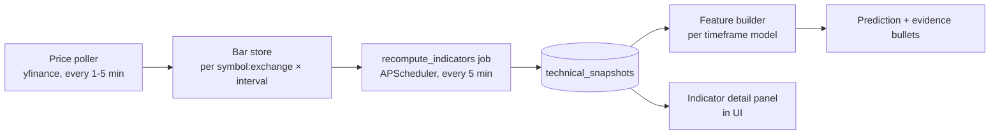

# DC Intel — Technical Indicators Specification (v1)

This document defines every technical indicator DC Intel computes, with exact formulas, parameters, bar sizes, lookback windows, signal rules, and the plain-language copy each signal produces in the UI. It is the single source of truth for the indicator layer. An engineer should be able to implement `indicators.py` from this document alone.

Related docs: `schema.md` (table definitions, including `technical_snapshots`), `prediction-model.md` (how features feed the six per-timeframe models), `data-sources.md` (yfinance fetch details and fallbacks), `backend-design.md` (endpoint contracts).

---

## 1. Scope and design principles

- **Four indicator families in v1:** RSI(14), EMA(5/20/50/200), MACD(12/26/9), Bollinger Bands(20, 2σ) — **plus one volume feature,** the 20-bar volume z-score `vol_z20` (Section 7A), which the model feature contract (`prediction-model.md` §4.2, group `volume`) sources from `technical_snapshots`. Nothing else. Additions (Stochastic, OBV, ATR) are v1.1 candidates.
- **One indicator codebase, four bar intervals.** The same formulas run on 5-minute, 15-minute, 1-hour, and daily bars. The prediction timeframe determines which bar interval feeds it (Section 3).
- **Indicators are computed on trading bars only.** No pre-market, no after-hours, no synthetic gap-filling bars (Sections 8–9).
- **Every numeric output maps to a deterministic signal state, and every signal state maps to fixed plain-language copy** (Sections 4–7, 7A, 12–13). The ML model consumes the numeric values; the explainability layer consumes the signal states and copy templates.
- **Update cadence:** indicators recompute every 5 minutes (canonical cadence) for every stock with an active prediction or a request in the last 24h, via the APScheduler job `recompute_indicators`. Results are written to `technical_snapshots`.

---

## 2. Conventions used throughout

| Term | Definition |
|---|---|
| Bar | One OHLCV candle: `open, high, low, close, volume` plus its interval-start timestamp. |
| Close | All formulas use the bar **close** price unless stated otherwise. |
| `t` | Index of the most recent **completed** bar. The currently-forming bar is never used. |
| Period `N` | Number of bars, not calendar time. RSI(14) on daily bars = 14 trading days; on 5-min bars = 70 minutes of trading. |
| Timestamps | Stored in UTC. Session boundaries evaluated in exchange-local time (KST for KRX, America/New_York for NYSE/NASDAQ — ET observes DST; KST does not). |
| Data source | Yahoo Finance via `yfinance` with `prepost=False`. Unofficial API — see `data-sources.md` for stability risk and fallback. |
| Rounding | Indicator values stored at full float precision; UI displays RSI/%B/bandwidth to 1 decimal, prices to the symbol's native tick precision. |

**Seed convention (applies to every smoothed indicator):** the first value is seeded with a simple average of the first `N` bars, then the recursive formula takes over. A smoothed indicator is treated as **converged** (safe to use in features and UI) once at least `3 × N` bars have elapsed since the start of the series; before that, the value is computed but flagged `warming_up` and excluded from evidence bullets.

---

## 3. Candle interval per prediction timeframe and raw-data lookback

One model per timeframe (canonical: 1h, 5h, 24h, 2d, 3d, 5d). Each model's features are computed from exactly one bar interval:

| Prediction timeframe | Bar interval | Why | Bars per trading day (KRX / US) |
|---|---|---|---|
| 1h | **5-min bars** | 12 bars span the prediction window; enough resolution for short momentum | 78 / 78 |
| 5h | **15-min bars** | 20 bars span the window | 26 / 26 |
| 24h | **1-hour bars** | Window crosses a session boundary; hourly is the finest interval with deep history | 7 / 7 |
| 2d | **Daily bars** | Multi-day direction is a daily-bar question | 1 / 1 |
| 3d | **Daily bars** | shares the daily snapshot with 2d | 1 / 1 |
| 5d | **Daily bars** | shares the daily snapshot with 2d/3d | 1 / 1 |

KRX bars/day: 09:00–15:30 KST = 390 min = 78 five-min / 26 fifteen-min / 7 hourly bars (the last hourly bar covers 15:00–15:30 and is a half-bar; it is kept as-is). US bars/day: 09:30–16:00 ET = 390 min, same counts.

### 3.1 Raw-data lookback (longest constraint: EMA200)

EMA200 needs 200 bars to seed and ~`3 × 200 = 600` bars to converge (Section 2). That sets the fetch window per interval:

| Bar interval | Min bars (hard floor) | Recommended fetch (converged EMA200) | ≈ Trading days | ≈ Calendar fetch window | yfinance interval limit (verify current limits at signup) |
|---|---|---|---|---|---|
| 5-min | 220 | 780 bars | 10 | 14 calendar days | `5m` history limited to last ~60 days |
| 15-min | 220 | 650 bars | 25 | 35 calendar days | `15m` limited to last ~60 days |
| 1-hour | 220 | 630 bars | 90 | 130 calendar days | `1h`/`60m` limited to last ~730 days |
| Daily | 220 | 756 bars | 756 | 3 years | `1d` effectively unlimited |

Rules:

- If available bars `< 200`: EMA200 is `NULL`, flag `ema_200_available = false`, EMA200 features dropped for that stock (common for recent IPOs). All other indicators still compute if their own minimums are met (RSI needs 15 bars, EMA5 needs 5, MACD needs 35, Bollinger needs 20).
- If `200 ≤ bars < 600`: EMA200 computed but flagged `warming_up`; usable as a model feature (the model was trained with the same flag) but **never** cited in an evidence bullet.
- Fetch windows above include weekend/holiday slack; the fetcher requests by calendar range and keeps whatever trading bars come back.

---

## 4. RSI — Relative Strength Index (Wilder, period 14)

### 4.1 Formula

For each bar `t` with close `C_t`:

```
delta_t = C_t − C_{t−1}
gain_t  = max(delta_t, 0)
loss_t  = max(−delta_t, 0)        # loss is a positive number
```

**Seed (first value, at bar 14 counting deltas):**

```
AvgGain_14 = mean(gain_1 … gain_14)
AvgLoss_14 = mean(loss_1 … loss_14)
```

**Wilder's smoothing (every subsequent bar):**

```
AvgGain_t = (AvgGain_{t−1} × 13 + gain_t) / 14
AvgLoss_t = (AvgLoss_{t−1} × 13 + loss_t) / 14
```

**RSI:**

```
RS_t  = AvgGain_t / AvgLoss_t
RSI_t = 100 − 100 / (1 + RS_t)
```

Edge cases: if `AvgLoss_t = 0` → `RSI = 100`. If `AvgGain_t = 0` → `RSI = 0`. If both are 0 (14 flat bars, e.g., a halted stock) → `RSI = 50` and flag `stale_price`.

> Note: Wilder's smoothing is an EMA with `α = 1/14`, **not** `2/15`. Do not reuse the EMA helper with the wrong α — this is the most common RSI implementation bug. `pandas` equivalent: `series.ewm(alpha=1/14, adjust=False).mean()` applied to gains and losses after seeding.

### 4.2 Worked example (15 closes)

Closes: `100, 101, 102, 101, 103, 104, 103, 105, 106, 105, 107, 108, 107, 109, 110`

- 14 deltas: `+1, +1, −1, +2, +1, −1, +2, +1, −1, +2, +1, −1, +2, +1`
- Sum of gains = 14 → `AvgGain = 1.000`; sum of losses = 4 → `AvgLoss = 0.2857`
- `RS = 1.000 / 0.2857 = 3.50` → `RSI = 100 − 100/4.50 = 77.8` → **overbought**

Next bar closes at 109 (`delta = −1`):

- `AvgGain = (1.000×13 + 0)/14 = 0.9286`; `AvgLoss = (0.2857×13 + 1)/14 = 0.3367`
- `RS = 2.758` → `RSI = 73.4` — still overbought; one down bar barely dents Wilder's smoothing. This stickiness is intentional.

### 4.3 Signal states and thresholds (identical for all six timeframes)

| `rsi_state` | Condition | Direction |
|---|---|---|
| `overbought` | RSI ≥ 70 | Bearish (mean-reversion risk) |
| `bullish` | 60 ≤ RSI < 70 | Bullish (strong but not stretched) |
| `neutral` | 40 ≤ RSI < 60 | Neutral |
| `bearish` | 30 < RSI ≤ 40 | Bearish |
| `oversold` | RSI ≤ 30 | Bullish (bounce candidate) |

Thresholds 70/30 are canonical and identical across timeframes — the bar interval already adapts the indicator's horizon, so per-timeframe threshold tuning is deliberately out of scope for v1.

### 4.4 Interpretation text generation

The copy generator is a pure function `rsi_copy(rsi_value, rsi_state, lang) -> str`. It interpolates the live value and the threshold it crossed:

| State | English template | Korean template |
|---|---|---|
| `overbought` | `RSI overbought ({value}/70) → pullback risk` | `RSI 과매수 ({value}/70) → 하락 전환 주의` |
| `bullish` | `RSI strong ({value}) → buyers in control` | `RSI 강세 ({value}) → 매수세 우위` |
| `neutral` | `RSI neutral ({value}) → no clear pressure` | `RSI 중립 ({value}) → 뚜렷한 방향 없음` |
| `bearish` | `RSI weak ({value}) → sellers in control` | `RSI 약세 ({value}) → 매도세 우위` |
| `oversold` | `RSI oversold ({value}/30) → bounce possible` | `RSI 과매도 ({value}/30) → 반등 가능` |

`{value}` is RSI rounded to the nearest integer. When the explainability layer selects RSI as an evidence bullet, the contribution percentage is appended per the canonical format, e.g. **`RSI overbought (74/70) → pullback risk (40%)`**. No financial jargon beyond "RSI" itself, which is always shown with the plain-language consequence.

---

## 5. EMA — Exponential Moving Average (periods 5, 20, 50, 200)

### 5.1 Formula

Smoothing factor for period `N`:

```
α = 2 / (N + 1)
```

| Period | α |
|---|---|
| 5 | 0.333333 |
| 20 | 0.095238 |
| 50 | 0.039216 |
| 200 | 0.009950 |

**Seed:** `EMA_N` at the N-th bar = SMA of the first N closes.
**Recursive step:**

```
EMA_t = α × C_t + (1 − α) × EMA_{t−1}
```

`pandas`: seed manually, then `ewm(span=N, adjust=False)`. Convergence rule from Section 2 applies (flag `warming_up` until `3 × N` bars).

### 5.2 Worked example (EMA5)

Closes: `10, 11, 12, 11, 13, 14, 13`

- Seed at bar 5: `SMA5 = (10+11+12+11+13)/5 = 11.40`
- Bar 6 (close 14): `EMA = 0.3333×14 + 0.6667×11.40 = 12.27`
- Bar 7 (close 13): `EMA = 0.3333×13 + 0.6667×12.27 = 12.51`

### 5.3 Crossover signals

A crossover fires when the sign of `(EMA_fast − EMA_slow)` changes between bar `t−1` and bar `t`. Two pairs are tracked:

| Pair | Name | Meaning |
|---|---|---|
| EMA5 × EMA20 | **Short-term momentum cross** | Fast money turning. Primary EMA signal for 1h/5h/24h. |
| EMA50 × EMA200 | **Golden cross** (up) / **Death cross** (down) | Long-term regime change. The names "golden/death cross" are used in copy **only on daily bars** (2d/3d/5d). On intraday bars the same event is labeled a "trend shift" — calling a 5-min EMA50×200 cross a golden cross would mislead beginners. |

Derived features per pair:

```
cross_dir          ∈ {+1 (fast crossed above), −1 (fast crossed below), 0 (no cross ever in window)}
bars_since_cross   = bars elapsed since the most recent cross, capped at 20
recent_cross       = (bars_since_cross ≤ 3)        # only recent crosses become evidence bullets
```

Additional trend features (no cross needed):

```
price_vs_ema20_pct  = (C_t − EMA20_t) / EMA20_t × 100
price_vs_ema50_pct  = (C_t − EMA50_t) / EMA50_t × 100
price_vs_ema200_pct = (C_t − EMA200_t) / EMA200_t × 100
ema_stack_bullish   = (EMA5 > EMA20 > EMA50 > EMA200)   # boolean, fully ordered uptrend
ema_stack_bearish   = (EMA5 < EMA20 < EMA50 < EMA200)
```

### 5.4 EMA copy templates

| Signal | English | Korean |
|---|---|---|
| EMA5 crossed above EMA20 (≤3 bars ago) | `Short-term momentum turned up (5/20 cross) → upward push` | `단기 흐름 상승 전환 (5/20 골든) → 상승 압력` |
| EMA5 crossed below EMA20 | `Short-term momentum turned down (5/20 cross) → downward push` | `단기 흐름 하락 전환 (5/20 데드) → 하락 압력` |
| Golden cross (daily bars only) | `Golden cross (50/200) → long-term trend turning up` | `골든 크로스 (50/200) → 장기 추세 상승 전환` |
| Death cross (daily bars only) | `Death cross (50/200) → long-term trend turning down` | `데드 크로스 (50/200) → 장기 추세 하락 전환` |
| EMA50×200 up-cross on intraday bars | `Trend shift up on short charts → strengthening` | `단기 차트 추세 상승 전환 → 강세 강화` |
| Price > EMA20 by ≥1% with bullish stack | `Price riding above its averages → uptrend intact` | `이동평균선 위 주행 → 상승 추세 유지` |
| Price < EMA20 by ≥1% with bearish stack | `Price sinking below its averages → downtrend intact` | `이동평균선 아래 주행 → 하락 추세 유지` |

Evidence-bullet form appends contribution: **`EMA crossover (25%)`** is the short canonical phrase when space is tight (matches the canonical explainability example); the longer template above is used in the indicator detail panel.

---

## 6. MACD — Moving Average Convergence Divergence (12 / 26 / 9)

### 6.1 Formula

```
MACD_t      = EMA12(C)_t − EMA26(C)_t          # "MACD line"
Signal_t    = EMA9(MACD)_t                      # EMA of the MACD line itself
Histogram_t = MACD_t − Signal_t
```

All three EMAs use the standard `α = 2/(N+1)` and SMA seeding from Section 5. Minimum bars: 26 (seed EMA26) + 9 (seed signal) = **35 bars**; converged after ~105 bars.

### 6.2 Worked example

Suppose at bar `t`: `EMA12 = 105.20`, `EMA26 = 103.80`, previous `Signal_{t−1} = 1.10`.

- `MACD_t = 105.20 − 103.80 = 1.40`
- `Signal_t = (2/10) × 1.40 + (8/10) × 1.10 = 0.28 + 0.88 = 1.16`
- `Histogram_t = 1.40 − 1.16 = +0.24` → MACD above signal and histogram positive → bullish momentum.

### 6.3 Signal states

| Event / state | Condition | Direction |
|---|---|---|
| `bullish_cross` | MACD crossed above Signal within last 3 bars | Bullish |
| `bearish_cross` | MACD crossed below Signal within last 3 bars | Bearish |
| `zero_cross_up` | MACD line crossed above 0 within last 3 bars | Bullish (trend confirmation) |
| `zero_cross_down` | MACD line crossed below 0 within last 3 bars | Bearish |
| `momentum_building` | No recent cross; `Histogram_t > 0` and rising for ≥3 consecutive bars | Bullish |
| `momentum_fading` | No recent cross; `|Histogram|` shrinking for ≥3 consecutive bars | Direction-weakening (counts against the prevailing side) |
| `neutral` | none of the above | Neutral |

Priority when several apply: signal-line cross > zero cross > histogram state. Features fed to the model: `macd_line, macd_signal, macd_histogram, macd_hist_delta (Histogram_t − Histogram_{t−1}), macd_cross_dir, bars_since_macd_cross` — the raw MACD line is price-scale dependent, so the model also receives `macd_line / C_t × 100` (normalized); see `prediction-model.md`.

### 6.4 MACD copy templates

| State | English | Korean |
|---|---|---|
| `bullish_cross` | `Momentum flipped up (MACD cross) → buyers stepping in` | `모멘텀 상승 전환 (MACD 교차) → 매수세 유입` |
| `bearish_cross` | `Momentum flipped down (MACD cross) → sellers stepping in` | `모멘텀 하락 전환 (MACD 교차) → 매도세 유입` |
| `zero_cross_up` | `Momentum turned positive → uptrend confirmed` | `모멘텀 플러스 전환 → 상승 추세 확인` |
| `zero_cross_down` | `Momentum turned negative → downtrend confirmed` | `모멘텀 마이너스 전환 → 하락 추세 확인` |
| `momentum_building` | `Upward momentum building → trend strengthening` | `상승 모멘텀 확대 → 추세 강화` |
| `momentum_fading` | `Momentum fading → current trend losing steam` | `모멘텀 약화 → 현재 추세 둔화` |

---

## 7. Bollinger Bands (20-period SMA ± 2 standard deviations)

### 7.1 Formula

```
Middle_t = SMA20(C)_t = mean(C_{t−19} … C_t)
σ_t      = population stddev of (C_{t−19} … C_t)      # ddof = 0, the TA convention (matches TA-Lib)
Upper_t  = Middle_t + 2 × σ_t
Lower_t  = Middle_t − 2 × σ_t

%B_t        = (C_t − Lower_t) / (Upper_t − Lower_t)    # 0 = at lower band, 1 = at upper band
Bandwidth_t = (Upper_t − Lower_t) / Middle_t           # relative band width
```

Edge case: if `σ_t = 0` (20 identical closes) → `%B = 0.5`, `Bandwidth = 0`, flag `stale_price`. Use `ddof=0` explicitly — `pandas .std()` defaults to `ddof=1` and will not match TA references.

### 7.2 Worked example

20 closes oscillating around 50 with `σ = 1.2`, current close `52.6`:

- `Middle = 50.0`, `Upper = 50 + 2.4 = 52.4`, `Lower = 47.6`
- `%B = (52.6 − 47.6) / (52.4 − 47.6) = 5.0 / 4.8 = 1.04` → close **outside** the upper band → upside breakout state.

### 7.3 Squeeze and breakout signals

| State | Condition | Direction |
|---|---|---|
| `squeeze` | `Bandwidth_t` is the **lowest value in the trailing 120 bars** | Neutral by itself — flags imminent volatility; direction comes from the breakout |
| `breakout_up` | `C_t > Upper_t` (i.e., `%B > 1`), and bar `t−1` closed inside the bands | Bullish — strongest when it ends a squeeze |
| `breakout_down` | `C_t < Lower_t` (`%B < 0`), and bar `t−1` closed inside | Bearish |
| `riding_upper` | `%B ≥ 0.95` for ≥3 consecutive bars (no fresh breakout) | Bullish trend persistence (NOT automatically overbought — do not generate reversal copy from this state alone) |
| `riding_lower` | `%B ≤ 0.05` for ≥3 consecutive bars | Bearish trend persistence |
| `inside` | none of the above | Neutral |

The 120-bar squeeze window requires ≥140 bars of history; with less, `squeeze` is undefined (`NULL`) and excluded.

### 7.4 Bollinger copy templates

| State | English | Korean |
|---|---|---|
| `squeeze` | `Price range tightening → big move brewing (direction unclear)` | `가격 변동폭 축소 → 큰 움직임 임박 (방향 미정)` |
| `breakout_up` | `Price broke above its normal range → upside breakout` | `평소 범위 위로 돌파 → 상승 돌파` |
| `breakout_down` | `Price broke below its normal range → downside break` | `평소 범위 아래로 이탈 → 하락 이탈` |
| `riding_upper` | `Price hugging the top of its range → strong demand` | `범위 상단 유지 → 강한 매수세` |
| `riding_lower` | `Price hugging the bottom of its range → strong selling` | `범위 하단 유지 → 강한 매도세` |
| `squeeze` + `breakout_up` same bar | `Tight range broke upward → sharp rise often follows` | `좁은 범위 상향 돌파 → 급등 가능성` |

---

## 7A. Volume z-score — `vol_z20` (supplementary model feature)

Not a fifth indicator family: `vol_z20` is a single normalized volume feature that the model feature contract (`prediction-model.md` §4.2, feature group `volume`) requires from `technical_snapshots` on the same 5-minute cadence as everything else. The indicator layer is its producer; this section is its spec. Full volume indicators (OBV, VWAP) remain v1.1 candidates (Section 14).

### 7A.1 Formula

```
VolMean_t = mean(V_{t−19} … V_t)                      # 20-bar simple mean, completed bars only
VolStd_t  = population stddev of (V_{t−19} … V_t)     # ddof = 0, same convention as Bollinger σ
vol_z20_t = clip((V_t − VolMean_t) / VolStd_t, −3, +6)
```

- `V_t` is the volume of the most recent **completed** bar of the interval mapped to the prediction timeframe (Section 3) — the same bar series as every other indicator: regular-session bars only, no gap filling.
- The clip to `[−3, +6]` is part of the model contract (`prediction-model.md` §4.2) and is applied **before** the value is written to `technical_snapshots`. The bounds are asymmetric because volume is floored at zero (a quiet bar can only sit a few σ below the mean) while news-driven spikes run many σ above it.
- Minimum history: 20 bars. With fewer, `vol_z20` is `NULL` and the snapshot is flagged `insufficient_history` (the model treats it as a missing feature).
- Edge case: `VolStd_t = 0` (20 identical volumes — in practice a halted or limit-locked stock) → `vol_z20 = 0`, flag `stale_price`.

### 7A.2 Worked example

20 bars with mean volume 100,000 and σ_V = 20,000; the current bar trades 138,000 shares:

- `vol_z20 = (138,000 − 100,000) / 20,000 = 1.9` → state `elevated` (below the 2.0 surge threshold); no clipping needed (−3 ≤ 1.9 ≤ +6). This matches the `vol_z20: 1.9` feature row in the `reasoning_json` example in `prediction-model.md` §8.

### 7A.3 Signal states

| `vol_state` | Condition | Meaning |
|---|---|---|
| `surge` | `vol_z20 ≥ 2.0` | Unusually heavy trading — the only state eligible for an evidence bullet |
| `elevated` | `1.0 ≤ vol_z20 < 2.0` | Above normal; model-only, never cited as evidence |
| `normal` | `−1.0 < vol_z20 < 1.0` | Baseline; model-only |
| `quiet` | `vol_z20 ≤ −1.0` | Unusually thin trading; model-only |

Session-open guard (mirrors Section 9.2): on the **first bar of a session**, `surge` requires `vol_z20 ≥ 3.0` — opening-auction volume is routinely 2–3× normal and must not read as news. The numeric feature is stored unmodified either way; only the state assignment is guarded.

### 7A.4 Copy and the direction handshake

Volume is **direction-agnostic**: a surge says "conviction behind the move", not which way the move goes, so the indicator layer emits no directional copy of its own. Evidence-bullet strings for the `volume` group are owned by the model layer's template table (`prediction-model.md` §6.3) and are paired with the **model's** contribution direction:

| Direction | English | Korean |
|---|---|---|
| up | `Unusual volume surge with buyers` | `거래량 급증 (매수 우위)` |
| down | `Unusual volume surge with sellers` | `거래량 급증 (매도 우위)` |
| neutral | `Volume back to normal` | `거래량 평소 수준` |

Indicator-layer obligations (extends Section 12's honesty rules): a `volume` bullet may render only when `vol_state = surge` at prediction time, and the standard flag rules apply (`stale_price`, `limit_lock`, `insufficient_history` make it ineligible). The indicator detail panel shows the raw value with a plain-language label — EN `Volume {z}σ above normal`, KR `거래량 평소 대비 {z}σ 증가` (`{z}` to 1 decimal) — rendered gray for `normal`/`quiet`/`elevated`, and green/red following the prediction direction on `surge`, per the canonical color semantics.

---

## 8. Market hours, sessions, and which bars count

### 8.1 Session definitions (canonical)

| Exchange | Regular session | Local TZ | In KST (reference) |
|---|---|---|---|
| KRX (KOSPI/KOSDAQ) | **09:00–15:30 KST, continuous session** (no lunch break) | Asia/Seoul (no DST) | 09:00–15:30 |
| NYSE / NASDAQ | **09:30–16:00 ET** | America/New_York (observes DST) | 22:30–05:00 next day (EDT) / 23:30–06:00 (EST) |

Indexes shown on the dashboard (KOSPI, NASDAQ Composite, S&P 500, Nikkei 225, DAX) follow their home-exchange sessions; their indicators use the same rules in this document.

### 8.2 Pre-market and after-hours: excluded

- All yfinance fetches use `prepost=False`. US pre-market (04:00–09:30 ET) and after-hours (16:00–20:00 ET) trades, and KRX pre-open/after-hours single-price sessions, **never enter indicator computation**.
- Rationale: extended-hours bars are thin, spread-distorted, and absent for many symbols; mixing them in makes RSI/EMA values non-comparable across stocks.
- The UI may still show an extended-hours *quote* (labeled "pre-market" / "시간외") sourced from the price poller, but it is display-only and is never written into the bar series.
- A bar is included iff its interval start falls inside the regular session of the stock's home exchange, evaluated in exchange-local time. Half-day sessions (e.g., US day before Thanksgiving, KRX seollal-eve early closes) simply produce fewer bars that day — no special handling.

### 8.3 Currently-forming bar

Indicators always use the last **completed** bar. At 10:07 KST on 5-min bars, the latest usable bar is 10:00–10:05. The recompute job tolerates this staleness (≤ one bar interval), which is within the canonical 5-minute indicator cadence.

---

## 9. Overnight and weekend gaps

### 9.1 The rule: bars are consecutive trading bars — **we do NOT fill gaps with synthetic bars**

The bar series for any interval is the simple concatenation of trading bars. Friday 15:25 KST's 5-min bar is immediately followed by Monday 09:00's bar. No weekend rows, no flat "phantom" bars, no interpolation. Consequences per indicator:

| Indicator | Effect of an overnight/weekend gap |
|---|---|
| **RSI** | The entire gap (e.g., −4% on a bad earnings night) lands in a single `delta_t`. One large gap can move RSI(14) by 10+ points in one bar. This is correct behavior — the market really did reprice — but explains why intraday RSI "jumps" at each session open. |
| **EMA** | The recursion `EMA_t = αC_t + (1−α)EMA_{t−1}` simply treats the first bar of the new session as the next bar. EMAs lag gaps by design; a gap through an EMA level is a meaningful signal, not an artifact. |
| **MACD** | Inherits EMA behavior; a large gap can produce a same-bar signal cross at the open. The `bars_since_macd_cross ≤ 3` recency rule intentionally lets these fire — opening-gap momentum is real information. |
| **Bollinger** | A gap outside the bands registers as `breakout_up/down` at the open. σ inflates for the next 20 bars (the gap bar stays in the window), widening bands — a known and accepted artifact. |
| **Volume z-score** | The first bar of a session routinely prints outsized volume (opening-auction flow), so intraday `vol_z20` spikes at every open. Real information, kept in the numeric feature — but the session-open guard (Section 7A.3) raises the `surge` threshold on that bar so routine opening volume never becomes an evidence bullet. |

Why no synthetic fill: padding weekends with flat bars would (a) drag RSI toward 50 and crush σ over every weekend, (b) systematically differ between KRX and US calendars, and (c) make indicator values depend on the padding policy rather than on trades. Every standard charting platform computes on trading bars; we match that so users can cross-check our numbers against their broker's chart.

### 9.2 Session-open behavior guard

To avoid over-triggering on routine small gaps, breakout/cross events that fire on the **first bar of a session** require the gap to exceed 0.5 × σ_t (Bollinger σ on that interval); smaller opening jitters keep their numeric effect on the indicators but do not emit a `recent_cross`/`breakout` *event* for evidence bullets.

### 9.3 ADR / cross-listing implications

A Korean company's US ADR (e.g., a KRX-listed stock with a NYSE ADR) trades while KRX is closed, and vice versa. Rules:

- **Each listing is its own time series.** `{symbol}:{exchange}` is the canonical identity (mirrors the API path convention). Indicators for `005930:KRX` and its ADR are computed completely independently — never blended, never used to fill each other's gaps.
- Predictions are per-listing: `GET /stocks/{symbol}:{exchange}/predict?timeframe=` answers for that listing's order book only.
- The ADR's overnight move *will* show up in the KRX listing as a larger-than-usual opening gap the next morning — the indicators absorb this naturally via the gap rules above. Cross-listing price comparison is surfaced to users through `GET /stocks/{symbol}:{exchange}/prices-across-markets` (display layer), not through the indicator pipeline.
- v1.1 candidate (out of scope for v1): an explicit `adr_overnight_gap_pct` feature feeding the KRX-listing models.

### 9.4 Trading halts and KRX price limits

- A halted stock simply stops producing bars; on resumption the gap rules apply. If no new bar has arrived for > 3 × interval during the session, the snapshot is flagged `stale_price` and the prediction endpoint returns the most recent prediction with a staleness notice instead of generating a fresh one.
- KRX enforces ±30% daily price limits. A limit-locked stock produces near-zero-range bars: Bollinger σ collapses and RSI pins at 100/0. The `stale_price`/`limit_lock` heuristic (≥5 consecutive bars with `high == low` at the limit price) suppresses indicator-based evidence bullets for that stock-day.

---

## 10. Computation pipeline and storage



### 10.1 `technical_snapshots` write contract

One row per `(stock_id, bar_interval, computed_at)` where `bar_interval ∈ {'5m','15m','1h','1d'}`. **The three daily timeframes (2d/3d/5d) share the single `'1d'` snapshot** — indicators are a property of the bar series, not of the prediction horizon. Column-level definitions live in `schema.md`; the indicator payload this document owns is:

```json
{
  "rsi_14": 73.4,
  "rsi_state": "overbought",
  "ema_5": 12.51, "ema_20": 11.98, "ema_50": 11.40, "ema_200": 10.85,
  "ema_200_available": true, "warming_up": false,
  "ema_5_20_cross_dir": 1, "bars_since_ema_5_20_cross": 2,
  "ema_50_200_cross_dir": 0, "bars_since_ema_50_200_cross": 20,
  "price_vs_ema20_pct": 1.8, "price_vs_ema50_pct": 4.1, "price_vs_ema200_pct": 9.7,
  "ema_stack_bullish": true, "ema_stack_bearish": false,
  "macd_line": 1.40, "macd_signal": 1.16, "macd_histogram": 0.24,
  "macd_hist_delta": 0.06, "macd_line_pct": 1.12,
  "macd_state": "momentum_building", "bars_since_macd_cross": 7,
  "bb_middle": 50.0, "bb_upper": 52.4, "bb_lower": 47.6,
  "bb_percent_b": 1.04, "bb_bandwidth": 0.096,
  "bb_state": "breakout_up", "bb_squeeze": false,
  "vol_z20": 1.9, "vol_state": "elevated",
  "flags": []
}
```

`flags` may contain `warming_up`, `stale_price`, `limit_lock`, `insufficient_history`. These exact feature names are the contract with `prediction-model.md` and `schema.md`.

### 10.2 Scheduling and scope

- Job `recompute_indicators` runs every 5 minutes (canonical cadence) during any tracked exchange's session, computing the intraday intervals (`5m`,`15m`,`1h`) for active symbols. The `1d` snapshot recomputes once per symbol shortly after its home-exchange close, plus on-demand if missing.
- "Active symbols" = stocks with an open prediction window OR a user prediction request in the trailing 24h (the canonical no-watchlist approximation: recent rows in `predictions`).
- On-demand path: if `GET /stocks/{symbol}:{exchange}/predict` arrives for a symbol with no fresh snapshot (older than 2 × cadence), the API computes synchronously (target < 1.5 s for a cold symbol: one yfinance fetch + vectorized pandas) and persists the snapshot.

---

## 11. Master summary table

| Indicator | Parameters | Bar size per timeframe | Bullish signal | Bearish signal | UI evidence-bullet copy style (EN) |
|---|---|---|---|---|---|
| **RSI** | Period 14, Wilder smoothing (α=1/14), thresholds 70/30 | 1h→5m · 5h→15m · 24h→1h · 2d/3d/5d→1d | RSI ≤ 30 (oversold bounce) or 60–70 (strength) | RSI ≥ 70 (overbought pullback) or 30–40 (weakness) | `RSI overbought (74/70) → pullback risk (40%)` / `RSI oversold (27/30) → bounce possible (35%)` |
| **EMA 5/20** | α=2/6, 2/21; SMA seed; cross = sign flip of EMA5−EMA20; recent if ≤3 bars | same mapping | EMA5 crosses above EMA20 | EMA5 crosses below EMA20 | `Short-term momentum turned up (5/20 cross) (25%)` |
| **EMA 50/200** | α=2/51, 2/201; SMA seed; needs ≥200 bars, converged ≥600 | same mapping (cross named golden/death **only on 1d bars**) | Golden cross / bullish stack EMA5>20>50>200 / price above EMA200 | Death cross / bearish stack / price below EMA200 | `Golden cross (50/200) → long-term trend turning up (30%)` |
| **MACD** | 12/26/9 EMAs; histogram = MACD − signal; min 35 bars | same mapping | MACD crosses above signal; zero-cross up; histogram rising 3+ bars | MACD crosses below signal; zero-cross down; histogram falling | `Momentum flipped up (MACD cross) (35%)` |
| **Bollinger** | SMA20 ± 2σ (population, ddof=0); %B; bandwidth; squeeze = 120-bar bandwidth low | same mapping | Close above upper band (breakout, esp. after squeeze); riding upper | Close below lower band; riding lower | `Tight range broke upward → sharp rise often follows (28%)` |
| **Volume z-score** | 20-bar mean/σ of volume (population, ddof=0), clipped to [−3, +6]; surge = z ≥ 2 (≥ 3 on session-open bar) | same mapping | Surge while the model pushes up (volume confirms buyers) | Surge while the model pushes down (volume confirms sellers) | `Unusual volume surge with buyers (30%)` |

Bar-size mapping (repeated for skimmers): **1h→5-min, 5h→15-min, 24h→1-hour, 2d/3d/5d→daily**. Raw lookback driven by EMA200: ~14 calendar days (5m), ~35 days (15m), ~130 days (1h), ~3 years (1d).

---

## 12. How signals become evidence bullets (explainability handshake)

The indicator layer outputs **signal states + copy strings**; the model layer outputs **per-feature contributions**. The explainability assembler (spec in `prediction-model.md`) merges them under the canonical format — up to 3 bullets, each `<plain-language signal phrase> (<contribution>%)`, contributions summing to 100:

1. Rank the prediction's top contributing feature groups (technical, sentiment, market-intel, calendar).
2. For each technical group selected, pick the copy string of its **strongest active signal state** from Sections 4–7 (priority within technicals: recent cross/breakout events > level states > neutral; never emit a `neutral`-state bullet). The `volume` group is the exception: it has no directional state of its own, so its bullet uses the model layer's direction-paired template and requires `vol_state = surge` (Section 7A.4).
3. Append the rounded contribution. Example final bullet set:

> `RSI bullish signal (40%) + Positive sentiment surge (35%) + EMA crossover (25%)`

Rules the indicator layer must respect so the assembler stays honest:

- A bullet may only cite a signal whose underlying feature actually contributed in the **same direction** as the prediction (no decorating a bullish call with a bearish RSI state).
- Signals flagged `warming_up`, `stale_price`, or `limit_lock` are ineligible.
- Long copy (with `→ consequence` clause) is used when ≤2 bullets are shown or in the detail panel; the short form (`RSI bullish signal`, `EMA crossover`, `MACD momentum up`, `Range breakout up`) is used when all 3 bullet slots are filled and on mobile widths. Both forms exist in EN and KR; language follows the user's UI locale.
- Color semantics in the UI: bullish copy renders green, bearish red, neutral/squeeze gray.

---

## 13. Reference implementation notes (Python)

```python
# indicators.py — sketch of the canonical implementations (pandas)
import numpy as np, pandas as pd

def rsi_wilder(close: pd.Series, period: int = 14) -> pd.Series:
    delta = close.diff()
    gain  = delta.clip(lower=0.0)
    loss  = (-delta).clip(lower=0.0)
    # SMA seed for first value, Wilder smoothing (alpha=1/period) thereafter
    avg_gain = gain.ewm(alpha=1/period, min_periods=period, adjust=False).mean()
    avg_loss = loss.ewm(alpha=1/period, min_periods=period, adjust=False).mean()
    rs = avg_gain / avg_loss
    rsi = 100 - 100 / (1 + rs)
    rsi = rsi.where(avg_loss != 0, 100.0).where(avg_gain != 0, other=rsi)
    rsi[(avg_gain == 0) & (avg_loss == 0)] = 50.0   # flat series -> neutral + stale_price flag
    return rsi

def ema(close: pd.Series, span: int) -> pd.Series:
    """SMA-seeded EMA: seed with SMA of first `span` closes, then recurse."""
    alpha = 2.0 / (span + 1)
    out = pd.Series(np.nan, index=close.index)
    out.iloc[span - 1] = close.iloc[:span].mean()           # SMA seed
    for i in range(span, len(close)):                        # vectorize in prod via ewm on the post-seed slice
        out.iloc[i] = alpha * close.iloc[i] + (1 - alpha) * out.iloc[i - 1]
    return out  # production: pure close.ewm(span=span, adjust=False).mean() is acceptable
                # because the seed difference is quarantined by the `warming_up` flag (Sec. 2)

def bollinger(close: pd.Series, period: int = 20, k: float = 2.0):
    mid = close.rolling(period).mean()
    sigma = close.rolling(period).std(ddof=0)        # population stddev — REQUIRED
    upper, lower = mid + k * sigma, mid - k * sigma
    pct_b = ((close - lower) / (upper - lower)).where(sigma != 0, 0.5)
    bandwidth = (upper - lower) / mid
    return mid, upper, lower, pct_b, bandwidth

def vol_z20(volume: pd.Series, period: int = 20) -> pd.Series:
    mean  = volume.rolling(period).mean()
    sigma = volume.rolling(period).std(ddof=0)       # population stddev, same convention as Bollinger
    z = ((volume - mean) / sigma).where(sigma != 0, 0.0)   # flat volume -> 0 + stale_price flag
    return z.clip(lower=-3.0, upper=6.0)             # contract clip — prediction-model.md §4.2
```

Implementation notes:

- Unit-test against published references: TA-Lib `RSI`, `EMA`, `MACD`, `BBANDS` outputs on a fixed fixture series must match within `1e-6` after the convergence window. The SMA-seed-vs-pure-ewm difference vanishes past `3 × N` bars, which is exactly why `warming_up` values are quarantined; the simple `ewm(..., adjust=False)` form is acceptable in production *given* the convergence flag.
- Compute everything vectorized once per (symbol, interval); never per-request loops over bars.
- Crossover detection: `cross = np.sign(fast - slow).diff()`; `+2` = up-cross, `−2` = down-cross at that bar.

---

## 14. Out of scope for v1 (documented so nobody re-litigates)

- Per-timeframe threshold tuning (e.g., RSI 80/20 on 5-min bars) — revisit after the ship-gate accuracy review (held-out win rate ≥ 52%).
- Volume-based indicators (OBV, VWAP), ATR-based stops, Ichimoku, Stochastic — v1.1 candidates. (The simple `vol_z20` volume z-score is **in** scope — Section 7A — because the model feature contract requires it; what's deferred is cumulative/derived volume indicators.)
- Synthetic gap filling, extended-hours bars, ADR-gap cross-features — explicitly rejected or deferred (Section 9).
- Divergence detection (price/RSI divergence) — high beginner appeal but noisy; needs its own validation pass.
