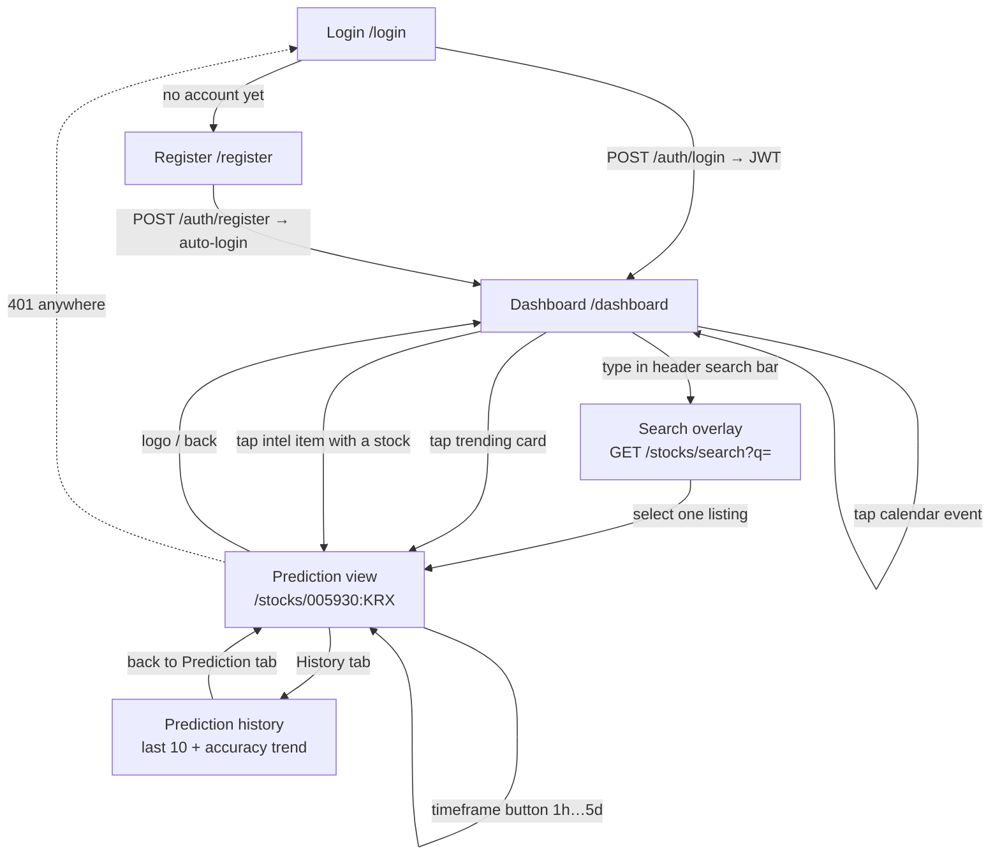

# UI/UX Specification — DC Intel Frontend (Phase 2)

**Status:** v1 source of truth for everything the user sees.
**Related docs:** `backend-design.md` (endpoint contracts), `schema.md` (tables), `market-intel-pipeline.md` (intel badge contract §8.2, credibility bands §6.4), `sentiment-pipeline.md` (staleness contract §8.2), `technical-indicators.md` (plain-language copy templates), `data-sources.md` (update cadences, source degradation states).

DC Intel's frontend is a **React (Vite) mobile-first responsive SPA**. Real-time feel comes from **polling in v1** (WebSocket is a documented v2 upgrade). UI ships in **Korean and English** with a runtime toggle. Every screen follows one rule above all others: *a beginner should understand it in 5 seconds without knowing any finance vocabulary.*

---

## 1. Design Principles (binding rules)

| # | Rule | Concrete meaning |
|---|---|---|
| P1 | **Graph-centric, minimal text** | Every key fact gets a visual first (arrow, gauge, sparkline, bar); text is a caption, not a paragraph. No widget renders more than 2 lines of body copy by default. |
| P2 | **Color semantics are fixed** | Green = bullish/up, red = bearish/down, gray = neutral. Blue = CONFIRMED, amber = UNCONFIRMED (reserved by `market-intel-pipeline.md` §8.2 — never reuse green/red for confirmation states). |
| P3 | **Never color alone** | Every colored element is paired with an icon (▲ ▼ ▬) and/or a text label. See §9 Accessibility. |
| P4 | **Plain language only** | "Price likely to rise", not "positive momentum divergence". Korean copy uses 해요체 (friendly polite), no 한자어 finance jargon. All user-facing strings come from the copy tables in this doc and the pipeline docs' template tables. |
| P5 | **Large type for key metrics** | Direction + confidence are the two biggest things on the prediction screen (see type scale §4.2). |
| P6 | **Honest by default** | Every data widget shows `as_of` age, stale flags, the UNCONFIRMED rumor badge, and the real win/loss record — including losses and the "collecting data" state. Never imply tick-level real-time (KRX quotes via yfinance can lag 15–20 min; see `data-sources.md`). |
| P7 | **Mobile-first** | Design at 375 px first; enhance upward at the breakpoints in §4.4. Touch targets ≥ 44×44 px. |
| P8 | **One stock per view** | A prediction view is always about exactly one listing (`{symbol}:{exchange}`). No multi-stock comparison screens in v1. |
| P9 | **Detail-perfect (owner standard)** | Clean and error-free in the details. Everything sits on the spacing token grid (§4.3) — consistent alignment, equal gutters, optical centering of icons with text. **No layout shift** when data updates (reserve space for every value; `tabular-nums` on all numerals, §4.2; skeletons match final dimensions). **No clipping, overflow, or text truncation without an ellipsis + full value on hover/tap.** Every component ships all states (loading / loaded / empty / error / stale — §component inventory). International conventions throughout (dates, number formatting per locale, green=up). Treat a misaligned pixel or a janky reflow as a bug, not a polish item. |

**Mandatory disclaimer** (footer of every prediction view and the dashboard, fixed copy):

- EN: *"Predictions are statistical estimates for reference only — not investment advice. You are responsible for your own decisions."*
- KO: *"예측은 참고용 통계 추정치이며 투자 자문이 아니에요. 투자 결정과 그 결과는 본인에게 있어요."*

---

## 2. Information Architecture & Routes

SPA routing (React Router). The `{symbol}:{exchange}` convention from the API is used verbatim in URLs (colon is a legal path character).

| Route | Screen | Auth |
|---|---|---|
| `/login` | Login form | public |
| `/register` | Registration form | public |
| `/dashboard` | Post-login dashboard (default after login) | JWT required |
| `/stocks/:listing` e.g. `/stocks/005930:KRX` | Main prediction view | JWT required |
| `/stocks/:listing/history` | Historical prediction log (rendered as a tab inside the prediction view; deep-linkable) | JWT required |
| `*` | 404 → link back to `/dashboard` | — |

Search is a **global overlay** (modal on mobile, dropdown panel on desktop) reachable from a persistent header search field on every authenticated screen — it is not a route.

### 2.1 Screen-flow diagram



### 2.2 Auth/session behavior

- JWT bearer token stored in `localStorage` key `dc_intel_token` (v1 simplicity; XSS exposure accepted and documented — mitigations: strict CSP, no `dangerouslySetInnerHTML`, all third-party scripts banned).
- Any API 401 → clear token, redirect to `/login?returnTo=<current path>`; after login, navigate back to `returnTo`.
- Login/register forms: email + password, client-side validation (email format, password ≥ 8 chars), submit disabled while pending, inline error copy:
  - EN: "Email or password doesn't match." / KO: "이메일 또는 비밀번호가 맞지 않아요."
  - EN: "This email is already registered." / KO: "이미 가입된 이메일이에요."

---

## 3. Real-Time Strategy — Polling (v1)

Data fetching uses **TanStack Query (React Query)** with `refetchInterval` per widget. WebSocket push is the documented v2 replacement; the per-widget query-key structure below is designed so v2 only swaps the transport.

### 3.1 Per-widget polling table (contract with backend cache TTLs)

Poll intervals **must match `backend-design.md` §5.2** (and the per-timeframe TTLs in §6.5) — that doc is the source of truth for both poll cadence and cache TTLs. They are set ≥ the backend Redis cache TTL so polling never multiplies upstream API load — a poll either hits warm cache or arrives just after refresh.

| Widget | Endpoint | Poll (tab visible, market open) | Poll (market closed) | Backend cache TTL |
|---|---|---|---|---|
| Price header (current stock) | `GET /stocks/{s}:{e}/price` | 30 s | 5 min | overwritten each price cycle |
| Cross-market pricing table | `GET /stocks/{s}:{e}/prices-across-markets` | 60 s | 5 min | 60 s |
| Prediction card (per timeframe) | `GET /stocks/{s}:{e}/predict?timeframe=` | **do not poll** — re-fetch on user action (timeframe switch, manual refresh) or when `window_closes_at` passes | same | per-timeframe **5/10/15/30/45/60 min** for 1h/5h/24h/2d/3d/5d (§6.5) |
| Trending carousel | `GET /dashboard/trending?region=` | 60 s | 60 s | 60 s |
| Indexes snapshot | `GET /dashboard/indexes` | 60 s | 60 s | 60 s |
| Economic calendar | `GET /dashboard/economic-calendar` | 10 min | 10 min | 10 min (data itself refreshes daily; countdown ticks client-side) |
| Market intel feed | `GET /dashboard/market-intel` | 60 s | 60 s | 60 s |
| Accuracy badge | `GET /stocks/{s}:{e}/accuracy` | **on navigation only** (no interval) | — | 300 s |
| Prediction history | `GET /stocks/{s}:{e}/history?limit=30` | **on navigation only** (no interval) | — | n/a (per-user, direct SQLite) |

Rules:

- **Jitter:** every interval gets ±10 % random jitter so 1,000 clients don't synchronize.
- **Page Visibility API:** when the tab is hidden, all polling pauses; on becoming visible, refetch everything immediately, then resume intervals.
- **"Market open"** for a widget = the exchange of the data it shows (KRX 09:00–15:30 KST continuous session; NYSE/NASDAQ 09:30–16:00 ET). Dashboard widgets mixing regions use the faster cadence if *any* relevant exchange is open.
- **Failure backoff:** after 3 consecutive failed polls of one endpoint, double that widget's interval per failure, capped at 10 min; reset on first success. The widget shows its stale state (§3.2), not an error wall — last good data stays on screen.

### 3.2 Freshness & staleness UI contract

Every data payload carries `as_of` (ISO-8601 UTC) and may carry `is_stale: true` (server-side judgment, e.g. sentiment older than 30 min per `sentiment-pipeline.md` §8.2, or intel sources down per `data-sources.md`).

| State | Trigger | Rendering |
|---|---|---|
| Fresh | age < 2 × poll interval and not `is_stale` | Quiet caption: EN "Updated 40 s ago" / KO "40초 전 업데이트" (gray, 12.5 px) |
| Stale | `is_stale: true` OR client-side age > 2 × poll interval | Amber chip on the widget: EN "⏱ Data delayed — last updated 14:32" / KO "⏱ 데이터 지연 — 14:32 기준". Content stays visible, slightly desaturated (opacity 0.85). |
| Market closed | exchange closed | Gray chip: EN "Market closed — showing last close" / KO "장 마감 — 마지막 종가 기준" |

Timestamps render in the **user's local timezone** via `Intl.DateTimeFormat`; raw API values are always UTC.

---

## 4. Design Tokens

Tokens are CSS custom properties on `:root`. v1 ships **light theme only**; using variables everywhere keeps dark mode a v1.1 patch, not a rewrite.

### 4.1 Color tokens

```css
:root {
  /* Direction semantics — fixed platform-wide */
  --bull:        #16A34A;  /* green-600: fills, arrows, large display numerals */
  --bull-text:   #15803D;  /* green-700: ≥4.5:1 on white, for body-size text */
  --bull-bg:     #F0FDF4;  /* tint for badges/cards */
  --bear:        #DC2626;  /* red-600 */
  --bear-text:   #B91C1C;  /* red-700 */
  --bear-bg:     #FEF2F2;
  --neutral:     #6B7280;  /* gray-500 */
  --neutral-text:#4B5563;  /* gray-600 */
  --neutral-bg:  #F3F4F6;

  /* Reserved by market-intel badge contract — never green/red */
  --confirmed:   #2563EB;  /* blue-600 */
  --unconfirmed: #D97706;  /* amber-600 */

  /* Economic-calendar impact (always paired with dots + label, §7.3.3) */
  --impact-high: #EA580C;  /* orange-600 */
  --impact-med:  #CA8A04;  /* yellow-600 */
  --impact-low:  #9CA3AF;  /* gray-400 */

  /* Surfaces & text */
  --bg:          #FFFFFF;
  --bg-subtle:   #F9FAFB;
  --border:      #E5E7EB;
  --text:        #111827;
  --text-2:      #4B5563;
  --text-3:      #9CA3AF;
  --focus-ring:  #2563EB;  /* 2px outline, 2px offset */
  --stale:       #D97706;  /* stale chips share amber */
  --error:       #B91C1C;
  --skeleton:    #E5E7EB;  /* pulsing skeleton blocks */
}
```

> **Note on Korean market convention:** Korean brokerage apps traditionally use red = up / blue = down. DC Intel deliberately uses the **international green-up convention in both locales** (canonical platform decision) for one consistent mental model across KRX and US stocks. Every direction element also carries an arrow + word, so no user has to decode color alone. A locale-based color flip is *not* in v1 (flagged to product owner).

### 4.2 Typography tokens

Font stack (covers Korean + Latin in one family, with fallbacks):

```css
--font-sans: "Pretendard Variable", Pretendard, Inter, "Noto Sans KR",
             -apple-system, "Segoe UI", sans-serif;
```

All numerals use `font-variant-numeric: tabular-nums` so polling updates don't cause layout shimmy.

| Token | Mobile (<768 px) | Desktop (≥1024 px) | Weight | Used for |
|---|---|---|---|---|
| `--type-display` | 44 px / 1.05 | 64 px / 1.05 | 800 | Confidence % ("72%"), direction word |
| `--type-h1` | 24 px / 1.2 | 28 px / 1.2 | 700 | Screen titles, stock name |
| `--type-h2` | 19 px / 1.3 | 22 px / 1.3 | 700 | Widget titles |
| `--type-metric` | 20 px / 1.2 | 24 px / 1.2 | 700 | Prices, % changes, win rate |
| `--type-body` | 15 px / 1.5 | 15 px / 1.5 | 400 | Evidence bullets, descriptions |
| `--type-caption` | 12.5 px / 1.4 | 12.5 px / 1.4 | 400 | `as_of` lines, badges, axis labels |
| `--type-micro` | 11 px / 1.3 | 11 px / 1.3 | 500 | Sparkline labels, chip text |

### 4.3 Spacing, radius, elevation

- Spacing scale: 4 / 8 / 12 / 16 / 24 / 32 / 48 px (`--sp-1`…`--sp-7`).
- Card: radius 12 px, border 1 px `--border`, no drop shadow at rest (flat, fast); `box-shadow: 0 4px 12px rgb(0 0 0 / 0.08)` only on overlays (search panel, tooltips).
- Skeletons: `--skeleton` blocks, 1.2 s opacity pulse, same dimensions as the loaded content (no layout shift). Pulse disabled under `prefers-reduced-motion`.

### 4.4 Breakpoints (concrete, mobile-first)

| Token | Range | Layout behavior |
|---|---|---|
| `xs` (base) | 0–639 px | Single column. Bottom-sheet search overlay. Carousel = horizontal swipe. Cross-market table collapses to stacked cards. |
| `sm` | 640–767 px | Single column, wider gutters (24 px). |
| `md` | 768–1023 px | Dashboard = 2-column grid. Prediction view: direction block and confidence side by side. |
| `lg` | 1024–1439 px | Dashboard = 3-column grid (intel feed gets a full-height right rail). Prediction view = 2 columns: left 40 % (direction + confidence + timeframes), right 60 % (evidence, cross-market, history). |
| `xl` | ≥1440 px | Content max-width 1320 px, centered. |

CSS: `@media (min-width: 640px) { … }` etc. — never max-width queries.

---

## 5. Internationalization (KO/EN)

- Toggle in the header: segmented control `한국어 | EN`. Persisted in `localStorage` key `dc_intel_lang`; default from `navigator.language` (`ko*` → `ko`, else `en`).
- All UI strings live in `src/locales/en.json` and `src/locales/ko.json` (flat keys, ICU-style interpolation `{n}`); a ~30-line `useT()` hook is enough — no i18n framework needed in v1.
- **Server-generated copy** (evidence bullets, intel headlines, calendar event names) is requested with `?lang=ko|en` on the relevant endpoints; the UI never translates server copy client-side. `content_snippet` from market intel always renders in its original language (pipeline contract).
- Numbers/dates via `Intl.NumberFormat` / `Intl.DateTimeFormat` with the active locale.

### 5.1 Canonical copy table (excerpt — full file in `src/locales/`)

| Key | EN | KO |
|---|---|---|
| `auth.login.cta` | Log in | 로그인 |
| `auth.register.cta` | Create account | 회원가입 |
| `search.placeholder` | Search any stock — name or ticker | 종목 이름이나 코드로 검색 |
| `search.empty` | No stocks found for "{q}" | "{q}" 검색 결과가 없어요 |
| `direction.up` | Price likely to rise | 오를 가능성이 높아요 |
| `direction.down` | Price likely to fall | 내릴 가능성이 높아요 |
| `direction.neutral` | Likely to stay flat | 크게 움직이지 않을 것 같아요 |
| `confidence.label` | {pct}% confidence | 확신도 {pct}% |
| `timeframe.label` | Prediction window | 예측 기간 |
| `accuracy.badge` | {pct}% win rate over {n} predictions on this stock | 이 종목에서 {n}번 예측 중 {pct}% 적중 |
| `accuracy.collecting` | Collecting data — {done} of {min} predictions scored | 데이터 수집 중 — {min}번 중 {done}번 채점 완료 |
| `intel.confirmed` | Confirmed | 확인됨 |
| `intel.unconfirmed` | Unconfirmed — rumor | 미확인 — 소문 |
| `intel.coordinated` | Possible coordinated promotion | 조직적 띄우기 의심 |
| `calendar.impact.high` | High impact | 영향 큼 |
| `calendar.impact.med` | Medium impact | 영향 보통 |
| `calendar.impact.low` | Low impact | 영향 작음 |
| `calendar.countdown` | in {d}d {h}h | {d}일 {h}시간 후 |
| `state.stale` | Data delayed — last updated {time} | 데이터 지연 — {time} 기준 |
| `state.marketClosed` | Market closed — showing last close | 장 마감 — 마지막 종가 기준 |
| `state.error` | Couldn't load this. Tap to retry. | 불러오지 못했어요. 눌러서 다시 시도 |
| `state.empty.intel` | Nothing notable in the last 48 hours | 최근 48시간 동안 특별한 소식이 없어요 |
| `outcome.win` | Hit | 적중 |
| `outcome.loss` | Miss | 빗나감 |
| `outcome.pending` | Waiting for result | 결과 기다리는 중 |
| `diff.tooltip.fx` | 1 USD = {rate} KRW ({time}) | 1달러 = {rate}원 ({time} 기준) |

Direction copy, badge copy, and credibility-band labels must match the pipeline docs verbatim (`market-intel-pipeline.md` §6.4, §8.2; `technical-indicators.md` copy-template tables).

---

## 6. Search & Stock Selection

### 6.1 Search bar behavior

- Persistent in the authenticated header; focusing it opens the overlay (bottom sheet on `xs/sm`, anchored panel ≥`md`). Keyboard shortcut `/` focuses it on desktop.
- **Debounce 250 ms**, minimum **2 characters** (1 character allowed if it is a Hangul syllable — Korean tickers are often searched by name like "삼성"). Each keystroke cancels the in-flight request (`AbortController`).
- Calls `GET /stocks/search?q={query}` (no `lang` param — the response carries both `company_name_en` and `company_name_ko`, and the client picks per the active locale; `backend-design.md` §6.3). Matches on ticker, English name, Korean name.
- Results cached client-side per query string for 60 s (TanStack Query) so backspacing is instant.
- Keyboard: ↑/↓ moves through *listings* (not company groups), Enter selects, Esc closes. `role="combobox"` + `aria-activedescendant` wiring per §9.

### 6.2 Dropdown structure — company groups with all listings

The search response groups listings by company (backend contract — `stocks` rows sharing a company grouping key, see `schema.md`):

Response shape exactly per `backend-design.md` §6.3 (`data`/`meta` envelope; one result per company, `listings[]` with the live price overlay):

```json
{
  "data": {
    "query": "hynix",
    "results": [
      {
        "company_name_en": "SK hynix", "company_name_ko": "SK하이닉스",
        "listings": [
          { "instrument": "000660:KRX", "symbol": "000660", "exchange": "KRX",
            "board": "KOSPI", "currency": "KRW", "is_primary": true, "kind": "common",
            "last_price": 85000, "price_as_of": "2026-06-12T05:39:00Z",
            "fx_rate": 0.000729, "diff_vs_primary_pct": null },
          { "instrument": "HXSCL:OTC", "symbol": "HXSCL", "exchange": "OTC",
            "board": null, "currency": "USD", "is_primary": false, "kind": "adr",
            "last_price": 6.32, "price_as_of": "2026-06-12T05:38:00Z",
            "fx_rate": 1.0, "diff_vs_primary_pct": 2.1 }
        ]
      }
    ]
  },
  "meta": { "source": "internal", "data_as_of": "2026-06-12T05:40:00Z",
            "is_stale": false, "cache": "metadata-hit", "request_id": "req_a1" }
}
```

Rendered as (one company group, two selectable rows):

```
SK hynix · SK하이닉스
  ● 000660 · KRX        85,000 KRW            [primary]
  ● HXSCL  · ADR/OTC    $6.32    Diff +2.1%
```

- `kind ∈ {common, adr}` and `exchange ∈ {KRX, NASDAQ, NYSE, AMEX, OTC}` (the `{symbol}:{exchange}` grammar, `backend-design.md` §2.2). **Futures are not a v1 listing type** — no EUREX/futures rows in v1 (documented v1.1+ extension, §11).
- Prices and diffs come **from the live price overlay the backend merges into the search response** (`backend-design.md` §6.3) — the dropdown never fires extra price calls per keystroke. A listing with no cached price shows "—" instead of a number.
- Selecting any row navigates to `/stocks/{symbol}:{exchange}` (single stock selection per view, P8) and closes the overlay.
- Max 7 company groups per response; each group shows all its listings.

### 6.3 Currency & cross-market difference display rule (canonical)

This rule governs the search dropdown **and** the cross-market pricing table (§7.4.6).

1. **Native currency, native formatting.** Every listing's price displays in its own currency: KRW and JPY with 0 decimals (`85,000 KRW`; KO locale: `85,000원`), USD `$6.32`, EUR `€55.10` — via `Intl.NumberFormat(locale, {style:'currency'})`, except KRW in EN locale renders as `85,000 KRW` (code suffix) because `₩` is poorly recognized by EN-locale beginners.
2. **The server computes all conversion; the client converts nothing.** `diff_vs_primary_pct` is computed backend-side:

   ```
   equiv_primary_ccy = listing_price × fx(listing_ccy → primary_ccy) / shares_per_unit
   diff_vs_primary_pct = (equiv_primary_ccy − primary_price) / primary_price × 100
   ```

   where `shares_per_unit` is the ADR ratio (ordinary shares represented by one depositary share) or contract multiplier. FX is the cached mid-rate refreshed with the price job; the response includes `fx_rate` and `fx_as_of`.
3. **Sign convention:** positive diff = this listing trades at a **premium** to the primary listing. Color: premium green, discount red, |diff| < 0.1 % gray "≈0%". Always with an explicit `+`/`−` sign (never color alone).
4. **Tooltip discloses the conversion:** "1 USD = 1,373.00 KRW (05:38 UTC) · 1 ADR = 1/10 share" / KO "1달러 = 1,373.00원 (05:38 기준) · ADR 1주 = 보통주 1/10주".
5. **Worked example (must reproduce):** primary 000660:KRX = 85,000 KRW; ADR HXSCL = $6.32; fx = 1,373.0 KRW/USD; 1 ADR = 1/10 ordinary share → `shares_per_unit = 0.1`. `equiv = 6.32 × 1373.0 / 0.1 = 86,773 KRW` → `diff = (86,773 − 85,000)/85,000 = +2.1%`. Dropdown line: `KRX: 85,000 KRW | ADR: $6.32 | Diff: +2.1%`.
6. **Stale legs:** if either price's `price_as_of` is older than 10 min, the diff renders in gray with the ⏱ stale marker (a fresh-vs-stale comparison is noise, not signal).

(Futures listings are out of scope for v1, so no futures-basis diff rule is needed — see §11.)

---

## 7. Screens

### 7.1 Login / Register

Centered card (max-width 400 px), logo, email + password fields, primary button, link to the other form. Error copy per §2.2. Password field has a show/hide toggle (`aria-pressed`). On success, store JWT and redirect (§2.2). No social login, no password reset flow in v1 (reset is a v1.1 item; the form says: EN "Forgot password? Contact support@dcintel.app" / KO "비밀번호를 잊으셨나요? support@dcintel.app로 연락 주세요").

### 7.2 Dashboard layout

Grid per §4.4 breakpoints. Order on mobile (single column): ① indexes strip → ② trending carousel → ③ market intel feed → ④ economic calendar. On `lg`: row 1 = indexes strip full-width; row 2 = trending (2 cols) + intel feed (right rail, full height); row 3 = calendar (2 cols).

#### 7.2.1 Trending stocks carousel

- **Data:** `GET /dashboard/trending?region={kr|us}` (no `lang` param — each card carries both `name_en` and `name_ko`; `backend-design.md` §6.7). The endpoint returns separate `gainers[]` and `losers[]` lists (default `limit` 10 each); the carousel merges them and shows the **top 10 movers by |%change|** on the day for the selected region. The region segmented control offers `KR | US` (the API also accepts `all`), persisted in `localStorage` (`dc_intel_region`, default by locale: `ko`→KR, else US).
- **Card (160 × 148 px, horizontal scroll-snap; ≥`md` shows 5 per row, 2 rows, no scroll):**
  - Stock name (KO or EN per locale) + `symbol:exchange` caption
  - Day % change, colored + signed: `▲ +3.2%`
  - **Mini sparkline:** inline SVG 120×32, today's session at 5-min resolution (≤ 78 points, provided by the endpoint as a `sparkline: number[]` array). Line colored by sign of day change; no axes; `aria-hidden` (the % text carries the information).
  - **Win-rate badge** (bottom): `🎯 71%` when the stock has ≥ 20 closed predictions, else `수집 중 / collecting` in gray (§7.4.5 threshold). Backend embeds `win_rate_pct` + `n_closed` per stock in the trending response.
- Tap → `/stocks/{symbol}:{exchange}`.
- Auto-advance: none (carousels that move by themselves hurt comprehension and a11y). Swipe/scroll only.

#### 7.2.2 Market indexes snapshot

- **Data:** `GET /dashboard/indexes` — fixed set: **KOSPI, NASDAQ Composite, S&P 500, Nikkei 225, DAX**.
- Horizontal strip of 5 tiles (scroll-snap on mobile). Tile: index name (localized: 코스피/나스닥 종합/S&P 500/니케이 225/닥스), current level, % change with ▲/▼/▬, mini line chart (same SVG sparkline spec, 1-day 5-min points), and an open/closed dot with the exchange's local status (uses the §3.1 market-hours definitions).
- Indexes are context only — tiles are **not** tappable in v1 (no index prediction pages).

#### 7.2.3 Economic calendar widget

- **Data:** `GET /dashboard/economic-calendar?days=7&lang=` — upcoming events in the next 7 days, server-sorted by event time. Widget shows **high-impact events first**, then medium, capped at 8 rows with a "show all ({n})" expander.
- **Row anatomy:** impact indicator + event name (plain language, localized by backend) + country flag/code + event local time *and* user-local time + **live countdown**.
- **Impact color coding** (always dots + label + color, never color alone):
  - High: `●●●` `--impact-high` + "High impact / 영향 큼"
  - Medium: `●●○` `--impact-med` + "Medium impact / 영향 보통"
  - Low: `●○○` `--impact-low` + "Low impact / 영향 작음"
- **Countdown:** computed client-side from the event's UTC timestamp. Updates every 1 min normally; switches to per-second ticking when < 1 h remains (`in 43 min 12 s` / `43분 12초 후`). At T-0 the row flips to "Happening now / 진행 중" (pulse dot, disabled under reduced-motion) and after +30 min the row drops off. Countdown text region is `aria-live="off"` (a ticking live region would be screen-reader noise); the absolute time is always present for AT users.
- Example row: `●●● High impact · US CPI release · 미국 소비자물가 발표 · Jun 13 21:30 KST · in 1d 4h`

#### 7.2.4 Real-time market intel feed

- **Data:** `GET /dashboard/market-intel?lang=&limit=20` (global feed; defaults `min_credibility=25` per the pipeline doc). Renders **clusters**, newest/anomaly-pinned first.
- **Card anatomy (top to bottom):**
  1. Badge row — mandatory **CONFIRMED/UNCONFIRMED badge** exactly per `market-intel-pipeline.md` §8.2 (blue check "Confirmed/확인됨" or amber warning-triangle "Unconfirmed — rumor / 미확인 — 소문", with the canonical tooltip + `confirm_url` link when confirmed). *No badge → do not render the item* (hard pipeline rule).
  2. **Credibility badge:** score 0–100 + band label from the §6.4 bands ("65 · Moderately credible / 보통 신뢰도"). Rendered as a small horizontal meter (0–100) + number + band text.
  3. **Sentiment chip:** ▲ bullish (green) / ▼ bearish (red) / ▬ neutral (gray) + word, with the cluster's `sentiment_confidence` as caption ("78% sure / 확신 78%").
  4. `content_snippet` of the cluster's top item (original language, max 3 lines, ellipsis), source icon + author handle + relative time, corroboration count: EN "{n} accounts reported this" / KO "{n}개 계정이 같은 내용을 올렸어요".
  5. If `coordinated_warning`: the extra amber label "Possible coordinated promotion / 조직적 띄우기 의심".
- **Anomaly banners** (when the response's `anomalies[]` is non-empty) render above the list with the canonical headline from the pipeline doc ("{name} moved {signed_pct}% in 30 minutes with no official news — here's what traders are saying happened" / KO equivalent) and the pinned clusters directly beneath.
- Tapping a card with a `stock` → that stock's prediction view; market-wide (NULL-stock) cards are not tappable.
- New items between polls: prepend with a 300 ms fade-in (no slide animation; disabled under reduced-motion). Never reorder existing visible cards under the user's thumb — new cards go on top, a "↑ {n} new / 새 소식 {n}건" pill appears if the user has scrolled down.

### 7.3 Main Prediction View (`/stocks/{symbol}:{exchange}`)

Header: stock name + `symbol:exchange`, current price + day change (polled per §3.1), language/region-aware. Tabs: **Prediction | History**. Layout per §4.4 (`lg` = 40/60 two-column).

#### 7.4.1 Large directional indicator

- A single block occupying **~30 % of the viewport height on mobile** (`min-height: 30vh`; on `lg` it fills the upper left column) containing:
  - Giant arrow icon: ▲ (up), ▼ (down), ▬ (neutral) — SVG, ~96 px on mobile / 128 px desktop, filled `--bull` / `--bear` / `--neutral`.
  - The direction phrase in `--type-display` directly beneath, same color (`-text` variant for contrast): "Price likely to rise / 오를 가능성이 높아요" (copy table §5.1).
  - Caption: selected timeframe + window close time: EN "next 24h · until Jun 13 14:35" / KO "앞으로 24시간 · 6월 13일 14:35까지".
- Direction change on refetch: cross-fade 200 ms. No bouncing/pulsing arrows ever (P6: this is information, not excitement).

#### 7.4.2 Confidence score

- `--type-display` numeral: **"72%"** with the label from `confidence.label` ("72% confidence / 확신도 72%"). Colored `--text` (not direction-colored — confidence is not a direction).
- Beneath it, a 0–100 horizontal track with a filled bar (direction color) and a thin marker at 50 ("coin flip / 반반" caption at the 50 tick).
- Tooltip ⓘ: EN "How sure the model is, based on its calibrated track record. 50% means a coin flip." / KO "과거 적중 기록으로 보정한 모델의 확신 정도예요. 50%는 동전 던지기와 같아요."
- Value is the calibrated 0–100 integer straight from the API; the UI never rescales it.

#### 7.4.3 Timeframe selector

- Button group, **six options exactly: `1h · 5h · 24h · 2d · 3d · 5d`** (KO labels: 1시간 · 5시간 · 24시간 · 2일 · 3일 · 5일). One model per timeframe — switching buttons refetches `GET …/predict?timeframe={tf}` (each timeframe is its own TanStack Query key, so previously viewed timeframes render instantly from cache while revalidating).
- Selected state: filled `--text` background, white text; unselected: outline. `role="radiogroup"`, arrow-key navigation, each button ≥ 44 px tall. Horizontal scroll-snap on `xs` if needed (6 × 52 px fits 375 px, so normally no scroll).
- Default timeframe on load: **24h**. Selection persists per session (not per stock).

#### 7.4.4 Evidence section ("Why?")

- Title: EN "Why the model thinks so" / KO "이렇게 예측한 이유".
- **Up to 3 bullets, canonical explainability format**: `<plain-language signal phrase> (<contribution>%)`, contributions summing to 100, delivered pre-localized by the API (`evidence[].text`, `evidence[].contribution_pct`). Signal phrases reuse the copy templates owned by `technical-indicators.md` / `sentiment-pipeline.md`.
- **Graph-oriented rendering:** each bullet is a row = icon (📈 technical / 💬 sentiment / 📅 calendar, by `evidence[].kind`) + phrase + a horizontal contribution bar sized to `contribution_pct` with the % at its end. Bars share one 100 % scale so relative weight is visible at a glance.
- Worked example (24h, up, EN):

  ```
  📈 RSI rising (62) → buyers in control                       (40%) ████████
  💬 Positive buzz up 45% in the last 2h (8 sources)           (35%) ███████
  📈 Short-term average crossed above long-term → rising trend (25%) █████
  ```

  KO same data:

  ```
  📈 RSI 상승 신호 (62) → 매수세 우위                            (40%)
  💬 최근 2시간 긍정 여론 +45% (8개 출처)                        (35%)
  📈 단기 평균선이 장기 평균선 위로 → 상승 흐름                   (25%)
  ```

  All three bullets push toward the displayed direction (**up**) — per `prediction-model.md` §6.2, an up prediction never cites a bearish signal (and vice-versa); a contradicting indicator is simply omitted, not shown as counter-evidence.

- If the model has < 3 evidence items, render only what exists (contributions still sum to 100). If sentiment sources are degraded (reduced-evidence mode per `data-sources.md`), bullets simply won't cite social signals — no special UI needed beyond the standard stale chip.

#### 7.4.5 Win-loss accuracy badge

- **Data:** `GET /stocks/{s}:{e}/accuracy` → shape per `backend-design.md` §6.12: `{ instrument, window, graded_total, pending, exact_accuracy_pct, directional: {predictions, wins, losses, win_rate_pct}, neutral_predictions, low_sample, by_timeframe[] }`. The badge headline uses `directional.win_rate_pct` (realized neutral counts as a loss) over `graded_total`.
- **Normal state** (`low_sample == false`, i.e. `graded_total ≥ 20`): pill under the confidence block — `🎯 71% win rate over 143 predictions on this stock` / KO `🎯 이 종목에서 143번 예측 중 71% 적중` (`directional.win_rate_pct` and `graded_total`). Background `--bull-bg` when win rate ≥ 55 %, `--neutral-bg` when 45–55 %, `--bear-bg` when < 45 % — the platform shows its losses in red just like a stock's (P6, honesty).
- **Collecting-data state** (`low_sample == true`, `graded_total < 20`): gray pill — EN `Collecting data — {graded_total} of 20 predictions scored` / KO `데이터 수집 중 — 20번 중 {graded_total}번 채점 완료`, with a thin progress bar (`graded_total`/20). Never show a win-rate % below the threshold (3/4 = "75%!" is statistical noise dressed as a track record).
- Tooltip: per-timeframe breakdown from `by_timeframe[]` (each row uses its own `directional.win_rate_pct`; a row with `graded < 20` shows "—").
- The **minimum-sample threshold is 20 graded outcomes** (cross-doc constant `MIN_ACCURACY_SAMPLE = 20`; the backend sets `low_sample` / `win_rate_pct = null` below it, so the client applies the same rule everywhere: badge, trending cards, history tab).

#### 7.4.6 Cross-market pricing table

- **Data:** `GET /stocks/{s}:{e}/prices-across-markets`. Same listing set and `diff_vs_primary_pct` semantics as search (§6.3 — single display rule, one backend computation).
- ≥`md`: table with columns **Market | Price (native) | vs primary | Updated | Status**. `xs/sm`: stacked cards, one per listing.

  | Market | Price | vs primary | Updated | Status |
  |---|---|---|---|---|
  | KRX `000660` (primary) | 85,000 KRW | — | 14:39 KST | ● open |
  | ADR/OTC `HXSCL` | $6.32 | **+2.1%** ⓘ | 00:38 ET | ○ closed |

  (v1 listing kinds are `common` and `adr` only; futures listings are a documented v1.1+ extension, §11 — they never appear in this table in v1.)

- The current view's listing row is highlighted; tapping another listing's row navigates to that listing's prediction view (still one stock per view — it's a navigation, not a comparison).
- Rows where the exchange is closed show the §3.2 market-closed chip; diffs against a closed leg follow the stale-leg rule (§6.3.6).

#### 7.4.7 Historical prediction log (History tab)

- **Data:** `GET /stocks/{s}:{e}/history?limit=30` (auth required; per `backend-design.md` §6.11 this returns **only the signed-in user's own** predictions on this stock, newest first, each with its outcome). The History tab is therefore "**your** predictions on this stock", not a platform-wide log. No `lang` param — each item carries both `evidence_summary_en` and `evidence_summary_ko`. Items: `{ prediction_id, timeframe, direction, confidence, evidence_summary_en/ko, predicted_at, window_closes_at, entry_price, currency, model_version, status, outcome }`.
- **Accuracy-trend mini chart** (top of tab): the client computes the rolling win rate over the user's last graded predictions **from the `items[]` already returned** (`status ∈ {correct, incorrect}`, oldest→newest), since `/history` carries no `trend` field. Line chart, y-axis 0–100 with a dashed reference line at 50 ("coin flip / 반반"), x-axis = time. Height 120 px. Hidden (replaced by a "collecting data" note) when the user has < 20 graded predictions on this stock. *(The platform-wide accuracy in §7.4.5 comes from `/accuracy` and is a separate, public number; this trend is the user's personal record.)*
- **Log rows** (`status ∈ {pending, correct, incorrect}` per `backend-design.md` §6.11; the realized move comes from `outcome.move_pct`):

  | When | Timeframe | Predicted | Result | Outcome |
  |---|---|---|---|---|
  | Jun 11 14:35 | 24h | ▲ rise · 72% | +1.8% | ✅ Hit / 적중 |
  | Jun 11 09:00 | 5h | ▼ fall · 64% | +0.4% | ❌ Miss / 빗나감 |
  | Jun 12 10:00 | 24h | ▲ rise · 58% | — | ⏳ Waiting / 결과 기다리는 중 |

  `status` maps to UI: `correct` → ✅ Hit/적중, `incorrect` → ❌ Miss/빗나감, `pending` → ⏳ Waiting/결과 기다리는 중 (icons + words, P3). The actual move % (`outcome.move_pct`) is colored by its own sign (it's a price move).
- Each row's expander reveals that prediction's evidence (`evidence_summary_en/ko`, recorded at prediction time), plus `model_version` in `--type-micro` gray (honest provenance; predictions carry `model_version` per the schema addition).
- Footer link: "How we score predictions ⓘ" → static modal explaining the outcome rule in plain language (EN "We check the price when the window closes. 'Rise' counts as a hit if the price ended higher…" / KO "예측 기간이 끝나는 시점의 가격으로 채점해요. '오른다'고 했을 때 실제로 올랐다면 적중이에요…").

#### 7.4.8 Stock-page intel section

Below the cross-market table, the same intel feed component as §7.2.4 filtered to this stock (`GET /dashboard/market-intel?stock={s}:{e}`), max 5 clusters, with the cluster timeline strip (horizontal dot timeline from the pipeline doc §10: first posted → corroborated → market moved → confirmed) rendered when timeline events exist. Empty state: `state.empty.intel`.

---

## 8. Component Inventory & States

Every data-bound component implements **all five states**. Skeletons match final dimensions (zero layout shift). Errors are per-widget (tap-to-retry), never full-screen, unless auth fails (→ login).

| Component | File (suggested) | Loading (skeleton) | Error | Empty | Stale flag | Notes |
|---|---|---|---|---|---|---|
| `AppHeader` | `components/AppHeader.tsx` | — | — | — | — | logo, search field, lang toggle, logout |
| `SearchOverlay` | `components/search/SearchOverlay.tsx` | 3 gray group rows | inline `state.error` + retry | `search.empty` with the query echoed | prices show "—" when uncached | combobox a11y per §9 |
| `ListingRow` | `components/search/ListingRow.tsx` | — | — | — | gray diff per §6.3.7 | price + diff chip |
| `TrendingCarousel` | `components/dashboard/TrendingCarousel.tsx` | 10 card skeletons | widget error card | "No movers yet today / 아직 큰 움직임이 없어요" | amber chip on widget header | region toggle KR/US |
| `TrendingCard` | `components/dashboard/TrendingCard.tsx` | — | — | — | — | sparkline + win-rate badge |
| `Sparkline` | `components/common/Sparkline.tsx` | gray block | hidden | flat gray line | — | pure SVG, `aria-hidden` |
| `IndexStrip` | `components/dashboard/IndexStrip.tsx` | 5 tile skeletons | widget error card | — (fixed set) | amber chip | open/closed dot per exchange |
| `EconCalendar` | `components/dashboard/EconCalendar.tsx` | 5 row skeletons | widget error card | "No major events in the next 7 days / 앞으로 7일간 큰 일정이 없어요" | amber chip | client-side countdown |
| `CountdownLabel` | `components/common/CountdownLabel.tsx` | — | — | — | — | 1 min tick, 1 s tick under 1 h, `aria-live="off"` |
| `IntelFeed` | `components/intel/IntelFeed.tsx` | 4 card skeletons | widget error card | `state.empty.intel` | amber chip (sources down per data-sources.md) | global + per-stock variants |
| `IntelCard` | `components/intel/IntelCard.tsx` | — | — | — | — | badge mandatory or do not render |
| `ConfirmBadge` | `components/intel/ConfirmBadge.tsx` | — | — | — | — | exact §8.2 pipeline contract (blue/amber) |
| `CredibilityMeter` | `components/intel/CredibilityMeter.tsx` | — | — | — | — | 0–100 + band label |
| `AnomalyBanner` | `components/intel/AnomalyBanner.tsx` | — | — | honest empty copy from pipeline §9.2.5 | — | canonical headline string |
| `DirectionIndicator` | `components/predict/DirectionIndicator.tsx` | pulsing gray arrow block | "Prediction unavailable — try again / 예측을 불러오지 못했어요" + retry | — | amber chip + desaturate | 30vh mobile |
| `ConfidenceScore` | `components/predict/ConfidenceScore.tsx` | gray numeral block | (covered by prediction error) | — | inherits | bar + 50 marker |
| `TimeframeSelector` | `components/predict/TimeframeSelector.tsx` | — | — | — | — | radiogroup, 6 fixed options |
| `EvidenceList` | `components/predict/EvidenceList.tsx` | 3 bar skeletons | inherits prediction error | "Not enough signals right now / 지금은 근거 신호가 부족해요" | inherits | bars sum to 100 |
| `AccuracyBadge` | `components/predict/AccuracyBadge.tsx` | pill skeleton | hidden (non-critical) | collecting-data pill | — | `MIN_ACCURACY_SAMPLE = 20` |
| `CrossMarketTable` | `components/predict/CrossMarketTable.tsx` | 3 row skeletons | widget error card | single-listing note: "Only listed on KRX / KRX 단독 상장" | per-row stale per §6.3.7 | stacked cards on xs |
| `HistoryLog` | `components/history/HistoryLog.tsx` | 10 row skeletons | widget error card | "No predictions yet — pick a timeframe to make the first one / 아직 예측 기록이 없어요 — 기간을 선택해 첫 예측을 받아보세요" | amber chip | outcome icons + words |
| `AccuracyTrendChart` | `components/history/AccuracyTrendChart.tsx` | gray block 120 px | hidden | collecting-data pill | — | dashed 50 line |
| `StaleChip` / `MarketClosedChip` | `components/common/Chips.tsx` | — | — | — | — | §3.2 contract |
| `ErrorCard` | `components/common/ErrorCard.tsx` | — | — | — | — | `state.error`, tap-to-retry, ≥44 px |
| `Disclaimer` | `components/common/Disclaimer.tsx` | — | — | — | — | fixed copy §1 |

**State definitions (uniform):**

- **Loading:** first fetch only. Refetches keep old data on screen (TanStack Query default) — no skeleton flashes on poll.
- **Error:** first fetch failed and no cached data → `ErrorCard`. Poll failure with cached data → keep data, show stale chip after the §3.2 threshold.
- **Empty:** 200 with no items → friendly empty copy (table above). Empty ≠ error; never show retry styling on empty.
- **Stale:** §3.2 contract, amber chip + 0.85 opacity content.

---

## 9. Accessibility

- **Never color alone (hard rule):** every direction has arrow + word; every badge has icon + label; calendar impact has dots + label; diffs have explicit +/− signs; outcomes have ✅/❌/⏳ + word.
- **Contrast:** body-size colored text uses the `-text` token variants (≥ 4.5:1 on white). Display-size (≥ 24 px bold) may use the base tokens (≥ 3:1, WCAG large-text). Verified pairs are part of the token definition — do not introduce new color/text-size pairs without checking.
- **Focus:** visible 2 px `--focus-ring` outline (2 px offset) on every interactive element; logical tab order; search overlay traps focus and restores it on close; Esc closes overlays.
- **ARIA:** search = `combobox` + `listbox` + `aria-activedescendant`; timeframe selector = `radiogroup`; tabs = `tablist`; sparklines `aria-hidden` with the adjacent text carrying the value; prediction direction block has `aria-label` like "Prediction: price likely to rise, 72 percent confidence, next 24 hours".
- **Live regions:** ticking numbers (prices, countdowns) are `aria-live="off"`. The only `aria-live="polite"` region is the per-widget stale/error chip (state *changes* matter; ticks don't).
- **Reduced motion:** `prefers-reduced-motion: reduce` disables skeleton pulse, fade-ins, the "happening now" pulse dot, and all transitions; content updates become instant swaps.
- **Touch:** all targets ≥ 44×44 px; carousel uses native scroll-snap (no JS gesture hijacking).
- **Language attributes:** `<html lang>` switches with the toggle; mixed-language intel snippets get a per-element `lang` attribute so screen readers switch voices.
- **Numbers:** `tabular-nums` everywhere; percent values always include the % sign in text, not just visually.

---

## 10. Frontend Stack & Project Structure

| Concern | Choice (v1) | Why |
|---|---|---|
| Build | Vite + React 18 + TypeScript | canonical |
| Routing | React Router v6 | standard SPA |
| Server state | TanStack Query v5 | polling (`refetchInterval`), cache keys per widget, visibility pause built in |
| Client state | React context only (lang, region, auth) | no Redux — v1 has almost no client state |
| Styling | CSS Modules + the §4 token sheet | zero runtime cost; tokens are plain CSS variables |
| Charts | Hand-rolled SVG sparklines; Recharts for the accuracy-trend and index mini charts | nothing heavier needed in v1 (no candlesticks in v1) |
| i18n | Two JSON dictionaries + a `useT()` hook | ~30 lines, no framework |
| Dates/numbers | Native `Intl.*` | no moment/dayjs needed |

```
src/
  api/client.ts            # fetch wrapper: base URL, JWT header, 401 redirect, AbortController
  api/types.ts             # response types matching backend-design.md
  locales/{en,ko}.json
  styles/tokens.css
  hooks/{useT,useAuth,usePolling,useMarketHours}.ts
  components/{common,search,dashboard,intel,predict,history}/...
  pages/{Login,Register,Dashboard,StockView}.tsx
  App.tsx  main.tsx  routes.tsx
```

`useMarketHours(exchange)` computes open/closed client-side from the fixed sessions (KRX 09:00–15:30 KST; NYSE/NASDAQ 09:30–16:00 ET) to pick poll intervals and render open/closed dots; the server response's own market-state field, when present, wins over the client clock (holidays are a server concern).

---

## 11. Explicitly Out of Scope for v1 (documented v1.1/v2)

| Item | Target |
|---|---|
| WebSocket push (replaces §3 polling; query keys already structured for it) | v2 |
| Watchlist/portfolio UI (no table exists in v1 — "recently predicted stocks" via the predictions table is the v1 approximation if a recents strip is added) | v1.1 |
| Dark mode (tokens ready) | v1.1 |
| Password reset flow | v1.1 |
| Candlestick/full price charts | v1.1 |
| Futures listings (e.g. Eurex) in search, the cross-market table, and the `{symbol}:{exchange}` grammar — v1 supports only `common` and `adr` listing kinds (`schema.md` reserves `security_type='future'`) | v1.1+ |
| Locale-based red/blue Korean market color convention | needs product decision (see open questions) |
| Push/email alerts for anomalies and high-impact events | v2 |
