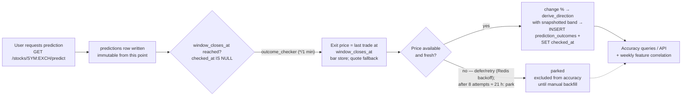

# Win/Loss Tracking — Prediction Logging, Outcome Marking, Accuracy Metrics, Backtesting

**Status:** v1 spec · **Owner:** backend/ML · **Depends on:** `schema.md` (canonical table definitions), `prediction-model.md` (window clock rules §2, label dead-bands §3, model versions §7.8, `reasoning_json` §8 — all CONTRACT), `backend-design.md` (endpoint contracts §6, outcome-checker grading summary §8), `economic-calendar.md` (event impact taxonomy), `technical-indicators.md` (bar series, market hours).

DC Intel's core honesty promise: **every prediction is logged at the moment it is made, frozen forever, and scored against what the market actually did.** Users see real win rates — including bad ones. This document specifies the logging contract, the outcome-checker job, the accuracy metrics and their exact user-facing copy, the feature-correlation feedback loop, and the boundary between live tracking and offline backtesting.

Where another document owns a contract, this document conforms to it and never redefines it: `prediction-model.md` owns the window clock (§2 there), the neutral dead-band (§3 there), `model_version` (§7.8 there), and `reasoning_json` (§8 there); `schema.md` owns all DDL; `backend-design.md` owns the `/accuracy` endpoint shape (§6.12 there).

---

## 1. Scope

In scope:

- What gets written to `predictions` at prediction time, and the immutability guarantee.
- The shared neutral dead-band (`derive_direction`) used identically by training labels and outcome scoring — with grading always driven by the per-prediction snapshot `reasoning_json.neutral_band_pct`.
- The outcome-checker background job: trading-day window clock, exit-price resolution, stale-price defer rule, missing-data handling, pseudocode, schedule.
- Accuracy metrics: per-stock, per-timeframe, per-model-version, overall; the `window=30d|90d|all` views; minimum sample size.
- Event-window segmentation (high-impact economic event overlap) — internal in v1, proposed as an extension to `backend-design.md` §6.12.
- User-facing exposure: exact UI copy strings (EN/KO) and the `GET /stocks/{symbol}:{exchange}/accuracy` response (shape owned by `backend-design.md` §6.12).
- Feature-correlation analysis into `feature_importance_logs` and how it feeds retraining decisions.
- The offline backtest harness boundary and the ≥ 52% ship gate.

Out of scope here: how predictions are *generated* (`prediction-model.md`), how the evidence bullets are *composed* (`prediction-model.md` §6, `technical-indicators.md` §11, `sentiment-pipeline.md`), schema DDL (`schema.md` is authoritative; tables are reproduced below for convenience only and match its DDL exactly).

---

## 2. Lifecycle overview



A prediction is exactly one of:

- **open** — window not yet closed (`checked_at IS NULL`, `window_closes_at > now`).
- **due** — window closed, not yet graded (`checked_at IS NULL`, no `prediction_outcomes` row; retry state, if any, lives in Redis — §5.5). There is **no status column**: this state is the *absence* of an outcome row, per `schema.md`.
- **graded** — `prediction_outcomes` row exists and `predictions.checked_at` is set, in one transaction.
- **parked** — terminal-until-operator: price truth could not be established after the §5.5 retry budget; the prediction stays ungraded (no outcome row), is recorded in the Redis park set, and is **excluded from every accuracy number** until the manual backfill CLI (§5.6) grades it.

---

## 3. Prediction logging

### 3.1 What is written, and when

A `predictions` row is inserted **synchronously inside the predict request** (`GET /stocks/{symbol}:{exchange}/predict?timeframe=`), before the response is returned. If the insert fails, the API returns 500 — we never show a user a prediction we did not log. Columns per `schema.md` §4.3 (convenience copy — `schema.md` DDL wins):

| Field | Source at write time | Notes |
|---|---|---|
| `stock_id` | resolved from `{symbol}:{exchange}` | FK → `stocks` |
| `user_id` | JWT subject; nullable | NULL = system-generated (warm-up job §10.3, dashboard precompute) or deleted account |
| `timeframe` | request param | One of `1h, 5h, 24h, 2d, 3d, 5d` |
| `direction` | model output (post neutral rule) | `up` / `down` / `neutral` |
| `confidence` | calibrated, capped, displayed value | Integer 0–100 |
| `reasoning_json` | full reasoning snapshot per `prediction-model.md` §8 | Carries `entry_price` and `neutral_band_pct`, which the outcome checker reads at grading time (§3.3) |
| `model_version` | the model that produced the output | Format §3.4 |
| `window_closes_at` | computed at prediction time via the exchange calendar (§3.5) | Denormalized copy of `reasoning_json.window_closes_at` so the outcome checker's due-scan is one indexed range query (`schema.md` §7.2) |
| `created_at` | UTC now | = `reasoning_json.predicted_at` (t0) |
| `checked_at` | NULL | Set by the outcome checker when it grades the row (§5.4) — the only column ever updated |

There is **no `price_at_prediction` column**: the entry price for scoring lives in `reasoning_json.entry_price` (listing currency), per `schema.md` §12.4. Grading reads it from the snapshot.

Cache behavior (per `backend-design.md` §6.5): a cache hit returns the cached payload; if the requesting user has no `predictions` row for that `(stock, timeframe, window_closes_at)`, one is inserted duplicating the cached model output, so *every user's served prediction is audited*. Accuracy statistics de-duplicate these rows (§6.1, §8.2) so popular stocks are not double-counted.

### 3.2 Immutability

`predictions` rows are never deleted, and only `checked_at` is ever updated by application code. Enforced in depth:

1. The repository module exposes only `insert`, `select`, and `set_checked_at` — no general `UPDATE`/`DELETE` code path exists in the app layer.
2. SQLite triggers as a backstop — **proposed addition to `schema.md`'s migrations** (not in migration 001; do not assume their presence until `schema.md` adopts them):

```sql
-- Scoped: UPDATE ... SET checked_at is the one legitimate write (schema.md §4.4 grading
-- step), and user_id is mutated only by the FK ON DELETE SET NULL action on account
-- deletion — both are deliberately excluded from the column list below.
CREATE TRIGGER predictions_immutable
BEFORE UPDATE OF stock_id, timeframe, direction, confidence,
                 reasoning_json, model_version, window_closes_at, created_at
ON predictions
BEGIN
    SELECT RAISE(ABORT, 'predictions rows are immutable (checked_at excepted)');
END;

CREATE TRIGGER predictions_no_delete
BEFORE DELETE ON predictions
BEGIN
    SELECT RAISE(ABORT, 'predictions rows are never deleted');
END;
```

If a model bug produced garbage predictions, we do **not** delete them — we grade them honestly and let the win rate show it. (A `model_version` filter exists precisely so a bad version's damage is visible and attributable.)

### 3.3 `reasoning_json` snapshot

The shape is **owned by `prediction-model.md` §8** (CONTRACT, `schema_version` 1). This document references it and does not redefine it; the authoritative field table and full worked example live there (§8.1–8.2 there; `schema.md` §6.1 carries an abridged copy). The tracking machinery reads these fields:

| Field (per `prediction-model.md` §8) | Used here for |
|---|---|
| `entry_price` | grading entry price (§5.4) |
| `neutral_band_pct` | grading dead-band (§4, §5.4) — never read from current config |
| `window_closes_at` | duplicated into the typed column (§3.1) |
| `model_version` | duplicated into the typed column; accuracy-by-version (§6.2) |
| `features[]` — array of `{name, group, value, baseline, contribution_signed, missing, stale}` | feature-correlation analysis (§9) |
| `evidence[]` — ≤ 3 of `{rank, group, contribution_pct, template_key, text_en, text_ko}`, `contribution_pct` sums to 100 | re-rendering history exactly as the user saw it |
| `high_impact_events[]` — `{event_id, …, relation}` with `relation ∈ {inside_window, within_6h_before, within_6h_after}` | event-window segmentation (§7) |

Evidence strings are the canonical bilingual templates from `prediction-model.md` §6.3 (e.g. `RSI bullish signal` / `RSI 상승 신호`, `Bullish EMA crossover` / `EMA 상승 교차 신호`); feature names are the canonical registry names from `prediction-model.md` §4.2 (`rsi_14`, `macd_hist_norm`, `bb_position`, `sent_agg`, …). If this pipeline ever needs additional snapshot fields (e.g. source-row audit ids), they must be proposed through `prediction-model.md` §8 as marked additions — never added here as a parallel shape.

### 3.4 `model_version` format

Owned by `prediction-model.md` §7.8 (CONTRACT); `schema.md` §4.3 records the same format in the DDL comment:

```
model_version = "{timeframe}-{algo}-{YYYYMMDD}.{seq}"
  algo ∈ {"lr", "xgb"}            e.g.  "24h-xgb-20260608.1"  ·  "5d-lr-20260601.2"
```

`{YYYYMMDD}` is the retrain as-of date (weekly, Sunday 03:00 KST per `prediction-model.md` §7.7); `{seq}` increments when more than one artifact is produced for the same timeframe on one date. There is no semver: every promoted retrain — including a breaking label change such as a dead-band re-tune (§4.2) — simply yields a new dated version. Accuracy-by-model-version (§6) groups on the raw string, which is why a single canonical format matters: two coexisting formats would split one model's history into two groups.

### 3.5 Window-close clock (CONTRACT — `prediction-model.md` §2)

`window_closes_at` is computed at prediction time with the exchange calendar (`exchange_calendars`: `XKRX` for KRX, `XNYS` for NYSE/NASDAQ; same convention as `technical-indicators.md` §2), using exactly the clock rules of `prediction-model.md` §2:

| Timeframe | Window clock rule |
|---|---|
| `1h`, `5h` | Counts **regular-session trading hours only**. The clock pauses at session close and resumes at the next session open of the stock's exchange. |
| `24h` | Closes at the **same time of day on the next trading day** of the stock's exchange. |
| `2d`, `3d`, `5d` | Closes at the same time of day **N trading days** later. |

- **Off-hours predictions are allowed for every timeframe** — there is no intraday creation guard, and no special error code. `entry_price` = last regular-session trade price; the window clock starts at the next session open.
- Worked example (`1h`, KRX): prediction Friday 15:00 KST → 30 session-minutes remain → window closes Monday 09:30 KST.
- Worked example (`24h`, KRX): prediction Friday 2026-06-12 10:30 KST → closes Monday 2026-06-15 10:30 KST (not Saturday — Saturday is not a trading day).
- Holidays and half-days come from the exchange calendar; if a target time-of-day falls after an early close, the window closes at that (shortened) session's close.

Because the clock counts trading time, `window_closes_at` always lands inside a regular session — a "24-hour" prediction is never silently stretched across a weekend gap, and a 1h prediction made at 15:30 ET honestly closes one session-hour into the next trading day.

---

## 4. Direction labels and the neutral dead-band

### 4.1 The shared function

One function defines what "up", "down", and "neutral" mean — for **training labels** (`prediction-model.md` §3) and **outcome scoring** (this doc) alike. It lives in one place and is imported by both:

```python
# app/tracking/labels.py — direction semantics shared by training labels and outcome scoring.
# DEFAULT band values are owned by prediction-model.md §3 (CONTRACT) and configured in
# config/ml.yaml (prediction-model.md §10). Grading NEVER reads these defaults: it uses
# the per-prediction snapshot reasoning_json.neutral_band_pct (§3.3, §5.4).

DEAD_BAND_PCT = {          # symmetric ± band, in percent — defaults per prediction-model.md §3
    "1h":  0.15,
    "5h":  0.30,
    "24h": 0.40,
    "2d":  0.50,
    "3d":  0.60,
    "5d":  0.75,
}

def derive_direction(change_pct: float, band_pct: float) -> str:
    """band_pct: training labels pass DEAD_BAND_PCT[timeframe];
    outcome grading passes reasoning_json.neutral_band_pct (the snapshotted band)."""
    if change_pct > band_pct:
        return "up"
    if change_pct < -band_pct:
        return "down"
    return "neutral"
```

### 4.2 Why a per-timeframe band, and why grading uses the snapshot

A flat band is wrong in both directions: ±0.75% on 1h would label almost everything neutral; ±0.15% on 5d would make "neutral" practically unreachable. The defaults scale with window length and are owned by `prediction-model.md` §3 (sized so `neutral` covers roughly 25–40% of historical samples; re-tune after the first backfill if the class balance falls outside that range — `prediction-model.md` §10).

Changing a band is a **breaking label change**: it requires retraining and ships as a new dated `model_version` (§3.4). Historical outcomes are *never* rescored — and this is guaranteed mechanically, not by policy: the band in force at prediction time is snapshotted into `reasoning_json.neutral_band_pct`, and **grading always uses the snapshot, never the current config** (CONTRACT — `prediction-model.md` §3; `schema.md` §4.4 and §12.4; `backend-design.md` §8). A later band re-tune therefore cannot corrupt a single old grade.

### 4.3 Correctness is strict 3-class equality

```
marked_correct = (predictions.direction == prediction_outcomes.actual_direction)
```

No partial credit. A predicted `up` with an actual move of +0.3% over 24h (inside that prediction's snapshotted ±0.40% band) grades `actual_direction = neutral` → **incorrect**. A predicted `neutral` that stays inside the band → **correct**. This is stricter than "did it at least not go down", and that is deliberate: the displayed win rate must survive skeptical scrutiny.

---

## 5. Outcome marking

### 5.1 The `prediction_outcomes` row

Exactly one row per graded prediction (`UNIQUE(prediction_id)` makes the job idempotent), written **once** by the outcome checker, in the same transaction that sets `predictions.checked_at`. Columns per `schema.md` §4.4 (convenience copy — `schema.md` DDL wins):

| Column | Type | Meaning |
|---|---|---|
| `id` | INTEGER PK | |
| `prediction_id` | INTEGER NOT NULL UNIQUE FK → predictions (CASCADE) | 1:0..1 with `predictions` |
| `actual_direction` | TEXT NOT NULL | `derive_direction(actual_price_change_percent, reasoning_json.neutral_band_pct)` — the snapshotted band, same semantics as training labels |
| `actual_price_change_percent` | REAL NOT NULL | `100 × (exit_price − entry_price) / entry_price`, entry from `reasoning_json.entry_price`, both in listing currency (FX never enters grading) |
| `marked_correct` | INTEGER NOT NULL (0/1) | `1` iff `predictions.direction == actual_direction` |
| `exit_price` | REAL NULL | ADDITION per `schema.md` — last trade price at `window_closes_at` (listing currency); kept for audit/debug of grading |
| `high_impact_event_overlap` | INTEGER NULL (0/1) | ADDITION per `schema.md` — frozen by the checker at grading time; `1` iff a high-impact `economic_events` row falls inside `[predictions.created_at, prediction_outcomes.created_at]` with `country ∈ relevant_countries(stock.exchange)` (`KRX → {KR,US}`, `NYSE/NASDAQ → {US}`). The single source for the §7 event-window split. |
| `created_at` | TEXT NOT NULL | When grading actually ran (may trail `window_closes_at` if the job was down; the *prices used* are still as-of window close) |

There is **no status / retry / resolution-rule column**: a pending grade is the *absence* of a row (`predictions.checked_at IS NULL`), and retry/attempt state lives in Redis (§5.5) — it is operational scratch, not durable truth. All columns are written once at grading and never updated; immutability needs no trigger because no code path updates this table.

> **`high_impact_event_overlap` is an adopted `schema.md` ADDITION** (see `schema.md` §4.4): the checker freezes it at grading time and §7 reads it directly. It is the canonical mechanism shared with `economic-calendar.md` §13 — do not recompute the split from `reasoning_json` at query time. Any *further* durable grading metadata (e.g. a `resolution_note` for backfilled rows) must likewise be proposed to `schema.md` as a marked ADDITION before this doc references it.

### 5.2 Exit-price resolution — the precise rules

Let `t_close = predictions.window_closes_at` (computed at prediction time by the §3.5 trading-day clock, so it always lands inside a regular session). Per `prediction-model.md` §2 and `backend-design.md` §8:

1. `exit_price` = **last trade price at `t_close`** — resolved from the bar store (last completed bar at or before `t_close`), falling back to the freshest cached quote at/after `t_close`.
2. **Never grade against a stale price** (`backend-design.md` §7, `outcome_checker` row): if the freshest available price predates `t_close` by more than **10 minutes** of session time (halted/stale symbol, source outage), the row is **deferred** to a later cycle — that is a retry, not a grade.
3. `actual_price_change_percent = 100 × (exit_price − entry_price) / entry_price` with `entry_price` from `reasoning_json.entry_price`.

Notes:

- There is no "next close" machinery and no market-closed branch: the trading-day clock (§3.5) guarantees the window closes in-session, so the exit price is always an ordinary historical lookup.
- The currently-forming bar is never used (consistent with `technical-indicators.md` §8.3). Extended-hours prints are never used (`prepost=False`).
- Entry/exit asymmetry: entry is the last trade price the user saw at t0; exit is the last trade at window close. Both are last-trade semantics per `prediction-model.md` §2.
- yfinance serves 5-min bars only ~60 days back (verify current limits) — irrelevant here since evaluation happens within minutes of the window closing, but it matters for the backtest harness (§10).

### 5.3 Edge cases (exhaustive)

| Edge case | Behavior |
|---|---|
| Prediction created while market closed (any timeframe) | Allowed (`prediction-model.md` §2): `entry_price` = last regular-session trade; the window clock starts at the next session open |
| Weekend / holiday inside the window | Trading-day clocks skip non-sessions via `exchange_calendars` — the window close never lands on one |
| Half-day session | The early close **is** that day's session end; a target time-of-day falling after it clamps to that session's close (§3.5) |
| Missing price data (yfinance outage, gap) | Retry with backoff (§5.5); after 8 failed attempts (~21 h), park — **excluded from every accuracy metric and from feature correlation** until backfilled |
| Trading halt at window close | No fresh trade within the 10-minute stale-price rule → defer → retries usually succeed once trading resumes the same day; multi-day halts get parked |
| Delisting / symbol gone | Price source returns empty permanently → parked; additionally flag `stocks.is_active = 0` (column per `schema.md`) so no new predictions are created |
| KRX ±30% limit-lock | Price exists and is real — grade normally. (The limit-lock affects indicator quality at *prediction* time, handled in `technical-indicators.md` §9; it does not affect scoring) |
| Stock split / dividend between entry and exit | v1 compares two raw last-trade prices — a split between entry and exit would corrupt the change %. Mitigation: if `|change_pct| > 35` (beyond the KRX daily limit and any plausible 5-day move for our universe), park and log `SPLIT_SUSPECT` for manual backfill. v1.1: corporate-actions feed |
| Clock skew / DST | All stored timestamps UTC; ET observes DST and KST does not — `exchange_calendars` handles both |
| Backend down when a window closes | No loss: the due-scan is `checked_at IS NULL AND window_closes_at <= now` (`schema.md` §7.2), so due predictions are picked up on restart, and exit prices are *historical lookups*, not "price right now" — late grading returns identical results |

### 5.4 Outcome-checker job — pseudocode

```python
# app/tracking/outcome_checker.py
# APScheduler: scheduler.add_job(run_outcome_checker, "interval", minutes=1,
#                                id="outcome_checker", max_instances=1, coalesce=True)

MAX_ATTEMPTS = 8
BACKOFF_MIN = [5, 10, 20, 40, 80, 160, 320, 640]   # ≈ 21 h total
STALE_PRICE_MAX_MIN = 10                            # §5.2 rule 2 (backend-design.md §7)

def run_outcome_checker(now: datetime | None = None) -> None:
    now = now or utcnow()
    due = db.fetch_all("""
        SELECT id, stock_id, timeframe, direction, created_at, reasoning_json
        FROM predictions
        WHERE checked_at IS NULL AND window_closes_at <= :now
        ORDER BY window_closes_at
        LIMIT 200
    """, now=now)                       # schema.md §7.2 due-scan; partial idx_predictions_due

    for pred in due:
        if redis.sismember("outcome:parked", pred.id):
            continue                                   # terminal until manual backfill (§5.6)
        if not retry_due(pred.id, now):                # Redis backoff gate (§5.5)
            continue

        snap  = json.loads(pred.reasoning_json)
        entry = snap["entry_price"]                    # schema.md §12.4: entry comes from the snapshot
        band  = snap["neutral_band_pct"]               # CONTRACT: snapshotted band, never current config

        exit_price, price_as_of = fetch_exit_price(pred.stock_id, snap["window_closes_at"])
        if (exit_price is None
                or too_stale(price_as_of, snap["window_closes_at"], STALE_PRICE_MAX_MIN)
                or split_suspect(entry, exit_price)):
            attempts = bump_attempt(pred.id, now)      # Redis HINCRBY outcome:retry:{id}
            if attempts >= MAX_ATTEMPTS:
                redis.sadd("outcome:parked", pred.id)
                log.warning("outcome parked", prediction_id=pred.id)
            continue

        change_pct = 100.0 * (exit_price - entry) / entry
        actual = derive_direction(change_pct, band)    # §4 — SAME semantics as training labels

        # Freeze the event-window flag over the REAL window [created_at, now] (§7, schema.md §4.4):
        # 1 iff a high-impact economic_events row falls in the window with a relevant country.
        overlap = high_impact_overlap(pred.stock_id, pred.created_at, now)  # -> 0/1

        with db.tx():                                  # one transaction: outcome row + checked_at
            db.insert("prediction_outcomes",
                      prediction_id=pred.id,
                      actual_direction=actual,
                      actual_price_change_percent=change_pct,
                      marked_correct=int(actual == pred.direction),
                      exit_price=exit_price,
                      high_impact_event_overlap=overlap)
            db.execute("UPDATE predictions SET checked_at = :now WHERE id = :id",
                       now=now, id=pred.id)            # permitted by the §3.2 trigger scope

        redis.delete(f"outcome:retry:{pred.id}")
        invalidate_accuracy_cache(pred.stock_id)       # §8.3: DEL acc:{symbol}:{exchange}:*
```

**Schedule:** every **1 minute** (`max_instances=1, coalesce=True`, matching the `outcome_checker` registry row in `backend-design.md` §7). The canonical cadence "outcome checker runs when each prediction window closes" is implemented as this frequent poller over the partial `idx_predictions_due` index — per-prediction one-shot timers do not survive process restarts; the poller does. Polling lag does not distort prices (exit prices are historical lookups), only availability, by ≤ 1 minute.

### 5.5 Retry policy summary

8 attempts with backoff 5/10/20/40/80/160/320/640 minutes ≈ 21 hours of trying, comfortably covering a yfinance outage or an intraday halt, then park. **Attempt state lives in Redis** (`outcome:retry:{prediction_id}` hash: count + last attempt; `outcome:parked` set), not in SQLite — `schema.md` deliberately has no retry columns, and losing Redis merely restarts a backoff schedule, never a grade. Parked predictions are excluded from the win-rate denominator — never counted as wrong, never as right.

### 5.6 Manual backfill (operator CLI)

`python -m app.tracking.backfill --prediction-id N --price P` (or `--since DATE` to re-attempt all parked): the only code path allowed to grade a parked prediction — it runs the identical §5.4 grading math with the operator-supplied exit price, inserts the `prediction_outcomes` row, sets `checked_at`, removes the id from `outcome:parked`, and writes an audit log line. Intended for split-suspects and prolonged data-source outages. No UI; operators only.

### 5.7 Not shared with the market-intel author-accuracy mechanism

The market-intel **author-accuracy subscore A is *not* a price-direction hit rate** and does **not** reuse this document's grading machinery. Per `market-intel-pipeline.md` §6.2 (owner) and `sentiment-pipeline.md` §6, A is a Laplace-smoothed **news-confirmation** rate — `A = 100·(confirmed + 1)/(resolved + 2)` over an author's resolved `market_intel` rows, where `confirmed` is the news-corroboration flag set by the confirmation matcher (`market-intel-pipeline.md` §8), never a comparison of price against a dead-band. (An earlier draft defined a separate price-move-based A using `DEAD_BAND_PCT["24h"]`; that definition is **retired** — see `sentiment-pipeline.md` §6.)

Consequently neither `derive_direction` nor `fetch_exit_price` is exported for author accuracy: that subscore is computed by the daily `intel_author_stats` job purely from `market_intel.confirmed`. This document's grading functions are reused only by the offline backtest harness (§10.1), which is their one legitimate external consumer.

---

## 6. Accuracy metrics

### 6.1 Definitions

- **Graded** prediction: has a `prediction_outcomes` row (`predictions.checked_at IS NOT NULL`). Open, due, and parked predictions are excluded everywhere; the API exposes their count as `pending` for transparency.
- **De-duplication** (per `backend-design.md` §6.12): cache-hit duplicate rows (§3.1) are collapsed with `GROUP BY (timeframe, direction, window_closes_at)` before counting, so popular stocks aren't double-counted.
- **`exact_accuracy_pct`** — 3-class exact match (`marked_correct`) share over all graded predictions.
- **`directional.win_rate_pct`** — among `up`/`down` calls only; a realized `neutral` counts as a **loss** for a directional call. (Same definition as the ship-gate win rate in `prediction-model.md` §7.6, but computed over live graded predictions, not the held-out test set — never conflate the two.)
- **Window**: `30d` / `90d` filter on `predictions.created_at >= now − N days` (keyed on creation, not grading — "predictions made in the last 30 days" is what users expect the words to mean); `all` = every graded prediction for the cell.

### 6.2 Dimensions

| Metric | Grouping | Consumed by |
|---|---|---|
| Per-stock × per-timeframe | `stock_id, timeframe` | Stock page accuracy panel, `/accuracy` endpoint (§8) |
| Per-timeframe (all stocks) | `timeframe` | Site-wide honesty page, internal dashboards |
| Per-model-version × timeframe | `model_version, timeframe` | Retraining decisions (§9.4), regression detection after deploys; exposed via `include_model_versions=true` (§8.2) |
| Overall | none | Site-wide headline number |
| Event-window split | any of the above × event overlap (§7) | Internal dashboards in v1; proposed `/accuracy` extension (§7) |

### 6.3 Minimum sample size

The API sets `low_sample: true` when the stock has fewer than **20** graded predictions (`graded_total < 20`, per `backend-design.md` §6.12); the UI then shows the "collecting data" state (§8.1) instead of headline percentages. The same ≥ 20 threshold (`MIN_SAMPLE_DISPLAY = 20`) is applied **per displayed cell** (stock × timeframe) by the UI layer, with progress (`graded / 20`). Internal dashboards may show smaller samples, clearly labeled. The event-window split additionally requires ≥ 20 graded **per segment**, else the split is omitted.

### 6.4 Reference SQL (SQLite)

Per-stock, per-timeframe, both statistics, with the §6.1 de-duplication (window filter shown for `30d`; drop it for `all`):

```sql
WITH graded AS (                       -- one logical prediction per (timeframe, direction, window)
    SELECT p.timeframe, p.direction,
           MAX(o.marked_correct) AS marked_correct      -- duplicates share one verdict
    FROM predictions p
    JOIN prediction_outcomes o ON o.prediction_id = p.id
    WHERE p.stock_id = :stock_id
      AND p.checked_at IS NOT NULL
      AND p.created_at >= datetime('now', '-30 days')   -- omit for window=all
    GROUP BY p.timeframe, p.direction, p.window_closes_at
)
SELECT timeframe,
       COUNT(*)                                                          AS graded,
       ROUND(100.0 * AVG(marked_correct), 1)                             AS exact_accuracy_pct,
       SUM(CASE WHEN direction IN ('up','down') THEN 1 ELSE 0 END)       AS directional_predictions,
       SUM(CASE WHEN direction IN ('up','down') AND marked_correct = 1
                THEN 1 ELSE 0 END)                                       AS directional_wins
FROM graded
GROUP BY timeframe;
```

`directional.win_rate_pct = 100 × wins / predictions` is computed app-side. Per-model-version: add `p.model_version` to the CTE's SELECT/GROUP BY. `pending` counts come from a parallel query with `p.checked_at IS NULL`.

Serving indexes (defined in `schema.md` §3): partial `idx_predictions_due (window_closes_at) WHERE checked_at IS NULL` (due-scan), `idx_predictions_accuracy (stock_id, timeframe) WHERE checked_at IS NOT NULL`, `idx_predictions_model_version (model_version) WHERE checked_at IS NOT NULL`, and the implicit unique index on `prediction_outcomes.prediction_id`.

### 6.5 Calibration check (internal)

Confidence must mean something: among predictions shown at 70% confidence, ~70% should be correct. Weekly internal report buckets graded predictions by confidence decile and compares bucket mean confidence vs bucket exact accuracy:

```sql
SELECT (p.confidence / 10) * 10 AS bucket,
       COUNT(*) AS n,
       ROUND(AVG(p.confidence), 1)            AS mean_conf,
       ROUND(100.0 * AVG(o.marked_correct),1) AS accuracy_pct
FROM predictions p
JOIN prediction_outcomes o ON o.prediction_id = p.id
WHERE p.checked_at IS NOT NULL
  AND p.created_at >= datetime('now','-90 days')
GROUP BY 1 ORDER BY 1;
```

A gap > 10 points in any bucket with n ≥ 50 triggers recalibration (§9.4). Not user-facing in v1.

---

## 7. Event-window segmentation

Predictions whose window contained a high-impact economic event (FOMC, CPI, BOK rate decision, NFP…) behave differently — users deserve to see that split eventually, and the model team needs it now to decide whether to suppress or down-weight predictions around events.

**Overlap rule:** a prediction is in the *with-event* segment iff `prediction_outcomes.high_impact_event_overlap = 1`. The outcome checker freezes this flag at grading time (`schema.md` §4.4, `economic-calendar.md` §13): `1` iff a high-impact `economic_events` row has `event_time` inside the **real** window `[predictions.created_at, prediction_outcomes.created_at]` (inclusive — including any next-close stretch) with `country ∈ relevant_countries(stock.exchange)` (`KRX → {KR, US}`, `NYSE/NASDAQ → {US}`). The segment is then a plain column filter, no JSON1:

```sql
-- with-event vs quiet-period accuracy for one (stock, timeframe)
SELECT o.high_impact_event_overlap AS with_event,
       AVG(o.marked_correct) * 100.0 AS win_rate_pct,
       COUNT(*)                       AS n
FROM predictions p
JOIN prediction_outcomes o ON o.prediction_id = p.id
WHERE p.stock_id = ? AND p.timeframe = ?
GROUP BY o.high_impact_event_overlap;
```

- Country/relevance filtering (`KRX → {KR, US}`, `NYSE/NASDAQ → {US}`) is applied by the checker when it computes the flag — this doc does not re-derive it.
- Computing it at **grading time over the real window** (rather than at prediction time from `reasoning_json.high_impact_events[]`) is deliberate: it captures events that occur *between* prediction and resolution, which a prediction-time snapshot would miss. The snapshot's `high_impact_events[]` (`prediction-model.md` §8) remains the record of what the model *saw* and is still used to render evidence; it is **not** the source for this split.
- Freezing the flag (rather than joining live `economic_events` rows at query time) is deliberate: calendar rows get revised after the fact, and accuracy history must not silently shift.

Exposure: **internal dashboards only in v1.** An `event_window.with_event` / `event_window.without_event` block per timeframe (each subject to the ≥ 20 sample rule) is a **proposed extension to `backend-design.md` §6.12** — until that doc adopts it, the public `/accuracy` response carries no event fields. Planned UI copy when it ships (beginner language, no jargon): EN *"Around major economic news: {x}% · Quiet periods: {y}%"* / KO *"주요 경제 발표 전후: {x}% · 평상시: {y}%"*.

---

## 8. User-facing exposure

### 8.1 Exact copy strings (UI layer)

The API returns raw numbers (§8.2); these strings are rendered by the **frontend** from those numbers (the EN string is the canonical format from the product owner — do not reword; which statistic feeds `{win_rate}` is fixed by `ui-ux.md`):

| State | EN | KO |
|---|---|---|
| Win rate shown | `This model has a {win_rate}% win rate over {n} predictions on {timeframe_label} predictions for this stock` | `이 모델은 이 종목의 {timeframe_label_ko} 예측 {n}건 중 {win_rate}%를 맞혔습니다` |
| Collecting data | `Still collecting data — {graded} of {min} predictions resolved so far` | `데이터 수집 중 — 지금까지 예측 {graded}건 확정 (표시 기준 {min}건)` |

Timeframe labels: `1h → 1-hour / 1시간`, `5h → 5-hour / 5시간`, `24h → 24-hour / 24시간`, `2d → 2-day / 2일`, `3d → 3-day / 3일`, `5d → 5-day / 5일`.

Worked example (the canonical one): 5d timeframe, 143 graded, 102 correct → 102/143 = 71.3% → rounds to 71 →

> *This model has a 71% win rate over 143 predictions on 5-day predictions for this stock*

Color semantics in the accuracy UI: win rate ≥ 55% green, 45–55% gray, < 45% red — green/red here means "doing well/poorly", consistent with the site-wide bullish/bearish/neutral palette. Never hide a red number.

### 8.2 `GET /stocks/{symbol}:{exchange}/accuracy`

The endpoint contract is **owned by `backend-design.md` §6.12**; this section mirrors it exactly and adds nothing.

| | |
|---|---|
| Auth | **none** — accuracy is public; honest win/loss numbers are the product's trust anchor |
| Query | `timeframe` optional filter; `window` enum `30d\|90d\|all` default `all`; `include_model_versions` bool default `false` |
| Cache | `acc:{symbol}:{exchange}:{timeframe}:{window}` → **300 s** |
| Rate limit | global |

Platform-wide stats for this stock (all users' graded predictions), de-duplicated per §6.1. Two statistics, both shown (user-facing metric, distinct from the ship gate — `prediction-model.md` §7.6).

**`200` example — `GET /stocks/005930:KRX/accuracy`** (verbatim from `backend-design.md` §6.12):

```json
{
  "data": {
    "instrument": "005930:KRX",
    "window": "all",
    "graded_total": 412, "pending": 9,
    "exact_accuracy_pct": 47.6,
    "directional": { "predictions": 268, "wins": 147, "losses": 121, "win_rate_pct": 54.9 },
    "neutral_predictions": 144,
    "low_sample": false,
    "by_timeframe": [
      { "timeframe": "1h",  "graded": 64, "exact_accuracy_pct": 43.8,
        "directional": { "predictions": 41, "wins": 22, "win_rate_pct": 53.7 } },
      { "timeframe": "24h", "graded": 118, "exact_accuracy_pct": 49.2,
        "directional": { "predictions": 80, "wins": 45, "win_rate_pct": 56.3 } }
    ]
  },
  "meta": { "source": "internal", "data_as_of": "2026-06-12T05:41:30Z",
            "is_stale": false, "cache": "miss", "request_id": "req_91fe20bb" }
}
```

- `low_sample: true` when `graded_total < 20`; the UI then shows "아직 데이터가 부족해요 / Not enough data yet" instead of headline percentages.
- With `include_model_versions=true`, a `by_model_version[]` array is appended — entries keyed by the canonical `{timeframe}-{algo}-{YYYYMMDD}.{seq}` string (e.g. `"5d-xgb-20260531.1"`), joining `predictions.model_version` × `prediction_outcomes` (the reason the column exists).
- Copy strings (§8.1) and the event-window split (§7) are **not** in this response: copy is rendered client-side, and the event split is a proposed extension to `backend-design.md` §6.12.
- **Errors:** `400`, `404 SYMBOL_NOT_FOUND`, `429`.

### 8.3 Caching

Redis keys `acc:{symbol}:{exchange}:{timeframe}:{window}` (one per response variant), TTL **300 s** per `backend-design.md` §5, additionally invalidated eagerly by the outcome checker (`DEL acc:{symbol}:{exchange}:*`) on each grade for that stock (§5.4). Worst-case staleness without invalidation: 5 minutes — fine for a number that moves a few times per day.

---

## 9. Feature-correlation analysis

### 9.1 Purpose

Answer, per timeframe and model version: *which features actually accompany correct predictions in live operation?* Training-time importance says what the model leaned on; this says what worked. Divergence between the two is the primary retraining signal.

### 9.2 Job

`compute_feature_correlations` — APScheduler cron, **Sunday 03:30 UTC** weekly (all covered markets closed; offset from the daily 03:00 jobs in `sentiment-pipeline.md` §10).

```python
# app/tracking/feature_correlation.py
WINDOW_DAYS = 90
MIN_GRADED = 50

def compute_feature_correlations(now=None):
    now = now or utcnow()
    window_start, window_end = now - timedelta(days=WINDOW_DAYS), now

    for timeframe in ["1h", "5h", "24h", "2d", "3d", "5d"]:
        for model_version in versions_with_graded(timeframe, window_start, min_n=MIN_GRADED):
            rows = db.fetch_all("""
                SELECT p.reasoning_json, o.marked_correct
                FROM predictions p
                JOIN prediction_outcomes o ON o.prediction_id = p.id
                WHERE p.timeframe = :tf AND p.model_version = :mv
                  AND p.checked_at IS NOT NULL
                  AND p.created_at BETWEEN :ws AND :we
            """, tf=timeframe, mv=model_version, ws=window_start, we=window_end)

            y = [r.marked_correct for r in rows]                  # 0/1
            # reasoning_json["features"] is an ARRAY of objects
            # {name, group, value, baseline, contribution_signed, missing, stale}
            # (prediction-model.md §8). Build {name: [values]}, treating entries
            # flagged missing as NaN (excluded pairwise from the correlation).
            features = feature_matrix(rows)

            for name, values in features.items():
                r = scipy.stats.pointbiserialr(values, y).statistic   # signed, in [-1, 1]
                if math.isnan(r):
                    continue
                # feature_importance_logs has UNIQUE (model_version, feature_name)
                # (schema.md §3) — a plain INSERT would crash on the second weekly run.
                # UPSERT instead: only the LATEST trailing window per (model_version,
                # feature) is kept; older windows live in the weekly report archive.
                db.execute("""
                    INSERT INTO feature_importance_logs
                        (model_version, timeframe, feature_name, importance_score,
                         window_start, window_end, created_at)
                    VALUES (:mv, :tf, :name, :score, :ws, :we, :now)
                    ON CONFLICT (model_version, feature_name) DO UPDATE SET
                        importance_score = excluded.importance_score,
                        window_start     = excluded.window_start,
                        window_end       = excluded.window_end,
                        created_at       = excluded.created_at
                """, mv=model_version, tf=timeframe,
                     name=f"outcome_corr:{name}", score=r,
                     ws=window_start, we=window_end, now=now)
```

### 9.3 Storage convention in `feature_importance_logs`

The canonical table (`id, model_version, timeframe, feature_name, importance_score, window_start, window_end, created_at`, `UNIQUE (model_version, feature_name)` — per `schema.md` §3/§4.8) has two writers. They share the table and are distinguished by a **`feature_name` namespace prefix** (this doc's convention, layered on `schema.md`'s columns):

| Prefix | Writer | `importance_score` semantics | `window_*` semantics |
|---|---|---|---|
| `outcome_corr:` | this job (weekly, upsert — latest window wins per the UNIQUE constraint) | Signed point-biserial correlation of live feature value vs `marked_correct`, in [−1, 1] | Trailing 90-day live evaluation window |
| `model_gain:` / `model_coef:` | training pipeline (`prediction-model.md` §7.7) | XGBoost gain share / standardized logistic coefficient | Training-data window |

The bare feature name after the prefix must match `reasoning_json.features[].name` exactly (canonical names owned by `prediction-model.md` §4.2). The prefix also keeps the two writers from colliding on the `UNIQUE (model_version, feature_name)` constraint. No prefix-less rows are ever written by this job.

### 9.4 How it feeds retraining decisions

Reviewed in the weekly model report; mechanical triggers (open a retraining task, never auto-deploy):

| Trigger | Condition | Action |
|---|---|---|
| Win-rate floor | 30-day directional win rate for a timeframe < 50% with ≥ 100 graded | Investigate immediately; consider pulling the timeframe behind "collecting data" |
| Dead feature | A top-5 `model_gain:` feature has `outcome_corr:` ≤ 0 for two consecutive weekly runs (same timeframe) | Feature-engineering review; candidate retrain |
| Calibration drift | Any confidence decile gap > 10 points, n ≥ 50 (§6.5) | Recalibrate (refit calibrator → ships as the next dated `model_version`, §3.4) |
| Version regression | New `model_version` trails the previous version by > 5 points win rate after ≥ 100 graded each | Roll back to previous version (both stay visible in `by_model_version` — honesty) |

---

## 10. Backtesting vs live tracking — the boundary

### 10.1 Offline backtest harness

The pre-ship evaluation (`prediction-model.md` §7 owns the harness; this doc owns the boundary rules):

- Replays historical bars, generates candidate-model predictions, and scores them with **the same `derive_direction`, the same §3.5 trading-day window clock, and the same §5.2 exit rules** — imported from `app/tracking/`, not reimplemented in a notebook.
- Runs entirely offline (pandas/parquet). **Backtest predictions are NEVER written to the `predictions` table** and never touch `prediction_outcomes`. User-facing accuracy comes exclusively from live-logged predictions — a backtest can be (accidentally) optimistic; the displayed win rate must not be contaminable by it.
- The only database artifacts a backtest may write are `model_gain:` / `model_coef:` rows into `feature_importance_logs` for the trained candidate.
- Data caveat: yfinance intraday history is shallow (5-min bars ~60 days back — verify current limits), so 1h/5h backtests have far fewer samples than daily timeframes. The ship gate accounts for this by being per-timeframe.

### 10.2 Ship gate

A model version ships to users only if its **held-out test win rate ≥ 52%** for its timeframe (canonical gate; `prediction-model.md` §7.6 additionally requires directional coverage ≥ 30%; held-out = chronologically last slice, never seen in training/validation). Below 52%: do not ship, investigate feature engineering. The gate is evaluated per timeframe — it is expected (and fine) that, e.g., 24h ships before 1h.

### 10.3 Live warm-up before public display

Even a gate-passing model shows "collecting data" until 20 *live* graded predictions exist per displayed cell. To avoid a months-long cold start on popular stocks, a warm-up job generates user-less predictions (`user_id = NULL`) for the top-N trending stocks (reusing `GET /dashboard/trending`'s list, N=25) on the 24h–5d timeframes once per trading day. These are real, logged, immutable, honestly scored predictions — they simply weren't requested by a human. They count toward (and are indistinguishable in) all accuracy metrics, because they are produced by the identical pipeline.

### 10.4 Worked examples (end to end)

**Example A — KRX, 24h trading-day clock, dead-band miss.**
Samsung Electronics `005930:KRX`. Friday 2026-06-05 10:00 KST (01:00 UTC): user requests a 24h prediction → model says `up`, confidence 64; the snapshot records `entry_price = 84300`, `neutral_band_pct = 0.40`, `model_version = "24h-xgb-20260531.1"`, and `window_closes_at = 2026-06-08T01:00:00Z` — the **same time of day on the next trading day** (Monday 10:00 KST; Saturday and Sunday are not trading days — §3.5).
Monday 10:01 KST run: exit = last trade at 01:00 UTC = 84,560 → change = +0.3084% → inside the snapshotted ±0.40% band → `actual_direction = neutral` → predicted `up` → `marked_correct = 0`; `checked_at` set in the same transaction. A BOK rate decision (high impact, KR) scheduled for Monday 10:00 KST falls inside the real window `[Fri 01:00Z, grading time]`, so the checker freezes `high_impact_event_overlap = 1` → the prediction lands in the with-event segment (§7).

**Example B — US, 5d trading-day clock, hit.**
`AAPL:NASDAQ`, Monday 2026-06-01 15:30 ET (19:30 UTC): 5d prediction `down`, confidence 58; snapshot records `entry_price = 198.40`, `neutral_band_pct = 0.75`, `model_version = "5d-xgb-20260531.1"`, `window_closes_at = 2026-06-08T19:30:00Z` — same time of day **5 trading days** later (Jun 2, 3, 4, 5, 8 → Monday 2026-06-08 15:30 ET).
Monday 15:31 ET run: exit = last trade at 19:30 UTC = 193.12 → change = −2.66% → beyond the −0.75% band → `actual_direction = down` → `marked_correct = 1`. This becomes the 102nd correct of 143 graded 5d predictions for AAPL → the §8.1 copy renders "71% win rate over 143 predictions".

---

## 11. Schema reference

Authoritative DDL lives in `schema.md`. This document depends on, and must stay byte-compatible with:

- **`predictions`** (core table): `id, user_id (nullable), stock_id, timeframe, direction, confidence, reasoning_json, model_version, window_closes_at, created_at, checked_at`. `model_version` and `window_closes_at` are marked additions there (rationale: accuracy-by-model-version §6.2; indexed due-scan §5.4). There is **no** `price_at_prediction` column — entry price lives in `reasoning_json.entry_price` (`schema.md` §12.4). `checked_at` is the grading marker (NULL = ungraded).
- **`prediction_outcomes`** (core table): `id, prediction_id (UNIQUE FK), actual_direction (NOT NULL), actual_price_change_percent (NOT NULL), marked_correct (NOT NULL), exit_price (marked addition), high_impact_event_overlap (marked addition, frozen at grading — §7), created_at (marked addition)` — written once at grading (§5.1). No status/retry columns exist; proposals for any further durable grading metadata go through `schema.md` first.
- **`feature_importance_logs`** (canonical supplementary table): `id, model_version, timeframe, feature_name, importance_score, window_start, window_end, created_at` with `UNIQUE (model_version, feature_name)` — written under the §9.3 namespace convention via upsert (§9.2).
- **`economic_events`** (core table): read-only here; needs `event_time (UTC), impact_level, country` per `schema.md` §4.6 / `economic-calendar.md`.

No watchlist/portfolio table exists in v1; "this stock's accuracy for you" style features approximate holdings via the user's own rows in `predictions` (canonical decision, `schema.md` §7.6; watchlist is a documented v1.1 extension).

---

## 12. Module layout, configuration, operations

### 12.1 Modules

```
app/tracking/
    labels.py               # DEAD_BAND_PCT defaults + derive_direction  (imported by ML training AND outcome checker)
    outcome_checker.py      # §5 job + fetch_exit_price + Redis retry/park state
    accuracy.py             # §6 queries + §8 response assembly + Redis cache
    feature_correlation.py  # §9 weekly job
    backfill.py             # §5.6 operator CLI
    jobs.py                 # APScheduler registration for this package
```

### 12.2 Scheduling summary (APScheduler, in-process)

| Job id | Cadence | What |
|---|---|---|
| `outcome_checker` | every 1 min, `max_instances=1, coalesce=True` | Grade due predictions (§5.4) |
| `feature_correlation` | weekly, Sun 03:30 UTC | Upsert `outcome_corr:` rows (§9.2) |
| `accuracy_report` | daily 04:00 UTC | Internal summary log: win rates, calibration table, parked rate |
| `warmup_predictions` | each trading day, 30 min after each exchange's open | §10.3 user-less predictions for trending stocks |

### 12.3 Configuration

| Constant / env var | Default | Meaning |
|---|---|---|
| `DEAD_BAND_PCT` | per `prediction-model.md` §3 (`config/ml.yaml`) | Label defaults; grading is immune to re-tunes via the `neutral_band_pct` snapshot (§4.2) |
| `OUTCOME_MAX_ATTEMPTS` | `8` | Then park (Redis `outcome:parked`) |
| `OUTCOME_STALE_PRICE_MAX_MIN` | `10` | Max staleness of the exit price vs `window_closes_at` before deferring (§5.2) |
| `MIN_SAMPLE_DISPLAY` | `20` | Graded predictions before a win rate is user-visible; mirrors `low_sample` in §8.2 |
| `ACCURACY_CACHE_TTL_SEC` | `300` | Redis TTL for `acc:*` responses (`backend-design.md` §5) |
| `FEATURE_CORR_WINDOW_DAYS` | `90` | Trailing window for §9 |
| `FEATURE_CORR_MIN_GRADED` | `50` | Per (timeframe, model_version) else skipped |
| `WARMUP_TRENDING_N` | `25` | Stocks covered by the warm-up job |

### 12.4 Operational alerts

| Signal | Threshold | Meaning |
|---|---|---|
| Parked rate | > 5% of windows closing in trailing 7 days | Price-source problem (yfinance instability — see `data-sources.md` fallback) |
| Due backlog | any prediction ungraded > 36 h past `window_closes_at` | Checker stuck or calendar bug |
| Win-rate floor | §9.4 row 1 | Model problem |
| `SPLIT_SUSPECT` log lines | any | Run §5.6 backfill after verifying the corporate action |

---

## 13. Out of scope for v1 (documented so nobody re-litigates)

- Rescoring history after a dead-band change (never — grading uses each prediction's snapshotted `neutral_band_pct`; new bands = new dated `model_version`).
- Profit/loss simulation, position sizing, or anything implying trade execution — DC Intel predicts direction, full stop.
- Per-user accuracy ("your predictions") — v1.1, pairs with the watchlist table.
- Streaks, badges, leaderboards over accuracy — explicitly rejected for v1 (gamifying win rates invites cherry-picking screenshots).
- WebSocket push of newly graded outcomes — v2 with the rest of the realtime layer; v1 polling + the 300 s cache is sufficient.
- Durable grading metadata columns (status/resolution notes/event-overlap flag) — proposed `schema.md` additions only (§5.1, §7); v1 works strictly against the current DDL.
